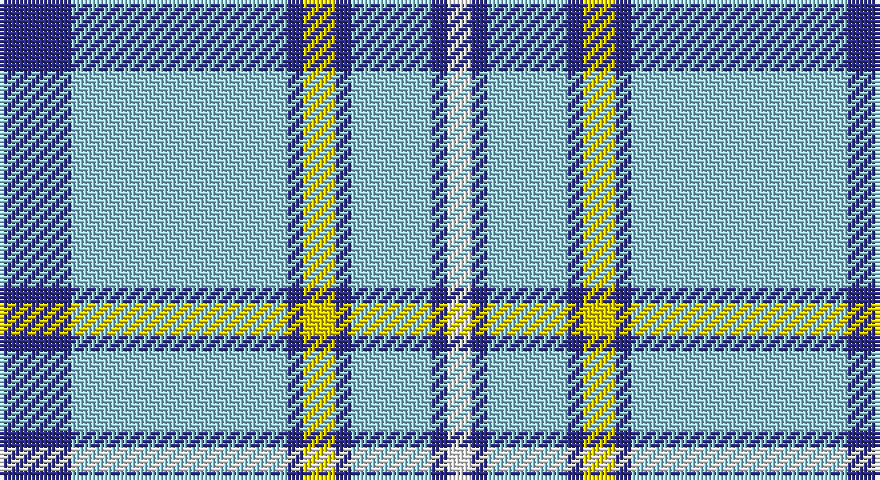

This page is one **sett** — a single exact thread-count. It belongs to the [tartan](/setts/db9lb27db2ly4db2lb10db2w3/)
(the same proportion at any scale), whose colour order is pattern [BWBYBWBW](/stripes/bwbybwbw/).

Sourced from tartans-authority.  It is a [8 stripe tartan](/stripes/stripes8/).

Original link http://www.tartansauthority.com/tartan-ferret/display/8433/

## Register references

External register numbers recorded for this tartan.

- Scottish Tartans Authority (ITI): 8433

## Thread count
DB/18 LB54 DB4 Y8 DB4 LB20 DB4 W/6

One full sett is **212 threads**.

## Palette

Palette: <strong>Tartan Register</strong>
<table><thead><tr><th>Colour</th><th>Threads</th><th>Shade</th><th>Base</th><th>OKLCh</th></tr></thead><tbody><tr><td>DB/</td><td style="text-align:right;font-variant-numeric:tabular-nums">18</td><td><code style="background-color:#2C2C80;">#2C2C80</code> <small style="color:#888">#2C2C80</small></td><td>B <code style="background-color:#2A418A;">#2A418A</code></td><td><small style="color:#888">oklch(35.0% 0.138 276.6)</small></td></tr><tr><td>LB</td><td style="text-align:right;font-variant-numeric:tabular-nums">54</td><td><code style="background-color:#98C8E8;">#98C8E8</code> <small style="color:#888">#98C8E8</small></td><td>W <code style="background-color:#F7F7F7;">#F7F7F7</code></td><td><small style="color:#888">oklch(81.0% 0.068 237.9)</small></td></tr><tr><td>DB</td><td style="text-align:right;font-variant-numeric:tabular-nums">4</td><td><code style="background-color:#2C2C80;">#2C2C80</code> <small style="color:#888">#2C2C80</small></td><td>B <code style="background-color:#2A418A;">#2A418A</code></td><td><small style="color:#888">oklch(35.0% 0.138 276.6)</small></td></tr><tr><td>Y</td><td style="text-align:right;font-variant-numeric:tabular-nums">8</td><td><code style="background-color:#FCCC00;">#FCCC00</code> <small style="color:#888">#FCCC00</small></td><td>Y <code style="background-color:#F2BF00;">#F2BF00</code></td><td><small style="color:#888">oklch(86.2% 0.176 91.5)</small></td></tr><tr><td>DB</td><td style="text-align:right;font-variant-numeric:tabular-nums">4</td><td><code style="background-color:#2C2C80;">#2C2C80</code> <small style="color:#888">#2C2C80</small></td><td>B <code style="background-color:#2A418A;">#2A418A</code></td><td><small style="color:#888">oklch(35.0% 0.138 276.6)</small></td></tr><tr><td>LB</td><td style="text-align:right;font-variant-numeric:tabular-nums">20</td><td><code style="background-color:#98C8E8;">#98C8E8</code> <small style="color:#888">#98C8E8</small></td><td>W <code style="background-color:#F7F7F7;">#F7F7F7</code></td><td><small style="color:#888">oklch(81.0% 0.068 237.9)</small></td></tr><tr><td>DB</td><td style="text-align:right;font-variant-numeric:tabular-nums">4</td><td><code style="background-color:#2C2C80;">#2C2C80</code> <small style="color:#888">#2C2C80</small></td><td>B <code style="background-color:#2A418A;">#2A418A</code></td><td><small style="color:#888">oklch(35.0% 0.138 276.6)</small></td></tr><tr><td>W/</td><td style="text-align:right;font-variant-numeric:tabular-nums">6</td><td><code style="background-color:#FCFCFC;">#FCFCFC</code> <small style="color:#888">#FCFCFC</small></td><td>W <code style="background-color:#F7F7F7;">#F7F7F7</code></td><td><small style="color:#888">oklch(99.1% 0.000 89.9)</small></td></tr></tbody></table>

# Sample pattern

## Nearest tartans

The nearest existing variants by ΔTartan distance, with this tartan at the top so the swatches line up against it.

ΔTartan

Tartan

Sett

—

<a href="/ttd/edit/#slug=db9lb27db2ly4db2lb10db2w3~x2">Alaska Highlanders P &amp; D (Corporate)</a> <a class="nn-out" href="/variants/s8/db9lb27db2ly4db2lb10db2w3~x2/" title="open its dictionary page">↗</a>

0.78

<a href="/ttd/edit/#slug=db9lb27db2k4db2lb10db2w3~x2&amp;base=db9lb27db2ly4db2lb10db2w3~x2">Alaska Highlanders Pipes &amp; Drums Corporate Tartan</a> <a class="nn-out" href="/variants/s8/db9lb27db2k4db2lb10db2w3~x2/" title="open its dictionary page">↗</a>

0.90

<a href="/ttd/edit/#slug=b12ly1w16b1w1b14w3b14r2~x4&amp;base=db9lb27db2ly4db2lb10db2w3~x2">Orlando Dress, City of (District)</a> <a class="nn-out" href="/variants/s9/b12ly1w16b1w1b14w3b14r2~x4/" title="open its dictionary page">↗</a>

1.16

<a href="/ttd/edit/#slug=n3b2w10b2n6b26k2~x2&amp;base=db9lb27db2ly4db2lb10db2w3~x2">MacLintock #2</a> <a class="nn-out" href="/variants/s7/n3b2w10b2n6b26k2~x2/" title="open its dictionary page">↗</a>

1.26

<a href="/ttd/edit/#slug=b120g9r7ly12g33ly33b26&amp;base=db9lb27db2ly4db2lb10db2w3~x2">Supporter.com</a> <a class="nn-out" href="/variants/s7/b120g9r7ly12g33ly33b26/" title="open its dictionary page">↗</a>

1.29

<a href="/ttd/edit/#slug=ly5db15lb5db5lb40ly3~x2&amp;base=db9lb27db2ly4db2lb10db2w3~x2">Legary</a> <a class="nn-out" href="/variants/s6/ly5db15lb5db5lb40ly3~x2/" title="open its dictionary page">↗</a>

1.36

<a href="/ttd/edit/#slug=w4k2w26t23w3t8p3~x2&amp;base=db9lb27db2ly4db2lb10db2w3~x2">MacPherson Turquoise Dress Tartan</a> <a class="nn-out" href="/variants/s7/w4k2w26t23w3t8p3~x2/" title="open its dictionary page">↗</a>

1.39

<a href="/variants/s10/r3b2w35b35r2g3~x2/">Galloway (Dance)</a>

1.40

<a href="/ttd/edit/#slug=lb20w2lb5k2b10r3~x2&amp;base=db9lb27db2ly4db2lb10db2w3~x2">St. Christopher's School (Corporate)</a> <a class="nn-out" href="/variants/s6/lb20w2lb5k2b10r3~x2/" title="open its dictionary page">↗</a>

1.41

<a href="/ttd/edit/#slug=t45w4db4w2ly14db2w2db2~x4&amp;base=db9lb27db2ly4db2lb10db2w3~x2">Madras 1 (Fashion)</a> <a class="nn-out" href="/variants/s8/t45w4db4w2ly14db2w2db2~x4/" title="open its dictionary page">↗</a>

1.41

<a href="/ttd/edit/#slug=w2db1w15t12w1ly3db1~x6&amp;base=db9lb27db2ly4db2lb10db2w3~x2">St. John's (Corporate)</a> <a class="nn-out" href="/variants/s7/w2db1w15t12w1ly3db1~x6/" title="open its dictionary page">↗</a>

## Neighbour map

Every grey dot is one of 14360 variants placed by the first two principal components of the ΔTartan feature space (44% of its variance). Red is this tartan; blue dots are its nearest — click one to open its page.

<svg viewBox="0 0 640 380" role="img" style="max-width:100%;height:auto;border:1px solid #e0e0e0;border-radius:4px;display:block" xmlns="http://www.w3.org/2000/svg"><image href="/nn/cloud.v1.png" width="640" height="380"/><a href="/variants/s8/db9lb27db2k4db2lb10db2w3~x2/"><circle cx="319.0" cy="150.7" r="4" fill="#3465a4"><title>Alaska Highlanders Pipes &amp; Drums Corporate Tartan</title></circle></a><a href="/variants/s9/b12ly1w16b1w1b14w3b14r2~x4/"><circle cx="339.5" cy="160.7" r="4" fill="#3465a4"><title>Orlando Dress, City of (District)</title></circle></a><a href="/variants/s7/n3b2w10b2n6b26k2~x2/"><circle cx="315.1" cy="170.1" r="4" fill="#3465a4"><title>MacLintock #2</title></circle></a><a href="/variants/s7/b120g9r7ly12g33ly33b26/"><circle cx="340.2" cy="166.3" r="4" fill="#3465a4"><title>Supporter.com</title></circle></a><a href="/variants/s6/ly5db15lb5db5lb40ly3~x2/"><circle cx="332.9" cy="176.2" r="4" fill="#3465a4"><title>Legary</title></circle></a><a href="/variants/s7/w4k2w26t23w3t8p3~x2/"><circle cx="277.7" cy="173.1" r="4" fill="#3465a4"><title>MacPherson Turquoise Dress Tartan</title></circle></a><a href="/variants/s10/r3b2w35b35r2g3~x2/"><circle cx="270.2" cy="131.7" r="4" fill="#3465a4"><title>Galloway (Dance)</title></circle></a><a href="/variants/s6/lb20w2lb5k2b10r3~x2/"><circle cx="276.8" cy="173.0" r="4" fill="#3465a4"><title>St. Christopher's School (Corporate)</title></circle></a><a href="/variants/s8/t45w4db4w2ly14db2w2db2~x4/"><circle cx="352.4" cy="119.4" r="4" fill="#3465a4"><title>Madras 1 (Fashion)</title></circle></a><a href="/variants/s7/w2db1w15t12w1ly3db1~x6/"><circle cx="286.3" cy="154.5" r="4" fill="#3465a4"><title>St. John's (Corporate)</title></circle></a><circle cx="332.5" cy="153.9" r="5" fill="#c00000"/></svg>

ID: /variants/s8/db9lb27db2ly4db2lb10db2w3~x2/
