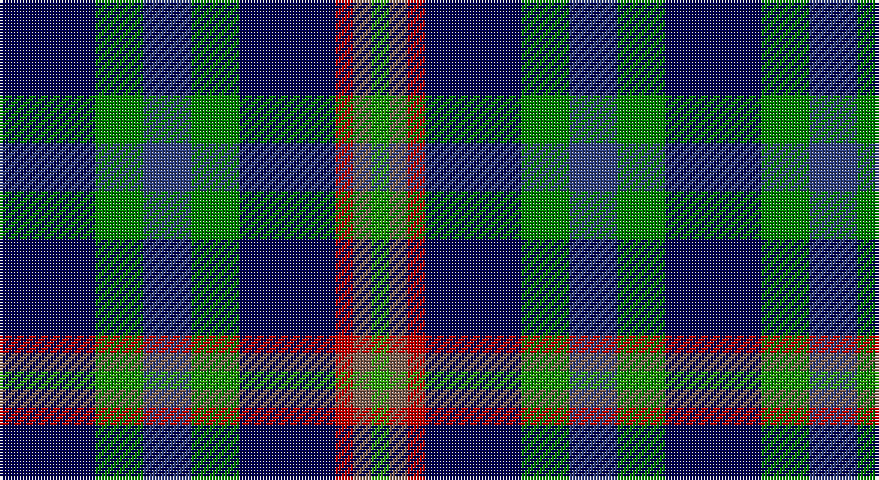

This page is one **sett** — a single exact thread-count. It belongs to the [tartan](/setts/dbi16g8db8g8dbi16r3o3gi3/)
(the same proportion at any scale), whose colour order is pattern [BGBGBRRG](/stripes/bgbgbrrg/).

Sourced from weddslist.  It is a [8 stripe tartan](/stripes/stripes8/).

Original link http://www.weddslist.com/cgi-bin/tartans/pg.pl?source=sts

## Thread count
DB/32 Ga16 B16 Ga16 DB32 R6 LT6 G/6

One full sett is **222 threads**.

## Palette

Palette: <strong>custom</strong>
<table><thead><tr><th>Colour</th><th>Threads</th><th>Shade</th><th>Base</th><th>OKLCh</th></tr></thead><tbody><tr><td>DB/</td><td style="text-align:right;font-variant-numeric:tabular-nums">32</td><td><code style="background-color:#000050;">#000050</code> <small style="color:#888">#000050</small></td><td>B <code style="background-color:#2A418A;">#2A418A</code></td><td><small style="color:#888">oklch(19.5% 0.135 264.1)</small></td></tr><tr><td>Ga</td><td style="text-align:right;font-variant-numeric:tabular-nums">16</td><td><code style="background-color:#008000;">#008000</code> <small style="color:#888">#008000</small></td><td>G <code style="background-color:#006100;">#006100</code></td><td><small style="color:#888">oklch(52.0% 0.177 142.5)</small></td></tr><tr><td>B</td><td style="text-align:right;font-variant-numeric:tabular-nums">16</td><td><code style="background-color:#304080;">#304080</code> <small style="color:#888">#304080</small></td><td>B <code style="background-color:#2A418A;">#2A418A</code></td><td><small style="color:#888">oklch(39.4% 0.109 270.2)</small></td></tr><tr><td>Ga</td><td style="text-align:right;font-variant-numeric:tabular-nums">16</td><td><code style="background-color:#008000;">#008000</code> <small style="color:#888">#008000</small></td><td>G <code style="background-color:#006100;">#006100</code></td><td><small style="color:#888">oklch(52.0% 0.177 142.5)</small></td></tr><tr><td>DB</td><td style="text-align:right;font-variant-numeric:tabular-nums">32</td><td><code style="background-color:#000050;">#000050</code> <small style="color:#888">#000050</small></td><td>B <code style="background-color:#2A418A;">#2A418A</code></td><td><small style="color:#888">oklch(19.5% 0.135 264.1)</small></td></tr><tr><td>R</td><td style="text-align:right;font-variant-numeric:tabular-nums">6</td><td><code style="background-color:#C00000;">#C00000</code> <small style="color:#888">#C00000</small></td><td>R <code style="background-color:#CC0000;">#CC0000</code></td><td><small style="color:#888">oklch(50.7% 0.208 29.2)</small></td></tr><tr><td>LT</td><td style="text-align:right;font-variant-numeric:tabular-nums">6</td><td><code style="background-color:#806050;">#806050</code> <small style="color:#888">#806050</small></td><td>R <code style="background-color:#CC0000;">#CC0000</code></td><td><small style="color:#888">oklch(51.7% 0.049 47.8)</small></td></tr><tr><td>G/</td><td style="text-align:right;font-variant-numeric:tabular-nums">6</td><td><code style="background-color:#30A010;">#30A010</code> <small style="color:#888">#30A010</small></td><td>G <code style="background-color:#006100;">#006100</code></td><td><small style="color:#888">oklch(61.9% 0.195 140.5)</small></td></tr></tbody></table>

# Sample pattern

## Nearest tartans

The nearest existing variants by ΔTartan distance, with this tartan at the top so the swatches line up against it.

ΔTartan

Tartan

Sett

—

<a href="/ttd/edit/#slug=dbi16g8db8g8dbi16r3o3gi3~x2">Glen Erin</a> <a class="nn-out" href="/variants/s8/dbi16g8db8g8dbi16r3o3gi3~x2/" title="open its dictionary page">↗</a>

0.89

<a href="/ttd/edit/#slug=dg2y13db12w3db10w3db12g13dp2~x2&amp;base=dbi16g8db8g8dbi16r3o3gi3~x2">Mounth, The</a> <a class="nn-out" href="/variants/s9/dg2y13db12w3db10w3db12g13dp2~x2/" title="open its dictionary page">↗</a>

1.15

<a href="/ttd/edit/#slug=r1b8k4g1dg4g1k4b8ly1~x6&amp;base=dbi16g8db8g8dbi16r3o3gi3~x2">Quinn (Personal)</a> <a class="nn-out" href="/variants/s9/r1b8k4g1dg4g1k4b8ly1~x6/" title="open its dictionary page">↗</a>

1.27

<a href="/ttd/edit/#slug=db2lo1db6r1db2r2k2g6t1g2~x4&amp;base=dbi16g8db8g8dbi16r3o3gi3~x2">Nance (1998)</a> <a class="nn-out" href="/variants/s10/db2lo1db6r1db2r2k2g6t1g2~x4/" title="open its dictionary page">↗</a>

1.29

<a href="/ttd/edit/#slug=db4dg2w2dg4dbi10r2dbi12ly3~x2&amp;base=dbi16g8db8g8dbi16r3o3gi3~x2">United Services, Planning Association</a> <a class="nn-out" href="/variants/s8/db4dg2w2dg4dbi10r2dbi12ly3~x2/" title="open its dictionary page">↗</a>

1.31

<a href="/ttd/edit/#slug=r2g10db10k5b2k5g10k10b2k10lo2~x2&amp;base=dbi16g8db8g8dbi16r3o3gi3~x2">Nairn (Edinburgh Woollen Mill)</a> <a class="nn-out" href="/variants/s11/r2g10db10k5b2k5g10k10b2k10lo2~x2/" title="open its dictionary page">↗</a>

1.39

<a href="/variants/s8/k10dg3k6dg20ki8r4w4dg10~x2/">BlackRock (Symmetrical)</a>

1.40

<a href="/ttd/edit/#slug=dbi4dg2w2dg4db10r2db12ly3~x2&amp;base=dbi16g8db8g8dbi16r3o3gi3~x2">United Services Planning Assoc Corporate Tartan</a> <a class="nn-out" href="/variants/s8/dbi4dg2w2dg4db10r2db12ly3~x2/" title="open its dictionary page">↗</a>

1.40

<a href="/ttd/edit/#slug=r3g9y15db10k2db18w3~x2&amp;base=dbi16g8db8g8dbi16r3o3gi3~x2">Coulthard (Personal)</a> <a class="nn-out" href="/variants/s7/r3g9y15db10k2db18w3~x2/" title="open its dictionary page">↗</a>

1.42

<a href="/ttd/edit/#slug=r1n8k4g1g4g1k4n8ly1~x6&amp;base=dbi16g8db8g8dbi16r3o3gi3~x2">Quinn</a> <a class="nn-out" href="/variants/s9/r1n8k4g1g4g1k4n8ly1~x6/" title="open its dictionary page">↗</a>

1.46

<a href="/variants/s7/g16lb3g3ki10db12r2k3~x2/">MacLean, Donald Personal Tartan</a>

## Neighbour map

Every grey dot is one of 14360 variants placed by the first two principal components of the ΔTartan feature space (44% of its variance). Red is this tartan; blue dots are its nearest — click one to open its page.

<svg viewBox="0 0 640 380" role="img" style="max-width:100%;height:auto;border:1px solid #e0e0e0;border-radius:4px;display:block" xmlns="http://www.w3.org/2000/svg"><image href="/nn/cloud.v1.png" width="640" height="380"/><a href="/variants/s9/dg2y13db12w3db10w3db12g13dp2~x2/"><circle cx="132.3" cy="195.4" r="4" fill="#3465a4"><title>Mounth, The</title></circle></a><a href="/variants/s9/r1b8k4g1dg4g1k4b8ly1~x6/"><circle cx="199.9" cy="191.6" r="4" fill="#3465a4"><title>Quinn (Personal)</title></circle></a><a href="/variants/s10/db2lo1db6r1db2r2k2g6t1g2~x4/"><circle cx="134.4" cy="196.5" r="4" fill="#3465a4"><title>Nance (1998)</title></circle></a><a href="/variants/s8/db4dg2w2dg4dbi10r2dbi12ly3~x2/"><circle cx="196.9" cy="195.5" r="4" fill="#3465a4"><title>United Services, Planning Association</title></circle></a><a href="/variants/s11/r2g10db10k5b2k5g10k10b2k10lo2~x2/"><circle cx="141.2" cy="221.1" r="4" fill="#3465a4"><title>Nairn (Edinburgh Woollen Mill)</title></circle></a><a href="/variants/s8/k10dg3k6dg20ki8r4w4dg10~x2/"><circle cx="202.9" cy="232.4" r="4" fill="#3465a4"><title>BlackRock (Symmetrical)</title></circle></a><a href="/variants/s8/dbi4dg2w2dg4db10r2db12ly3~x2/"><circle cx="213.6" cy="198.7" r="4" fill="#3465a4"><title>United Services Planning Assoc Corporate Tartan</title></circle></a><a href="/variants/s7/r3g9y15db10k2db18w3~x2/"><circle cx="186.1" cy="202.0" r="4" fill="#3465a4"><title>Coulthard (Personal)</title></circle></a><a href="/variants/s9/r1n8k4g1g4g1k4n8ly1~x6/"><circle cx="180.0" cy="174.7" r="4" fill="#3465a4"><title>Quinn</title></circle></a><a href="/variants/s7/g16lb3g3ki10db12r2k3~x2/"><circle cx="129.8" cy="197.4" r="4" fill="#3465a4"><title>MacLean, Donald Personal Tartan</title></circle></a><circle cx="155.0" cy="221.0" r="5" fill="#c00000"/></svg>

ID: /variants/s8/dbi16g8db8g8dbi16r3o3gi3~x2/
