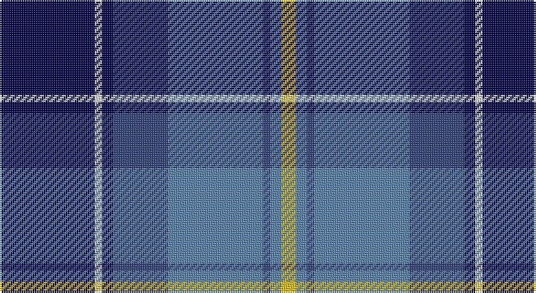

This page is one **sett** — a single exact thread-count. It belongs to the [tartan](/setts/dbi26w2dbi3db15t26db2t3ly4/)
(the same proportion at any scale), whose colour order is pattern [BWBBBBBY](/stripes/bwbbbbby/).

Sourced from weddslist.  It is a [8 stripe tartan](/stripes/stripes8/).

Original link http://www.weddslist.com/cgi-bin/tartans/pg.pl?source=sts

## Thread count
DB/52 LN4 DB6 B30 Ba52 B4 Ba6 Y/8

One full sett is **264 threads**.

## Palette

Palette: <strong>Tartan Dictionary</strong> <small style="color:#888">(1 of 5 colours)</small>
<table><thead><tr><th>Colour</th><th>Threads</th><th>Shade</th><th>Base</th><th>OKLCh</th></tr></thead><tbody><tr><td>DB/</td><td style="text-align:right;font-variant-numeric:tabular-nums">52</td><td><code style="background-color:#000050;">#000050</code> <small style="color:#888">#000050</small></td><td>B <code style="background-color:#2A418A;">#2A418A</code></td><td><small style="color:#888">oklch(19.5% 0.135 264.1)</small></td></tr><tr><td>LN</td><td style="text-align:right;font-variant-numeric:tabular-nums">4</td><td><code style="background-color:#E0E0E0;">#E0E0E0</code> <small style="color:#888">#E0E0E0</small></td><td>W <code style="background-color:#F7F7F7;">#F7F7F7</code></td><td><small style="color:#888">oklch(90.7% 0.000 89.9)</small></td></tr><tr><td>DB</td><td style="text-align:right;font-variant-numeric:tabular-nums">6</td><td><code style="background-color:#000050;">#000050</code> <small style="color:#888">#000050</small></td><td>B <code style="background-color:#2A418A;">#2A418A</code></td><td><small style="color:#888">oklch(19.5% 0.135 264.1)</small></td></tr><tr><td>B</td><td style="text-align:right;font-variant-numeric:tabular-nums">30</td><td><code style="background-color:#304080;">#304080</code> <small style="color:#888">#304080</small></td><td>B <code style="background-color:#2A418A;">#2A418A</code></td><td><small style="color:#888">oklch(39.4% 0.109 270.2)</small></td></tr><tr><td>Ba</td><td style="text-align:right;font-variant-numeric:tabular-nums">52</td><td><code style="background-color:#5480B0;">#5480B0</code> <small style="color:#888">#5480B0</small></td><td>B <code style="background-color:#2A418A;">#2A418A</code></td><td><small style="color:#888">oklch(58.8% 0.089 251.5)</small></td></tr><tr><td>B</td><td style="text-align:right;font-variant-numeric:tabular-nums">4</td><td><code style="background-color:#304080;">#304080</code> <small style="color:#888">#304080</small></td><td>B <code style="background-color:#2A418A;">#2A418A</code></td><td><small style="color:#888">oklch(39.4% 0.109 270.2)</small></td></tr><tr><td>Ba</td><td style="text-align:right;font-variant-numeric:tabular-nums">6</td><td><code style="background-color:#5480B0;">#5480B0</code> <small style="color:#888">#5480B0</small></td><td>B <code style="background-color:#2A418A;">#2A418A</code></td><td><small style="color:#888">oklch(58.8% 0.089 251.5)</small></td></tr><tr><td>Y/</td><td style="text-align:right;font-variant-numeric:tabular-nums">8</td><td><code style="background-color:#F0C000;">#F0C000</code> <small style="color:#888">#F0C000</small></td><td>Y <code style="background-color:#F2BF00;">#F2BF00</code></td><td><small style="color:#888">oklch(82.7% 0.169 90.5)</small></td></tr></tbody></table>

# Sample pattern

## Nearest tartans

The nearest existing variants by ΔTartan distance, with this tartan at the top so the swatches line up against it.

ΔTartan

Tartan

Sett

—

<a href="/ttd/edit/#slug=dbi26w2dbi3db15t26db2t3ly4~x2">Banff, and Buchan</a> <a class="nn-out" href="/variants/s8/dbi26w2dbi3db15t26db2t3ly4~x2/" title="open its dictionary page">↗</a>

0.68

<a href="/ttd/edit/#slug=db26w2db3dbi15t26dbi2t3ly4~x2&amp;base=dbi26w2dbi3db15t26db2t3ly4~x2">Banff and Buchan District Tartan</a> <a class="nn-out" href="/variants/s8/db26w2db3dbi15t26dbi2t3ly4~x2/" title="open its dictionary page">↗</a>

0.87

<a href="/ttd/edit/#slug=w4db24ly2dbi24t5db4ly4~x2&amp;base=dbi26w2dbi3db15t26db2t3ly4~x2">Mina Perhonen Japanese Corporate Tartan</a> <a class="nn-out" href="/variants/s7/w4db24ly2dbi24t5db4ly4~x2/" title="open its dictionary page">↗</a>

0.89

<a href="/ttd/edit/#slug=db3t24k11db20w2db5lo3~x2&amp;base=dbi26w2dbi3db15t26db2t3ly4~x2">Icelandair</a> <a class="nn-out" href="/variants/s7/db3t24k11db20w2db5lo3~x2/" title="open its dictionary page">↗</a>

1.01

<a href="/ttd/edit/#slug=db25k3db7k15b25k2b2w4~x2&amp;base=dbi26w2dbi3db15t26db2t3ly4~x2">Sabema</a> <a class="nn-out" href="/variants/s8/db25k3db7k15b25k2b2w4~x2/" title="open its dictionary page">↗</a>

1.03

<a href="/ttd/edit/#slug=b30db3b3db3b3db10k10g20k2w4~x2&amp;base=dbi26w2dbi3db15t26db2t3ly4~x2">St Kentigern College</a> <a class="nn-out" href="/variants/s10/b30db3b3db3b3db10k10g20k2w4~x2/" title="open its dictionary page">↗</a>

1.11

<a href="/ttd/edit/#slug=db35r2k16ly2t25w2t6~x2&amp;base=dbi26w2dbi3db15t26db2t3ly4~x2">US Forces (Thurso) Regimental Tartan</a> <a class="nn-out" href="/variants/s7/db35r2k16ly2t25w2t6~x2/" title="open its dictionary page">↗</a>

1.14

<a href="/ttd/edit/#slug=w4k24ly2n24t5k4ly4~x2&amp;base=dbi26w2dbi3db15t26db2t3ly4~x2">Mina Perhonen</a> <a class="nn-out" href="/variants/s7/w4k24ly2n24t5k4ly4~x2/" title="open its dictionary page">↗</a>

1.14

<a href="/ttd/edit/#slug=n12k2n2k2n2k12db12b3w1~x2&amp;base=dbi26w2dbi3db15t26db2t3ly4~x2">de Franck, Matt (Personal)</a> <a class="nn-out" href="/variants/s9/n12k2n2k2n2k12db12b3w1~x2/" title="open its dictionary page">↗</a>

1.15

<a href="/ttd/edit/#slug=r2t2r2t21lg11k17lb2~x2&amp;base=dbi26w2dbi3db15t26db2t3ly4~x2">Loch Ness (Fashion)</a> <a class="nn-out" href="/variants/s7/r2t2r2t21lg11k17lb2~x2/" title="open its dictionary page">↗</a>

1.16

<a href="/ttd/edit/#slug=db44lo3k20r3db8lg34db3db2lg15~x2&amp;base=dbi26w2dbi3db15t26db2t3ly4~x2">US Air Force Reserve Pipe Band</a> <a class="nn-out" href="/variants/s9/db44lo3k20r3db8lg34db3db2lg15~x2/" title="open its dictionary page">↗</a>

## Neighbour map

Every grey dot is one of 14360 variants placed by the first two principal components of the ΔTartan feature space (44% of its variance). Red is this tartan; blue dots are its nearest — click one to open its page.

<svg viewBox="0 0 640 380" role="img" style="max-width:100%;height:auto;border:1px solid #e0e0e0;border-radius:4px;display:block" xmlns="http://www.w3.org/2000/svg"><image href="/nn/cloud.v1.png" width="640" height="380"/><a href="/variants/s8/db26w2db3dbi15t26dbi2t3ly4~x2/"><circle cx="196.0" cy="169.2" r="4" fill="#3465a4"><title>Banff and Buchan District Tartan</title></circle></a><a href="/variants/s7/w4db24ly2dbi24t5db4ly4~x2/"><circle cx="212.6" cy="177.3" r="4" fill="#3465a4"><title>Mina Perhonen Japanese Corporate Tartan</title></circle></a><a href="/variants/s7/db3t24k11db20w2db5lo3~x2/"><circle cx="206.7" cy="188.5" r="4" fill="#3465a4"><title>Icelandair</title></circle></a><a href="/variants/s8/db25k3db7k15b25k2b2w4~x2/"><circle cx="215.5" cy="195.5" r="4" fill="#3465a4"><title>Sabema</title></circle></a><a href="/variants/s10/b30db3b3db3b3db10k10g20k2w4~x2/"><circle cx="173.5" cy="142.9" r="4" fill="#3465a4"><title>St Kentigern College</title></circle></a><a href="/variants/s7/db35r2k16ly2t25w2t6~x2/"><circle cx="198.7" cy="147.5" r="4" fill="#3465a4"><title>US Forces (Thurso) Regimental Tartan</title></circle></a><a href="/variants/s7/w4k24ly2n24t5k4ly4~x2/"><circle cx="187.2" cy="169.3" r="4" fill="#3465a4"><title>Mina Perhonen</title></circle></a><a href="/variants/s9/n12k2n2k2n2k12db12b3w1~x2/"><circle cx="179.5" cy="184.1" r="4" fill="#3465a4"><title>de Franck, Matt (Personal)</title></circle></a><a href="/variants/s7/r2t2r2t21lg11k17lb2~x2/"><circle cx="169.2" cy="171.4" r="4" fill="#3465a4"><title>Loch Ness (Fashion)</title></circle></a><a href="/variants/s9/db44lo3k20r3db8lg34db3db2lg15~x2/"><circle cx="230.8" cy="139.2" r="4" fill="#3465a4"><title>US Air Force Reserve Pipe Band</title></circle></a><circle cx="182.0" cy="165.4" r="5" fill="#c00000"/></svg>

ID: /variants/s8/dbi26w2dbi3db15t26db2t3ly4~x2/
