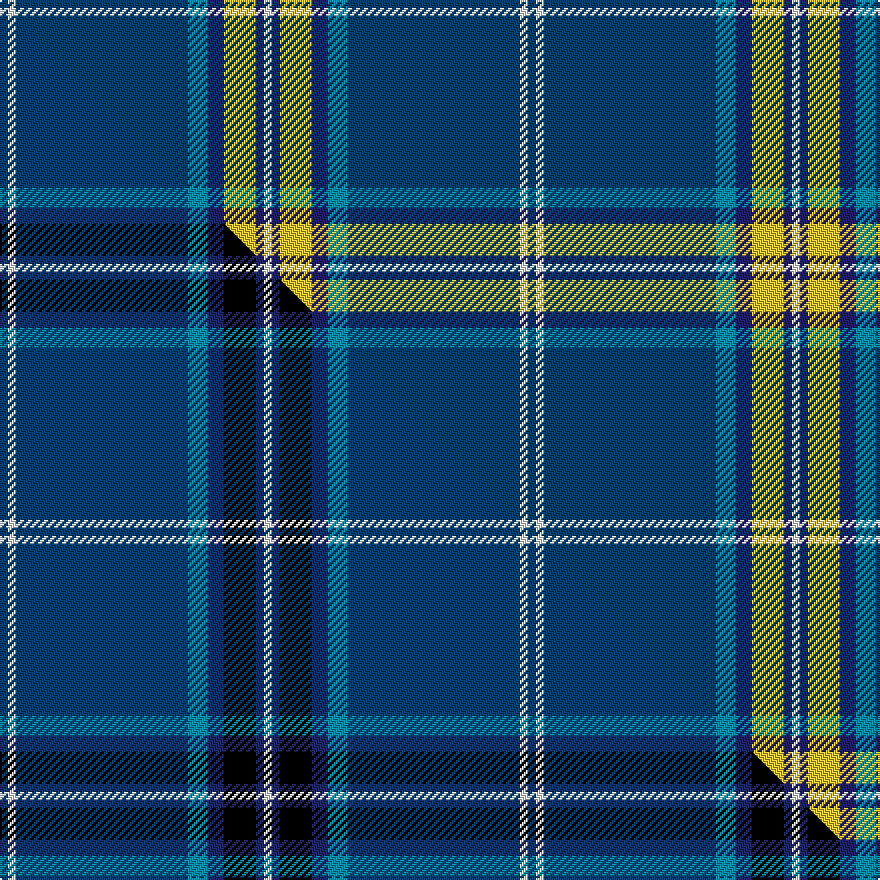

This page is one **sett** — a single exact thread-count. It belongs to the [tartan](/setts/dbi2w2dbi43t5db4ly8db2w2/)
(the same proportion at any scale), whose colour order is pattern [BWBBBYBW](/stripes/bwbbbybw/).

Part of the [Fife Flyers](/tartans/fife-flyers/) tartan — the named design grouping this sett with its other cloths.

Sourced from tartans-authority.  It is a [8 stripe tartan](/stripes/stripes8/).

Original link http://www.tartansauthority.com/tartan-ferret/display/4534/

## Register references

External register numbers recorded for this tartan.

- Scottish Tartans Authority (ITI): 4534

## Thread count
DBi/4 W4 DBi86 T10 DB8 LY16 DB4 W/4

One full sett is **264 threads**.

## Palette
<table><thead><tr><th>Colour</th><th>Shade</th><th>OKLCh</th></tr></thead><tbody><tr><td>T</td><td><code style="background-color:#00879F;">#00879F</code> <small style="color:#888">#00879F</small></td><td><small style="color:#888">oklch(57.4% 0.102 216.1)</small></td></tr><tr><td>DB</td><td><code style="background-color:#003C64;">#003C64</code> <small style="color:#888">#003C64</small></td><td><small style="color:#888">oklch(34.5% 0.089 246.0)</small></td></tr><tr><td>DB</td><td><code style="background-color:#202060;">#202060</code> <small style="color:#888">#202060</small></td><td><small style="color:#888">oklch(28.9% 0.111 276.9)</small></td></tr><tr><td>W</td><td><code style="background-color:#F7F7F7;">#F7F7F7</code> <small style="color:#888">#F7F7F7</small></td><td><small style="color:#888">oklch(97.6% 0.000 89.9)</small></td></tr><tr><td>LY</td><td><code style="background-color:#DCBC32;">#DCBC32</code> <small style="color:#888">#DCBC32</small></td><td><small style="color:#888">oklch(80.0% 0.150 95.2)</small></td></tr></tbody></table>

# Sample pattern

## Compared to the master

This cloth is one sett of its design; the master sett (the exemplar the design is anchored on) is below for comparison.

Its **ΔTartan distance** from the master is **3.62** — the same measure the nearest-tartans table ranks by (0 is identical; a re-scale of the same cloth is near 0, a recolour or a different proportion further).

<figure class="master-compare" style="margin:0">

this sett
master sett ★

<figcaption style="color:#888;font-size:smaller">One weave of this sett against the <a href="/setts/dbi2w2dbi43t5db4k8db2w2/">master sett ★</a>, split on the diagonal: a shared proportion runs seamlessly across it with only the shades shifting; a different proportion breaks on it.</figcaption>
</figure>

## Nearest variants

The nearest existing variants by ΔTartan distance, with this cloth at the top so the swatches line up against it.

ΔTartan

Threads

Variant

Sett

—

264

<a href="/variants/s8/dbi2w2dbi43t5db4ly8db2w2~x2~dbi1404245-db1204274/">Fife Flyers (Corporate)</a>

<a href="/ttd/edit/#slug=w1lb4t4db3w3t20lb1~x4&amp;base=dbi2w2dbi43t5db4ly8db2w2~x2~dbi1404245-db1204274" title="compare in the TTD">1.77</a>

280

<a href="/variants/s7/w1lb4t4db3w3t20lb1~x4/">Starr (Name)</a>

<a href="/ttd/edit/#slug=w1lb4t4db3w3t20lb1~x4~t2205244-db1406275&amp;base=dbi2w2dbi43t5db4ly8db2w2~x2~dbi1404245-db1204274" title="compare in the TTD">1.77</a>

280

<a href="/variants/s7/w1lb4t4db3w3t20lb1~x4~t2205244-db1406275/">Starr</a>

<a href="/ttd/edit/#slug=db128dr8lb41dt4lb4dt4&amp;base=dbi2w2dbi43t5db4ly8db2w2~x2~dbi1404245-db1204274" title="compare in the TTD">2.10</a>

246

<a href="/variants/s6/db128dr8lb41dt4lb4dt4/">French Freemasons' Pride</a>

<a href="/ttd/edit/#slug=dbi8w4db6dbi2db6n10db63w3~dbi1406275-db1404245&amp;base=dbi2w2dbi43t5db4ly8db2w2~x2~dbi1404245-db1204274" title="compare in the TTD">2.49</a>

193

<a href="/variants/s8/dbi8w4db6dbi2db6n10db63w3~dbi1406275-db1404245/">Pride of the Clyde</a>

<a href="/ttd/edit/#slug=lb9db2lb39dbi33ly2dbi5~x2~db1106275-dbi1404245&amp;base=dbi2w2dbi43t5db4ly8db2w2~x2~dbi1404245-db1204274" title="compare in the TTD">2.50</a>

332

<a href="/variants/s6/lb9db2lb39dbi33ly2dbi5~x2~db1106275-dbi1404245/">Port Authority of NY &amp; NJ</a>

<a href="/ttd/edit/#slug=w3dbi3w1db44n1db2n1dr4n1db5ly2~x2~dbi1409278-db1404245&amp;base=dbi2w2dbi43t5db4ly8db2w2~x2~dbi1404245-db1204274" title="compare in the TTD">2.68</a>

258

<a href="/variants/s11/w3dbi3w1db44n1db2n1dr4n1db5ly2~x2~dbi1409278-db1404245/">Jewish (Kosher) (Corporate)</a>

<a href="/ttd/edit/#slug=lb5dy6w2g7w2t44w2~x2&amp;base=dbi2w2dbi43t5db4ly8db2w2~x2~dbi1404245-db1204274" title="compare in the TTD">2.78</a>

258

<a href="/variants/s7/lb5dy6w2g7w2t44w2~x2/">Leblant-Macqueron (Personal)</a>

<a href="/ttd/edit/#slug=db28ly3lb1ly3db4lb2dp1lb5~x4&amp;base=dbi2w2dbi43t5db4ly8db2w2~x2~dbi1404245-db1204274" title="compare in the TTD">2.78</a>

244

<a href="/variants/s8/db28ly3lb1ly3db4lb2dp1lb5~x4/">Baker (Name)</a>

<a href="/ttd/edit/#slug=db21n2lr1n2db1dr2db1y6~x4&amp;base=dbi2w2dbi43t5db4ly8db2w2~x2~dbi1404245-db1204274" title="compare in the TTD">2.82</a>

180

<a href="/variants/s8/db21n2lr1n2db1dr2db1y6~x4/">Blue Rust (Corporate)</a>

<a href="/ttd/edit/#slug=db22ly2db1ly2db10y2g11y6~x2~ly3307090-y2400000&amp;base=dbi2w2dbi43t5db4ly8db2w2~x2~dbi1404245-db1204274" title="compare in the TTD">2.85</a>

168

<a href="/variants/s8/db22ly2db1ly2db10y2g11y6~x2~ly3307090-y2400000/">Katsushika (Corporate)</a>

## Neighbour map

Every grey dot is one of 13620 variants placed by the first two principal components of the ΔTartan feature space (42% of its variance). Red is this tartan; blue dots are its nearest — click one to open its page.

<svg viewBox="0 0 640 380" role="img" style="max-width:100%;height:auto;border:1px solid #e0e0e0;border-radius:4px;display:block" xmlns="http://www.w3.org/2000/svg"><image href="/nn/cloud.v1.png" width="640" height="380"/><a href="/variants/s7/w1lb4t4db3w3t20lb1~x4/"><circle cx="470.0" cy="199.3" r="4" fill="#3465a4"><title>Starr (Name)</title></circle></a><a href="/variants/s7/w1lb4t4db3w3t20lb1~x4~t2205244-db1406275/"><circle cx="471.8" cy="197.4" r="4" fill="#3465a4"><title>Starr</title></circle></a><a href="/variants/s6/db128dr8lb41dt4lb4dt4/"><circle cx="480.9" cy="155.9" r="4" fill="#3465a4"><title>French Freemasons' Pride</title></circle></a><a href="/variants/s8/dbi8w4db6dbi2db6n10db63w3~dbi1406275-db1404245/"><circle cx="564.9" cy="162.8" r="4" fill="#3465a4"><title>Pride of the Clyde</title></circle></a><a href="/variants/s6/lb9db2lb39dbi33ly2dbi5~x2~db1106275-dbi1404245/"><circle cx="380.6" cy="205.1" r="4" fill="#3465a4"><title>Port Authority of NY &amp; NJ</title></circle></a><a href="/variants/s11/w3dbi3w1db44n1db2n1dr4n1db5ly2~x2~dbi1409278-db1404245/"><circle cx="540.9" cy="81.8" r="4" fill="#3465a4"><title>Jewish (Kosher) (Corporate)</title></circle></a><a href="/variants/s7/lb5dy6w2g7w2t44w2~x2/"><circle cx="443.8" cy="163.5" r="4" fill="#3465a4"><title>Leblant-Macqueron (Personal)</title></circle></a><a href="/variants/s8/db28ly3lb1ly3db4lb2dp1lb5~x4/"><circle cx="457.8" cy="147.8" r="4" fill="#3465a4"><title>Baker (Name)</title></circle></a><a href="/variants/s8/db21n2lr1n2db1dr2db1y6~x4/"><circle cx="439.5" cy="150.1" r="4" fill="#3465a4"><title>Blue Rust (Corporate)</title></circle></a><a href="/variants/s8/db22ly2db1ly2db10y2g11y6~x2~ly3307090-y2400000/"><circle cx="358.9" cy="179.1" r="4" fill="#3465a4"><title>Katsushika (Corporate)</title></circle></a><circle cx="431.3" cy="145.3" r="5" fill="#c00000"/><text x="320" y="376" text-anchor="middle" font-size="11" fill="#999">ground</text><text x="11" y="190" text-anchor="middle" font-size="11" fill="#999" transform="rotate(-90 11 190)">complexity</text></svg>

ID: /variants/s8/dbi2w2dbi43t5db4ly8db2w2~x2~dbi1404245-db1204274/
