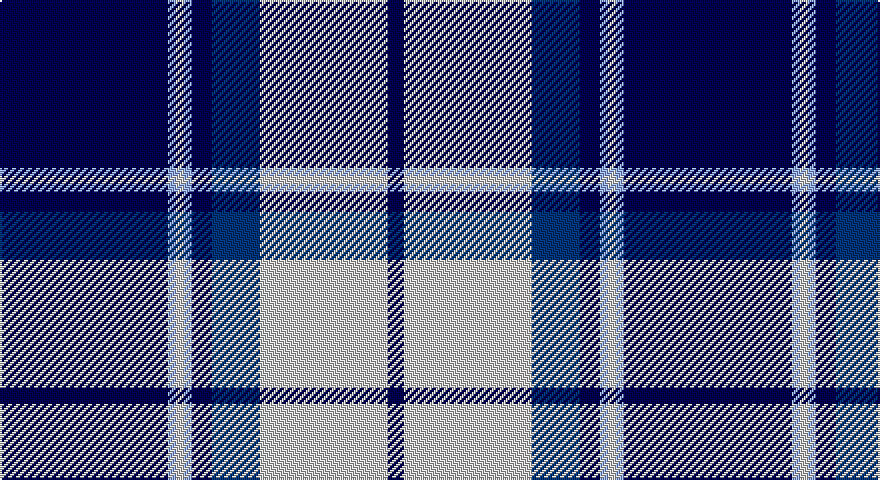

This page is one **sett** — a single exact thread-count. It belongs to the [tartan](/setts/dbi42lbi2lb2lbi2dbi5db12lb32dbi4/)
(the same proportion at any scale), whose colour order is pattern [BWBBWWWB](/stripes/bwbbwwwb/).

Sourced from register-of-tartans.  It is a [8 stripe tartan](/stripes/stripes8/).

Original link https://www.tartanregister.gov.uk/tartanDetails.aspx?ref=1092

## Register references

External register numbers recorded for this tartan.

- Scottish Register of Tartans: [1092](https://www.tartanregister.gov.uk/tartanDetails.aspx?ref=1092)
- Scottish Tartans Authority (ITI): 4799

## Thread count
DB/84 LP4 N4 LP4 DB10 DBa24 N64 DB/8

One full sett is **312 threads**.

## Palette

Palette: <strong>Tartan Register</strong> <small style="color:#888">(1 of 4 colours)</small>
<table><thead><tr><th>Colour</th><th>Threads</th><th>Shade</th><th>Base</th><th>OKLCh</th></tr></thead><tbody><tr><td>DB/</td><td style="text-align:right;font-variant-numeric:tabular-nums">84</td><td><code style="background-color:#000050;">#000050</code> <small style="color:#888">#000050</small></td><td>B <code style="background-color:#2A418A;">#2A418A</code></td><td><small style="color:#888">oklch(19.5% 0.135 264.1)</small></td></tr><tr><td>LP</td><td style="text-align:right;font-variant-numeric:tabular-nums">4</td><td><code style="background-color:#94ACFC;">#94ACFC</code> <small style="color:#888">#94ACFC</small></td><td>W <code style="background-color:#F7F7F7;">#F7F7F7</code></td><td><small style="color:#888">oklch(75.8% 0.119 270.6)</small></td></tr><tr><td>N</td><td style="text-align:right;font-variant-numeric:tabular-nums">4</td><td><code style="background-color:#C8C8C8;">#C8C8C8</code> <small style="color:#888">#C8C8C8</small></td><td>W <code style="background-color:#F7F7F7;">#F7F7F7</code></td><td><small style="color:#888">oklch(83.3% 0.000 89.9)</small></td></tr><tr><td>LP</td><td style="text-align:right;font-variant-numeric:tabular-nums">4</td><td><code style="background-color:#94ACFC;">#94ACFC</code> <small style="color:#888">#94ACFC</small></td><td>W <code style="background-color:#F7F7F7;">#F7F7F7</code></td><td><small style="color:#888">oklch(75.8% 0.119 270.6)</small></td></tr><tr><td>DB</td><td style="text-align:right;font-variant-numeric:tabular-nums">10</td><td><code style="background-color:#000050;">#000050</code> <small style="color:#888">#000050</small></td><td>B <code style="background-color:#2A418A;">#2A418A</code></td><td><small style="color:#888">oklch(19.5% 0.135 264.1)</small></td></tr><tr><td>DBa</td><td style="text-align:right;font-variant-numeric:tabular-nums">24</td><td><code style="background-color:#003478;">#003478</code> <small style="color:#888">#003478</small></td><td>B <code style="background-color:#2A418A;">#2A418A</code></td><td><small style="color:#888">oklch(34.1% 0.127 258.1)</small></td></tr><tr><td>N</td><td style="text-align:right;font-variant-numeric:tabular-nums">64</td><td><code style="background-color:#C8C8C8;">#C8C8C8</code> <small style="color:#888">#C8C8C8</small></td><td>W <code style="background-color:#F7F7F7;">#F7F7F7</code></td><td><small style="color:#888">oklch(83.3% 0.000 89.9)</small></td></tr><tr><td>DB/</td><td style="text-align:right;font-variant-numeric:tabular-nums">8</td><td><code style="background-color:#000050;">#000050</code> <small style="color:#888">#000050</small></td><td>B <code style="background-color:#2A418A;">#2A418A</code></td><td><small style="color:#888">oklch(19.5% 0.135 264.1)</small></td></tr></tbody></table>

# Sample pattern

## Nearest tartans

The nearest existing variants by ΔTartan distance, with this tartan at the top so the swatches line up against it.

ΔTartan

Tartan

Sett

—

<a href="/ttd/edit/#slug=dbi42lbi2lb2lbi2dbi5db12lb32dbi4~x2">Eildon (1980)</a> <a class="nn-out" href="/variants/s8/dbi42lbi2lb2lbi2dbi5db12lb32dbi4~x2/" title="open its dictionary page">↗</a>

0.75

<a href="/ttd/edit/#slug=db42lbi2lb2lbi2db5dt12lb32db4~x2&amp;base=dbi42lbi2lb2lbi2dbi5db12lb32dbi4~x2">Longniddry Eildon Blue Dress Fancy Tartan</a> <a class="nn-out" href="/variants/s8/db42lbi2lb2lbi2db5dt12lb32db4~x2/" title="open its dictionary page">↗</a>

0.93

<a href="/ttd/edit/#slug=db4w1db1w3db24y9k1y9k3~x2&amp;base=dbi42lbi2lb2lbi2dbi5db12lb32dbi4~x2">Historic Scotland</a> <a class="nn-out" href="/variants/s9/db4w1db1w3db24y9k1y9k3~x2/" title="open its dictionary page">↗</a>

0.94

<a href="/ttd/edit/#slug=db30lb2k9w3db6w4k3lb6~x2&amp;base=dbi42lbi2lb2lbi2dbi5db12lb32dbi4~x2">Detroit Lions</a> <a class="nn-out" href="/variants/s8/db30lb2k9w3db6w4k3lb6~x2/" title="open its dictionary page">↗</a>

1.08

<a href="/ttd/edit/#slug=ly12dbi2ly2dbi30db3dbi2db13w4~x2&amp;base=dbi42lbi2lb2lbi2dbi5db12lb32dbi4~x2">Highlands School (N. Carolina) Corporate Tartan</a> <a class="nn-out" href="/variants/s8/ly12dbi2ly2dbi30db3dbi2db13w4~x2/" title="open its dictionary page">↗</a>

1.15

<a href="/ttd/edit/#slug=db41ti2w2ti2db5t12w31db4~x2&amp;base=dbi42lbi2lb2lbi2dbi5db12lb32dbi4~x2">Harmony Eildon (Dance)</a> <a class="nn-out" href="/variants/s8/db41ti2w2ti2db5t12w31db4~x2/" title="open its dictionary page">↗</a>

1.16

<a href="/ttd/edit/#slug=r3db2w2db26k22w3db3w3~x2&amp;base=dbi42lbi2lb2lbi2dbi5db12lb32dbi4~x2">DeCloud-McMasters (Personal)</a> <a class="nn-out" href="/variants/s8/r3db2w2db26k22w3db3w3~x2/" title="open its dictionary page">↗</a>

1.19

<a href="/ttd/edit/#slug=dt42lbi2lb2lbi2dt5dti12lb32dt4~x2&amp;base=dbi42lbi2lb2lbi2dbi5db12lb32dbi4~x2">Longniddry Blue (Dance)</a> <a class="nn-out" href="/variants/s8/dt42lbi2lb2lbi2dt5dti12lb32dt4~x2/" title="open its dictionary page">↗</a>

1.20

<a href="/ttd/edit/#slug=db4r2db40k11g2w16r2~x2&amp;base=dbi42lbi2lb2lbi2dbi5db12lb32dbi4~x2">Sinclair, Blue (Personal)</a> <a class="nn-out" href="/variants/s7/db4r2db40k11g2w16r2~x2/" title="open its dictionary page">↗</a>

1.21

<a href="/ttd/edit/#slug=db30t2w2t2db4ti10w25db4~x2&amp;base=dbi42lbi2lb2lbi2dbi5db12lb32dbi4~x2">Eildon/Longniddry Blue Dress Fashion Tartan</a> <a class="nn-out" href="/variants/s8/db30t2w2t2db4ti10w25db4~x2/" title="open its dictionary page">↗</a>

1.22

<a href="/ttd/edit/#slug=lo12db2lo2db30dt2db2dt13lb4~x2&amp;base=dbi42lbi2lb2lbi2dbi5db12lb32dbi4~x2">Highlands School (North Carolina)</a> <a class="nn-out" href="/variants/s8/lo12db2lo2db30dt2db2dt13lb4~x2/" title="open its dictionary page">↗</a>

## Neighbour map

Every grey dot is one of 14360 variants placed by the first two principal components of the ΔTartan feature space (44% of its variance). Red is this tartan; blue dots are its nearest — click one to open its page.

<svg viewBox="0 0 640 380" role="img" style="max-width:100%;height:auto;border:1px solid #e0e0e0;border-radius:4px;display:block" xmlns="http://www.w3.org/2000/svg"><image href="/nn/cloud.v1.png" width="640" height="380"/><a href="/variants/s8/db42lbi2lb2lbi2db5dt12lb32db4~x2/"><circle cx="288.7" cy="139.6" r="4" fill="#3465a4"><title>Longniddry Eildon Blue Dress Fancy Tartan</title></circle></a><a href="/variants/s9/db4w1db1w3db24y9k1y9k3~x2/"><circle cx="301.2" cy="138.3" r="4" fill="#3465a4"><title>Historic Scotland</title></circle></a><a href="/variants/s8/db30lb2k9w3db6w4k3lb6~x2/"><circle cx="290.8" cy="154.2" r="4" fill="#3465a4"><title>Detroit Lions</title></circle></a><a href="/variants/s8/ly12dbi2ly2dbi30db3dbi2db13w4~x2/"><circle cx="259.8" cy="156.5" r="4" fill="#3465a4"><title>Highlands School (N. Carolina) Corporate Tartan</title></circle></a><a href="/variants/s8/db41ti2w2ti2db5t12w31db4~x2/"><circle cx="278.5" cy="134.5" r="4" fill="#3465a4"><title>Harmony Eildon (Dance)</title></circle></a><a href="/variants/s8/r3db2w2db26k22w3db3w3~x2/"><circle cx="256.3" cy="162.2" r="4" fill="#3465a4"><title>DeCloud-McMasters (Personal)</title></circle></a><a href="/variants/s8/dt42lbi2lb2lbi2dt5dti12lb32dt4~x2/"><circle cx="286.6" cy="140.0" r="4" fill="#3465a4"><title>Longniddry Blue (Dance)</title></circle></a><a href="/variants/s7/db4r2db40k11g2w16r2~x2/"><circle cx="290.2" cy="126.9" r="4" fill="#3465a4"><title>Sinclair, Blue (Personal)</title></circle></a><a href="/variants/s8/db30t2w2t2db4ti10w25db4~x2/"><circle cx="243.4" cy="147.6" r="4" fill="#3465a4"><title>Eildon/Longniddry Blue Dress Fashion Tartan</title></circle></a><a href="/variants/s8/lo12db2lo2db30dt2db2dt13lb4~x2/"><circle cx="272.7" cy="161.3" r="4" fill="#3465a4"><title>Highlands School (North Carolina)</title></circle></a><circle cx="274.6" cy="137.8" r="5" fill="#c00000"/></svg>

ID: /variants/s8/dbi42lbi2lb2lbi2dbi5db12lb32dbi4~x2/
