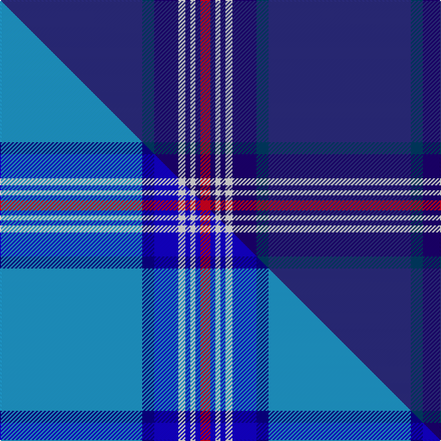

This is one **variant** — a specific cloth: this exact thread count and colourway, with its own
provenance below. It is one weaving of the [sett](/setts/dbii142dbi12db24w7db5w5db5r10/) (the scale-free proportion — the
same cloth at any scale or shade), whose colour order is pattern [BBBWBWBR](/stripes/bbbwbwbr/).

Part of the [Glen Innes](/tartans/g/gl/glen-innes/) tartan — the named design grouping this sett with its other cloths.

Sourced from tartans-authority.  It is a [8 stripe tartan](/stripes/stripes8/).

Original link [https://www.tartanregister.gov.uk/tartanDetails.aspx?ref=8443](https://www.tartanregister.gov.uk/tartanDetails.aspx?ref=8443)

Dataset <small>— provenance for this record, inherited from the source manifest</small>

<dl class="dataset-prov">
<dt>source</dt><dd><a href="/sources/tartans-authority/">Scottish Tartans Authority</a></dd>
<dt>data captured from</dt><dd><a href="https://github.com/thetartan/tartan-database/blob/master/data/tartans-authority/data.csv">https://github.com/thetartan/tartan-database/blob/master/data/tartans-authority/data.csv</a></dd>
<dt>data date</dt><dd>2nd April 1991 <small>(this record)</small></dd>
<dt>licence</dt><dd><a href="https://creativecommons.org/licenses/by-nc-nd/4.0/">CC BY-NC-ND 4.0</a></dd>
</dl>

Capture chain <small>— the hands this data passed through, oldest first; each capture carries its own licence</small>

<ol class="capture-chain">
<li><a href="https://www.tartansauthority.com/">Scottish Tartans Authority</a> <small>the heritage body's archive — its tartan-ferret record browser is retired (links repaired to the SRT, above)</small></li>
<li><a href="https://github.com/thetartan/tartan-database">thetartan/tartan-database</a> <small>2016-2017</small> · <a href="https://creativecommons.org/licenses/by-nc-nd/4.0/">CC BY-NC-ND 4.0</a> <small>Levko Kravets's frozen compilation — the capture we vendored, and where its CC licence text came from</small></li>
<li>this dictionary <small>captured 2026-06-10 · commit 5bf86c7566</small> <small>each re-capture is a git commit to data/sources</small></li>
</ol>

## Register references

External register numbers recorded for this tartan.

- Scottish Tartans Authority (ITI): 8443

## Thread count
DBii/142 DBi12 DB24 W7 DB5 W5 DB5 R/10

One full sett is **268 threads**.

## Palette
<table><thead><tr><th>Colour</th><th>Shade</th><th>OKLCh</th></tr></thead><tbody><tr><td>DB</td><td><code style="background-color:#003C64;">#003C64</code> <small style="color:#888">#003C64</small></td><td><small style="color:#888">oklch(34.5% 0.089 246.0)</small></td></tr><tr><td>DB</td><td><code style="background-color:#2C2C80;">#2C2C80</code> <small style="color:#888">#2C2C80</small></td><td><small style="color:#888">oklch(35.0% 0.138 276.6)</small></td></tr><tr><td>DB</td><td><code style="background-color:#1C0070;">#1C0070</code> <small style="color:#888">#1C0070</small></td><td><small style="color:#888">oklch(26.3% 0.162 277.1)</small></td></tr><tr><td>W</td><td><code style="background-color:#F7F7F7;">#F7F7F7</code> <small style="color:#888">#F7F7F7</small></td><td><small style="color:#888">oklch(97.6% 0.000 89.9)</small></td></tr><tr><td>R</td><td><code style="background-color:#D60020;">#D60020</code> <small style="color:#888">#D60020</small></td><td><small style="color:#888">oklch(55.2% 0.224 25.5)</small></td></tr></tbody></table>

# Sample pattern

## Compared to the master

This cloth is one sett of its design; the master sett (the exemplar the design is anchored on) is below for comparison.

Its **ΔTartan distance** from the master is **5.26** — the same measure the nearest-tartans table ranks by (0 is identical; a re-scale of the same cloth is near 0, a recolour or a different proportion further).

<figure class="master-compare" style="margin:0">

this sett
master sett ★

<figcaption style="color:#888;font-size:smaller">One weave of this sett against the <a href="/setts/t142db12b24w7b5w5b5r10/">master sett ★</a>, split on the diagonal: a shared proportion runs seamlessly across it with only the shades shifting; a different proportion breaks on it.</figcaption>
</figure>

## Nearest tartan variants

The nearest existing variants by ΔTartan distance, with this cloth at the top so the swatches line up against it.

ΔTartan

Threads

Variant

Sett

—

268

<a href="/variants/s8/dbii142dbi12db24w7db5w5db5r10~dbii1406275-dbi1404245-db1106275/">Glen Innes (District)</a>

<a href="/ttd/edit/#slug=dbi66w1db10w1db10w1db12r2lb24~x2~dbi1406275-db1404245&amp;base=dbii142dbi12db24w7db5w5db5r10~dbii1406275-dbi1404245-db1106275" title="compare in the TTD">1.22</a>

328

<a href="/variants/s9/dbi66w1db10w1db10w1db12r2lb24~x2~dbi1406275-db1404245/">RAAF #2</a>

<a href="/ttd/edit/#slug=n55db18w3db2r2db6~x2~n1604274-db0805267&amp;base=dbii142dbi12db24w7db5w5db5r10~dbii1406275-dbi1404245-db1106275" title="compare in the TTD">2.67</a>

222

<a href="/variants/s6/dbi55db18w3db2r2db6~x2~dbi1604274-db0805267/">S.C.O.T.S.</a>

<a href="/ttd/edit/#slug=r1db2n1dt3n19db3lo1db2lo1~x4~db1007262-n1703284-dt1103265&amp;base=dbii142dbi12db24w7db5w5db5r10~dbii1406275-dbi1404245-db1106275" title="compare in the TTD">3.09</a>

256

<a href="/variants/s9/r1db2n1dt3n19db3lo1db2lo1~x4~db1007262-n1703284-dt1103265/">Pagus Wasia District Tartan</a>

<a href="/ttd/edit/#slug=t136db45w7db4r4db16&amp;base=dbii142dbi12db24w7db5w5db5r10~dbii1406275-dbi1404245-db1106275" title="compare in the TTD">3.16</a>

272

<a href="/variants/s6/t136db45w7db4r4db16/">S.C.O.T.S</a>

<a href="/ttd/edit/#slug=db57y2db10dg4db4dg9r12db4r4lr2~x2&amp;base=dbii142dbi12db24w7db5w5db5r10~dbii1406275-dbi1404245-db1106275" title="compare in the TTD">3.24</a>

314

<a href="/variants/s10/db57y2db10dg4db4dg9r12db4r4lr2~x2/">Unidentified #64</a>

<a href="/ttd/edit/#slug=w6dt32n3dt3n1dt3n2db4dt1y2~x2~dt1204274-db1406275&amp;base=dbii142dbi12db24w7db5w5db5r10~dbii1406275-dbi1404245-db1106275" title="compare in the TTD">3.24</a>

212

<a href="/variants/s10/w6db32n3db3n1db3n2dbi4db1y2~x2~db1204274-dbi1406275/">X Marks the Scot</a>

<a href="/ttd/edit/#slug=dbi7db5lr6db5r7db2dbi2db70lr2~dbi1406275-db1404245&amp;base=dbii142dbi12db24w7db5w5db5r10~dbii1406275-dbi1404245-db1106275" title="compare in the TTD">3.28</a>

203

<a href="/variants/s9/dbi7db5lr6db5r7db2dbi2db70lr2~dbi1406275-db1404245/">United States Trade sett Tartan</a>

<a href="/ttd/edit/#slug=db32w1db1y2db1r1db4dg16~x4&amp;base=dbii142dbi12db24w7db5w5db5r10~dbii1406275-dbi1404245-db1106275" title="compare in the TTD">3.32</a>

272

<a href="/variants/s8/db32w1db1y2db1r1db4dg16~x4/">Royal Agricultural Winter Fair</a>

<a href="/ttd/edit/#slug=db2w2db43t5dt4k8dt2w2~x2~db1404245-dt1204274&amp;base=dbii142dbi12db24w7db5w5db5r10~dbii1406275-dbi1404245-db1106275" title="compare in the TTD">3.39</a>

264

<a href="/variants/s8/dbi2w2dbi43t5db4k8db2w2~x2~dbi1404245-db1204274/">Fife Flyers</a>

<a href="/ttd/edit/#slug=k10db3k3db32g1db1g1db2n2~x2&amp;base=dbii142dbi12db24w7db5w5db5r10~dbii1406275-dbi1404245-db1106275" title="compare in the TTD">3.40</a>

196

<a href="/variants/s9/k10db3k3db32g1db1g1db2n2~x2/">Orman (Midlothian) (Personal)</a>

## Neighbour map

Every grey dot is one of 13656 variants placed by the first two principal components of the ΔTartan feature space (42% of its variance). Red is this tartan; blue dots are its nearest — click one to open its page. The map is a flat projection of a many-dimensional space — [how to read it](/posts/neighbourhood-maps/).

<svg viewBox="0 0 640 380" role="img" style="max-width:100%;height:auto;border:1px solid #e0e0e0;border-radius:4px;display:block" xmlns="http://www.w3.org/2000/svg"><image href="/nn/cloud.v1.png" width="640" height="380"/><a href="/variants/s9/dbi66w1db10w1db10w1db12r2lb24~x2~dbi1406275-db1404245/"><circle cx="356.3" cy="99.9" r="4" fill="#3465a4"><title>RAAF #2</title></circle></a><a href="/variants/s6/dbi55db18w3db2r2db6~x2~dbi1604274-db0805267/"><circle cx="476.9" cy="161.6" r="4" fill="#3465a4"><title>S.C.O.T.S.</title></circle></a><a href="/variants/s9/r1db2n1dt3n19db3lo1db2lo1~x4~db1007262-n1703284-dt1103265/"><circle cx="429.4" cy="144.4" r="4" fill="#3465a4"><title>Pagus Wasia District Tartan</title></circle></a><a href="/variants/s6/t136db45w7db4r4db16/"><circle cx="462.1" cy="152.0" r="4" fill="#3465a4"><title>S.C.O.T.S</title></circle></a><a href="/variants/s10/db57y2db10dg4db4dg9r12db4r4lr2~x2/"><circle cx="452.0" cy="106.4" r="4" fill="#3465a4"><title>Unidentified #64</title></circle></a><a href="/variants/s10/w6db32n3db3n1db3n2dbi4db1y2~x2~db1204274-dbi1406275/"><circle cx="437.3" cy="103.8" r="4" fill="#3465a4"><title>X Marks the Scot</title></circle></a><a href="/variants/s9/dbi7db5lr6db5r7db2dbi2db70lr2~dbi1406275-db1404245/"><circle cx="567.2" cy="113.6" r="4" fill="#3465a4"><title>United States Trade sett Tartan</title></circle></a><a href="/variants/s8/db32w1db1y2db1r1db4dg16~x4/"><circle cx="487.9" cy="133.5" r="4" fill="#3465a4"><title>Royal Agricultural Winter Fair</title></circle></a><a href="/variants/s8/dbi2w2dbi43t5db4k8db2w2~x2~dbi1404245-db1204274/"><circle cx="379.7" cy="107.4" r="4" fill="#3465a4"><title>Fife Flyers</title></circle></a><a href="/variants/s9/k10db3k3db32g1db1g1db2n2~x2/"><circle cx="462.2" cy="104.3" r="4" fill="#3465a4"><title>Orman (Midlothian) (Personal)</title></circle></a><circle cx="474.7" cy="117.7" r="5" fill="#c00000"/><text x="320" y="376" text-anchor="middle" font-size="11" fill="#999">ground</text><text x="11" y="190" text-anchor="middle" font-size="11" fill="#999" transform="rotate(-90 11 190)">complexity</text></svg>

ID: /variants/s8/dbii142dbi12db24w7db5w5db5r10~dbii1406275-dbi1404245-db1106275/
