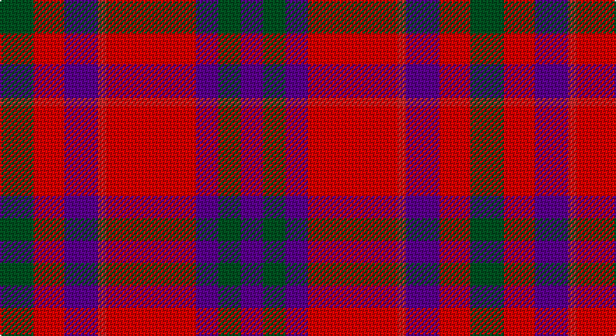

This page is one **sett** — a single exact thread-count. It belongs to the [tartan](/setts/dg12r11dp12ri3r32dp8dg8dp8/)
(the same proportion at any scale), whose colour order is pattern [BGBRRBRG](/stripes/bgbrrbrg/).

Part of the [Fiddes](/tartans/fiddes/) tartan — the named design grouping this sett with its other cloths.

Sourced from register-of-tartans.  It is a [8 stripe tartan](/stripes/stripes8/).

Original link https://www.tartanregister.gov.uk/tartanDetails.aspx?ref=1174

## Also known as

This cloth is also recorded under:

- Fiddes #2
- Fiddes #3

## Register references

External register numbers recorded for this tartan.

- Scottish Register of Tartans: [1174](https://www.tartanregister.gov.uk/tartanDetails.aspx?ref=1174)
- Scottish Tartans World Register: 121

## Thread count
G/24 R22 P24 Ra6 R64 P16 G16 P/16

One full sett is **336 threads**.

## Palette

Palette: <strong>Tartan Register</strong>
<table><thead><tr><th>Colour</th><th>Threads</th><th>Shade</th><th>Base</th><th>OKLCh</th></tr></thead><tbody><tr><td>G/</td><td style="text-align:right;font-variant-numeric:tabular-nums">24</td><td><code style="background-color:#005020;">#005020</code> <small style="color:#888">#005020</small></td><td>G <code style="background-color:#006100;">#006100</code></td><td><small style="color:#888">oklch(37.7% 0.105 149.6)</small></td></tr><tr><td>R</td><td style="text-align:right;font-variant-numeric:tabular-nums">22</td><td><code style="background-color:#DC0000;">#DC0000</code> <small style="color:#888">#DC0000</small></td><td>R <code style="background-color:#CC0000;">#CC0000</code></td><td><small style="color:#888">oklch(56.2% 0.230 29.2)</small></td></tr><tr><td>P</td><td style="text-align:right;font-variant-numeric:tabular-nums">24</td><td><code style="background-color:#5A008C;">#5A008C</code> <small style="color:#888">#5A008C</small></td><td>B <code style="background-color:#2A418A;">#2A418A</code></td><td><small style="color:#888">oklch(37.0% 0.191 306.3)</small></td></tr><tr><td>Ra</td><td style="text-align:right;font-variant-numeric:tabular-nums">6</td><td><code style="background-color:#C82828;">#C82828</code> <small style="color:#888">#C82828</small></td><td>R <code style="background-color:#CC0000;">#CC0000</code></td><td><small style="color:#888">oklch(54.2% 0.196 26.8)</small></td></tr><tr><td>R</td><td style="text-align:right;font-variant-numeric:tabular-nums">64</td><td><code style="background-color:#DC0000;">#DC0000</code> <small style="color:#888">#DC0000</small></td><td>R <code style="background-color:#CC0000;">#CC0000</code></td><td><small style="color:#888">oklch(56.2% 0.230 29.2)</small></td></tr><tr><td>P</td><td style="text-align:right;font-variant-numeric:tabular-nums">16</td><td><code style="background-color:#5A008C;">#5A008C</code> <small style="color:#888">#5A008C</small></td><td>B <code style="background-color:#2A418A;">#2A418A</code></td><td><small style="color:#888">oklch(37.0% 0.191 306.3)</small></td></tr><tr><td>G</td><td style="text-align:right;font-variant-numeric:tabular-nums">16</td><td><code style="background-color:#005020;">#005020</code> <small style="color:#888">#005020</small></td><td>G <code style="background-color:#006100;">#006100</code></td><td><small style="color:#888">oklch(37.7% 0.105 149.6)</small></td></tr><tr><td>P/</td><td style="text-align:right;font-variant-numeric:tabular-nums">16</td><td><code style="background-color:#5A008C;">#5A008C</code> <small style="color:#888">#5A008C</small></td><td>B <code style="background-color:#2A418A;">#2A418A</code></td><td><small style="color:#888">oklch(37.0% 0.191 306.3)</small></td></tr></tbody></table>

# Sample pattern

## Nearest tartans

The nearest existing variants by ΔTartan distance, with this tartan at the top so the swatches line up against it.

ΔTartan

Tartan

Sett

—

<a href="/ttd/edit/#slug=dg12r11dp12ri3r32dp8dg8dp8~x2">Fiddes</a> <a class="nn-out" href="/variants/s8/dg12r11dp12ri3r32dp8dg8dp8~x2/" title="open its dictionary page">↗</a>

0.81

<a href="/ttd/edit/#slug=g12ri11p12r3ri32p8g8p8~x2&amp;base=dg12r11dp12ri3r32dp8dg8dp8~x2">Fiddes</a> <a class="nn-out" href="/variants/s8/g12ri11p12r3ri32p8g8p8~x2/" title="open its dictionary page">↗</a>

1.10

<a href="/ttd/edit/#slug=r3db15r3g8r20k2~x2&amp;base=dg12r11dp12ri3r32dp8dg8dp8~x2">Finnigan (Estimated threadcount)</a> <a class="nn-out" href="/variants/s6/r3db15r3g8r20k2~x2/" title="open its dictionary page">↗</a>

1.13

<a href="/ttd/edit/#slug=r16o2r11o6k4w2k4o16~x2&amp;base=dg12r11dp12ri3r32dp8dg8dp8~x2">Sidney (Nova Scotia) Canadian Tartan</a> <a class="nn-out" href="/variants/s8/r16o2r11o6k4w2k4o16~x2/" title="open its dictionary page">↗</a>

1.20

<a href="/ttd/edit/#slug=k2r12db6r3dg12r4db1~x2&amp;base=dg12r11dp12ri3r32dp8dg8dp8~x2">MacBean/MacElvain</a> <a class="nn-out" href="/variants/s7/k2r12db6r3dg12r4db1~x2/" title="open its dictionary page">↗</a>

1.22

<a href="/ttd/edit/#slug=r36lb3r5k21db24k3~x2&amp;base=dg12r11dp12ri3r32dp8dg8dp8~x2">Graham of Menteith (Red)</a> <a class="nn-out" href="/variants/s6/r36lb3r5k21db24k3~x2/" title="open its dictionary page">↗</a>

1.26

<a href="/ttd/edit/#slug=r16db6ly4db6w1db6ly4db6r16db1~x4&amp;base=dg12r11dp12ri3r32dp8dg8dp8~x2">Superfast Ferries</a> <a class="nn-out" href="/variants/s10/r16db6ly4db6w1db6ly4db6r16db1~x4/" title="open its dictionary page">↗</a>

1.26

<a href="/ttd/edit/#slug=r6dg16r4db12r16t1r2~x2&amp;base=dg12r11dp12ri3r32dp8dg8dp8~x2">MacQuarrie #6</a> <a class="nn-out" href="/variants/s7/r6dg16r4db12r16t1r2~x2/" title="open its dictionary page">↗</a>

1.27

<a href="/ttd/edit/#slug=db8r8dg17w3r35db10dg15w3~x2&amp;base=dg12r11dp12ri3r32dp8dg8dp8~x2">James of Glencarr (Personal)</a> <a class="nn-out" href="/variants/s8/db8r8dg17w3r35db10dg15w3~x2/" title="open its dictionary page">↗</a>

1.28

<a href="/ttd/edit/#slug=k9r4k2r20o9r4db18r4w2~x2&amp;base=dg12r11dp12ri3r32dp8dg8dp8~x2">Stephens Dress</a> <a class="nn-out" href="/variants/s9/k9r4k2r20o9r4db18r4w2~x2/" title="open its dictionary page">↗</a>

1.30

<a href="/ttd/edit/#slug=db24r3db4r6g8r3g8r30k3~x2&amp;base=dg12r11dp12ri3r32dp8dg8dp8~x2">Gates</a> <a class="nn-out" href="/variants/s9/db24r3db4r6g8r3g8r30k3~x2/" title="open its dictionary page">↗</a>

## Neighbour map

Every grey dot is one of 14360 variants placed by the first two principal components of the ΔTartan feature space (44% of its variance). Red is this tartan; blue dots are its nearest — click one to open its page.

<svg viewBox="0 0 640 380" role="img" style="max-width:100%;height:auto;border:1px solid #e0e0e0;border-radius:4px;display:block" xmlns="http://www.w3.org/2000/svg"><image href="/nn/cloud.v1.png" width="640" height="380"/><a href="/variants/s8/g12ri11p12r3ri32p8g8p8~x2/"><circle cx="264.1" cy="206.3" r="4" fill="#3465a4"><title>Fiddes</title></circle></a><a href="/variants/s6/r3db15r3g8r20k2~x2/"><circle cx="285.7" cy="208.5" r="4" fill="#3465a4"><title>Finnigan (Estimated threadcount)</title></circle></a><a href="/variants/s8/r16o2r11o6k4w2k4o16~x2/"><circle cx="235.6" cy="203.4" r="4" fill="#3465a4"><title>Sidney (Nova Scotia) Canadian Tartan</title></circle></a><a href="/variants/s7/k2r12db6r3dg12r4db1~x2/"><circle cx="259.2" cy="199.0" r="4" fill="#3465a4"><title>MacBean/MacElvain</title></circle></a><a href="/variants/s6/r36lb3r5k21db24k3~x2/"><circle cx="248.5" cy="195.7" r="4" fill="#3465a4"><title>Graham of Menteith (Red)</title></circle></a><a href="/variants/s10/r16db6ly4db6w1db6ly4db6r16db1~x4/"><circle cx="268.8" cy="159.8" r="4" fill="#3465a4"><title>Superfast Ferries</title></circle></a><a href="/variants/s7/r6dg16r4db12r16t1r2~x2/"><circle cx="284.4" cy="191.1" r="4" fill="#3465a4"><title>MacQuarrie #6</title></circle></a><a href="/variants/s8/db8r8dg17w3r35db10dg15w3~x2/"><circle cx="227.4" cy="186.0" r="4" fill="#3465a4"><title>James of Glencarr (Personal)</title></circle></a><a href="/variants/s9/k9r4k2r20o9r4db18r4w2~x2/"><circle cx="198.3" cy="167.0" r="4" fill="#3465a4"><title>Stephens Dress</title></circle></a><a href="/variants/s9/db24r3db4r6g8r3g8r30k3~x2/"><circle cx="269.6" cy="180.0" r="4" fill="#3465a4"><title>Gates</title></circle></a><circle cx="247.4" cy="198.5" r="5" fill="#c00000"/></svg>

ID: /variants/s8/dg12r11dp12ri3r32dp8dg8dp8~x2/
