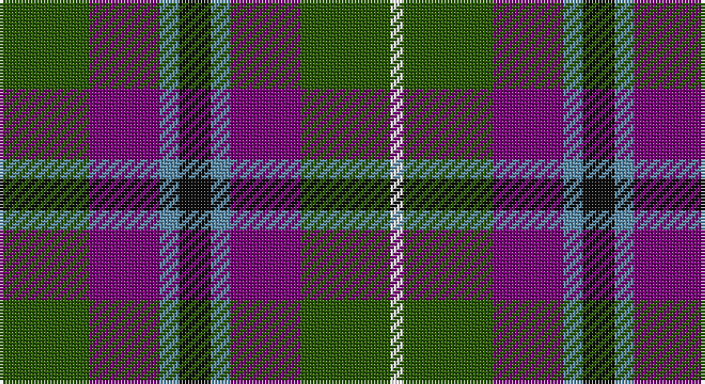

This page is one **sett** — a single exact thread-count. It belongs to the [tartan](/setts/dg14dp11t3k5t3dp11dg14w2/)
(the same proportion at any scale), whose colour order is pattern [GBBKBBGW](/stripes/gbbkbbgw/).

Sourced from register-of-tartans.  It is a [8 stripe tartan](/stripes/stripes8/).

Original link https://www.tartanregister.gov.uk/tartanDetails.aspx?ref=4757

## Register references

External register numbers recorded for this tartan.

- Scottish Register of Tartans: [4757](https://www.tartanregister.gov.uk/tartanDetails.aspx?ref=4757)
- Scottish Tartans Authority (ITI): 5588

## Thread count
G/28 P22 B6 K10 B6 P22 G28 W/4

One full sett is **220 threads**.

## Palette

Palette: <strong>Tartan Register</strong>
<table><thead><tr><th>Colour</th><th>Threads</th><th>Shade</th><th>Base</th><th>OKLCh</th></tr></thead><tbody><tr><td>G/</td><td style="text-align:right;font-variant-numeric:tabular-nums">28</td><td><code style="background-color:#285800;">#285800</code> <small style="color:#888">#285800</small></td><td>G <code style="background-color:#006100;">#006100</code></td><td><small style="color:#888">oklch(41.0% 0.122 135.8)</small></td></tr><tr><td>P</td><td style="text-align:right;font-variant-numeric:tabular-nums">22</td><td><code style="background-color:#780078;">#780078</code> <small style="color:#888">#780078</small></td><td>B <code style="background-color:#2A418A;">#2A418A</code></td><td><small style="color:#888">oklch(40.2% 0.185 328.4)</small></td></tr><tr><td>B</td><td style="text-align:right;font-variant-numeric:tabular-nums">6</td><td><code style="background-color:#5C8CA8;">#5C8CA8</code> <small style="color:#888">#5C8CA8</small></td><td>B <code style="background-color:#2A418A;">#2A418A</code></td><td><small style="color:#888">oklch(61.7% 0.067 235.0)</small></td></tr><tr><td>K</td><td style="text-align:right;font-variant-numeric:tabular-nums">10</td><td><code style="background-color:#101010;">#101010</code> <small style="color:#888">#101010</small></td><td>K <code style="background-color:#000000;">#000000</code></td><td><small style="color:#888">oklch(17.3% 0.000 89.9)</small></td></tr><tr><td>B</td><td style="text-align:right;font-variant-numeric:tabular-nums">6</td><td><code style="background-color:#5C8CA8;">#5C8CA8</code> <small style="color:#888">#5C8CA8</small></td><td>B <code style="background-color:#2A418A;">#2A418A</code></td><td><small style="color:#888">oklch(61.7% 0.067 235.0)</small></td></tr><tr><td>P</td><td style="text-align:right;font-variant-numeric:tabular-nums">22</td><td><code style="background-color:#780078;">#780078</code> <small style="color:#888">#780078</small></td><td>B <code style="background-color:#2A418A;">#2A418A</code></td><td><small style="color:#888">oklch(40.2% 0.185 328.4)</small></td></tr><tr><td>G</td><td style="text-align:right;font-variant-numeric:tabular-nums">28</td><td><code style="background-color:#285800;">#285800</code> <small style="color:#888">#285800</small></td><td>G <code style="background-color:#006100;">#006100</code></td><td><small style="color:#888">oklch(41.0% 0.122 135.8)</small></td></tr><tr><td>W/</td><td style="text-align:right;font-variant-numeric:tabular-nums">4</td><td><code style="background-color:#FCFCFC;">#FCFCFC</code> <small style="color:#888">#FCFCFC</small></td><td>W <code style="background-color:#F7F7F7;">#F7F7F7</code></td><td><small style="color:#888">oklch(99.1% 0.000 89.9)</small></td></tr></tbody></table>

# Sample pattern

## Nearest tartans

The nearest existing variants by ΔTartan distance, with this tartan at the top so the swatches line up against it.

ΔTartan

Tartan

Sett

—

<a href="/ttd/edit/#slug=dg14dp11t3k5t3dp11dg14w2~x2">Wilson's No.229</a> <a class="nn-out" href="/variants/s8/dg14dp11t3k5t3dp11dg14w2~x2/" title="open its dictionary page">↗</a>

0.38

<a href="/ttd/edit/#slug=g14dp11y3k5y3dp11g14ly2~x2&amp;base=dg14dp11t3k5t3dp11dg14w2~x2">Wilson's No.124</a> <a class="nn-out" href="/variants/s8/g14dp11y3k5y3dp11g14ly2~x2/" title="open its dictionary page">↗</a>

0.87

<a href="/variants/s8/k8t3g13dp12ly2~x2/">Wilson's No.176</a>

1.04

<a href="/ttd/edit/#slug=r1g6dp6t1k2t1dp6g6r1g1~x4&amp;base=dg14dp11t3k5t3dp11dg14w2~x2">Wilson's No.183</a> <a class="nn-out" href="/variants/s10/r1g6dp6t1k2t1dp6g6r1g1~x4/" title="open its dictionary page">↗</a>

1.05

<a href="/ttd/edit/#slug=db10o3db10r3k21g20k15r3~x2&amp;base=dg14dp11t3k5t3dp11dg14w2~x2">Williamson/Smart (Personal)</a> <a class="nn-out" href="/variants/s8/db10o3db10r3k21g20k15r3~x2/" title="open its dictionary page">↗</a>

1.06

<a href="/ttd/edit/#slug=r2k8lo1k8g8t8r2~x4&amp;base=dg14dp11t3k5t3dp11dg14w2~x2">Brodie Hunting</a> <a class="nn-out" href="/variants/s7/r2k8lo1k8g8t8r2~x4/" title="open its dictionary page">↗</a>

1.10

<a href="/ttd/edit/#slug=dt6lo2r6lb3k2lo6dt10r2dt3r2~x4&amp;base=dg14dp11t3k5t3dp11dg14w2~x2">Commonwealth</a> <a class="nn-out" href="/variants/s10/dt6lo2r6lb3k2lo6dt10r2dt3r2~x4/" title="open its dictionary page">↗</a>

1.11

<a href="/ttd/edit/#slug=o8r1o8g8k8db8o8r2~x2&amp;base=dg14dp11t3k5t3dp11dg14w2~x2">MacDuff, hunting</a> <a class="nn-out" href="/variants/s8/o8r1o8g8k8db8o8r2~x2/" title="open its dictionary page">↗</a>

1.12

<a href="/ttd/edit/#slug=dg7dp3w1g2dg1r2dp1~x8&amp;base=dg14dp11t3k5t3dp11dg14w2~x2">Lindley-Highfield (Name)</a> <a class="nn-out" href="/variants/s7/dg7dp3w1g2dg1r2dp1~x8/" title="open its dictionary page">↗</a>

1.14

<a href="/ttd/edit/#slug=db7r3g7r1g7r3db7t1~x2&amp;base=dg14dp11t3k5t3dp11dg14w2~x2">Hebrides #8</a> <a class="nn-out" href="/variants/s8/db7r3g7r1g7r3db7t1~x2/" title="open its dictionary page">↗</a>

1.16

<a href="/ttd/edit/#slug=k4b21dy10y4k20r6b3~x2&amp;base=dg14dp11t3k5t3dp11dg14w2~x2">Swankie (Personal)</a> <a class="nn-out" href="/variants/s7/k4b21dy10y4k20r6b3~x2/" title="open its dictionary page">↗</a>

## Neighbour map

Every grey dot is one of 14360 variants placed by the first two principal components of the ΔTartan feature space (44% of its variance). Red is this tartan; blue dots are its nearest — click one to open its page.

<svg viewBox="0 0 640 380" role="img" style="max-width:100%;height:auto;border:1px solid #e0e0e0;border-radius:4px;display:block" xmlns="http://www.w3.org/2000/svg"><image href="/nn/cloud.v1.png" width="640" height="380"/><a href="/variants/s8/g14dp11y3k5y3dp11g14ly2~x2/"><circle cx="184.5" cy="221.6" r="4" fill="#3465a4"><title>Wilson's No.124</title></circle></a><a href="/variants/s8/k8t3g13dp12ly2~x2/"><circle cx="150.3" cy="234.7" r="4" fill="#3465a4"><title>Wilson's No.176</title></circle></a><a href="/variants/s10/r1g6dp6t1k2t1dp6g6r1g1~x4/"><circle cx="191.5" cy="209.0" r="4" fill="#3465a4"><title>Wilson's No.183</title></circle></a><a href="/variants/s8/db10o3db10r3k21g20k15r3~x2/"><circle cx="172.9" cy="225.3" r="4" fill="#3465a4"><title>Williamson/Smart (Personal)</title></circle></a><a href="/variants/s7/r2k8lo1k8g8t8r2~x4/"><circle cx="155.3" cy="219.1" r="4" fill="#3465a4"><title>Brodie Hunting</title></circle></a><a href="/variants/s10/dt6lo2r6lb3k2lo6dt10r2dt3r2~x4/"><circle cx="149.2" cy="210.9" r="4" fill="#3465a4"><title>Commonwealth</title></circle></a><a href="/variants/s8/o8r1o8g8k8db8o8r2~x2/"><circle cx="155.5" cy="231.9" r="4" fill="#3465a4"><title>MacDuff, hunting</title></circle></a><a href="/variants/s7/dg7dp3w1g2dg1r2dp1~x8/"><circle cx="185.0" cy="195.1" r="4" fill="#3465a4"><title>Lindley-Highfield (Name)</title></circle></a><a href="/variants/s8/db7r3g7r1g7r3db7t1~x2/"><circle cx="193.5" cy="248.2" r="4" fill="#3465a4"><title>Hebrides #8</title></circle></a><a href="/variants/s7/k4b21dy10y4k20r6b3~x2/"><circle cx="147.2" cy="214.6" r="4" fill="#3465a4"><title>Swankie (Personal)</title></circle></a><circle cx="183.0" cy="219.7" r="5" fill="#c00000"/></svg>

ID: /variants/s8/dg14dp11t3k5t3dp11dg14w2~x2/
