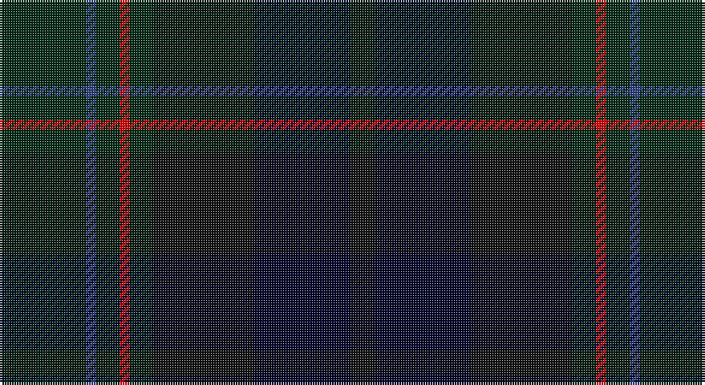

This page is one **sett** — a single exact thread-count. It belongs to the [tartan](/setts/dg18db2dg5r2dg5ki21k20ki5/)
(the same proportion at any scale), whose colour order is pattern [GBGRGKKK](/stripes/gbgrgkkk/).

Sourced from register-of-tartans.  It is a [8 stripe tartan](/stripes/stripes8/).

Original link https://www.tartanregister.gov.uk/tartanDetails.aspx?ref=2756

## Register references

External register numbers recorded for this tartan.

- Scottish Register of Tartans: [2756](https://www.tartanregister.gov.uk/tartanDetails.aspx?ref=2756)
- Scottish Tartans World Register: 2767

## Thread count
DG/36 B4 DG10 R4 DG10 K42 DB40 K/10

One full sett is **266 threads**.

## Palette

Palette: <strong>Tartan Register</strong> <small style="color:#888">(4 of 5 colours)</small>
<table><thead><tr><th>Colour</th><th>Threads</th><th>Shade</th><th>Base</th><th>OKLCh</th></tr></thead><tbody><tr><td>DG/</td><td style="text-align:right;font-variant-numeric:tabular-nums">36</td><td><code style="background-color:#002814;">#002814</code> <small style="color:#888">#002814</small></td><td>G <code style="background-color:#006100;">#006100</code></td><td><small style="color:#888">oklch(24.4% 0.059 156.5)</small></td></tr><tr><td>B</td><td style="text-align:right;font-variant-numeric:tabular-nums">4</td><td><code style="background-color:#2C4084;">#2C4084</code> <small style="color:#888">#2C4084</small></td><td>B <code style="background-color:#2A418A;">#2A418A</code></td><td><small style="color:#888">oklch(39.4% 0.117 268.3)</small></td></tr><tr><td>DG</td><td style="text-align:right;font-variant-numeric:tabular-nums">10</td><td><code style="background-color:#002814;">#002814</code> <small style="color:#888">#002814</small></td><td>G <code style="background-color:#006100;">#006100</code></td><td><small style="color:#888">oklch(24.4% 0.059 156.5)</small></td></tr><tr><td>R</td><td style="text-align:right;font-variant-numeric:tabular-nums">4</td><td><code style="background-color:#DC0000;">#DC0000</code> <small style="color:#888">#DC0000</small></td><td>R <code style="background-color:#CC0000;">#CC0000</code></td><td><small style="color:#888">oklch(56.2% 0.230 29.2)</small></td></tr><tr><td>DG</td><td style="text-align:right;font-variant-numeric:tabular-nums">10</td><td><code style="background-color:#002814;">#002814</code> <small style="color:#888">#002814</small></td><td>G <code style="background-color:#006100;">#006100</code></td><td><small style="color:#888">oklch(24.4% 0.059 156.5)</small></td></tr><tr><td>K</td><td style="text-align:right;font-variant-numeric:tabular-nums">42</td><td><code style="background-color:#101010;">#101010</code> <small style="color:#888">#101010</small></td><td>K <code style="background-color:#000000;">#000000</code></td><td><small style="color:#888">oklch(17.3% 0.000 89.9)</small></td></tr><tr><td>DB</td><td style="text-align:right;font-variant-numeric:tabular-nums">40</td><td><code style="background-color:#000028;">#000028</code> <small style="color:#888">#000028</small></td><td>K <code style="background-color:#000000;">#000000</code></td><td><small style="color:#888">oklch(12.5% 0.087 264.1)</small></td></tr><tr><td>K/</td><td style="text-align:right;font-variant-numeric:tabular-nums">10</td><td><code style="background-color:#101010;">#101010</code> <small style="color:#888">#101010</small></td><td>K <code style="background-color:#000000;">#000000</code></td><td><small style="color:#888">oklch(17.3% 0.000 89.9)</small></td></tr></tbody></table>

# Sample pattern

## Nearest tartans

The nearest existing variants by ΔTartan distance, with this tartan at the top so the swatches line up against it.

ΔTartan

Tartan

Sett

—

<a href="/ttd/edit/#slug=dg18db2dg5r2dg5ki21k20ki5~x2">MacRae, Special Hunting</a> <a class="nn-out" href="/variants/s8/dg18db2dg5r2dg5ki21k20ki5~x2/" title="open its dictionary page">↗</a>

1.19

<a href="/ttd/edit/#slug=k10lo1k3dt8dg8dgi1dg8dt8k15lo1~x2&amp;base=dg18db2dg5r2dg5ki21k20ki5~x2">Ryder Cup 2006</a> <a class="nn-out" href="/variants/s10/k10lo1k3dt8dg8dgi1dg8dt8k15lo1~x2/" title="open its dictionary page">↗</a>

1.45

<a href="/variants/s11/k2ki20dg30ki2dg4ki2dg30ki3db30ki35r2/">Phillips Welsh Name Tartan</a>

1.51

<a href="/ttd/edit/#slug=dg28k2dbi3k11dbi3k2dbi17db4lr2~x2&amp;base=dg18db2dg5r2dg5ki21k20ki5~x2">West of Wells (Personal)</a> <a class="nn-out" href="/variants/s9/dg28k2dbi3k11dbi3k2dbi17db4lr2~x2/" title="open its dictionary page">↗</a>

1.51

<a href="/ttd/edit/#slug=dp2dg16dti16dt2dti2dt2dti2dt15db3lo2~x2&amp;base=dg18db2dg5r2dg5ki21k20ki5~x2">Brydon (Scottish Borders)</a> <a class="nn-out" href="/variants/s10/dp2dg16dti16dt2dti2dt2dti2dt15db3lo2~x2/" title="open its dictionary page">↗</a>

1.61

<a href="/ttd/edit/#slug=db4k4db16k14dg14m3dg3~x2&amp;base=dg18db2dg5r2dg5ki21k20ki5~x2">Inneryne (Personal)</a> <a class="nn-out" href="/variants/s7/db4k4db16k14dg14m3dg3~x2/" title="open its dictionary page">↗</a>

1.61

<a href="/variants/s7/dgi3dg12dt6dgii3db15o2db2~x2/">Myres Castle</a>

1.63

<a href="/ttd/edit/#slug=dti16k3dti40k22db3k25dg3k6dt10&amp;base=dg18db2dg5r2dg5ki21k20ki5~x2">Comme Ça Il Conte</a> <a class="nn-out" href="/variants/s9/dti16k3dti40k22db3k25dg3k6dt10/" title="open its dictionary page">↗</a>

1.67

<a href="/ttd/edit/#slug=dg7db1dg1k4dp4k1~x4&amp;base=dg18db2dg5r2dg5ki21k20ki5~x2">MacArthur of Milton Hunting</a> <a class="nn-out" href="/variants/s6/dg7db1dg1k4dp4k1~x4/" title="open its dictionary page">↗</a>

1.70

<a href="/ttd/edit/#slug=dgi5dg2db2dg2db2dt5dg2dt1lo1dt1dg10db3~x4&amp;base=dg18db2dg5r2dg5ki21k20ki5~x2">Protheroe (Welsh Name)</a> <a class="nn-out" href="/variants/s12/dgi5dg2db2dg2db2dt5dg2dt1lo1dt1dg10db3~x4/" title="open its dictionary page">↗</a>

1.70

<a href="/ttd/edit/#slug=db16k2db2k2db2k12dg13k2dg13k12db12k2r1~x2&amp;base=dg18db2dg5r2dg5ki21k20ki5~x2">Black Watch/Isetan Men's</a> <a class="nn-out" href="/variants/s13/db16k2db2k2db2k12dg13k2dg13k12db12k2r1~x2/" title="open its dictionary page">↗</a>

## Neighbour map

Every grey dot is one of 14360 variants placed by the first two principal components of the ΔTartan feature space (44% of its variance). Red is this tartan; blue dots are its nearest — click one to open its page.

<svg viewBox="0 0 640 380" role="img" style="max-width:100%;height:auto;border:1px solid #e0e0e0;border-radius:4px;display:block" xmlns="http://www.w3.org/2000/svg"><image href="/nn/cloud.v1.png" width="640" height="380"/><a href="/variants/s10/k10lo1k3dt8dg8dgi1dg8dt8k15lo1~x2/"><circle cx="333.3" cy="256.3" r="4" fill="#3465a4"><title>Ryder Cup 2006</title></circle></a><a href="/variants/s11/k2ki20dg30ki2dg4ki2dg30ki3db30ki35r2/"><circle cx="361.2" cy="232.0" r="4" fill="#3465a4"><title>Phillips Welsh Name Tartan</title></circle></a><a href="/variants/s9/dg28k2dbi3k11dbi3k2dbi17db4lr2~x2/"><circle cx="317.8" cy="222.5" r="4" fill="#3465a4"><title>West of Wells (Personal)</title></circle></a><a href="/variants/s10/dp2dg16dti16dt2dti2dt2dti2dt15db3lo2~x2/"><circle cx="255.9" cy="235.2" r="4" fill="#3465a4"><title>Brydon (Scottish Borders)</title></circle></a><a href="/variants/s7/db4k4db16k14dg14m3dg3~x2/"><circle cx="293.2" cy="331.8" r="4" fill="#3465a4"><title>Inneryne (Personal)</title></circle></a><a href="/variants/s7/dgi3dg12dt6dgii3db15o2db2~x2/"><circle cx="255.6" cy="259.3" r="4" fill="#3465a4"><title>Myres Castle</title></circle></a><a href="/variants/s9/dti16k3dti40k22db3k25dg3k6dt10/"><circle cx="366.4" cy="252.6" r="4" fill="#3465a4"><title>Comme Ça Il Conte</title></circle></a><a href="/variants/s6/dg7db1dg1k4dp4k1~x4/"><circle cx="345.8" cy="314.7" r="4" fill="#3465a4"><title>MacArthur of Milton Hunting</title></circle></a><a href="/variants/s12/dgi5dg2db2dg2db2dt5dg2dt1lo1dt1dg10db3~x4/"><circle cx="308.6" cy="248.7" r="4" fill="#3465a4"><title>Protheroe (Welsh Name)</title></circle></a><a href="/variants/s13/db16k2db2k2db2k12dg13k2dg13k12db12k2r1~x2/"><circle cx="335.4" cy="250.2" r="4" fill="#3465a4"><title>Black Watch/Isetan Men's</title></circle></a><circle cx="305.2" cy="274.0" r="5" fill="#c00000"/></svg>

ID: /variants/s8/dg18db2dg5r2dg5ki21k20ki5~x2/
