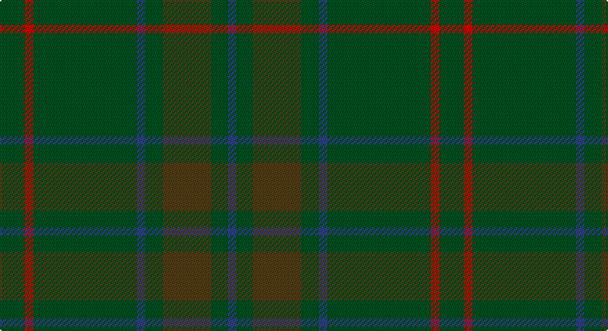

This page is one **sett** — a single exact thread-count. It belongs to the [tartan](/setts/dg18r6dg75db6dg13dy35dg12db6/)
(the same proportion at any scale), whose colour order is pattern [BGGGBGRG](/stripes/bgggbgrg/).

Sourced from register-of-tartans.  It is a [8 stripe tartan](/stripes/stripes8/).

Original link https://www.tartanregister.gov.uk/tartanDetails.aspx?ref=1321

## Register references

External register numbers recorded for this tartan.

- Scottish Register of Tartans: [1321](https://www.tartanregister.gov.uk/tartanDetails.aspx?ref=1321)
- Scottish Tartans World Register: 197

## Thread count
G/18 R6 G75 B6 G13 T35 G12 B/6

One full sett is **318 threads**.

## Palette

Palette: <strong>Tartan Register</strong>
<table><thead><tr><th>Colour</th><th>Threads</th><th>Shade</th><th>Base</th><th>OKLCh</th></tr></thead><tbody><tr><td>G/</td><td style="text-align:right;font-variant-numeric:tabular-nums">18</td><td><code style="background-color:#005020;">#005020</code> <small style="color:#888">#005020</small></td><td>G <code style="background-color:#006100;">#006100</code></td><td><small style="color:#888">oklch(37.7% 0.105 149.6)</small></td></tr><tr><td>R</td><td style="text-align:right;font-variant-numeric:tabular-nums">6</td><td><code style="background-color:#DC0000;">#DC0000</code> <small style="color:#888">#DC0000</small></td><td>R <code style="background-color:#CC0000;">#CC0000</code></td><td><small style="color:#888">oklch(56.2% 0.230 29.2)</small></td></tr><tr><td>G</td><td style="text-align:right;font-variant-numeric:tabular-nums">75</td><td><code style="background-color:#005020;">#005020</code> <small style="color:#888">#005020</small></td><td>G <code style="background-color:#006100;">#006100</code></td><td><small style="color:#888">oklch(37.7% 0.105 149.6)</small></td></tr><tr><td>B</td><td style="text-align:right;font-variant-numeric:tabular-nums">6</td><td><code style="background-color:#2C4084;">#2C4084</code> <small style="color:#888">#2C4084</small></td><td>B <code style="background-color:#2A418A;">#2A418A</code></td><td><small style="color:#888">oklch(39.4% 0.117 268.3)</small></td></tr><tr><td>G</td><td style="text-align:right;font-variant-numeric:tabular-nums">13</td><td><code style="background-color:#005020;">#005020</code> <small style="color:#888">#005020</small></td><td>G <code style="background-color:#006100;">#006100</code></td><td><small style="color:#888">oklch(37.7% 0.105 149.6)</small></td></tr><tr><td>T</td><td style="text-align:right;font-variant-numeric:tabular-nums">35</td><td><code style="background-color:#503C14;">#503C14</code> <small style="color:#888">#503C14</small></td><td>G <code style="background-color:#006100;">#006100</code></td><td><small style="color:#888">oklch(37.0% 0.062 81.8)</small></td></tr><tr><td>G</td><td style="text-align:right;font-variant-numeric:tabular-nums">12</td><td><code style="background-color:#005020;">#005020</code> <small style="color:#888">#005020</small></td><td>G <code style="background-color:#006100;">#006100</code></td><td><small style="color:#888">oklch(37.7% 0.105 149.6)</small></td></tr><tr><td>B/</td><td style="text-align:right;font-variant-numeric:tabular-nums">6</td><td><code style="background-color:#2C4084;">#2C4084</code> <small style="color:#888">#2C4084</small></td><td>B <code style="background-color:#2A418A;">#2A418A</code></td><td><small style="color:#888">oklch(39.4% 0.117 268.3)</small></td></tr></tbody></table>

# Sample pattern

## Nearest tartans

The nearest existing variants by ΔTartan distance, with this tartan at the top so the swatches line up against it.

ΔTartan

Tartan

Sett

—

<a href="/ttd/edit/#slug=dg18r6dg75db6dg13dy35dg12db6">Gayre Bodyguard</a> <a class="nn-out" href="/variants/s8/dg18r6dg75db6dg13dy35dg12db6/" title="open its dictionary page">↗</a>

1.52

<a href="/ttd/edit/#slug=dg27dgi39db3dgi3db4dgi3db3dgi39db3dgi3db4dgi3~x2&amp;base=dg18r6dg75db6dg13dy35dg12db6">Montgomerie/Montgomery</a> <a class="nn-out" href="/variants/s12/dg27dgi39db3dgi3db4dgi3db3dgi39db3dgi3db4dgi3~x2/" title="open its dictionary page">↗</a>

1.63

<a href="/ttd/edit/#slug=g13dy3g1do3dy1~x6&amp;base=dg18r6dg75db6dg13dy35dg12db6">Glen Boig</a> <a class="nn-out" href="/variants/s5/g13dy3g1do3dy1~x6/" title="open its dictionary page">↗</a>

1.79

<a href="/ttd/edit/#slug=y37dy9y3do9dy3~x2&amp;base=dg18r6dg75db6dg13dy35dg12db6">Glen Boig Trade Tartan</a> <a class="nn-out" href="/variants/s5/y37dy9y3do9dy3~x2/" title="open its dictionary page">↗</a>

1.85

<a href="/ttd/edit/#slug=g18r6g75db6g13dy35g12db6&amp;base=dg18r6dg75db6dg13dy35dg12db6">Glenlivet Corporate Tartan</a> <a class="nn-out" href="/variants/s8/g18r6g75db6g13dy35g12db6/" title="open its dictionary page">↗</a>

1.85

<a href="/ttd/edit/#slug=dgi4db2dgi17dg2r4dg2dgi3dg11dgi2~x2&amp;base=dg18r6dg75db6dg13dy35dg12db6">Conlon</a> <a class="nn-out" href="/variants/s9/dgi4db2dgi17dg2r4dg2dgi3dg11dgi2~x2/" title="open its dictionary page">↗</a>

1.98

<a href="/ttd/edit/#slug=gi40dg15g4dg4g4~x2&amp;base=dg18r6dg75db6dg13dy35dg12db6">Celtic 2009 (Sports)</a> <a class="nn-out" href="/variants/s5/gi40dg15g4dg4g4~x2/" title="open its dictionary page">↗</a>

2.00

<a href="/ttd/edit/#slug=do1n2g6n1do3t1n12do1n1g1~x4&amp;base=dg18r6dg75db6dg13dy35dg12db6">Wicklow, County (District)</a> <a class="nn-out" href="/variants/s10/do1n2g6n1do3t1n12do1n1g1~x4/" title="open its dictionary page">↗</a>

2.07

<a href="/variants/s8/y3dyi3y4k4dy14k3y41g2~x2/">Huntsman</a>

2.08

<a href="/ttd/edit/#slug=dg20dgi2ly3dgi2dg32dgi32dg2r3dg2dgi32dg12~x2&amp;base=dg18r6dg75db6dg13dy35dg12db6">Galloway District Tartan</a> <a class="nn-out" href="/variants/s11/dg20dgi2ly3dgi2dg32dgi32dg2r3dg2dgi32dg12~x2/" title="open its dictionary page">↗</a>

2.09

<a href="/ttd/edit/#slug=dgi24r2dgi2dg40dgi25dg2dgi2r2dgi2dg20~x2&amp;base=dg18r6dg75db6dg13dy35dg12db6">Donachie of Brockloch Hunting Clan Tartan</a> <a class="nn-out" href="/variants/s10/dgi24r2dgi2dg40dgi25dg2dgi2r2dgi2dg20~x2/" title="open its dictionary page">↗</a>

## Neighbour map

Every grey dot is one of 14360 variants placed by the first two principal components of the ΔTartan feature space (44% of its variance). Red is this tartan; blue dots are its nearest — click one to open its page.

<svg viewBox="0 0 640 380" role="img" style="max-width:100%;height:auto;border:1px solid #e0e0e0;border-radius:4px;display:block" xmlns="http://www.w3.org/2000/svg"><image href="/nn/cloud.v1.png" width="640" height="380"/><a href="/variants/s12/dg27dgi39db3dgi3db4dgi3db3dgi39db3dgi3db4dgi3~x2/"><circle cx="549.4" cy="255.1" r="4" fill="#3465a4"><title>Montgomerie/Montgomery</title></circle></a><a href="/variants/s5/g13dy3g1do3dy1~x6/"><circle cx="568.6" cy="306.9" r="4" fill="#3465a4"><title>Glen Boig</title></circle></a><a href="/variants/s5/y37dy9y3do9dy3~x2/"><circle cx="554.6" cy="298.1" r="4" fill="#3465a4"><title>Glen Boig Trade Tartan</title></circle></a><a href="/variants/s8/g18r6g75db6g13dy35g12db6/"><circle cx="498.1" cy="244.0" r="4" fill="#3465a4"><title>Glenlivet Corporate Tartan</title></circle></a><a href="/variants/s9/dgi4db2dgi17dg2r4dg2dgi3dg11dgi2~x2/"><circle cx="444.6" cy="289.0" r="4" fill="#3465a4"><title>Conlon</title></circle></a><a href="/variants/s5/gi40dg15g4dg4g4~x2/"><circle cx="488.1" cy="307.3" r="4" fill="#3465a4"><title>Celtic 2009 (Sports)</title></circle></a><a href="/variants/s10/do1n2g6n1do3t1n12do1n1g1~x4/"><circle cx="455.8" cy="245.1" r="4" fill="#3465a4"><title>Wicklow, County (District)</title></circle></a><a href="/variants/s8/y3dyi3y4k4dy14k3y41g2~x2/"><circle cx="499.5" cy="192.3" r="4" fill="#3465a4"><title>Huntsman</title></circle></a><a href="/variants/s11/dg20dgi2ly3dgi2dg32dgi32dg2r3dg2dgi32dg12~x2/"><circle cx="428.3" cy="241.1" r="4" fill="#3465a4"><title>Galloway District Tartan</title></circle></a><a href="/variants/s10/dgi24r2dgi2dg40dgi25dg2dgi2r2dgi2dg20~x2/"><circle cx="516.3" cy="268.5" r="4" fill="#3465a4"><title>Donachie of Brockloch Hunting Clan Tartan</title></circle></a><circle cx="541.3" cy="270.0" r="5" fill="#c00000"/></svg>

ID: /variants/s8/dg18r6dg75db6dg13dy35dg12db6/
