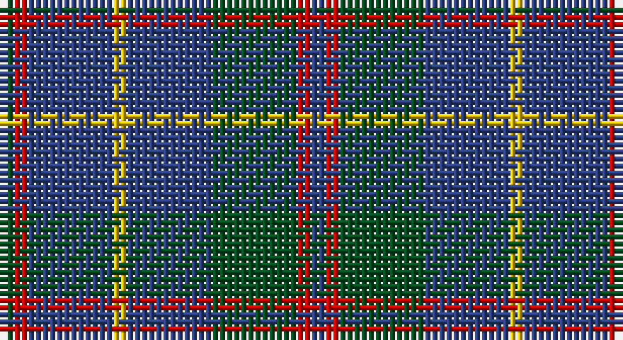

This page is one **sett** — a single exact thread-count. It belongs to the [tartan](/setts/dg1r1db6ly1db6dg6r1db1/)
(the same proportion at any scale), whose colour order is pattern [BRGBYBRG](/stripes/brgbybrg/).

Sourced from register-of-tartans.  It is a [8 stripe tartan](/stripes/stripes8/).

Original link https://www.tartanregister.gov.uk/tartanDetails.aspx?ref=2466

## Register references

External register numbers recorded for this tartan.

- Scottish Register of Tartans: [2466](https://www.tartanregister.gov.uk/tartanDetails.aspx?ref=2466)
- Scottish Tartans World Register: 513

## Thread count
G/2 R2 B12 Y2 B12 G12 R2 B/2

One full sett is **88 threads**.

## Palette

Palette: <strong>Tartan Register</strong>
<table><thead><tr><th>Colour</th><th>Threads</th><th>Shade</th><th>Base</th><th>OKLCh</th></tr></thead><tbody><tr><td>G/</td><td style="text-align:right;font-variant-numeric:tabular-nums">2</td><td><code style="background-color:#005020;">#005020</code> <small style="color:#888">#005020</small></td><td>G <code style="background-color:#006100;">#006100</code></td><td><small style="color:#888">oklch(37.7% 0.105 149.6)</small></td></tr><tr><td>R</td><td style="text-align:right;font-variant-numeric:tabular-nums">2</td><td><code style="background-color:#DC0000;">#DC0000</code> <small style="color:#888">#DC0000</small></td><td>R <code style="background-color:#CC0000;">#CC0000</code></td><td><small style="color:#888">oklch(56.2% 0.230 29.2)</small></td></tr><tr><td>B</td><td style="text-align:right;font-variant-numeric:tabular-nums">12</td><td><code style="background-color:#2C4084;">#2C4084</code> <small style="color:#888">#2C4084</small></td><td>B <code style="background-color:#2A418A;">#2A418A</code></td><td><small style="color:#888">oklch(39.4% 0.117 268.3)</small></td></tr><tr><td>Y</td><td style="text-align:right;font-variant-numeric:tabular-nums">2</td><td><code style="background-color:#E8C000;">#E8C000</code> <small style="color:#888">#E8C000</small></td><td>Y <code style="background-color:#F2BF00;">#F2BF00</code></td><td><small style="color:#888">oklch(81.9% 0.168 93.7)</small></td></tr><tr><td>B</td><td style="text-align:right;font-variant-numeric:tabular-nums">12</td><td><code style="background-color:#2C4084;">#2C4084</code> <small style="color:#888">#2C4084</small></td><td>B <code style="background-color:#2A418A;">#2A418A</code></td><td><small style="color:#888">oklch(39.4% 0.117 268.3)</small></td></tr><tr><td>G</td><td style="text-align:right;font-variant-numeric:tabular-nums">12</td><td><code style="background-color:#005020;">#005020</code> <small style="color:#888">#005020</small></td><td>G <code style="background-color:#006100;">#006100</code></td><td><small style="color:#888">oklch(37.7% 0.105 149.6)</small></td></tr><tr><td>R</td><td style="text-align:right;font-variant-numeric:tabular-nums">2</td><td><code style="background-color:#DC0000;">#DC0000</code> <small style="color:#888">#DC0000</small></td><td>R <code style="background-color:#CC0000;">#CC0000</code></td><td><small style="color:#888">oklch(56.2% 0.230 29.2)</small></td></tr><tr><td>B/</td><td style="text-align:right;font-variant-numeric:tabular-nums">2</td><td><code style="background-color:#2C4084;">#2C4084</code> <small style="color:#888">#2C4084</small></td><td>B <code style="background-color:#2A418A;">#2A418A</code></td><td><small style="color:#888">oklch(39.4% 0.117 268.3)</small></td></tr></tbody></table>

# Sample pattern

## Nearest tartans

The nearest existing variants by ΔTartan distance, with this tartan at the top so the swatches line up against it.

ΔTartan

Tartan

Sett

—

<a href="/ttd/edit/#slug=dg1r1db6ly1db6dg6r1db1~x2">MacHardy</a> <a class="nn-out" href="/variants/s8/dg1r1db6ly1db6dg6r1db1~x2/" title="open its dictionary page">↗</a>

0.85

<a href="/ttd/edit/#slug=db1r1g6db6ly1db6r1g1~x2&amp;base=dg1r1db6ly1db6dg6r1db1~x2">MacHardy</a> <a class="nn-out" href="/variants/s8/db1r1g6db6ly1db6r1g1~x2/" title="open its dictionary page">↗</a>

1.10

<a href="/ttd/edit/#slug=db6r3g26db26w4db26r5g5~x2&amp;base=dg1r1db6ly1db6dg6r1db1~x2">MacHardy, Blue</a> <a class="nn-out" href="/variants/s8/db6r3g26db26w4db26r5g5~x2/" title="open its dictionary page">↗</a>

1.14

<a href="/ttd/edit/#slug=dg8r2dg2r3dg8db12dg2ly2~x2&amp;base=dg1r1db6ly1db6dg6r1db1~x2">Glen Nevis #1 (Fashion)</a> <a class="nn-out" href="/variants/s8/dg8r2dg2r3dg8db12dg2ly2~x2/" title="open its dictionary page">↗</a>

1.27

<a href="/ttd/edit/#slug=do15r5do30b32do4lo3~x2&amp;base=dg1r1db6ly1db6dg6r1db1~x2">Cameron Hunting</a> <a class="nn-out" href="/variants/s6/do15r5do30b32do4lo3~x2/" title="open its dictionary page">↗</a>

1.28

<a href="/ttd/edit/#slug=k3g22db3g3db19r3~x2&amp;base=dg1r1db6ly1db6dg6r1db1~x2">Davidson, Half</a> <a class="nn-out" href="/variants/s6/k3g22db3g3db19r3~x2/" title="open its dictionary page">↗</a>

1.32

<a href="/ttd/edit/#slug=dp3o15dt15r2dt15ly3~x2&amp;base=dg1r1db6ly1db6dg6r1db1~x2">HMS Duncan (Military)</a> <a class="nn-out" href="/variants/s6/dp3o15dt15r2dt15ly3~x2/" title="open its dictionary page">↗</a>

1.34

<a href="/ttd/edit/#slug=r1db12y5db2y4lb1~x2&amp;base=dg1r1db6ly1db6dg6r1db1~x2">Connaught Green</a> <a class="nn-out" href="/variants/s6/r1db12y5db2y4lb1~x2/" title="open its dictionary page">↗</a>

1.34

<a href="/ttd/edit/#slug=db6r15dg41r15db20dg41dbi6&amp;base=dg1r1db6ly1db6dg6r1db1~x2">Bean Hunting Clan Tartan</a> <a class="nn-out" href="/variants/s7/db6r15dg41r15db20dg41dbi6/" title="open its dictionary page">↗</a>

1.37

<a href="/ttd/edit/#slug=dt3t14dt3o16dt34r3~x2&amp;base=dg1r1db6ly1db6dg6r1db1~x2">Thorburn (Lochcarron)</a> <a class="nn-out" href="/variants/s6/dt3t14dt3o16dt34r3~x2/" title="open its dictionary page">↗</a>

1.37

<a href="/ttd/edit/#slug=dt6r15dg41r15dt20dg41db6&amp;base=dg1r1db6ly1db6dg6r1db1~x2">Bean of Freeport (Personal)</a> <a class="nn-out" href="/variants/s7/dt6r15dg41r15dt20dg41db6/" title="open its dictionary page">↗</a>

## Neighbour map

Every grey dot is one of 14360 variants placed by the first two principal components of the ΔTartan feature space (44% of its variance). Red is this tartan; blue dots are its nearest — click one to open its page.

<svg viewBox="0 0 640 380" role="img" style="max-width:100%;height:auto;border:1px solid #e0e0e0;border-radius:4px;display:block" xmlns="http://www.w3.org/2000/svg"><image href="/nn/cloud.v1.png" width="640" height="380"/><a href="/variants/s8/db1r1g6db6ly1db6r1g1~x2/"><circle cx="291.2" cy="229.6" r="4" fill="#3465a4"><title>MacHardy</title></circle></a><a href="/variants/s8/db6r3g26db26w4db26r5g5~x2/"><circle cx="303.1" cy="215.9" r="4" fill="#3465a4"><title>MacHardy, Blue</title></circle></a><a href="/variants/s8/dg8r2dg2r3dg8db12dg2ly2~x2/"><circle cx="263.8" cy="247.2" r="4" fill="#3465a4"><title>Glen Nevis #1 (Fashion)</title></circle></a><a href="/variants/s6/do15r5do30b32do4lo3~x2/"><circle cx="348.5" cy="235.0" r="4" fill="#3465a4"><title>Cameron Hunting</title></circle></a><a href="/variants/s6/k3g22db3g3db19r3~x2/"><circle cx="291.7" cy="239.9" r="4" fill="#3465a4"><title>Davidson, Half</title></circle></a><a href="/variants/s6/dp3o15dt15r2dt15ly3~x2/"><circle cx="278.9" cy="232.6" r="4" fill="#3465a4"><title>HMS Duncan (Military)</title></circle></a><a href="/variants/s6/r1db12y5db2y4lb1~x2/"><circle cx="353.3" cy="220.4" r="4" fill="#3465a4"><title>Connaught Green</title></circle></a><a href="/variants/s7/db6r15dg41r15db20dg41dbi6/"><circle cx="306.2" cy="259.4" r="4" fill="#3465a4"><title>Bean Hunting Clan Tartan</title></circle></a><a href="/variants/s6/dt3t14dt3o16dt34r3~x2/"><circle cx="332.7" cy="226.1" r="4" fill="#3465a4"><title>Thorburn (Lochcarron)</title></circle></a><a href="/variants/s7/dt6r15dg41r15dt20dg41db6/"><circle cx="311.0" cy="263.3" r="4" fill="#3465a4"><title>Bean of Freeport (Personal)</title></circle></a><circle cx="309.7" cy="239.8" r="5" fill="#c00000"/></svg>

ID: /variants/s8/dg1r1db6ly1db6dg6r1db1~x2/
