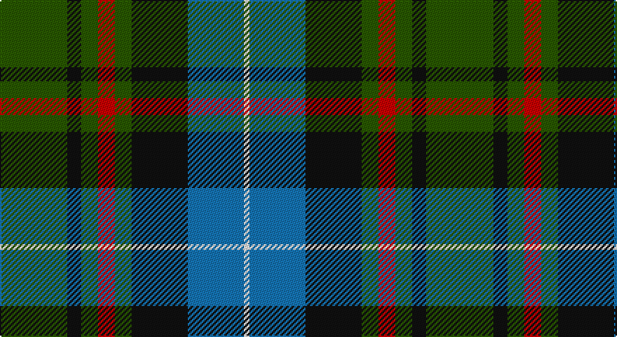

This page is one **sett** — a single exact thread-count. It belongs to the [tartan](/setts/dg24k5dg6r6dg6k20b20w2/)
(the same proportion at any scale), whose colour order is pattern [GKGRGKBW](/stripes/gkgrgkbw/).

Sourced from tartans-authority.  It is a [8 stripe tartan](/stripes/stripes8/).

Original link http://www.tartansauthority.com/tartan-ferret/display/8891/

## Register references

External register numbers recorded for this tartan.

- Scottish Register of Tartans: [8891](https://www.tartanregister.gov.uk/tartanDetails?ref=8891)
- Scottish Tartans Authority (ITI): 8891

## Thread count
G/48 K10 G12 R12 G12 K40 B40 W/4

One full sett is **304 threads**.

## Palette

Palette: <strong>Tartan Register</strong>
<table><thead><tr><th>Colour</th><th>Threads</th><th>Shade</th><th>Base</th><th>OKLCh</th></tr></thead><tbody><tr><td>G/</td><td style="text-align:right;font-variant-numeric:tabular-nums">48</td><td><code style="background-color:#285800;">#285800</code> <small style="color:#888">#285800</small></td><td>G <code style="background-color:#006100;">#006100</code></td><td><small style="color:#888">oklch(41.0% 0.122 135.8)</small></td></tr><tr><td>K</td><td style="text-align:right;font-variant-numeric:tabular-nums">10</td><td><code style="background-color:#101010;">#101010</code> <small style="color:#888">#101010</small></td><td>K <code style="background-color:#000000;">#000000</code></td><td><small style="color:#888">oklch(17.3% 0.000 89.9)</small></td></tr><tr><td>G</td><td style="text-align:right;font-variant-numeric:tabular-nums">12</td><td><code style="background-color:#285800;">#285800</code> <small style="color:#888">#285800</small></td><td>G <code style="background-color:#006100;">#006100</code></td><td><small style="color:#888">oklch(41.0% 0.122 135.8)</small></td></tr><tr><td>R</td><td style="text-align:right;font-variant-numeric:tabular-nums">12</td><td><code style="background-color:#C80000;">#C80000</code> <small style="color:#888">#C80000</small></td><td>R <code style="background-color:#CC0000;">#CC0000</code></td><td><small style="color:#888">oklch(52.3% 0.215 29.2)</small></td></tr><tr><td>G</td><td style="text-align:right;font-variant-numeric:tabular-nums">12</td><td><code style="background-color:#285800;">#285800</code> <small style="color:#888">#285800</small></td><td>G <code style="background-color:#006100;">#006100</code></td><td><small style="color:#888">oklch(41.0% 0.122 135.8)</small></td></tr><tr><td>K</td><td style="text-align:right;font-variant-numeric:tabular-nums">40</td><td><code style="background-color:#101010;">#101010</code> <small style="color:#888">#101010</small></td><td>K <code style="background-color:#000000;">#000000</code></td><td><small style="color:#888">oklch(17.3% 0.000 89.9)</small></td></tr><tr><td>B</td><td style="text-align:right;font-variant-numeric:tabular-nums">40</td><td><code style="background-color:#1474B4;">#1474B4</code> <small style="color:#888">#1474B4</small></td><td>B <code style="background-color:#2A418A;">#2A418A</code></td><td><small style="color:#888">oklch(54.0% 0.129 245.1)</small></td></tr><tr><td>W/</td><td style="text-align:right;font-variant-numeric:tabular-nums">4</td><td><code style="background-color:#FCFCFC;">#FCFCFC</code> <small style="color:#888">#FCFCFC</small></td><td>W <code style="background-color:#F7F7F7;">#F7F7F7</code></td><td><small style="color:#888">oklch(99.1% 0.000 89.9)</small></td></tr></tbody></table>

# Sample pattern

## Nearest tartans

The nearest existing variants by ΔTartan distance, with this tartan at the top so the swatches line up against it.

ΔTartan

Tartan

Sett

—

<a href="/ttd/edit/#slug=dg24k5dg6r6dg6k20b20w2~x2">Dunfermline Bank of Scotland (Corp)</a> <a class="nn-out" href="/variants/s8/dg24k5dg6r6dg6k20b20w2~x2/" title="open its dictionary page">↗</a>

0.58

<a href="/ttd/edit/#slug=g3db12w1k12g13r2g2~x2&amp;base=dg24k5dg6r6dg6k20b20w2~x2">Paterson (Personal)</a> <a class="nn-out" href="/variants/s7/g3db12w1k12g13r2g2~x2/" title="open its dictionary page">↗</a>

0.61

<a href="/ttd/edit/#slug=n33k16g17o3g17k16n15k3w3~x2&amp;base=dg24k5dg6r6dg6k20b20w2~x2">Dove (Personal)</a> <a class="nn-out" href="/variants/s9/n33k16g17o3g17k16n15k3w3~x2/" title="open its dictionary page">↗</a>

0.70

<a href="/ttd/edit/#slug=r5k2db19g4k19g28k2ly5~x2&amp;base=dg24k5dg6r6dg6k20b20w2~x2">Tait #1</a> <a class="nn-out" href="/variants/s8/r5k2db19g4k19g28k2ly5~x2/" title="open its dictionary page">↗</a>

0.76

<a href="/ttd/edit/#slug=b22k12g11ly2g11k12b11k2r2~x2&amp;base=dg24k5dg6r6dg6k20b20w2~x2">Huntly Gordon Fancy Tartan</a> <a class="nn-out" href="/variants/s9/b22k12g11ly2g11k12b11k2r2~x2/" title="open its dictionary page">↗</a>

0.82

<a href="/variants/s8/dp19w2g12t3k4~x2/">Wilson's No.111</a>

0.84

<a href="/ttd/edit/#slug=db3ly1db12k4ly2k4dg8r2dg8r1~x4&amp;base=dg24k5dg6r6dg6k20b20w2~x2">MacMillan Htg (1906) (Clan)</a> <a class="nn-out" href="/variants/s10/db3ly1db12k4ly2k4dg8r2dg8r1~x4/" title="open its dictionary page">↗</a>

0.86

<a href="/ttd/edit/#slug=r3g2r3g18k14w2db16g3~x2&amp;base=dg24k5dg6r6dg6k20b20w2~x2">Mantle (Personal)</a> <a class="nn-out" href="/variants/s8/r3g2r3g18k14w2db16g3~x2/" title="open its dictionary page">↗</a>

0.87

<a href="/ttd/edit/#slug=r12db68w7k39g75r6g6&amp;base=dg24k5dg6r6dg6k20b20w2~x2">Rhun (Fashion)</a> <a class="nn-out" href="/variants/s7/r12db68w7k39g75r6g6/" title="open its dictionary page">↗</a>

0.89

<a href="/ttd/edit/#slug=g28k4g5dr4g5k19db19y2~x2&amp;base=dg24k5dg6r6dg6k20b20w2~x2">City of Guelph</a> <a class="nn-out" href="/variants/s8/g28k4g5dr4g5k19db19y2~x2/" title="open its dictionary page">↗</a>

0.91

<a href="/ttd/edit/#slug=g3db12w1k12g13r2g2~x4&amp;base=dg24k5dg6r6dg6k20b20w2~x2">MacFadzean/MacPhedran</a> <a class="nn-out" href="/variants/s7/g3db12w1k12g13r2g2~x4/" title="open its dictionary page">↗</a>

## Neighbour map

Every grey dot is one of 14360 variants placed by the first two principal components of the ΔTartan feature space (44% of its variance). Red is this tartan; blue dots are its nearest — click one to open its page.

<svg viewBox="0 0 640 380" role="img" style="max-width:100%;height:auto;border:1px solid #e0e0e0;border-radius:4px;display:block" xmlns="http://www.w3.org/2000/svg"><image href="/nn/cloud.v1.png" width="640" height="380"/><a href="/variants/s7/g3db12w1k12g13r2g2~x2/"><circle cx="200.7" cy="195.4" r="4" fill="#3465a4"><title>Paterson (Personal)</title></circle></a><a href="/variants/s9/n33k16g17o3g17k16n15k3w3~x2/"><circle cx="179.7" cy="204.3" r="4" fill="#3465a4"><title>Dove (Personal)</title></circle></a><a href="/variants/s8/r5k2db19g4k19g28k2ly5~x2/"><circle cx="184.2" cy="172.9" r="4" fill="#3465a4"><title>Tait #1</title></circle></a><a href="/variants/s9/b22k12g11ly2g11k12b11k2r2~x2/"><circle cx="171.2" cy="204.3" r="4" fill="#3465a4"><title>Huntly Gordon Fancy Tartan</title></circle></a><a href="/variants/s8/dp19w2g12t3k4~x2/"><circle cx="183.0" cy="184.3" r="4" fill="#3465a4"><title>Wilson's No.111</title></circle></a><a href="/variants/s10/db3ly1db12k4ly2k4dg8r2dg8r1~x4/"><circle cx="162.8" cy="180.1" r="4" fill="#3465a4"><title>MacMillan Htg (1906) (Clan)</title></circle></a><a href="/variants/s8/r3g2r3g18k14w2db16g3~x2/"><circle cx="174.5" cy="196.7" r="4" fill="#3465a4"><title>Mantle (Personal)</title></circle></a><a href="/variants/s7/r12db68w7k39g75r6g6/"><circle cx="196.7" cy="184.1" r="4" fill="#3465a4"><title>Rhun (Fashion)</title></circle></a><a href="/variants/s8/g28k4g5dr4g5k19db19y2~x2/"><circle cx="209.2" cy="180.2" r="4" fill="#3465a4"><title>City of Guelph</title></circle></a><a href="/variants/s7/g3db12w1k12g13r2g2~x4/"><circle cx="193.7" cy="188.3" r="4" fill="#3465a4"><title>MacFadzean/MacPhedran</title></circle></a><circle cx="181.9" cy="194.6" r="5" fill="#c00000"/></svg>

ID: /variants/s8/dg24k5dg6r6dg6k20b20w2~x2/
