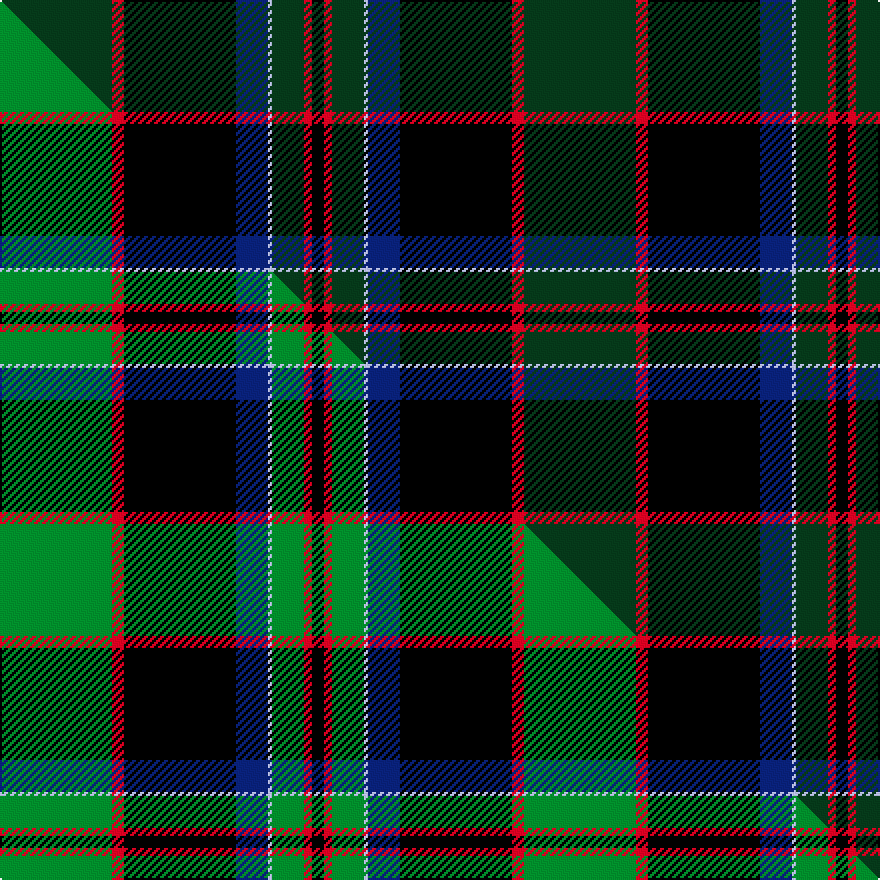

This page is one **sett** — a single exact thread-count. It belongs to the [tartan](/setts/dg28r3k28db8lb1dg8r2k3/)
(the same proportion at any scale), whose colour order is pattern [GRKBWGRK](/stripes/grkbwgrk/).

Part of the [Stansbury](/tartans/stansbury/) tartan — the named design grouping this sett with its other cloths.

Sourced from tartans-authority.  It is a [8 stripe tartan](/stripes/stripes8/).

Original link [https://www.tartanregister.gov.uk/tartanDetails.aspx?ref=11120](https://www.tartanregister.gov.uk/tartanDetails.aspx?ref=11120)

Dataset <small>— provenance for this record, inherited from the source manifest</small>

<dl class="dataset-prov">
<dt>source</dt><dd><a href="/sources/tartans-authority/">Scottish Tartans Authority</a></dd>
<dt>data captured from</dt><dd><a href="https://github.com/thetartan/tartan-database/blob/master/data/tartans-authority/data.csv">https://github.com/thetartan/tartan-database/blob/master/data/tartans-authority/data.csv</a></dd>
<dt>data date</dt><dd>2014 <small>(this record)</small></dd>
<dt>licence</dt><dd><a href="https://creativecommons.org/licenses/by-nc-nd/4.0/">CC BY-NC-ND 4.0</a></dd>
</dl>

Capture chain <small>— the hands this data passed through, oldest first; each capture carries its own licence</small>

<ol class="capture-chain">
<li><a href="https://www.tartansauthority.com/">Scottish Tartans Authority</a> <small>the heritage body's archive — its tartan-ferret record browser is retired (links repaired to the SRT, above)</small></li>
<li><a href="https://github.com/thetartan/tartan-database">thetartan/tartan-database</a> <small>2016-2017</small> · <a href="https://creativecommons.org/licenses/by-nc-nd/4.0/">CC BY-NC-ND 4.0</a> <small>Levko Kravets's frozen compilation — the capture we vendored, and where its CC licence text came from</small></li>
<li>this dictionary <small>captured 2026-06-10 · commit 5bf86c7566</small> <small>each re-capture is a git commit to data/sources</small></li>
</ol>

## Register references

External register numbers recorded for this tartan.

- Scottish Register of Tartans: [11120](https://www.tartanregister.gov.uk/tartanDetails?ref=11120)
- Scottish Tartans Authority (ITI): 11120

## Thread count
DG/56 R6 K56 DB16 LB2 DG16 R4 K/6

One full sett is **262 threads**.

## Palette
<table><thead><tr><th>Colour</th><th>Shade</th><th>OKLCh</th></tr></thead><tbody><tr><td>LB</td><td><code style="background-color:#B5BBDE;">#B5BBDE</code> <small style="color:#888">#B5BBDE</small></td><td><small style="color:#888">oklch(79.9% 0.050 277.6)</small></td></tr><tr><td>DB</td><td><code style="background-color:#082077;">#082077</code> <small style="color:#888">#082077</small></td><td><small style="color:#888">oklch(30.0% 0.149 265.1)</small></td></tr><tr><td>DG</td><td><code style="background-color:#053819;">#053819</code> <small style="color:#888">#053819</small></td><td><small style="color:#888">oklch(30.0% 0.075 151.3)</small></td></tr><tr><td>K</td><td><code style="background-color:#000000;">#000000</code> <small style="color:#888">#000000</small></td><td><small style="color:#888">oklch(0.0% 0.000 0.0)</small></td></tr><tr><td>R</td><td><code style="background-color:#D60020;">#D60020</code> <small style="color:#888">#D60020</small></td><td><small style="color:#888">oklch(55.2% 0.224 25.5)</small></td></tr></tbody></table>

# Sample pattern

## Compared to the master

This cloth is one sett of its design; the master sett (the exemplar the design is anchored on) is below for comparison.

Its **ΔTartan distance** from the master is **0.18** — the same measure the nearest-tartans table ranks by (0 is identical; a re-scale of the same cloth is near 0, a recolour or a different proportion further).

<figure class="master-compare" style="margin:0">

this sett
master sett ★

<figcaption style="color:#888;font-size:smaller">One weave of this sett against the <a href="/setts/g28r3k28db8lb1g8r2k3/">master sett ★</a>, split on the diagonal: a shared proportion runs seamlessly across it with only the shades shifting; a different proportion breaks on it.</figcaption>
</figure>

## Nearest tartan variants

The nearest existing variants by ΔTartan distance, with this cloth at the top so the swatches line up against it.

ΔTartan

Threads

Variant

Sett

—

262

<a href="/variants/s8/dg28r3k28db8lb1dg8r2k3~x2/">Stansbury</a>

<a href="/ttd/edit/#slug=k43dg8k8db21dg10w2~x2&amp;base=dg28r3k28db8lb1dg8r2k3~x2" title="compare in the TTD">1.80</a>

278

<a href="/variants/s6/k43dg8k8db21dg10w2~x2/">Longmuir (2014)</a>

<a href="/ttd/edit/#slug=db10k12dg3k1dg1k1dg30dy4w4~x2&amp;base=dg28r3k28db8lb1dg8r2k3~x2" title="compare in the TTD">2.33</a>

236

<a href="/variants/s9/db10k12dg3k1dg1k1dg30dy4w4~x2/">Hutchens (Kansas) (Personal)</a>

<a href="/ttd/edit/#slug=dr2k13db4k13dg6k17dg23w1~x2&amp;base=dg28r3k28db8lb1dg8r2k3~x2" title="compare in the TTD">2.43</a>

310

<a href="/variants/s8/dr2k13db4k13dg6k17dg23w1~x2/">Meiklejohn (Personal)</a>

<a href="/ttd/edit/#slug=k5r3k27ki37r5g2y2~x2~ki0604259&amp;base=dg28r3k28db8lb1dg8r2k3~x2" title="compare in the TTD">2.58</a>

310

<a href="/variants/s7/k5r3k27ki37r5g2y2~x2~ki0604259/">Royal Marines Condor</a>

<a href="/ttd/edit/#slug=k8dr4k36db48dr6dg3lo2~x2&amp;base=dg28r3k28db8lb1dg8r2k3~x2" title="compare in the TTD">2.63</a>

408

<a href="/variants/s7/k8dr4k36db48dr6dg3lo2~x2/">Royal Marines Condor (Military)</a>

<a href="/ttd/edit/#slug=k8r4k36db48r6g3lo2~x2&amp;base=dg28r3k28db8lb1dg8r2k3~x2" title="compare in the TTD">2.65</a>

408

<a href="/variants/s7/k8r4k36db48r6g3lo2~x2/">Royal Marines Condor</a>

<a href="/ttd/edit/#slug=db2k6g2k6dg12y1~x4&amp;base=dg28r3k28db8lb1dg8r2k3~x2" title="compare in the TTD">2.71</a>

220

<a href="/variants/s6/db2k6g2k6dg12y1~x4/">Leahy, Thomas Francis &amp; Mary (Australia)</a>

<a href="/ttd/edit/#slug=w2k2r1db20k15dg30ly1~x2&amp;base=dg28r3k28db8lb1dg8r2k3~x2" title="compare in the TTD">2.76</a>

278

<a href="/variants/s7/w2k2r1db20k15dg30ly1~x2/">Muir-Hill (Personal)</a>

<a href="/ttd/edit/#slug=n3r18k2dg18k24ri1~x2~r1706009-ri2109032&amp;base=dg28r3k28db8lb1dg8r2k3~x2" title="compare in the TTD">2.78</a>

256

<a href="/variants/s6/n3r18k2dg18k24ri1~x2~r1706009-ri2109032/">205 (Scottish) Field Hospital (Mil.)</a>

<a href="/ttd/edit/#slug=y4k1dg16k16r1w3~x2&amp;base=dg28r3k28db8lb1dg8r2k3~x2" title="compare in the TTD">2.81</a>

150

<a href="/variants/s6/y4k1dg16k16r1w3~x2/">MacLamroc</a>

## Neighbour map

Every grey dot is one of 13621 variants placed by the first two principal components of the ΔTartan feature space (42% of its variance). Red is this tartan; blue dots are its nearest — click one to open its page.

<svg viewBox="0 0 640 380" role="img" style="max-width:100%;height:auto;border:1px solid #e0e0e0;border-radius:4px;display:block" xmlns="http://www.w3.org/2000/svg"><image href="/nn/cloud.v1.png" width="640" height="380"/><a href="/variants/s6/k43dg8k8db21dg10w2~x2/"><circle cx="313.0" cy="168.1" r="4" fill="#3465a4"><title>Longmuir (2014)</title></circle></a><a href="/variants/s9/db10k12dg3k1dg1k1dg30dy4w4~x2/"><circle cx="271.2" cy="105.6" r="4" fill="#3465a4"><title>Hutchens (Kansas) (Personal)</title></circle></a><a href="/variants/s8/dr2k13db4k13dg6k17dg23w1~x2/"><circle cx="307.0" cy="159.6" r="4" fill="#3465a4"><title>Meiklejohn (Personal)</title></circle></a><a href="/variants/s7/k5r3k27ki37r5g2y2~x2~ki0604259/"><circle cx="266.6" cy="133.2" r="4" fill="#3465a4"><title>Royal Marines Condor</title></circle></a><a href="/variants/s7/k8dr4k36db48dr6dg3lo2~x2/"><circle cx="288.5" cy="134.3" r="4" fill="#3465a4"><title>Royal Marines Condor (Military)</title></circle></a><a href="/variants/s7/k8r4k36db48r6g3lo2~x2/"><circle cx="250.4" cy="118.5" r="4" fill="#3465a4"><title>Royal Marines Condor</title></circle></a><a href="/variants/s6/db2k6g2k6dg12y1~x4/"><circle cx="217.6" cy="193.2" r="4" fill="#3465a4"><title>Leahy, Thomas Francis &amp; Mary (Australia)</title></circle></a><a href="/variants/s7/w2k2r1db20k15dg30ly1~x2/"><circle cx="224.7" cy="113.9" r="4" fill="#3465a4"><title>Muir-Hill (Personal)</title></circle></a><a href="/variants/s6/n3r18k2dg18k24ri1~x2~r1706009-ri2109032/"><circle cx="213.6" cy="152.3" r="4" fill="#3465a4"><title>205 (Scottish) Field Hospital (Mil.)</title></circle></a><a href="/variants/s6/y4k1dg16k16r1w3~x2/"><circle cx="189.6" cy="151.0" r="4" fill="#3465a4"><title>MacLamroc</title></circle></a><circle cx="260.8" cy="124.4" r="5" fill="#c00000"/><text x="320" y="376" text-anchor="middle" font-size="11" fill="#999">ground</text><text x="11" y="190" text-anchor="middle" font-size="11" fill="#999" transform="rotate(-90 11 190)">complexity</text></svg>

ID: /variants/s8/dg28r3k28db8lb1dg8r2k3~x2/
