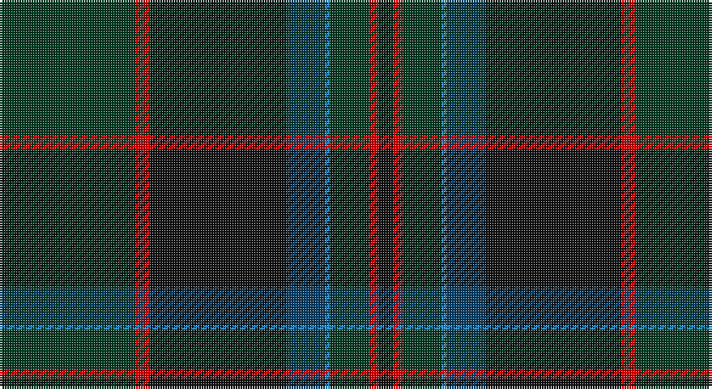

This page is one **sett** — a single exact thread-count. It belongs to the [tartan](/setts/dg28r3k28dt8t1dg8r2k3/)
(the same proportion at any scale), whose colour order is pattern [GRKBBGRK](/stripes/grkbbgrk/).

Part of the [Stansbury](/tartans/stansbury/) tartan — the named design grouping this sett with its other cloths.

Sourced from register-of-tartans.  It is a [8 stripe tartan](/stripes/stripes8/).

Original link https://www.tartanregister.gov.uk/tartanDetails.aspx?ref=11120

## Register references

External register numbers recorded for this tartan.

- Scottish Register of Tartans: [11120](https://www.tartanregister.gov.uk/tartanDetails.aspx?ref=11120)

## Thread count
DG/56 R6 K56 DB16 B2 DG16 R4 K/6

One full sett is **262 threads**.

## Palette

Palette: <strong>Tartan Register</strong>
<table><thead><tr><th>Colour</th><th>Threads</th><th>Shade</th><th>Base</th><th>OKLCh</th></tr></thead><tbody><tr><td>DG/</td><td style="text-align:right;font-variant-numeric:tabular-nums">56</td><td><code style="background-color:#003820;">#003820</code> <small style="color:#888">#003820</small></td><td>G <code style="background-color:#006100;">#006100</code></td><td><small style="color:#888">oklch(30.0% 0.070 158.3)</small></td></tr><tr><td>R</td><td style="text-align:right;font-variant-numeric:tabular-nums">6</td><td><code style="background-color:#C80000;">#C80000</code> <small style="color:#888">#C80000</small></td><td>R <code style="background-color:#CC0000;">#CC0000</code></td><td><small style="color:#888">oklch(52.3% 0.215 29.2)</small></td></tr><tr><td>K</td><td style="text-align:right;font-variant-numeric:tabular-nums">56</td><td><code style="background-color:#101010;">#101010</code> <small style="color:#888">#101010</small></td><td>K <code style="background-color:#000000;">#000000</code></td><td><small style="color:#888">oklch(17.3% 0.000 89.9)</small></td></tr><tr><td>DB</td><td style="text-align:right;font-variant-numeric:tabular-nums">16</td><td><code style="background-color:#003C64;">#003C64</code> <small style="color:#888">#003C64</small></td><td>B <code style="background-color:#2A418A;">#2A418A</code></td><td><small style="color:#888">oklch(34.5% 0.089 246.0)</small></td></tr><tr><td>B</td><td style="text-align:right;font-variant-numeric:tabular-nums">2</td><td><code style="background-color:#2888C4;">#2888C4</code> <small style="color:#888">#2888C4</small></td><td>B <code style="background-color:#2A418A;">#2A418A</code></td><td><small style="color:#888">oklch(60.1% 0.125 241.5)</small></td></tr><tr><td>DG</td><td style="text-align:right;font-variant-numeric:tabular-nums">16</td><td><code style="background-color:#003820;">#003820</code> <small style="color:#888">#003820</small></td><td>G <code style="background-color:#006100;">#006100</code></td><td><small style="color:#888">oklch(30.0% 0.070 158.3)</small></td></tr><tr><td>R</td><td style="text-align:right;font-variant-numeric:tabular-nums">4</td><td><code style="background-color:#C80000;">#C80000</code> <small style="color:#888">#C80000</small></td><td>R <code style="background-color:#CC0000;">#CC0000</code></td><td><small style="color:#888">oklch(52.3% 0.215 29.2)</small></td></tr><tr><td>K/</td><td style="text-align:right;font-variant-numeric:tabular-nums">6</td><td><code style="background-color:#101010;">#101010</code> <small style="color:#888">#101010</small></td><td>K <code style="background-color:#000000;">#000000</code></td><td><small style="color:#888">oklch(17.3% 0.000 89.9)</small></td></tr></tbody></table>

# Sample pattern

## Nearest tartans

The nearest existing variants by ΔTartan distance, with this tartan at the top so the swatches line up against it.

ΔTartan

Tartan

Sett

—

<a href="/ttd/edit/#slug=dg28r3k28dt8t1dg8r2k3~x2">Stansbury (2014)</a> <a class="nn-out" href="/variants/s8/dg28r3k28dt8t1dg8r2k3~x2/" title="open its dictionary page">↗</a>

0.46

<a href="/ttd/edit/#slug=dg28r3k28db8t1dg8r2k3~x2&amp;base=dg28r3k28dt8t1dg8r2k3~x2">Stansbury</a> <a class="nn-out" href="/variants/s8/dg28r3k28db8t1dg8r2k3~x2/" title="open its dictionary page">↗</a>

0.83

<a href="/ttd/edit/#slug=db50dg26k9dg4w2r2dg10~x2&amp;base=dg28r3k28dt8t1dg8r2k3~x2">Java St Andrew Society hunting</a> <a class="nn-out" href="/variants/s7/db50dg26k9dg4w2r2dg10~x2/" title="open its dictionary page">↗</a>

1.11

<a href="/ttd/edit/#slug=r2db38k20w1dg20r2&amp;base=dg28r3k28dt8t1dg8r2k3~x2">Waterfront</a> <a class="nn-out" href="/variants/s6/r2db38k20w1dg20r2/" title="open its dictionary page">↗</a>

1.30

<a href="/ttd/edit/#slug=r4n38k4n6k41dg62y4&amp;base=dg28r3k28dt8t1dg8r2k3~x2">Bennett, John Paul (Personal)</a> <a class="nn-out" href="/variants/s7/r4n38k4n6k41dg62y4/" title="open its dictionary page">↗</a>

1.34

<a href="/ttd/edit/#slug=k8r3dt4g4dt48k48g4k4lo3dt8&amp;base=dg28r3k28dt8t1dg8r2k3~x2">Kingsbarns Golf Links</a> <a class="nn-out" href="/variants/s10/k8r3dt4g4dt48k48g4k4lo3dt8/" title="open its dictionary page">↗</a>

1.34

<a href="/ttd/edit/#slug=dp5db8dt13g21db34dt55o3&amp;base=dg28r3k28dt8t1dg8r2k3~x2">Bouncing Blackie (Personal)</a> <a class="nn-out" href="/variants/s7/dp5db8dt13g21db34dt55o3/" title="open its dictionary page">↗</a>

1.38

<a href="/ttd/edit/#slug=dg36k52lo2k8dg8dy8lo2dy6dg36r1~x2&amp;base=dg28r3k28dt8t1dg8r2k3~x2">Grenauld</a> <a class="nn-out" href="/variants/s10/dg36k52lo2k8dg8dy8lo2dy6dg36r1~x2/" title="open its dictionary page">↗</a>

1.39

<a href="/variants/s10/db47dg14dp5do2r3dg7~x2/">Round Table of Britain and Ire Corporate Tartan</a>

1.42

<a href="/ttd/edit/#slug=db2r1dg26ly1k18db26y1r1db2~x2&amp;base=dg28r3k28dt8t1dg8r2k3~x2">Robb Hunting (Personal)</a> <a class="nn-out" href="/variants/s9/db2r1dg26ly1k18db26y1r1db2~x2/" title="open its dictionary page">↗</a>

1.46

<a href="/ttd/edit/#slug=dt6o4dt2db25k30g2k2~x2&amp;base=dg28r3k28dt8t1dg8r2k3~x2">Passion of Scotland (Fashion)</a> <a class="nn-out" href="/variants/s7/dt6o4dt2db25k30g2k2~x2/" title="open its dictionary page">↗</a>

## Neighbour map

Every grey dot is one of 14360 variants placed by the first two principal components of the ΔTartan feature space (44% of its variance). Red is this tartan; blue dots are its nearest — click one to open its page.

<svg viewBox="0 0 640 380" role="img" style="max-width:100%;height:auto;border:1px solid #e0e0e0;border-radius:4px;display:block" xmlns="http://www.w3.org/2000/svg"><image href="/nn/cloud.v1.png" width="640" height="380"/><a href="/variants/s8/dg28r3k28db8t1dg8r2k3~x2/"><circle cx="349.2" cy="184.4" r="4" fill="#3465a4"><title>Stansbury</title></circle></a><a href="/variants/s7/db50dg26k9dg4w2r2dg10~x2/"><circle cx="381.7" cy="196.4" r="4" fill="#3465a4"><title>Java St Andrew Society hunting</title></circle></a><a href="/variants/s6/r2db38k20w1dg20r2/"><circle cx="355.6" cy="191.4" r="4" fill="#3465a4"><title>Waterfront</title></circle></a><a href="/variants/s7/r4n38k4n6k41dg62y4/"><circle cx="291.6" cy="212.1" r="4" fill="#3465a4"><title>Bennett, John Paul (Personal)</title></circle></a><a href="/variants/s10/k8r3dt4g4dt48k48g4k4lo3dt8/"><circle cx="362.6" cy="185.0" r="4" fill="#3465a4"><title>Kingsbarns Golf Links</title></circle></a><a href="/variants/s7/dp5db8dt13g21db34dt55o3/"><circle cx="344.7" cy="218.9" r="4" fill="#3465a4"><title>Bouncing Blackie (Personal)</title></circle></a><a href="/variants/s10/dg36k52lo2k8dg8dy8lo2dy6dg36r1~x2/"><circle cx="432.4" cy="170.4" r="4" fill="#3465a4"><title>Grenauld</title></circle></a><a href="/variants/s10/db47dg14dp5do2r3dg7~x2/"><circle cx="345.9" cy="159.4" r="4" fill="#3465a4"><title>Round Table of Britain and Ire Corporate Tartan</title></circle></a><a href="/variants/s9/db2r1dg26ly1k18db26y1r1db2~x2/"><circle cx="311.1" cy="160.8" r="4" fill="#3465a4"><title>Robb Hunting (Personal)</title></circle></a><a href="/variants/s7/dt6o4dt2db25k30g2k2~x2/"><circle cx="335.1" cy="211.3" r="4" fill="#3465a4"><title>Passion of Scotland (Fashion)</title></circle></a><circle cx="359.0" cy="191.0" r="5" fill="#c00000"/></svg>

ID: /variants/s8/dg28r3k28dt8t1dg8r2k3~x2/
