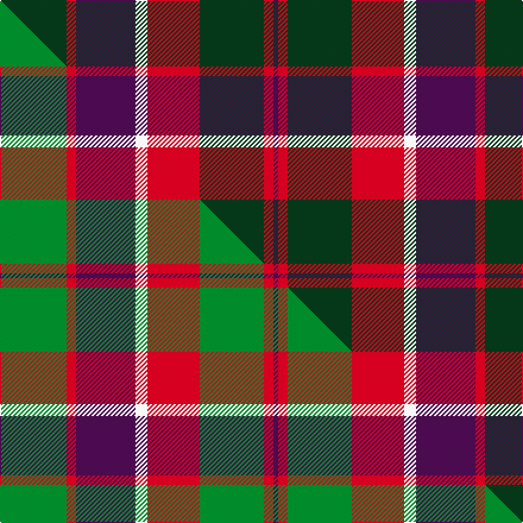

This page is one **sett** — a single exact thread-count. It belongs to the [tartan](/setts/dg28r4dp25w5r22dg27r4dp2/)
(the same proportion at any scale), whose colour order is pattern [BRGRWBRG](/stripes/brgrwbrg/).

Part of the [New Glasgow](/tartans/new-glasgow/) tartan — the named design grouping this sett with its other cloths.

Sourced from tartans-authority.  It is a [8 stripe tartan](/stripes/stripes8/).

Original link [https://www.tartanregister.gov.uk/tartanDetails.aspx?ref=11166](https://www.tartanregister.gov.uk/tartanDetails.aspx?ref=11166)

Dataset <small>— provenance for this record, inherited from the source manifest</small>

<dl class="dataset-prov">
<dt>source</dt><dd><a href="/sources/tartans-authority/">Scottish Tartans Authority</a></dd>
<dt>data captured from</dt><dd><a href="https://github.com/thetartan/tartan-database/blob/master/data/tartans-authority/data.csv">https://github.com/thetartan/tartan-database/blob/master/data/tartans-authority/data.csv</a></dd>
<dt>data date</dt><dd>2014 <small>(this record)</small></dd>
<dt>licence</dt><dd><a href="https://creativecommons.org/licenses/by-nc-nd/4.0/">CC BY-NC-ND 4.0</a></dd>
</dl>

Capture chain <small>— the hands this data passed through, oldest first; each capture carries its own licence</small>

<ol class="capture-chain">
<li><a href="https://www.tartansauthority.com/">Scottish Tartans Authority</a> <small>the heritage body's archive — its tartan-ferret record browser is retired (links repaired to the SRT, above)</small></li>
<li><a href="https://github.com/thetartan/tartan-database">thetartan/tartan-database</a> <small>2016-2017</small> · <a href="https://creativecommons.org/licenses/by-nc-nd/4.0/">CC BY-NC-ND 4.0</a> <small>Levko Kravets's frozen compilation — the capture we vendored, and where its CC licence text came from</small></li>
<li>this dictionary <small>captured 2026-06-10 · commit 5bf86c7566</small> <small>each re-capture is a git commit to data/sources</small></li>
</ol>

## Register references

External register numbers recorded for this tartan.

- Scottish Register of Tartans: [11166](https://www.tartanregister.gov.uk/tartanDetails?ref=11166)
- Scottish Tartans Authority (ITI): 11166

## Thread count
DG/56 R8 DP50 W10 R44 DG54 R8 DP/4

One full sett is **408 threads**.

## Palette
<table><thead><tr><th>Colour</th><th>Shade</th><th>OKLCh</th></tr></thead><tbody><tr><td>DP</td><td><code style="background-color:#4B0B4F;">#4B0B4F</code> <small style="color:#888">#4B0B4F</small></td><td><small style="color:#888">oklch(30.1% 0.125 325.4)</small></td></tr><tr><td>DG</td><td><code style="background-color:#053819;">#053819</code> <small style="color:#888">#053819</small></td><td><small style="color:#888">oklch(30.0% 0.075 151.3)</small></td></tr><tr><td>R</td><td><code style="background-color:#D60020;">#D60020</code> <small style="color:#888">#D60020</small></td><td><small style="color:#888">oklch(55.2% 0.224 25.5)</small></td></tr><tr><td>W</td><td><code style="background-color:#F7F7F7;">#F7F7F7</code> <small style="color:#888">#F7F7F7</small></td><td><small style="color:#888">oklch(97.6% 0.000 89.9)</small></td></tr></tbody></table>

# Sample pattern

## Compared to the master

This cloth is one sett of its design; the master sett (the exemplar the design is anchored on) is below for comparison.

Its **ΔTartan distance** from the master is **0.18** — the same measure the nearest-tartans table ranks by (0 is identical; a re-scale of the same cloth is near 0, a recolour or a different proportion further).

<figure class="master-compare" style="margin:0">

this sett
master sett ★

<figcaption style="color:#888;font-size:smaller">One weave of this sett against the <a href="/setts/g28r4dp25w5r22g27r4dp2/">master sett ★</a>, split on the diagonal: a shared proportion runs seamlessly across it with only the shades shifting; a different proportion breaks on it.</figcaption>
</figure>

## Nearest tartan variants

The nearest existing variants by ΔTartan distance, with this cloth at the top so the swatches line up against it.

ΔTartan

Threads

Variant

Sett

—

408

<a href="/variants/s8/dg28r4dp25w5r22dg27r4dp2~x2/">New Glasgow (Canada)</a>

<a href="/ttd/edit/#slug=g28r4dp25w5r22g27r4dp2~x2&amp;base=dg28r4dp25w5r22dg27r4dp2~x2" title="compare in the TTD">0.18</a>

408

<a href="/variants/s8/g28r4dp25w5r22g27r4dp2~x2/">New Glasgow (Canada)</a>

<a href="/ttd/edit/#slug=dg28r4dp25r22dg27r4dp2~x2&amp;base=dg28r4dp25w5r22dg27r4dp2~x2" title="compare in the TTD">0.30</a>

388

<a href="/variants/s7/dg28r4dp25r22dg27r4dp2~x2/">Glasgow, Ciity of (District)</a>

<a href="/ttd/edit/#slug=g28r4dp25r22g27r4dp2~x2&amp;base=dg28r4dp25w5r22dg27r4dp2~x2" title="compare in the TTD">0.43</a>

388

<a href="/variants/s7/g28r4dp25r22g27r4dp2~x2/">Glasgow, City of</a>

<a href="/ttd/edit/#slug=g28r4dp27r27g28r5dp2~x2&amp;base=dg28r4dp25w5r22dg27r4dp2~x2" title="compare in the TTD">0.58</a>

424

<a href="/variants/s7/g28r4dp27r27g28r5dp2~x2/">Madder</a>

<a href="/ttd/edit/#slug=db8r8dg17w3r35db10dg15w3~x2&amp;base=dg28r4dp25w5r22dg27r4dp2~x2" title="compare in the TTD">1.93</a>

374

<a href="/variants/s8/db8r8dg17w3r35db10dg15w3~x2/">James of Glencarr (Personal)</a>

<a href="/ttd/edit/#slug=db18r18dp2g12db1~x4&amp;base=dg28r4dp25w5r22dg27r4dp2~x2" title="compare in the TTD">1.96</a>

332

<a href="/variants/s5/db18r18dp2g12db1~x4/">Wyeth (Personal)</a>

<a href="/ttd/edit/#slug=r12y4r38dg25db8dg10db8dg8db25r3&amp;base=dg28r4dp25w5r22dg27r4dp2~x2" title="compare in the TTD">2.17</a>

267

<a href="/variants/s10/r12y4r38dg25db8dg10db8dg8db25r3/">MacEdward (Personal)</a>

<a href="/ttd/edit/#slug=dp1r5g15r3dp9r10w1~x4&amp;base=dg28r4dp25w5r22dg27r4dp2~x2" title="compare in the TTD">2.18</a>

344

<a href="/variants/s7/dp1r5g15r3dp9r10w1~x4/">Geddes</a>

<a href="/ttd/edit/#slug=dg7w1dg18db6r18dg2~x2&amp;base=dg28r4dp25w5r22dg27r4dp2~x2" title="compare in the TTD">2.24</a>

190

<a href="/variants/s6/dg7w1dg18db6r18dg2~x2/">Finlaggan</a>

<a href="/ttd/edit/#slug=r6g16r4db12r16lb1r2~x2&amp;base=dg28r4dp25w5r22dg27r4dp2~x2" title="compare in the TTD">2.27</a>

212

<a href="/variants/s7/r6g16r4db12r16lb1r2~x2/">MacQuarrie #6</a>

## Neighbour map

Every grey dot is one of 13621 variants placed by the first two principal components of the ΔTartan feature space (42% of its variance). Red is this tartan; blue dots are its nearest — click one to open its page.

<svg viewBox="0 0 640 380" role="img" style="max-width:100%;height:auto;border:1px solid #e0e0e0;border-radius:4px;display:block" xmlns="http://www.w3.org/2000/svg"><image href="/nn/cloud.v1.png" width="640" height="380"/><a href="/variants/s8/g28r4dp25w5r22g27r4dp2~x2/"><circle cx="249.1" cy="196.9" r="4" fill="#3465a4"><title>New Glasgow (Canada)</title></circle></a><a href="/variants/s7/dg28r4dp25r22dg27r4dp2~x2/"><circle cx="326.4" cy="230.4" r="4" fill="#3465a4"><title>Glasgow, Ciity of (District)</title></circle></a><a href="/variants/s7/g28r4dp25r22g27r4dp2~x2/"><circle cx="293.1" cy="224.5" r="4" fill="#3465a4"><title>Glasgow, City of</title></circle></a><a href="/variants/s7/g28r4dp27r27g28r5dp2~x2/"><circle cx="280.9" cy="225.4" r="4" fill="#3465a4"><title>Madder</title></circle></a><a href="/variants/s8/db8r8dg17w3r35db10dg15w3~x2/"><circle cx="230.3" cy="194.7" r="4" fill="#3465a4"><title>James of Glencarr (Personal)</title></circle></a><a href="/variants/s5/db18r18dp2g12db1~x4/"><circle cx="247.2" cy="194.9" r="4" fill="#3465a4"><title>Wyeth (Personal)</title></circle></a><a href="/variants/s10/r12y4r38dg25db8dg10db8dg8db25r3/"><circle cx="224.1" cy="192.2" r="4" fill="#3465a4"><title>MacEdward (Personal)</title></circle></a><a href="/variants/s7/dp1r5g15r3dp9r10w1~x4/"><circle cx="247.3" cy="197.0" r="4" fill="#3465a4"><title>Geddes</title></circle></a><a href="/variants/s6/dg7w1dg18db6r18dg2~x2/"><circle cx="316.8" cy="194.3" r="4" fill="#3465a4"><title>Finlaggan</title></circle></a><a href="/variants/s7/r6g16r4db12r16lb1r2~x2/"><circle cx="274.5" cy="193.6" r="4" fill="#3465a4"><title>MacQuarrie #6</title></circle></a><circle cx="263.1" cy="196.5" r="5" fill="#c00000"/><text x="320" y="376" text-anchor="middle" font-size="11" fill="#999">ground</text><text x="11" y="190" text-anchor="middle" font-size="11" fill="#999" transform="rotate(-90 11 190)">complexity</text></svg>

ID: /variants/s8/dg28r4dp25w5r22dg27r4dp2~x2/
