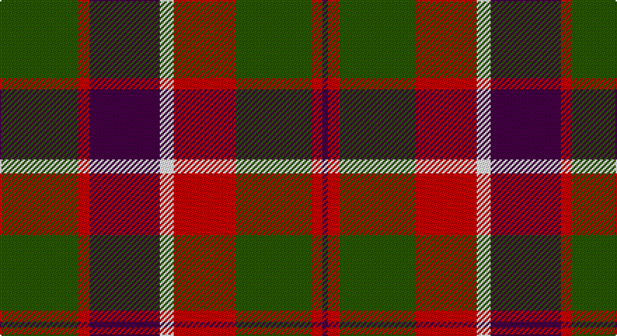

This page is one **sett** — a single exact thread-count. It belongs to the [tartan](/setts/dg28r4dp25w5r22dg27r4dp2/)
(the same proportion at any scale), whose colour order is pattern [BRGRWBRG](/stripes/brgrwbrg/).

Part of the [New Glasgow](/tartans/new-glasgow/) tartan — the named design grouping this sett with its other cloths.

Sourced from tartans-authority.  It is a [8 stripe tartan](/stripes/stripes8/).

Original link http://www.tartansauthority.com/tartan-ferret/display/11166/

## Register references

External register numbers recorded for this tartan.

- Scottish Register of Tartans: [11166](https://www.tartanregister.gov.uk/tartanDetails?ref=11166)
- Scottish Tartans Authority (ITI): 11166

## Thread count
G/56 R8 DP50 W10 R44 G54 R8 DP/4

One full sett is **408 threads**.

## Palette

Palette: <strong>Tartan Register</strong>
<table><thead><tr><th>Colour</th><th>Threads</th><th>Shade</th><th>Base</th><th>OKLCh</th></tr></thead><tbody><tr><td>G/</td><td style="text-align:right;font-variant-numeric:tabular-nums">56</td><td><code style="background-color:#285800;">#285800</code> <small style="color:#888">#285800</small></td><td>G <code style="background-color:#006100;">#006100</code></td><td><small style="color:#888">oklch(41.0% 0.122 135.8)</small></td></tr><tr><td>R</td><td style="text-align:right;font-variant-numeric:tabular-nums">8</td><td><code style="background-color:#C80000;">#C80000</code> <small style="color:#888">#C80000</small></td><td>R <code style="background-color:#CC0000;">#CC0000</code></td><td><small style="color:#888">oklch(52.3% 0.215 29.2)</small></td></tr><tr><td>DP</td><td style="text-align:right;font-variant-numeric:tabular-nums">50</td><td><code style="background-color:#440044;">#440044</code> <small style="color:#888">#440044</small></td><td>B <code style="background-color:#2A418A;">#2A418A</code></td><td><small style="color:#888">oklch(27.1% 0.125 328.4)</small></td></tr><tr><td>W</td><td style="text-align:right;font-variant-numeric:tabular-nums">10</td><td><code style="background-color:#FCFCFC;">#FCFCFC</code> <small style="color:#888">#FCFCFC</small></td><td>W <code style="background-color:#F7F7F7;">#F7F7F7</code></td><td><small style="color:#888">oklch(99.1% 0.000 89.9)</small></td></tr><tr><td>R</td><td style="text-align:right;font-variant-numeric:tabular-nums">44</td><td><code style="background-color:#C80000;">#C80000</code> <small style="color:#888">#C80000</small></td><td>R <code style="background-color:#CC0000;">#CC0000</code></td><td><small style="color:#888">oklch(52.3% 0.215 29.2)</small></td></tr><tr><td>G</td><td style="text-align:right;font-variant-numeric:tabular-nums">54</td><td><code style="background-color:#285800;">#285800</code> <small style="color:#888">#285800</small></td><td>G <code style="background-color:#006100;">#006100</code></td><td><small style="color:#888">oklch(41.0% 0.122 135.8)</small></td></tr><tr><td>R</td><td style="text-align:right;font-variant-numeric:tabular-nums">8</td><td><code style="background-color:#C80000;">#C80000</code> <small style="color:#888">#C80000</small></td><td>R <code style="background-color:#CC0000;">#CC0000</code></td><td><small style="color:#888">oklch(52.3% 0.215 29.2)</small></td></tr><tr><td>DP/</td><td style="text-align:right;font-variant-numeric:tabular-nums">4</td><td><code style="background-color:#440044;">#440044</code> <small style="color:#888">#440044</small></td><td>B <code style="background-color:#2A418A;">#2A418A</code></td><td><small style="color:#888">oklch(27.1% 0.125 328.4)</small></td></tr></tbody></table>

# Sample pattern

## Compared to the master

This cloth is one sett of its design; the master sett (the exemplar the design is anchored on) is below for comparison.

<figure style="margin:0"><figcaption style="color:#888;font-size:smaller">this sett</figcaption></figure>
<figure style="margin:0"><figcaption style="color:#888;font-size:smaller"><a href="/setts/dg28r4db25w5r22dg27r4db2/">master sett →</a></figcaption></figure>

## Nearest tartans

The nearest existing variants by ΔTartan distance, with this tartan at the top so the swatches line up against it.

ΔTartan

Tartan

Sett

—

<a href="/ttd/edit/#slug=dg28r4dp25w5r22dg27r4dp2~x2">New Glasgow (Canada)</a> <a class="nn-out" href="/variants/s8/dg28r4dp25w5r22dg27r4dp2~x2/" title="open its dictionary page">↗</a>

0.58

<a href="/ttd/edit/#slug=k2r12db6r3g12r4db1~x2&amp;base=dg28r4dp25w5r22dg27r4dp2~x2">MacBean, MacElvain</a> <a class="nn-out" href="/variants/s7/k2r12db6r3g12r4db1~x2/" title="open its dictionary page">↗</a>

0.68

<a href="/ttd/edit/#slug=dg12g6dg6r15k1r1k2~x2&amp;base=dg28r4dp25w5r22dg27r4dp2~x2">Cook (Name)</a> <a class="nn-out" href="/variants/s7/dg12g6dg6r15k1r1k2~x2/" title="open its dictionary page">↗</a>

0.82

<a href="/ttd/edit/#slug=dp8r3ly1r3dg14r3ly1~x4&amp;base=dg28r4dp25w5r22dg27r4dp2~x2">Logan - 1819 (with yellow)</a> <a class="nn-out" href="/variants/s7/dp8r3ly1r3dg14r3ly1~x4/" title="open its dictionary page">↗</a>

0.85

<a href="/ttd/edit/#slug=db3k5r2g2r3g12r6k1r3~x4&amp;base=dg28r4dp25w5r22dg27r4dp2~x2">Fulton (1999) (Name)</a> <a class="nn-out" href="/variants/s9/db3k5r2g2r3g12r6k1r3~x4/" title="open its dictionary page">↗</a>

0.86

<a href="/ttd/edit/#slug=r6dg16r4db12r16lb1r2~x2&amp;base=dg28r4dp25w5r22dg27r4dp2~x2">MacQuarrie LO</a> <a class="nn-out" href="/variants/s7/r6dg16r4db12r16lb1r2~x2/" title="open its dictionary page">↗</a>

0.88

<a href="/ttd/edit/#slug=g12t6g6r15k1r1k2~x4&amp;base=dg28r4dp25w5r22dg27r4dp2~x2">McCook/Cook (Name)</a> <a class="nn-out" href="/variants/s7/g12t6g6r15k1r1k2~x4/" title="open its dictionary page">↗</a>

0.89

<a href="/ttd/edit/#slug=dp1r5g15r3dp9r10w1~x4&amp;base=dg28r4dp25w5r22dg27r4dp2~x2">Geddes</a> <a class="nn-out" href="/variants/s7/dp1r5g15r3dp9r10w1~x4/" title="open its dictionary page">↗</a>

0.91

<a href="/ttd/edit/#slug=r15db2r1db2r3db7g13gi3~x2&amp;base=dg28r4dp25w5r22dg27r4dp2~x2">Cranston Dress</a> <a class="nn-out" href="/variants/s8/r15db2r1db2r3db7g13gi3~x2/" title="open its dictionary page">↗</a>

0.92

<a href="/ttd/edit/#slug=dp8r3ly1r3g14r3ly1~x4&amp;base=dg28r4dp25w5r22dg27r4dp2~x2">Logan with Yellow</a> <a class="nn-out" href="/variants/s7/dp8r3ly1r3g14r3ly1~x4/" title="open its dictionary page">↗</a>

0.92

<a href="/ttd/edit/#slug=k2r12db6r3dg12r4db1~x2&amp;base=dg28r4dp25w5r22dg27r4dp2~x2">MacBean/MacElvain</a> <a class="nn-out" href="/variants/s7/k2r12db6r3dg12r4db1~x2/" title="open its dictionary page">↗</a>

## Neighbour map

Every grey dot is one of 14360 variants placed by the first two principal components of the ΔTartan feature space (44% of its variance). Red is this tartan; blue dots are its nearest — click one to open its page.

<svg viewBox="0 0 640 380" role="img" style="max-width:100%;height:auto;border:1px solid #e0e0e0;border-radius:4px;display:block" xmlns="http://www.w3.org/2000/svg"><image href="/nn/cloud.v1.png" width="640" height="380"/><a href="/variants/s7/k2r12db6r3g12r4db1~x2/"><circle cx="249.5" cy="197.5" r="4" fill="#3465a4"><title>MacBean, MacElvain</title></circle></a><a href="/variants/s7/dg12g6dg6r15k1r1k2~x2/"><circle cx="252.7" cy="191.8" r="4" fill="#3465a4"><title>Cook (Name)</title></circle></a><a href="/variants/s7/dp8r3ly1r3dg14r3ly1~x4/"><circle cx="248.0" cy="181.0" r="4" fill="#3465a4"><title>Logan - 1819 (with yellow)</title></circle></a><a href="/variants/s9/db3k5r2g2r3g12r6k1r3~x4/"><circle cx="209.4" cy="191.2" r="4" fill="#3465a4"><title>Fulton (1999) (Name)</title></circle></a><a href="/variants/s7/r6dg16r4db12r16lb1r2~x2/"><circle cx="267.5" cy="187.0" r="4" fill="#3465a4"><title>MacQuarrie LO</title></circle></a><a href="/variants/s7/g12t6g6r15k1r1k2~x4/"><circle cx="248.7" cy="189.5" r="4" fill="#3465a4"><title>McCook/Cook (Name)</title></circle></a><a href="/variants/s7/dp1r5g15r3dp9r10w1~x4/"><circle cx="242.8" cy="188.1" r="4" fill="#3465a4"><title>Geddes</title></circle></a><a href="/variants/s8/r15db2r1db2r3db7g13gi3~x2/"><circle cx="228.6" cy="170.0" r="4" fill="#3465a4"><title>Cranston Dress</title></circle></a><a href="/variants/s7/dp8r3ly1r3g14r3ly1~x4/"><circle cx="246.7" cy="178.7" r="4" fill="#3465a4"><title>Logan with Yellow</title></circle></a><a href="/variants/s7/k2r12db6r3dg12r4db1~x2/"><circle cx="259.2" cy="199.0" r="4" fill="#3465a4"><title>MacBean/MacElvain</title></circle></a><circle cx="249.0" cy="189.5" r="5" fill="#c00000"/></svg>

ID: /variants/s8/dg28r4dp25w5r22dg27r4dp2~x2/
