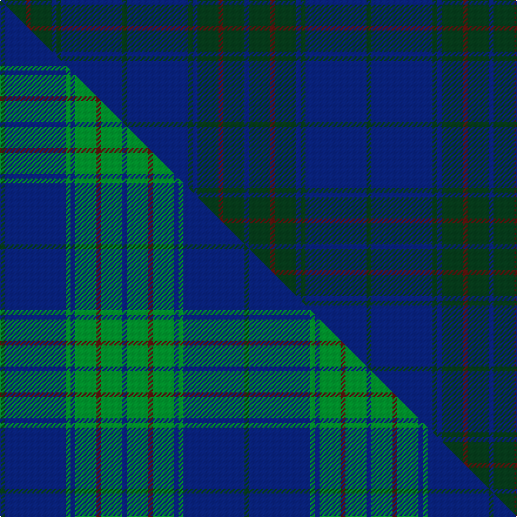

This is one **variant** — a specific cloth: this exact thread count and colourway, with its own
provenance below. It is one weaving of the [sett](/setts/dg2db26dg2db2dg9dr2dg9db2/) (the scale-free proportion — the
same cloth at any scale or shade), whose colour order is pattern [BGBGBGBG](/stripes/bgbgbgbg/).

Part of the [Land's End](/tartans/land-s-end-3/) tartan — the named design grouping this sett with its other cloths.

Sourced from tartans-authority.  It is a [8 stripe tartan](/stripes/stripes8/).

Original link [https://www.tartanregister.gov.uk/tartanDetails.aspx?ref=2579](https://www.tartanregister.gov.uk/tartanDetails.aspx?ref=2579)

Dataset <small>— provenance for this record, inherited from the source manifest</small>

<dl class="dataset-prov">
<dt>source</dt><dd><a href="/sources/tartans-authority/">Scottish Tartans Authority</a></dd>
<dt>data captured from</dt><dd><a href="https://github.com/thetartan/tartan-database/blob/master/data/tartans-authority/data.csv">https://github.com/thetartan/tartan-database/blob/master/data/tartans-authority/data.csv</a></dd>
<dt>data date</dt><dd>pre 2002 <small>(this record)</small></dd>
<dt>licence</dt><dd><a href="https://creativecommons.org/licenses/by-nc-nd/4.0/">CC BY-NC-ND 4.0</a></dd>
</dl>

Capture chain <small>— the hands this data passed through, oldest first; each capture carries its own licence</small>

<ol class="capture-chain">
<li><a href="https://www.tartansauthority.com/">Scottish Tartans Authority</a> <small>the heritage body's archive — its tartan-ferret record browser is retired (links repaired to the SRT, above)</small></li>
<li><a href="https://github.com/thetartan/tartan-database">thetartan/tartan-database</a> <small>2016-2017</small> · <a href="https://creativecommons.org/licenses/by-nc-nd/4.0/">CC BY-NC-ND 4.0</a> <small>Levko Kravets's frozen compilation — the capture we vendored, and where its CC licence text came from</small></li>
<li>this dictionary <small>captured 2026-06-10 · commit 5bf86c7566</small> <small>each re-capture is a git commit to data/sources</small></li>
</ol>

## Register references

External register numbers recorded for this tartan.

- Scottish Tartans Authority (ITI): 2579

## Thread count
DB/4 DG18 DR4 DG18 DB4 DG4 DB52 DG/4

One full sett is **208 threads**.

## Palette
<table><thead><tr><th>Colour</th><th>Shade</th><th>OKLCh</th></tr></thead><tbody><tr><td>DB</td><td><code style="background-color:#082077;">#082077</code> <small style="color:#888">#082077</small></td><td><small style="color:#888">oklch(30.0% 0.149 265.1)</small></td></tr><tr><td>DR</td><td><code style="background-color:#55120C;">#55120C</code> <small style="color:#888">#55120C</small></td><td><small style="color:#888">oklch(30.0% 0.099 29.3)</small></td></tr><tr><td>DG</td><td><code style="background-color:#053819;">#053819</code> <small style="color:#888">#053819</small></td><td><small style="color:#888">oklch(30.0% 0.075 151.3)</small></td></tr></tbody></table>

# Sample pattern

## Compared to the master

This cloth is one sett of its design; the master sett (the exemplar the design is anchored on) is below for comparison.

Its **ΔTartan distance** from the master is **8.20** — the same measure the nearest-tartans table ranks by (0 is identical; a re-scale of the same cloth is near 0, a recolour or a different proportion further).

<figure class="master-compare" style="margin:0">

this sett
master sett ★

<figcaption style="color:#888;font-size:smaller">One weave of this sett against the <a href="/setts/dg2db26g2db2g9dr2g9db2/">master sett ★</a>, split on the diagonal: a shared proportion runs seamlessly across it with only the shades shifting; a different proportion breaks on it.</figcaption>
</figure>

## Nearest tartan variants

The nearest existing variants by ΔTartan distance, with this cloth at the top so the swatches line up against it.

ΔTartan

Threads

Variant

Sett

—

208

<a href="/variants/s8/dg2db26dg2db2dg9dr2dg9db2~x2/">Land's End, Blue (Fashion)</a>

<a href="/ttd/edit/#slug=dg8db27dg11do2dg11db27dg8dr2~x2&amp;base=dg2db26dg2db2dg9dr2dg9db2~x2" title="compare in the TTD">1.56</a>

364

<a href="/variants/s8/dg8db27dg11do2dg11db27dg8dr2~x2/">Hector, James</a>

<a href="/ttd/edit/#slug=db10dg1db1dg1db1dg2dr12dg1dr2~x4&amp;base=dg2db26dg2db2dg9dr2dg9db2~x2" title="compare in the TTD">1.94</a>

200

<a href="/variants/s9/db10dg1db1dg1db1dg2dr12dg1dr2~x4/">Lawlis/Lawless</a>

<a href="/ttd/edit/#slug=db4lo2db20dt2dr4dt2db3dt12db2~x2&amp;base=dg2db26dg2db2dg9dr2dg9db2~x2" title="compare in the TTD">2.04</a>

192

<a href="/variants/s9/db4lo2db20dt2dr4dt2db3dt12db2~x2/">Stone of Destiny, The (Commemorative</a>

<a href="/ttd/edit/#slug=db3dr1db14dg14dr1dg1dr1dg1dr2~x4&amp;base=dg2db26dg2db2dg9dr2dg9db2~x2" title="compare in the TTD">2.90</a>

284

<a href="/variants/s9/db3dr1db14dg14dr1dg1dr1dg1dr2~x4/">Breckon Hunting</a>

<a href="/ttd/edit/#slug=do3db3do3db27do40dy3&amp;base=dg2db26dg2db2dg9dr2dg9db2~x2" title="compare in the TTD">3.04</a>

152

<a href="/variants/s6/do3db3do3db27do40dy3/">Keeper of the Quaich Corporate Tartan</a>

<a href="/ttd/edit/#slug=dg4db3dg20db9dr2db2dr2db18dp4~x2&amp;base=dg2db26dg2db2dg9dr2dg9db2~x2" title="compare in the TTD">3.16</a>

240

<a href="/variants/s9/dg4db3dg20db9dr2db2dr2db18dp4~x2/">New Club Centenary</a>

<a href="/ttd/edit/#slug=dr2dg8db27dg11do2~x2&amp;base=dg2db26dg2db2dg9dr2dg9db2~x2" title="compare in the TTD">3.22</a>

192

<a href="/variants/s5/dr2dg8db27dg11do2~x2/">Hector, James (Corporate)</a>

<a href="/ttd/edit/#slug=db9dy12db44dy12db9dr3~x2&amp;base=dg2db26dg2db2dg9dr2dg9db2~x2" title="compare in the TTD">3.88</a>

332

<a href="/variants/s6/db9dy12db44dy12db9dr3~x2/">Elliot</a>

<a href="/ttd/edit/#slug=dg8dr2dg2dr3dg8db12dg2dy2~x2&amp;base=dg2db26dg2db2dg9dr2dg9db2~x2" title="compare in the TTD">3.94</a>

136

<a href="/variants/s8/dg8dr2dg2dr3dg8db12dg2dy2~x2/">Glen Nevis #1</a>

## Neighbour map

Every grey dot is one of 13621 variants placed by the first two principal components of the ΔTartan feature space (42% of its variance). Red is this tartan; blue dots are its nearest — click one to open its page.

<svg viewBox="0 0 640 380" role="img" style="max-width:100%;height:auto;border:1px solid #e0e0e0;border-radius:4px;display:block" xmlns="http://www.w3.org/2000/svg"><image href="/nn/cloud.v1.png" width="640" height="380"/><a href="/variants/s8/dg8db27dg11do2dg11db27dg8dr2~x2/"><circle cx="517.8" cy="273.0" r="4" fill="#3465a4"><title>Hector, James</title></circle></a><a href="/variants/s9/db10dg1db1dg1db1dg2dr12dg1dr2~x4/"><circle cx="463.4" cy="242.9" r="4" fill="#3465a4"><title>Lawlis/Lawless</title></circle></a><a href="/variants/s9/db4lo2db20dt2dr4dt2db3dt12db2~x2/"><circle cx="474.2" cy="251.6" r="4" fill="#3465a4"><title>Stone of Destiny, The (Commemorative</title></circle></a><a href="/variants/s9/db3dr1db14dg14dr1dg1dr1dg1dr2~x4/"><circle cx="485.9" cy="243.4" r="4" fill="#3465a4"><title>Breckon Hunting</title></circle></a><a href="/variants/s6/do3db3do3db27do40dy3/"><circle cx="589.2" cy="271.2" r="4" fill="#3465a4"><title>Keeper of the Quaich Corporate Tartan</title></circle></a><a href="/variants/s9/dg4db3dg20db9dr2db2dr2db18dp4~x2/"><circle cx="467.0" cy="263.8" r="4" fill="#3465a4"><title>New Club Centenary</title></circle></a><a href="/variants/s5/dr2dg8db27dg11do2~x2/"><circle cx="519.1" cy="278.6" r="4" fill="#3465a4"><title>Hector, James (Corporate)</title></circle></a><a href="/variants/s6/db9dy12db44dy12db9dr3~x2/"><circle cx="626.0" cy="277.7" r="4" fill="#3465a4"><title>Elliot</title></circle></a><a href="/variants/s8/dg8dr2dg2dr3dg8db12dg2dy2~x2/"><circle cx="445.7" cy="306.2" r="4" fill="#3465a4"><title>Glen Nevis #1</title></circle></a><circle cx="551.2" cy="256.6" r="5" fill="#c00000"/><text x="320" y="376" text-anchor="middle" font-size="11" fill="#999">ground</text><text x="11" y="190" text-anchor="middle" font-size="11" fill="#999" transform="rotate(-90 11 190)">complexity</text></svg>

ID: /variants/s8/dg2db26dg2db2dg9dr2dg9db2~x2/
