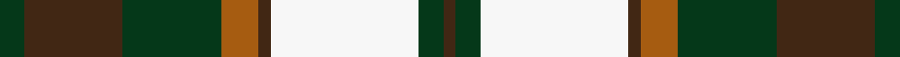
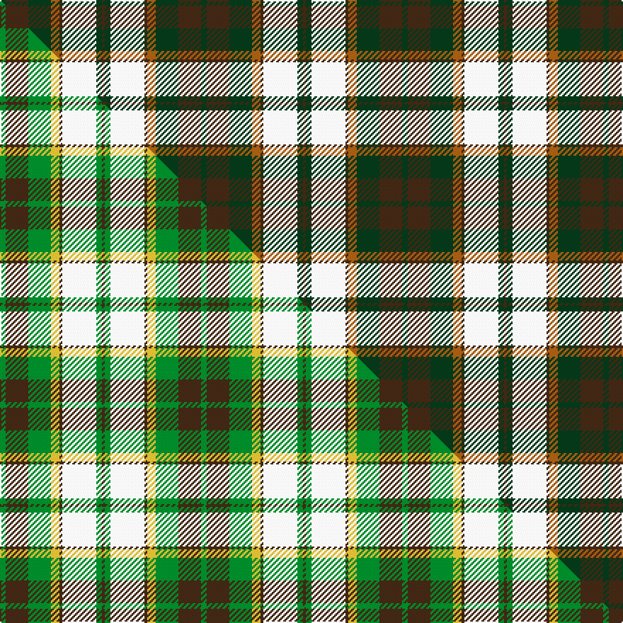

This is one **variant** — a specific cloth: this exact thread count and colourway, with its own
provenance below. It is one weaving of the [sett](/setts/dg2do8dg8o3do1w12dg2do1/) (the scale-free proportion — the
same cloth at any scale or shade), whose colour order is pattern [BGWBRGBG](/stripes/bgwbrgbg/).

Part of the [National Trust](/tartans/n/na/national-trust-2/) tartan — the named design grouping this sett with its other cloths.

Sourced from weddslist.  It is a [8 stripe tartan](/stripes/stripes8/).

Original link [http://www.weddslist.com/cgi-bin/tartans/pg.pl?source=sts](http://www.weddslist.com/cgi-bin/tartans/pg.pl?source=sts)

Dataset <small>— provenance for this record, inherited from the source manifest</small>

<dl class="dataset-prov">
<dt>source</dt><dd><a href="/sources/weddslist/">Weddslist</a></dd>
<dt>data captured from</dt><dd><a href="https://github.com/thetartan/tartan-database/blob/master/data/weddslist/data.csv">https://github.com/thetartan/tartan-database/blob/master/data/weddslist/data.csv</a></dd>
<dt>data date</dt><dd>2016-11-17 <small>(dataset default)</small></dd>
<dt>licence</dt><dd><a href="https://creativecommons.org/licenses/by-nc-nd/4.0/">CC BY-NC-ND 4.0</a></dd>
</dl>

Capture chain <small>— the hands this data passed through, oldest first; each capture carries its own licence</small>

<ol class="capture-chain">
<li><a href="https://www.weddslist.com/tartans/">Weddslist</a> <small>the living privately compiled reference</small></li>
<li><a href="https://github.com/thetartan/tartan-database">thetartan/tartan-database</a> <small>2016-2017</small> · <a href="https://creativecommons.org/licenses/by-nc-nd/4.0/">CC BY-NC-ND 4.0</a> <small>Levko Kravets's frozen compilation — the capture we vendored, and where its CC licence text came from</small></li>
<li>this dictionary <small>captured 2026-06-10 · commit 5bf86c7566</small> <small>each re-capture is a git commit to data/sources</small></li>
</ol>

## Thread count
DG/4 DO16 DG16 O6 DO2 W24 DG4 DO/2

One full sett is **142 threads**.

## Palette
<table><thead><tr><th>Colour</th><th>Shade</th><th>OKLCh</th></tr></thead><tbody><tr><td>DG</td><td><code style="background-color:#053819;">#053819</code> <small style="color:#888">#053819</small></td><td><small style="color:#888">oklch(30.0% 0.075 151.3)</small></td></tr><tr><td>DO</td><td><code style="background-color:#412714;">#412714</code> <small style="color:#888">#412714</small></td><td><small style="color:#888">oklch(30.1% 0.050 55.7)</small></td></tr><tr><td>W</td><td><code style="background-color:#F7F7F7;">#F7F7F7</code> <small style="color:#888">#F7F7F7</small></td><td><small style="color:#888">oklch(97.6% 0.000 89.9)</small></td></tr><tr><td>O</td><td><code style="background-color:#A65C11;">#A65C11</code> <small style="color:#888">#A65C11</small></td><td><small style="color:#888">oklch(55.0% 0.125 58.3)</small></td></tr></tbody></table>

# Sample pattern

## Compared to the master

This cloth is one sett of its design; the master sett (the exemplar the design is anchored on) is below for comparison.

Its **ΔTartan distance** from the master is **0.41** — the same measure the nearest-tartans table ranks by (0 is identical; a re-scale of the same cloth is near 0, a recolour or a different proportion further).

<figure class="master-compare" style="margin:0">

this sett
master sett ★

<figcaption style="color:#888;font-size:smaller">One weave of this sett against the <a href="/setts/g2do8g8ly3do1w12g2do1/">master sett ★</a>, split on the diagonal: a shared proportion runs seamlessly across it with only the shades shifting; a different proportion breaks on it.</figcaption>
</figure>

## Nearest tartan variants

The nearest existing variants by ΔTartan distance, with this cloth at the top so the swatches line up against it.

ΔTartan

Threads

Variant

Sett

—

142

<a href="/variants/s8/dg2do8dg8o3do1w12dg2do1~x2/">National Trust</a>

<a href="/ttd/edit/#slug=g2do8g8ly3do1w12g2do1~x2&amp;base=dg2do8dg8o3do1w12dg2do1~x2" title="compare in the TTD">0.41</a>

142

<a href="/variants/s8/g2do8g8ly3do1w12g2do1~x2/">National Trust</a>

<a href="/ttd/edit/#slug=dg2do8dg8r3do1w12dg2g1~x2&amp;base=dg2do8dg8o3do1w12dg2do1~x2" title="compare in the TTD">1.30</a>

142

<a href="/variants/s8/dg2do8dg8r3do1w12dg2g1~x2/">National Trust Corporate Tartan</a>

<a href="/ttd/edit/#slug=db24r4g24r4w20r10g3w4~x2&amp;base=dg2do8dg8o3do1w12dg2do1~x2" title="compare in the TTD">2.19</a>

316

<a href="/variants/s8/db24r4g24r4w20r10g3w4~x2/">Robertson Dress (Dalgleish) #2</a>

<a href="/ttd/edit/#slug=db24r4g24r4db4w20r10g3w4~x2&amp;base=dg2do8dg8o3do1w12dg2do1~x2" title="compare in the TTD">2.26</a>

332

<a href="/variants/s9/db24r4g24r4db4w20r10g3w4~x2/">Robertson Dress Clan Tartan</a>

<a href="/ttd/edit/#slug=do2b2do15b1w10o15b2o2~x2&amp;base=dg2do8dg8o3do1w12dg2do1~x2" title="compare in the TTD">2.37</a>

188

<a href="/variants/s8/do2b2do15b1w10o15b2o2~x2/">Bannockbane</a>

<a href="/ttd/edit/#slug=o20db2o2db2ly3db12w18db3~x2&amp;base=dg2do8dg8o3do1w12dg2do1~x2" title="compare in the TTD">2.42</a>

202

<a href="/variants/s8/o20db2o2db2ly3db12w18db3~x2/">Heriot (Fashion)</a>

<a href="/ttd/edit/#slug=do2r2do15r1w10dy15r2dy2~x2&amp;base=dg2do8dg8o3do1w12dg2do1~x2" title="compare in the TTD">2.65</a>

188

<a href="/variants/s8/do2r2do15r1w10dy15r2dy2~x2/">Bannockbane Brown #1</a>

<a href="/ttd/edit/#slug=r5w36dp14r9g28r8dp2~x2&amp;base=dg2do8dg8o3do1w12dg2do1~x2" title="compare in the TTD">2.83</a>

394

<a href="/variants/s7/r5w36dp14r9g28r8dp2~x2/">MacKintosh, Arisaid</a>

<a href="/ttd/edit/#slug=dg20r3n3r15w19dg3lb2~x2&amp;base=dg2do8dg8o3do1w12dg2do1~x2" title="compare in the TTD">2.86</a>

216

<a href="/variants/s7/dg20r3n3r15w19dg3lb2~x2/">Glasgow</a>

<a href="/ttd/edit/#slug=w3g15db18r15g1r2~x2&amp;base=dg2do8dg8o3do1w12dg2do1~x2" title="compare in the TTD">2.86</a>

206

<a href="/variants/s6/w3g15db18r15g1r2~x2/">Nibley</a>

## Neighbour map

Every grey dot is one of 13621 variants placed by the first two principal components of the ΔTartan feature space (42% of its variance). Red is this tartan; blue dots are its nearest — click one to open its page. The map is a flat projection of a many-dimensional space — [how to read it](/posts/neighbourhood-maps/).

<svg viewBox="0 0 640 380" role="img" style="max-width:100%;height:auto;border:1px solid #e0e0e0;border-radius:4px;display:block" xmlns="http://www.w3.org/2000/svg"><image href="/nn/cloud.v1.png" width="640" height="380"/><a href="/variants/s8/g2do8g8ly3do1w12g2do1~x2/"><circle cx="181.1" cy="211.4" r="4" fill="#3465a4"><title>National Trust</title></circle></a><a href="/variants/s8/dg2do8dg8r3do1w12dg2g1~x2/"><circle cx="132.2" cy="175.8" r="4" fill="#3465a4"><title>National Trust Corporate Tartan</title></circle></a><a href="/variants/s8/db24r4g24r4w20r10g3w4~x2/"><circle cx="117.5" cy="213.5" r="4" fill="#3465a4"><title>Robertson Dress (Dalgleish) #2</title></circle></a><a href="/variants/s9/db24r4g24r4db4w20r10g3w4~x2/"><circle cx="117.5" cy="204.7" r="4" fill="#3465a4"><title>Robertson Dress Clan Tartan</title></circle></a><a href="/variants/s8/do2b2do15b1w10o15b2o2~x2/"><circle cx="199.6" cy="176.8" r="4" fill="#3465a4"><title>Bannockbane</title></circle></a><a href="/variants/s8/o20db2o2db2ly3db12w18db3~x2/"><circle cx="178.1" cy="189.5" r="4" fill="#3465a4"><title>Heriot (Fashion)</title></circle></a><a href="/variants/s8/do2r2do15r1w10dy15r2dy2~x2/"><circle cx="194.1" cy="173.7" r="4" fill="#3465a4"><title>Bannockbane Brown #1</title></circle></a><a href="/variants/s7/r5w36dp14r9g28r8dp2~x2/"><circle cx="176.4" cy="182.0" r="4" fill="#3465a4"><title>MacKintosh, Arisaid</title></circle></a><a href="/variants/s7/dg20r3n3r15w19dg3lb2~x2/"><circle cx="150.1" cy="186.6" r="4" fill="#3465a4"><title>Glasgow</title></circle></a><a href="/variants/s6/w3g15db18r15g1r2~x2/"><circle cx="200.2" cy="194.2" r="4" fill="#3465a4"><title>Nibley</title></circle></a><circle cx="153.7" cy="190.2" r="5" fill="#c00000"/><text x="320" y="376" text-anchor="middle" font-size="11" fill="#999">ground</text><text x="11" y="190" text-anchor="middle" font-size="11" fill="#999" transform="rotate(-90 11 190)">complexity</text></svg>

ID: /variants/s8/dg2do8dg8o3do1w12dg2do1~x2/
