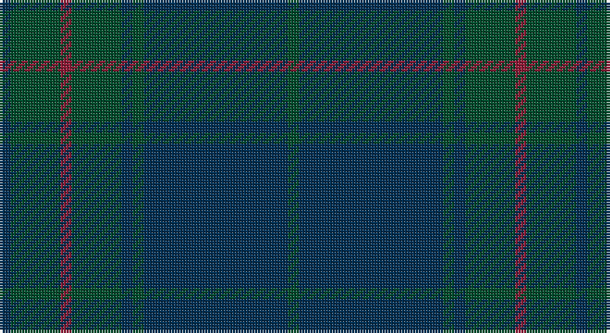

This page is one **sett** — a single exact thread-count. It belongs to the [tartan](/setts/dg2dt26dg2dt2dg9r2dg9dt2/)
(the same proportion at any scale), whose colour order is pattern [BGRGBGBG](/stripes/bgrgbgbg/).

Part of the [Land's End](/tartans/land-s-end/) tartan — the named design grouping this sett with its other cloths.

Sourced from tartans-authority.  It is a [8 stripe tartan](/stripes/stripes8/).

Original link http://www.tartansauthority.com/tartan-ferret/display/2579/

## Also known as

This cloth is also recorded under:

- Land's End Blue
- Land's End, Blue
- MacKenzie Dress
- MacKenzie, dress

## Register references

External register numbers recorded for this tartan.

- Scottish Tartans Authority (ITI): 2579

## Thread count
DB/4 G18 DR4 G18 DB4 G4 DB52 G/4

One full sett is **208 threads**.

## Palette

Palette: <strong>Tartan Register</strong> <small style="color:#888">(1 of 3 colours)</small>
<table><thead><tr><th>Colour</th><th>Threads</th><th>Shade</th><th>Base</th><th>OKLCh</th></tr></thead><tbody><tr><td>DB/</td><td style="text-align:right;font-variant-numeric:tabular-nums">4</td><td><code style="background-color:#003054;">#003054</code> <small style="color:#888">#003054</small></td><td>B <code style="background-color:#2A418A;">#2A418A</code></td><td><small style="color:#888">oklch(30.1% 0.080 247.6)</small></td></tr><tr><td>G</td><td style="text-align:right;font-variant-numeric:tabular-nums">18</td><td><code style="background-color:#004C2C;">#004C2C</code> <small style="color:#888">#004C2C</small></td><td>G <code style="background-color:#006100;">#006100</code></td><td><small style="color:#888">oklch(36.7% 0.087 157.4)</small></td></tr><tr><td>DR</td><td style="text-align:right;font-variant-numeric:tabular-nums">4</td><td><code style="background-color:#901C38;">#901C38</code> <small style="color:#888">#901C38</small></td><td>R <code style="background-color:#CC0000;">#CC0000</code></td><td><small style="color:#888">oklch(43.2% 0.150 13.1)</small></td></tr><tr><td>G</td><td style="text-align:right;font-variant-numeric:tabular-nums">18</td><td><code style="background-color:#004C2C;">#004C2C</code> <small style="color:#888">#004C2C</small></td><td>G <code style="background-color:#006100;">#006100</code></td><td><small style="color:#888">oklch(36.7% 0.087 157.4)</small></td></tr><tr><td>DB</td><td style="text-align:right;font-variant-numeric:tabular-nums">4</td><td><code style="background-color:#003054;">#003054</code> <small style="color:#888">#003054</small></td><td>B <code style="background-color:#2A418A;">#2A418A</code></td><td><small style="color:#888">oklch(30.1% 0.080 247.6)</small></td></tr><tr><td>G</td><td style="text-align:right;font-variant-numeric:tabular-nums">4</td><td><code style="background-color:#004C2C;">#004C2C</code> <small style="color:#888">#004C2C</small></td><td>G <code style="background-color:#006100;">#006100</code></td><td><small style="color:#888">oklch(36.7% 0.087 157.4)</small></td></tr><tr><td>DB</td><td style="text-align:right;font-variant-numeric:tabular-nums">52</td><td><code style="background-color:#003054;">#003054</code> <small style="color:#888">#003054</small></td><td>B <code style="background-color:#2A418A;">#2A418A</code></td><td><small style="color:#888">oklch(30.1% 0.080 247.6)</small></td></tr><tr><td>G/</td><td style="text-align:right;font-variant-numeric:tabular-nums">4</td><td><code style="background-color:#004C2C;">#004C2C</code> <small style="color:#888">#004C2C</small></td><td>G <code style="background-color:#006100;">#006100</code></td><td><small style="color:#888">oklch(36.7% 0.087 157.4)</small></td></tr></tbody></table>

# Sample pattern

## Nearest tartans

The nearest existing variants by ΔTartan distance, with this tartan at the top so the swatches line up against it.

ΔTartan

Tartan

Sett

—

<a href="/ttd/edit/#slug=dg2dt26dg2dt2dg9r2dg9dt2~x2">Land's End, Blue (Fashion)</a> <a class="nn-out" href="/variants/s8/dg2dt26dg2dt2dg9r2dg9dt2~x2/" title="open its dictionary page">↗</a>

1.46

<a href="/ttd/edit/#slug=dg23db3k8db4dg4db56dy8&amp;base=dg2dt26dg2dt2dg9r2dg9dt2~x2">Tern House</a> <a class="nn-out" href="/variants/s7/dg23db3k8db4dg4db56dy8/" title="open its dictionary page">↗</a>

1.58

<a href="/ttd/edit/#slug=do2dg11dt27dg8r2~x2&amp;base=dg2dt26dg2dt2dg9r2dg9dt2~x2">Hector, James (Corporate)</a> <a class="nn-out" href="/variants/s5/do2dg11dt27dg8r2~x2/" title="open its dictionary page">↗</a>

1.61

<a href="/ttd/edit/#slug=dgi4db2dgi17dg2r4dg2dgi3dg11dgi2~x2&amp;base=dg2dt26dg2dt2dg9r2dg9dt2~x2">Conlon</a> <a class="nn-out" href="/variants/s9/dgi4db2dgi17dg2r4dg2dgi3dg11dgi2~x2/" title="open its dictionary page">↗</a>

1.75

<a href="/ttd/edit/#slug=dgi24r2dgi2dg40dgi25dg2dgi2r2dgi2dg20~x2&amp;base=dg2dt26dg2dt2dg9r2dg9dt2~x2">Donachie of Brockloch Hunting Clan Tartan</a> <a class="nn-out" href="/variants/s10/dgi24r2dgi2dg40dgi25dg2dgi2r2dgi2dg20~x2/" title="open its dictionary page">↗</a>

1.86

<a href="/variants/s10/dp17dg5dp5dg17dp4dg17ki2k2ki2dg5~x2/">Hueg (Bavaria) Hunting (Personal)</a>

1.86

<a href="/ttd/edit/#slug=dg8dt27dg11do2dg11dt27dg8r2~x2&amp;base=dg2dt26dg2dt2dg9r2dg9dt2~x2">Hector, James</a> <a class="nn-out" href="/variants/s8/dg8dt27dg11do2dg11dt27dg8r2~x2/" title="open its dictionary page">↗</a>

1.86

<a href="/ttd/edit/#slug=dg45db14k3db2dy2db5~x2&amp;base=dg2dt26dg2dt2dg9r2dg9dt2~x2">St Andrews Old Course Hotel, Golf Course and Spa</a> <a class="nn-out" href="/variants/s6/dg45db14k3db2dy2db5~x2/" title="open its dictionary page">↗</a>

1.95

<a href="/ttd/edit/#slug=dg27dgi39db3dgi3db4dgi3db3dgi39db3dgi3db4dgi3~x2&amp;base=dg2dt26dg2dt2dg9r2dg9dt2~x2">Montgomerie/Montgomery</a> <a class="nn-out" href="/variants/s12/dg27dgi39db3dgi3db4dgi3db3dgi39db3dgi3db4dgi3~x2/" title="open its dictionary page">↗</a>

1.96

<a href="/ttd/edit/#slug=g4db34dt20db4dt8db6r2db5dt2db3g4&amp;base=dg2dt26dg2dt2dg9r2dg9dt2~x2">Hughes Welsh Name Tartan</a> <a class="nn-out" href="/variants/s11/g4db34dt20db4dt8db6r2db5dt2db3g4/" title="open its dictionary page">↗</a>

1.96

<a href="/ttd/edit/#slug=do1n2g6n1do3t1n12do1n1g1~x4&amp;base=dg2dt26dg2dt2dg9r2dg9dt2~x2">Wicklow, County (District)</a> <a class="nn-out" href="/variants/s10/do1n2g6n1do3t1n12do1n1g1~x4/" title="open its dictionary page">↗</a>

## Neighbour map

Every grey dot is one of 14360 variants placed by the first two principal components of the ΔTartan feature space (44% of its variance). Red is this tartan; blue dots are its nearest — click one to open its page.

<svg viewBox="0 0 640 380" role="img" style="max-width:100%;height:auto;border:1px solid #e0e0e0;border-radius:4px;display:block" xmlns="http://www.w3.org/2000/svg"><image href="/nn/cloud.v1.png" width="640" height="380"/><a href="/variants/s7/dg23db3k8db4dg4db56dy8/"><circle cx="527.6" cy="265.1" r="4" fill="#3465a4"><title>Tern House</title></circle></a><a href="/variants/s5/do2dg11dt27dg8r2~x2/"><circle cx="492.5" cy="310.7" r="4" fill="#3465a4"><title>Hector, James (Corporate)</title></circle></a><a href="/variants/s9/dgi4db2dgi17dg2r4dg2dgi3dg11dgi2~x2/"><circle cx="444.6" cy="289.0" r="4" fill="#3465a4"><title>Conlon</title></circle></a><a href="/variants/s10/dgi24r2dgi2dg40dgi25dg2dgi2r2dgi2dg20~x2/"><circle cx="516.3" cy="268.5" r="4" fill="#3465a4"><title>Donachie of Brockloch Hunting Clan Tartan</title></circle></a><a href="/variants/s10/dp17dg5dp5dg17dp4dg17ki2k2ki2dg5~x2/"><circle cx="470.5" cy="299.3" r="4" fill="#3465a4"><title>Hueg (Bavaria) Hunting (Personal)</title></circle></a><a href="/variants/s8/dg8dt27dg11do2dg11dt27dg8r2~x2/"><circle cx="509.6" cy="316.0" r="4" fill="#3465a4"><title>Hector, James</title></circle></a><a href="/variants/s6/dg45db14k3db2dy2db5~x2/"><circle cx="562.2" cy="254.1" r="4" fill="#3465a4"><title>St Andrews Old Course Hotel, Golf Course and Spa</title></circle></a><a href="/variants/s12/dg27dgi39db3dgi3db4dgi3db3dgi39db3dgi3db4dgi3~x2/"><circle cx="549.4" cy="255.1" r="4" fill="#3465a4"><title>Montgomerie/Montgomery</title></circle></a><a href="/variants/s11/g4db34dt20db4dt8db6r2db5dt2db3g4/"><circle cx="477.9" cy="239.5" r="4" fill="#3465a4"><title>Hughes Welsh Name Tartan</title></circle></a><a href="/variants/s10/do1n2g6n1do3t1n12do1n1g1~x4/"><circle cx="455.8" cy="245.1" r="4" fill="#3465a4"><title>Wicklow, County (District)</title></circle></a><circle cx="523.5" cy="286.8" r="5" fill="#c00000"/></svg>

ID: /variants/s8/dg2dt26dg2dt2dg9r2dg9dt2~x2/
