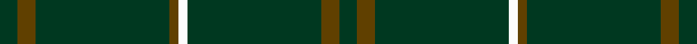
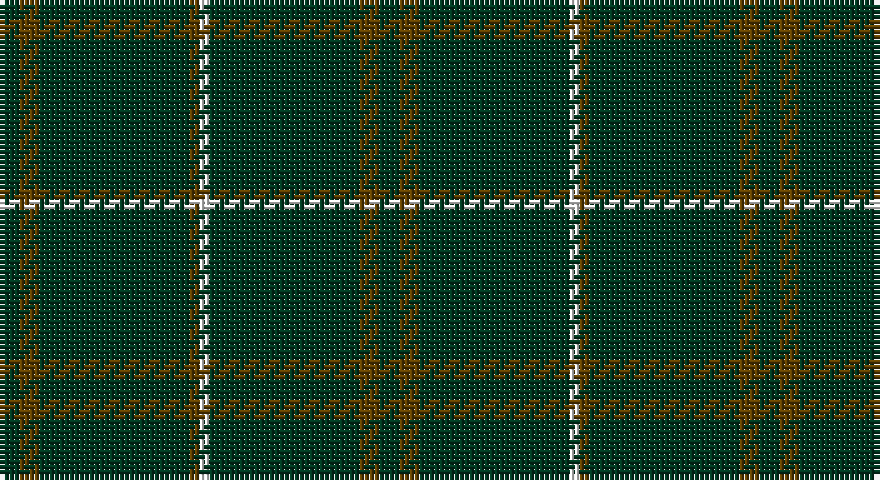

This page is one **sett** — a single exact thread-count. It belongs to the [tartan](/setts/dg2dy2dg15dy1w1dg15dy2dg2/)
(the same proportion at any scale), whose colour order is pattern [GGGGWGGG](/stripes/ggggwggg/).

Part of the [Bannockbane Hunting](/tartans/bannockbane-hunting/) tartan — the named design grouping this sett with its other cloths.

Sourced from register-of-tartans.  It is a [8 stripe tartan](/stripes/stripes8/).

Original link https://www.tartanregister.gov.uk/tartanDetails.aspx?ref=200

## Also known as

This cloth is also recorded under:

- Bannockbane, hunting

## Register references

External register numbers recorded for this tartan.

- Scottish Register of Tartans: [200](https://www.tartanregister.gov.uk/tartanDetails.aspx?ref=200)
- Scottish Tartans Authority (ITI): 909
- Scottish Tartans World Register: 909

## Thread count
DG/4 T4 DG30 T2 W2 DG30 T4 DG/4

One full sett is **152 threads**.

## Palette

Palette: <strong>Tartan Register</strong>
<table><thead><tr><th>Colour</th><th>Threads</th><th>Shade</th><th>Base</th><th>OKLCh</th></tr></thead><tbody><tr><td>DG/</td><td style="text-align:right;font-variant-numeric:tabular-nums">4</td><td><code style="background-color:#003820;">#003820</code> <small style="color:#888">#003820</small></td><td>G <code style="background-color:#006100;">#006100</code></td><td><small style="color:#888">oklch(30.0% 0.070 158.3)</small></td></tr><tr><td>T</td><td style="text-align:right;font-variant-numeric:tabular-nums">4</td><td><code style="background-color:#604000;">#604000</code> <small style="color:#888">#604000</small></td><td>G <code style="background-color:#006100;">#006100</code></td><td><small style="color:#888">oklch(39.8% 0.083 76.8)</small></td></tr><tr><td>DG</td><td style="text-align:right;font-variant-numeric:tabular-nums">30</td><td><code style="background-color:#003820;">#003820</code> <small style="color:#888">#003820</small></td><td>G <code style="background-color:#006100;">#006100</code></td><td><small style="color:#888">oklch(30.0% 0.070 158.3)</small></td></tr><tr><td>T</td><td style="text-align:right;font-variant-numeric:tabular-nums">2</td><td><code style="background-color:#604000;">#604000</code> <small style="color:#888">#604000</small></td><td>G <code style="background-color:#006100;">#006100</code></td><td><small style="color:#888">oklch(39.8% 0.083 76.8)</small></td></tr><tr><td>W</td><td style="text-align:right;font-variant-numeric:tabular-nums">2</td><td><code style="background-color:#FCFCFC;">#FCFCFC</code> <small style="color:#888">#FCFCFC</small></td><td>W <code style="background-color:#F7F7F7;">#F7F7F7</code></td><td><small style="color:#888">oklch(99.1% 0.000 89.9)</small></td></tr><tr><td>DG</td><td style="text-align:right;font-variant-numeric:tabular-nums">30</td><td><code style="background-color:#003820;">#003820</code> <small style="color:#888">#003820</small></td><td>G <code style="background-color:#006100;">#006100</code></td><td><small style="color:#888">oklch(30.0% 0.070 158.3)</small></td></tr><tr><td>T</td><td style="text-align:right;font-variant-numeric:tabular-nums">4</td><td><code style="background-color:#604000;">#604000</code> <small style="color:#888">#604000</small></td><td>G <code style="background-color:#006100;">#006100</code></td><td><small style="color:#888">oklch(39.8% 0.083 76.8)</small></td></tr><tr><td>DG/</td><td style="text-align:right;font-variant-numeric:tabular-nums">4</td><td><code style="background-color:#003820;">#003820</code> <small style="color:#888">#003820</small></td><td>G <code style="background-color:#006100;">#006100</code></td><td><small style="color:#888">oklch(30.0% 0.070 158.3)</small></td></tr></tbody></table>

# Sample pattern

## Nearest tartans

The nearest existing variants by ΔTartan distance, with this tartan at the top so the swatches line up against it.

ΔTartan

Tartan

Sett

—

<a href="/ttd/edit/#slug=dg2dy2dg15dy1w1dg15dy2dg2~x2">Bannockbane Hunting</a> <a class="nn-out" href="/variants/s8/dg2dy2dg15dy1w1dg15dy2dg2~x2/" title="open its dictionary page">↗</a>

1.90

<a href="/ttd/edit/#slug=dg62r7k4r4dg62~x2&amp;base=dg2dy2dg15dy1w1dg15dy2dg2~x2">MacNab, Ancient</a> <a class="nn-out" href="/variants/s5/dg62r7k4r4dg62~x2/" title="open its dictionary page">↗</a>

1.95

<a href="/variants/s8/r8g3r4g44w4~x2/">Welsh National</a>

2.09

<a href="/ttd/edit/#slug=k3g2k20r2k12g2k4g2k6g2~x2&amp;base=dg2dy2dg15dy1w1dg15dy2dg2~x2">Renwick</a> <a class="nn-out" href="/variants/s10/k3g2k20r2k12g2k4g2k6g2~x2/" title="open its dictionary page">↗</a>

2.11

<a href="/ttd/edit/#slug=k40dg15k10r2k10ly2k10~x2&amp;base=dg2dy2dg15dy1w1dg15dy2dg2~x2">Langhein Family Tartan</a> <a class="nn-out" href="/variants/s7/k40dg15k10r2k10ly2k10~x2/" title="open its dictionary page">↗</a>

2.15

<a href="/ttd/edit/#slug=g3dt1g2r1g3db3g2db2g18dt2~x2&amp;base=dg2dy2dg15dy1w1dg15dy2dg2~x2">Owen Welsh Name Tartan</a> <a class="nn-out" href="/variants/s10/g3dt1g2r1g3db3g2db2g18dt2~x2/" title="open its dictionary page">↗</a>

2.20

<a href="/ttd/edit/#slug=dg48r4dg2r4dg6r2dg3r9~x2&amp;base=dg2dy2dg15dy1w1dg15dy2dg2~x2">Menzies Hunting</a> <a class="nn-out" href="/variants/s8/dg48r4dg2r4dg6r2dg3r9~x2/" title="open its dictionary page">↗</a>

2.22

<a href="/ttd/edit/#slug=k40dg15k10r2k10lo2k10lo2~x2&amp;base=dg2dy2dg15dy1w1dg15dy2dg2~x2">Langhein, Alex (Personal)</a> <a class="nn-out" href="/variants/s8/k40dg15k10r2k10lo2k10lo2~x2/" title="open its dictionary page">↗</a>

2.23

<a href="/ttd/edit/#slug=k40dg15k10r2k10lo2k10~x2&amp;base=dg2dy2dg15dy1w1dg15dy2dg2~x2">Langhein, Alex (Personal)</a> <a class="nn-out" href="/variants/s7/k40dg15k10r2k10lo2k10~x2/" title="open its dictionary page">↗</a>

2.23

<a href="/ttd/edit/#slug=g2dp2g20g2g2dp1~x4&amp;base=dg2dy2dg15dy1w1dg15dy2dg2~x2">Walters (Personal)</a> <a class="nn-out" href="/variants/s6/g2dp2g20g2g2dp1~x4/" title="open its dictionary page">↗</a>

2.24

<a href="/ttd/edit/#slug=g2dy2g15dy1w1g15dy2g2~x2&amp;base=dg2dy2dg15dy1w1dg15dy2dg2~x2">Bannockbane Hunting Trade Tartan</a> <a class="nn-out" href="/variants/s8/g2dy2g15dy1w1g15dy2g2~x2/" title="open its dictionary page">↗</a>

## Neighbour map

Every grey dot is one of 14360 variants placed by the first two principal components of the ΔTartan feature space (44% of its variance). Red is this tartan; blue dots are its nearest — click one to open its page.

<svg viewBox="0 0 640 380" role="img" style="max-width:100%;height:auto;border:1px solid #e0e0e0;border-radius:4px;display:block" xmlns="http://www.w3.org/2000/svg"><image href="/nn/cloud.v1.png" width="640" height="380"/><a href="/variants/s5/dg62r7k4r4dg62~x2/"><circle cx="626.0" cy="264.5" r="4" fill="#3465a4"><title>MacNab, Ancient</title></circle></a><a href="/variants/s8/r8g3r4g44w4~x2/"><circle cx="575.0" cy="207.6" r="4" fill="#3465a4"><title>Welsh National</title></circle></a><a href="/variants/s10/k3g2k20r2k12g2k4g2k6g2~x2/"><circle cx="561.7" cy="237.4" r="4" fill="#3465a4"><title>Renwick</title></circle></a><a href="/variants/s7/k40dg15k10r2k10ly2k10~x2/"><circle cx="568.2" cy="233.5" r="4" fill="#3465a4"><title>Langhein Family Tartan</title></circle></a><a href="/variants/s10/g3dt1g2r1g3db3g2db2g18dt2~x2/"><circle cx="536.1" cy="193.3" r="4" fill="#3465a4"><title>Owen Welsh Name Tartan</title></circle></a><a href="/variants/s8/dg48r4dg2r4dg6r2dg3r9~x2/"><circle cx="611.0" cy="203.3" r="4" fill="#3465a4"><title>Menzies Hunting</title></circle></a><a href="/variants/s8/k40dg15k10r2k10lo2k10lo2~x2/"><circle cx="544.0" cy="213.2" r="4" fill="#3465a4"><title>Langhein, Alex (Personal)</title></circle></a><a href="/variants/s7/k40dg15k10r2k10lo2k10~x2/"><circle cx="547.6" cy="220.6" r="4" fill="#3465a4"><title>Langhein, Alex (Personal)</title></circle></a><a href="/variants/s6/g2dp2g20g2g2dp1~x4/"><circle cx="626.0" cy="226.0" r="4" fill="#3465a4"><title>Walters (Personal)</title></circle></a><a href="/variants/s8/g2dy2g15dy1w1g15dy2g2~x2/"><circle cx="626.0" cy="258.4" r="4" fill="#3465a4"><title>Bannockbane Hunting Trade Tartan</title></circle></a><circle cx="626.0" cy="241.8" r="5" fill="#c00000"/></svg>

ID: /variants/s8/dg2dy2dg15dy1w1dg15dy2dg2~x2/
