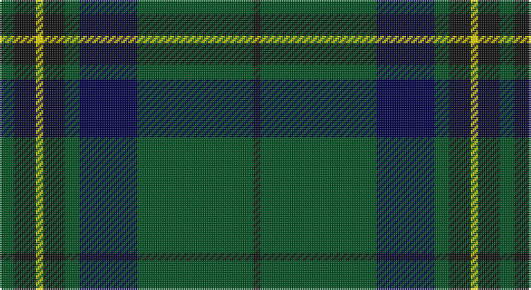

This page is one **sett** — a single exact thread-count. It belongs to the [tartan](/setts/dg2k3ly1k3dg2db8dg16k1/)
(the same proportion at any scale), whose colour order is pattern [GKYKGBGK](/stripes/gkykgbgk/).

Sourced from register-of-tartans.  It is a [8 stripe tartan](/stripes/stripes8/).

Original link https://www.tartanregister.gov.uk/tartanDetails.aspx?ref=10986

## Register references

External register numbers recorded for this tartan.

- Scottish Register of Tartans: [10986](https://www.tartanregister.gov.uk/tartanDetails.aspx?ref=10986)

## Thread count
G/8 K12 Y4 K12 G8 DB32 G64 K/4

One full sett is **276 threads**.

## Palette

Palette: <strong>Tartan Register</strong>
<table><thead><tr><th>Colour</th><th>Threads</th><th>Shade</th><th>Base</th><th>OKLCh</th></tr></thead><tbody><tr><td>G/</td><td style="text-align:right;font-variant-numeric:tabular-nums">8</td><td><code style="background-color:#005020;">#005020</code> <small style="color:#888">#005020</small></td><td>G <code style="background-color:#006100;">#006100</code></td><td><small style="color:#888">oklch(37.7% 0.105 149.6)</small></td></tr><tr><td>K</td><td style="text-align:right;font-variant-numeric:tabular-nums">12</td><td><code style="background-color:#101010;">#101010</code> <small style="color:#888">#101010</small></td><td>K <code style="background-color:#000000;">#000000</code></td><td><small style="color:#888">oklch(17.3% 0.000 89.9)</small></td></tr><tr><td>Y</td><td style="text-align:right;font-variant-numeric:tabular-nums">4</td><td><code style="background-color:#FFE600;">#FFE600</code> <small style="color:#888">#FFE600</small></td><td>Y <code style="background-color:#F2BF00;">#F2BF00</code></td><td><small style="color:#888">oklch(91.7% 0.192 101.4)</small></td></tr><tr><td>K</td><td style="text-align:right;font-variant-numeric:tabular-nums">12</td><td><code style="background-color:#101010;">#101010</code> <small style="color:#888">#101010</small></td><td>K <code style="background-color:#000000;">#000000</code></td><td><small style="color:#888">oklch(17.3% 0.000 89.9)</small></td></tr><tr><td>G</td><td style="text-align:right;font-variant-numeric:tabular-nums">8</td><td><code style="background-color:#005020;">#005020</code> <small style="color:#888">#005020</small></td><td>G <code style="background-color:#006100;">#006100</code></td><td><small style="color:#888">oklch(37.7% 0.105 149.6)</small></td></tr><tr><td>DB</td><td style="text-align:right;font-variant-numeric:tabular-nums">32</td><td><code style="background-color:#000048;">#000048</code> <small style="color:#888">#000048</small></td><td>B <code style="background-color:#2A418A;">#2A418A</code></td><td><small style="color:#888">oklch(18.2% 0.126 264.1)</small></td></tr><tr><td>G</td><td style="text-align:right;font-variant-numeric:tabular-nums">64</td><td><code style="background-color:#005020;">#005020</code> <small style="color:#888">#005020</small></td><td>G <code style="background-color:#006100;">#006100</code></td><td><small style="color:#888">oklch(37.7% 0.105 149.6)</small></td></tr><tr><td>K/</td><td style="text-align:right;font-variant-numeric:tabular-nums">4</td><td><code style="background-color:#101010;">#101010</code> <small style="color:#888">#101010</small></td><td>K <code style="background-color:#000000;">#000000</code></td><td><small style="color:#888">oklch(17.3% 0.000 89.9)</small></td></tr></tbody></table>

# Sample pattern

## Nearest tartans

The nearest existing variants by ΔTartan distance, with this tartan at the top so the swatches line up against it.

ΔTartan

Tartan

Sett

—

<a href="/ttd/edit/#slug=dg2k3ly1k3dg2db8dg16k1~x4">Harley (Leslie), Robert</a> <a class="nn-out" href="/variants/s8/dg2k3ly1k3dg2db8dg16k1~x4/" title="open its dictionary page">↗</a>

0.73

<a href="/ttd/edit/#slug=g2k3ly1k3g2db8g16k1~x4&amp;base=dg2k3ly1k3dg2db8dg16k1~x4">Harley (Leslie), Robert</a> <a class="nn-out" href="/variants/s8/g2k3ly1k3g2db8g16k1~x4/" title="open its dictionary page">↗</a>

1.03

<a href="/ttd/edit/#slug=dg46k18dg6k13r4k4w4~x2&amp;base=dg2k3ly1k3dg2db8dg16k1~x4">Page</a> <a class="nn-out" href="/variants/s7/dg46k18dg6k13r4k4w4~x2/" title="open its dictionary page">↗</a>

1.08

<a href="/ttd/edit/#slug=dg40r3dg4r3dg12db32ly4r3~x2&amp;base=dg2k3ly1k3dg2db8dg16k1~x4">U.S. Marine Corps (Military?)</a> <a class="nn-out" href="/variants/s8/dg40r3dg4r3dg12db32ly4r3~x2/" title="open its dictionary page">↗</a>

1.15

<a href="/ttd/edit/#slug=k19r1dg3k2k3k2dg2k2dg20w2~x2&amp;base=dg2k3ly1k3dg2db8dg16k1~x4">Scottish Chieftain</a> <a class="nn-out" href="/variants/s10/k19r1dg3k2k3k2dg2k2dg20w2~x2/" title="open its dictionary page">↗</a>

1.16

<a href="/ttd/edit/#slug=k4gi13k4g8k44g8k4gi13k4w3~x2&amp;base=dg2k3ly1k3dg2db8dg16k1~x4">Childers</a> <a class="nn-out" href="/variants/s10/k4gi13k4g8k44g8k4gi13k4w3~x2/" title="open its dictionary page">↗</a>

1.18

<a href="/ttd/edit/#slug=dt6r3g26dt26w2dt27r5g5~x2&amp;base=dg2k3ly1k3dg2db8dg16k1~x4">MacHardy (Clan)</a> <a class="nn-out" href="/variants/s8/dt6r3g26dt26w2dt27r5g5~x2/" title="open its dictionary page">↗</a>

1.19

<a href="/ttd/edit/#slug=dg38w2dg6db24o6db2o3db2~x2&amp;base=dg2k3ly1k3dg2db8dg16k1~x4">MacAuliffe/McAucliffe</a> <a class="nn-out" href="/variants/s8/dg38w2dg6db24o6db2o3db2~x2/" title="open its dictionary page">↗</a>

1.21

<a href="/ttd/edit/#slug=dg4db12r3db12dg32lr4~x2&amp;base=dg2k3ly1k3dg2db8dg16k1~x4">MacIntyre LC</a> <a class="nn-out" href="/variants/s6/dg4db12r3db12dg32lr4~x2/" title="open its dictionary page">↗</a>

1.21

<a href="/ttd/edit/#slug=dg4db12r3db12dg32lr4&amp;base=dg2k3ly1k3dg2db8dg16k1~x4">MacIntyre LC</a> <a class="nn-out" href="/variants/s6/dg4db12r3db12dg32lr4/" title="open its dictionary page">↗</a>

1.21

<a href="/ttd/edit/#slug=g24k2db3k2db8r2~x2&amp;base=dg2k3ly1k3dg2db8dg16k1~x4">Shaw (Clan 1)</a> <a class="nn-out" href="/variants/s6/g24k2db3k2db8r2~x2/" title="open its dictionary page">↗</a>

## Neighbour map

Every grey dot is one of 14360 variants placed by the first two principal components of the ΔTartan feature space (44% of its variance). Red is this tartan; blue dots are its nearest — click one to open its page.

<svg viewBox="0 0 640 380" role="img" style="max-width:100%;height:auto;border:1px solid #e0e0e0;border-radius:4px;display:block" xmlns="http://www.w3.org/2000/svg"><image href="/nn/cloud.v1.png" width="640" height="380"/><a href="/variants/s8/g2k3ly1k3g2db8g16k1~x4/"><circle cx="337.6" cy="189.5" r="4" fill="#3465a4"><title>Harley (Leslie), Robert</title></circle></a><a href="/variants/s7/dg46k18dg6k13r4k4w4~x2/"><circle cx="343.8" cy="210.4" r="4" fill="#3465a4"><title>Page</title></circle></a><a href="/variants/s8/dg40r3dg4r3dg12db32ly4r3~x2/"><circle cx="342.1" cy="189.2" r="4" fill="#3465a4"><title>U.S. Marine Corps (Military?)</title></circle></a><a href="/variants/s10/k19r1dg3k2k3k2dg2k2dg20w2~x2/"><circle cx="361.0" cy="165.7" r="4" fill="#3465a4"><title>Scottish Chieftain</title></circle></a><a href="/variants/s10/k4gi13k4g8k44g8k4gi13k4w3~x2/"><circle cx="329.1" cy="171.7" r="4" fill="#3465a4"><title>Childers</title></circle></a><a href="/variants/s8/dt6r3g26dt26w2dt27r5g5~x2/"><circle cx="365.1" cy="216.7" r="4" fill="#3465a4"><title>MacHardy (Clan)</title></circle></a><a href="/variants/s8/dg38w2dg6db24o6db2o3db2~x2/"><circle cx="364.2" cy="179.5" r="4" fill="#3465a4"><title>MacAuliffe/McAucliffe</title></circle></a><a href="/variants/s6/dg4db12r3db12dg32lr4~x2/"><circle cx="322.0" cy="229.6" r="4" fill="#3465a4"><title>MacIntyre LC</title></circle></a><a href="/variants/s6/dg4db12r3db12dg32lr4/"><circle cx="322.0" cy="229.6" r="4" fill="#3465a4"><title>MacIntyre LC</title></circle></a><a href="/variants/s6/g24k2db3k2db8r2~x2/"><circle cx="369.4" cy="209.1" r="4" fill="#3465a4"><title>Shaw (Clan 1)</title></circle></a><circle cx="346.1" cy="196.8" r="5" fill="#c00000"/></svg>

ID: /variants/s8/dg2k3ly1k3dg2db8dg16k1~x4/
