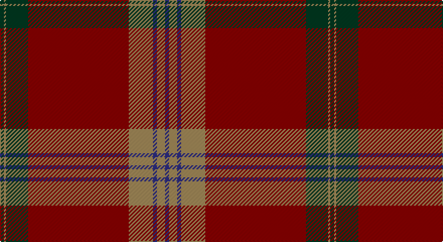

This page is one **sett** — a single exact thread-count. It belongs to the [tartan](/setts/dg2lo1dg11r50lo12db2lo4db2/)
(the same proportion at any scale), whose colour order is pattern [BYBYRGYG](/stripes/bybyrgyg/).

Sourced from tartans-authority.  It is a [8 stripe tartan](/stripes/stripes8/).

Original link http://www.tartansauthority.com/tartan-ferret/display/5795/

## Register references

External register numbers recorded for this tartan.

- Scottish Tartans Authority (ITI): 5795

## Thread count
DG/4 LT2 DG22 DR100 LT24 DB4 LT8 DB/4

One full sett is **328 threads**.

## Palette

Palette: <strong>Tartan Register</strong>
<table><thead><tr><th>Colour</th><th>Threads</th><th>Shade</th><th>Base</th><th>OKLCh</th></tr></thead><tbody><tr><td>DG/</td><td style="text-align:right;font-variant-numeric:tabular-nums">4</td><td><code style="background-color:#003820;">#003820</code> <small style="color:#888">#003820</small></td><td>G <code style="background-color:#006100;">#006100</code></td><td><small style="color:#888">oklch(30.0% 0.070 158.3)</small></td></tr><tr><td>LT</td><td style="text-align:right;font-variant-numeric:tabular-nums">2</td><td><code style="background-color:#A08858;">#A08858</code> <small style="color:#888">#A08858</small></td><td>Y <code style="background-color:#F2BF00;">#F2BF00</code></td><td><small style="color:#888">oklch(63.7% 0.071 84.0)</small></td></tr><tr><td>DG</td><td style="text-align:right;font-variant-numeric:tabular-nums">22</td><td><code style="background-color:#003820;">#003820</code> <small style="color:#888">#003820</small></td><td>G <code style="background-color:#006100;">#006100</code></td><td><small style="color:#888">oklch(30.0% 0.070 158.3)</small></td></tr><tr><td>DR</td><td style="text-align:right;font-variant-numeric:tabular-nums">100</td><td><code style="background-color:#880000;">#880000</code> <small style="color:#888">#880000</small></td><td>R <code style="background-color:#CC0000;">#CC0000</code></td><td><small style="color:#888">oklch(39.4% 0.162 29.2)</small></td></tr><tr><td>LT</td><td style="text-align:right;font-variant-numeric:tabular-nums">24</td><td><code style="background-color:#A08858;">#A08858</code> <small style="color:#888">#A08858</small></td><td>Y <code style="background-color:#F2BF00;">#F2BF00</code></td><td><small style="color:#888">oklch(63.7% 0.071 84.0)</small></td></tr><tr><td>DB</td><td style="text-align:right;font-variant-numeric:tabular-nums">4</td><td><code style="background-color:#2C2C80;">#2C2C80</code> <small style="color:#888">#2C2C80</small></td><td>B <code style="background-color:#2A418A;">#2A418A</code></td><td><small style="color:#888">oklch(35.0% 0.138 276.6)</small></td></tr><tr><td>LT</td><td style="text-align:right;font-variant-numeric:tabular-nums">8</td><td><code style="background-color:#A08858;">#A08858</code> <small style="color:#888">#A08858</small></td><td>Y <code style="background-color:#F2BF00;">#F2BF00</code></td><td><small style="color:#888">oklch(63.7% 0.071 84.0)</small></td></tr><tr><td>DB/</td><td style="text-align:right;font-variant-numeric:tabular-nums">4</td><td><code style="background-color:#2C2C80;">#2C2C80</code> <small style="color:#888">#2C2C80</small></td><td>B <code style="background-color:#2A418A;">#2A418A</code></td><td><small style="color:#888">oklch(35.0% 0.138 276.6)</small></td></tr></tbody></table>

# Sample pattern

## Nearest tartans

The nearest existing variants by ΔTartan distance, with this tartan at the top so the swatches line up against it.

ΔTartan

Tartan

Sett

—

<a href="/ttd/edit/#slug=dg2lo1dg11r50lo12db2lo4db2~x2">Slessor (Personal)</a> <a class="nn-out" href="/variants/s8/dg2lo1dg11r50lo12db2lo4db2~x2/" title="open its dictionary page">↗</a>

1.17

<a href="/variants/s14/dg2lo1dg11r50lo12db2lo4db2~x2/">Slessor (Personal)</a>

1.18

<a href="/ttd/edit/#slug=lo1ri45dt23w1dt6r2lo1r2lo1~x2&amp;base=dg2lo1dg11r50lo12db2lo4db2~x2">Arbroath Smokie</a> <a class="nn-out" href="/variants/s9/lo1ri45dt23w1dt6r2lo1r2lo1~x2/" title="open its dictionary page">↗</a>

1.27

<a href="/ttd/edit/#slug=oi50o3oi4o4db1o1db1o7dg7o1dg3~x4&amp;base=dg2lo1dg11r50lo12db2lo4db2~x2">Unidentified #60</a> <a class="nn-out" href="/variants/s11/oi50o3oi4o4db1o1db1o7dg7o1dg3~x4/" title="open its dictionary page">↗</a>

1.37

<a href="/ttd/edit/#slug=r36dg18r4dg6k1lr2~x2&amp;base=dg2lo1dg11r50lo12db2lo4db2~x2">MacGregor</a> <a class="nn-out" href="/variants/s6/r36dg18r4dg6k1lr2~x2/" title="open its dictionary page">↗</a>

1.37

<a href="/ttd/edit/#slug=r36dg18r4dg6k1lr2&amp;base=dg2lo1dg11r50lo12db2lo4db2~x2">MacGregor</a> <a class="nn-out" href="/variants/s6/r36dg18r4dg6k1lr2/" title="open its dictionary page">↗</a>

1.37

<a href="/ttd/edit/#slug=g4r52k20dy9g2lo1~x2&amp;base=dg2lo1dg11r50lo12db2lo4db2~x2">Jack (Personal)</a> <a class="nn-out" href="/variants/s6/g4r52k20dy9g2lo1~x2/" title="open its dictionary page">↗</a>

1.38

<a href="/ttd/edit/#slug=r36g18r4g6k1lb2k1g2~x2&amp;base=dg2lo1dg11r50lo12db2lo4db2~x2">Strang (Personal)</a> <a class="nn-out" href="/variants/s8/r36g18r4g6k1lb2k1g2~x2/" title="open its dictionary page">↗</a>

1.39

<a href="/ttd/edit/#slug=r6t1dt1r57t2r2dt23r4g30r6t1r6dt2~x2&amp;base=dg2lo1dg11r50lo12db2lo4db2~x2">MacGillivray - 1819 (Clan)</a> <a class="nn-out" href="/variants/s13/r6t1dt1r57t2r2dt23r4g30r6t1r6dt2~x2/" title="open its dictionary page">↗</a>

1.39

<a href="/ttd/edit/#slug=y8r6k4r64o1k28r6y40r6k4~x2&amp;base=dg2lo1dg11r50lo12db2lo4db2~x2">Laporte</a> <a class="nn-out" href="/variants/s10/y8r6k4r64o1k28r6y40r6k4~x2/" title="open its dictionary page">↗</a>

1.45

<a href="/ttd/edit/#slug=o36k3dy3r1dy3k3o4dy6k1r2~x4&amp;base=dg2lo1dg11r50lo12db2lo4db2~x2">Moulin</a> <a class="nn-out" href="/variants/s10/o36k3dy3r1dy3k3o4dy6k1r2~x4/" title="open its dictionary page">↗</a>

## Neighbour map

Every grey dot is one of 14360 variants placed by the first two principal components of the ΔTartan feature space (44% of its variance). Red is this tartan; blue dots are its nearest — click one to open its page.

<svg viewBox="0 0 640 380" role="img" style="max-width:100%;height:auto;border:1px solid #e0e0e0;border-radius:4px;display:block" xmlns="http://www.w3.org/2000/svg"><image href="/nn/cloud.v1.png" width="640" height="380"/><a href="/variants/s14/dg2lo1dg11r50lo12db2lo4db2~x2/"><circle cx="455.4" cy="97.6" r="4" fill="#3465a4"><title>Slessor (Personal)</title></circle></a><a href="/variants/s9/lo1ri45dt23w1dt6r2lo1r2lo1~x2/"><circle cx="432.7" cy="100.2" r="4" fill="#3465a4"><title>Arbroath Smokie</title></circle></a><a href="/variants/s11/oi50o3oi4o4db1o1db1o7dg7o1dg3~x4/"><circle cx="524.4" cy="96.9" r="4" fill="#3465a4"><title>Unidentified #60</title></circle></a><a href="/variants/s6/r36dg18r4dg6k1lr2~x2/"><circle cx="450.0" cy="156.5" r="4" fill="#3465a4"><title>MacGregor</title></circle></a><a href="/variants/s6/r36dg18r4dg6k1lr2/"><circle cx="450.0" cy="156.5" r="4" fill="#3465a4"><title>MacGregor</title></circle></a><a href="/variants/s6/g4r52k20dy9g2lo1~x2/"><circle cx="446.2" cy="136.2" r="4" fill="#3465a4"><title>Jack (Personal)</title></circle></a><a href="/variants/s8/r36g18r4g6k1lb2k1g2~x2/"><circle cx="421.8" cy="123.3" r="4" fill="#3465a4"><title>Strang (Personal)</title></circle></a><a href="/variants/s13/r6t1dt1r57t2r2dt23r4g30r6t1r6dt2~x2/"><circle cx="411.4" cy="79.2" r="4" fill="#3465a4"><title>MacGillivray - 1819 (Clan)</title></circle></a><a href="/variants/s10/y8r6k4r64o1k28r6y40r6k4~x2/"><circle cx="394.1" cy="130.0" r="4" fill="#3465a4"><title>Laporte</title></circle></a><a href="/variants/s10/o36k3dy3r1dy3k3o4dy6k1r2~x4/"><circle cx="503.3" cy="128.5" r="4" fill="#3465a4"><title>Moulin</title></circle></a><circle cx="458.8" cy="116.0" r="5" fill="#c00000"/></svg>

ID: /variants/s8/dg2lo1dg11r50lo12db2lo4db2~x2/
