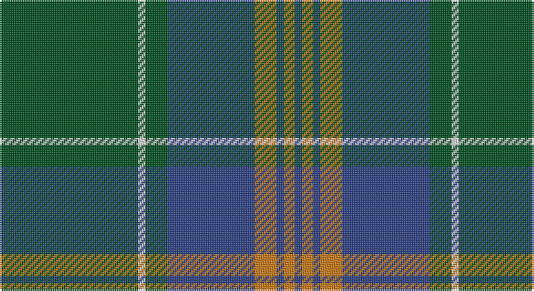

This page is one **sett** — a single exact thread-count. It belongs to the [tartan](/setts/dg38w2dg6db24o6db2o3db2/)
(the same proportion at any scale), whose colour order is pattern [BRBRBGWG](/stripes/brbrbgwg/).

Sourced from register-of-tartans.  It is a [8 stripe tartan](/stripes/stripes8/).

Original link https://www.tartanregister.gov.uk/tartanDetails.aspx?ref=2289

## Register references

External register numbers recorded for this tartan.

- Scottish Register of Tartans: [2289](https://www.tartanregister.gov.uk/tartanDetails.aspx?ref=2289)
- Scottish Tartans World Register: 2839

## Thread count
G/76 LN4 G12 B48 O12 B4 O6 B/4

One full sett is **252 threads**.

## Palette

Palette: <strong>Tartan Register</strong> <small style="color:#888">(3 of 4 colours)</small>
<table><thead><tr><th>Colour</th><th>Threads</th><th>Shade</th><th>Base</th><th>OKLCh</th></tr></thead><tbody><tr><td>G/</td><td style="text-align:right;font-variant-numeric:tabular-nums">76</td><td><code style="background-color:#005020;">#005020</code> <small style="color:#888">#005020</small></td><td>G <code style="background-color:#006100;">#006100</code></td><td><small style="color:#888">oklch(37.7% 0.105 149.6)</small></td></tr><tr><td>LN</td><td style="text-align:right;font-variant-numeric:tabular-nums">4</td><td><code style="background-color:#E0E0E0;">#E0E0E0</code> <small style="color:#888">#E0E0E0</small></td><td>W <code style="background-color:#F7F7F7;">#F7F7F7</code></td><td><small style="color:#888">oklch(90.7% 0.000 89.9)</small></td></tr><tr><td>G</td><td style="text-align:right;font-variant-numeric:tabular-nums">12</td><td><code style="background-color:#005020;">#005020</code> <small style="color:#888">#005020</small></td><td>G <code style="background-color:#006100;">#006100</code></td><td><small style="color:#888">oklch(37.7% 0.105 149.6)</small></td></tr><tr><td>B</td><td style="text-align:right;font-variant-numeric:tabular-nums">48</td><td><code style="background-color:#2C4084;">#2C4084</code> <small style="color:#888">#2C4084</small></td><td>B <code style="background-color:#2A418A;">#2A418A</code></td><td><small style="color:#888">oklch(39.4% 0.117 268.3)</small></td></tr><tr><td>O</td><td style="text-align:right;font-variant-numeric:tabular-nums">12</td><td><code style="background-color:#C87814;">#C87814</code> <small style="color:#888">#C87814</small></td><td>R <code style="background-color:#CC0000;">#CC0000</code></td><td><small style="color:#888">oklch(64.5% 0.141 63.8)</small></td></tr><tr><td>B</td><td style="text-align:right;font-variant-numeric:tabular-nums">4</td><td><code style="background-color:#2C4084;">#2C4084</code> <small style="color:#888">#2C4084</small></td><td>B <code style="background-color:#2A418A;">#2A418A</code></td><td><small style="color:#888">oklch(39.4% 0.117 268.3)</small></td></tr><tr><td>O</td><td style="text-align:right;font-variant-numeric:tabular-nums">6</td><td><code style="background-color:#C87814;">#C87814</code> <small style="color:#888">#C87814</small></td><td>R <code style="background-color:#CC0000;">#CC0000</code></td><td><small style="color:#888">oklch(64.5% 0.141 63.8)</small></td></tr><tr><td>B/</td><td style="text-align:right;font-variant-numeric:tabular-nums">4</td><td><code style="background-color:#2C4084;">#2C4084</code> <small style="color:#888">#2C4084</small></td><td>B <code style="background-color:#2A418A;">#2A418A</code></td><td><small style="color:#888">oklch(39.4% 0.117 268.3)</small></td></tr></tbody></table>

# Sample pattern

## Nearest tartans

The nearest existing variants by ΔTartan distance, with this tartan at the top so the swatches line up against it.

ΔTartan

Tartan

Sett

—

<a href="/ttd/edit/#slug=dg38w2dg6db24o6db2o3db2~x2">MacAuliffe/McAucliffe</a> <a class="nn-out" href="/variants/s8/dg38w2dg6db24o6db2o3db2~x2/" title="open its dictionary page">↗</a>

0.89

<a href="/ttd/edit/#slug=g40r3g4r3g12db32lo4r3~x2&amp;base=dg38w2dg6db24o6db2o3db2~x2">US Marine Corps</a> <a class="nn-out" href="/variants/s8/g40r3g4r3g12db32lo4r3~x2/" title="open its dictionary page">↗</a>

0.93

<a href="/ttd/edit/#slug=dg40r3dg4r3dg12db32ly4r3~x2&amp;base=dg38w2dg6db24o6db2o3db2~x2">U.S. Marine Corps (Military?)</a> <a class="nn-out" href="/variants/s8/dg40r3dg4r3dg12db32ly4r3~x2/" title="open its dictionary page">↗</a>

0.98

<a href="/ttd/edit/#slug=g28r2g2r2g8db24ly3r2~x2&amp;base=dg38w2dg6db24o6db2o3db2~x2">Leatherneck U.S.Marine Corps Corporate Tartan</a> <a class="nn-out" href="/variants/s8/g28r2g2r2g8db24ly3r2~x2/" title="open its dictionary page">↗</a>

1.08

<a href="/ttd/edit/#slug=g28r2g2r2g8db24y3r2~x2&amp;base=dg38w2dg6db24o6db2o3db2~x2">Leatherneck, U.S.Marine Corps</a> <a class="nn-out" href="/variants/s8/g28r2g2r2g8db24y3r2~x2/" title="open its dictionary page">↗</a>

1.10

<a href="/ttd/edit/#slug=g2k3ly1k3g2db8g16k1~x4&amp;base=dg38w2dg6db24o6db2o3db2~x2">Harley (Leslie), Robert</a> <a class="nn-out" href="/variants/s8/g2k3ly1k3g2db8g16k1~x4/" title="open its dictionary page">↗</a>

1.17

<a href="/ttd/edit/#slug=g24k2db3k2db8r2~x2&amp;base=dg38w2dg6db24o6db2o3db2~x2">Shaw (Clan 1)</a> <a class="nn-out" href="/variants/s6/g24k2db3k2db8r2~x2/" title="open its dictionary page">↗</a>

1.19

<a href="/ttd/edit/#slug=dr2db4g12db3dr6t2db24dr2db2g2~x2&amp;base=dg38w2dg6db24o6db2o3db2~x2">Wicklow</a> <a class="nn-out" href="/variants/s10/dr2db4g12db3dr6t2db24dr2db2g2~x2/" title="open its dictionary page">↗</a>

1.19

<a href="/ttd/edit/#slug=dg2k3ly1k3dg2db8dg16k1~x4&amp;base=dg38w2dg6db24o6db2o3db2~x2">Harley (Leslie), Robert</a> <a class="nn-out" href="/variants/s8/dg2k3ly1k3dg2db8dg16k1~x4/" title="open its dictionary page">↗</a>

1.23

<a href="/ttd/edit/#slug=dg2db2t23db2t2db6t2db2dg33r2t2~x2&amp;base=dg38w2dg6db24o6db2o3db2~x2">Maine, Original State of (Fashion)</a> <a class="nn-out" href="/variants/s11/dg2db2t23db2t2db6t2db2dg33r2t2~x2/" title="open its dictionary page">↗</a>

1.24

<a href="/ttd/edit/#slug=lo4g4db2g29w1db12g2lo16g4db2~x2&amp;base=dg38w2dg6db24o6db2o3db2~x2">Unidentified (Pahls)</a> <a class="nn-out" href="/variants/s10/lo4g4db2g29w1db12g2lo16g4db2~x2/" title="open its dictionary page">↗</a>

## Neighbour map

Every grey dot is one of 14360 variants placed by the first two principal components of the ΔTartan feature space (44% of its variance). Red is this tartan; blue dots are its nearest — click one to open its page.

<svg viewBox="0 0 640 380" role="img" style="max-width:100%;height:auto;border:1px solid #e0e0e0;border-radius:4px;display:block" xmlns="http://www.w3.org/2000/svg"><image href="/nn/cloud.v1.png" width="640" height="380"/><a href="/variants/s8/g40r3g4r3g12db32lo4r3~x2/"><circle cx="343.4" cy="189.5" r="4" fill="#3465a4"><title>US Marine Corps</title></circle></a><a href="/variants/s8/dg40r3dg4r3dg12db32ly4r3~x2/"><circle cx="342.1" cy="189.2" r="4" fill="#3465a4"><title>U.S. Marine Corps (Military?)</title></circle></a><a href="/variants/s8/g28r2g2r2g8db24ly3r2~x2/"><circle cx="330.0" cy="181.0" r="4" fill="#3465a4"><title>Leatherneck U.S.Marine Corps Corporate Tartan</title></circle></a><a href="/variants/s8/g28r2g2r2g8db24y3r2~x2/"><circle cx="340.8" cy="187.4" r="4" fill="#3465a4"><title>Leatherneck, U.S.Marine Corps</title></circle></a><a href="/variants/s8/g2k3ly1k3g2db8g16k1~x4/"><circle cx="337.6" cy="189.5" r="4" fill="#3465a4"><title>Harley (Leslie), Robert</title></circle></a><a href="/variants/s6/g24k2db3k2db8r2~x2/"><circle cx="369.4" cy="209.1" r="4" fill="#3465a4"><title>Shaw (Clan 1)</title></circle></a><a href="/variants/s10/dr2db4g12db3dr6t2db24dr2db2g2~x2/"><circle cx="348.2" cy="189.8" r="4" fill="#3465a4"><title>Wicklow</title></circle></a><a href="/variants/s8/dg2k3ly1k3dg2db8dg16k1~x4/"><circle cx="346.1" cy="196.8" r="4" fill="#3465a4"><title>Harley (Leslie), Robert</title></circle></a><a href="/variants/s11/dg2db2t23db2t2db6t2db2dg33r2t2~x2/"><circle cx="321.1" cy="155.5" r="4" fill="#3465a4"><title>Maine, Original State of (Fashion)</title></circle></a><a href="/variants/s10/lo4g4db2g29w1db12g2lo16g4db2~x2/"><circle cx="341.0" cy="151.0" r="4" fill="#3465a4"><title>Unidentified (Pahls)</title></circle></a><circle cx="364.2" cy="179.5" r="5" fill="#c00000"/></svg>

ID: /variants/s8/dg38w2dg6db24o6db2o3db2~x2/
