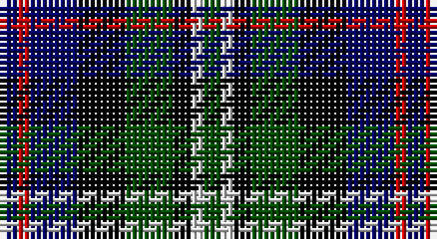

This page is one **sett** — a single exact thread-count. It belongs to the [tartan](/setts/dg3lb2k3dg8k8db8r2db3/)
(the same proportion at any scale), whose colour order is pattern [BRBKGKWG](/stripes/brbkgkwg/).

Part of the [Davidson 'Double'](/tartans/davidson-double/) tartan — the named design grouping this sett with its other cloths.

Sourced from weddslist.  It is a [8 stripe tartan](/stripes/stripes8/).

Original link http://www.weddslist.com/cgi-bin/tartans/pg.pl?source=rb

## Also known as

This cloth is also recorded under:

- Davidson Double
- Davidson Double..
- Davidson, Double
- Davidson, Double..

## Thread count
DB/3 R2 DB8 K8 G8 K3 N2 G/3

One full sett is **68 threads**.

## Palette

Palette: <strong>Tartan Register</strong> <small style="color:#888">(4 of 5 colours)</small>
<table><thead><tr><th>Colour</th><th>Threads</th><th>Shade</th><th>Base</th><th>OKLCh</th></tr></thead><tbody><tr><td>DB/</td><td style="text-align:right;font-variant-numeric:tabular-nums">3</td><td><code style="background-color:#000064;">#000064</code> <small style="color:#888">#000064</small></td><td>B <code style="background-color:#2A418A;">#2A418A</code></td><td><small style="color:#888">oklch(22.7% 0.158 264.1)</small></td></tr><tr><td>R</td><td style="text-align:right;font-variant-numeric:tabular-nums">2</td><td><code style="background-color:#C80000;">#C80000</code> <small style="color:#888">#C80000</small></td><td>R <code style="background-color:#CC0000;">#CC0000</code></td><td><small style="color:#888">oklch(52.3% 0.215 29.2)</small></td></tr><tr><td>DB</td><td style="text-align:right;font-variant-numeric:tabular-nums">8</td><td><code style="background-color:#000064;">#000064</code> <small style="color:#888">#000064</small></td><td>B <code style="background-color:#2A418A;">#2A418A</code></td><td><small style="color:#888">oklch(22.7% 0.158 264.1)</small></td></tr><tr><td>K</td><td style="text-align:right;font-variant-numeric:tabular-nums">8</td><td><code style="background-color:#000000;">#000000</code> <small style="color:#888">#000000</small></td><td>K <code style="background-color:#000000;">#000000</code></td><td><small style="color:#888">oklch(0.0% 0.000 0.0)</small></td></tr><tr><td>G</td><td style="text-align:right;font-variant-numeric:tabular-nums">8</td><td><code style="background-color:#004C00;">#004C00</code> <small style="color:#888">#004C00</small></td><td>G <code style="background-color:#006100;">#006100</code></td><td><small style="color:#888">oklch(36.1% 0.123 142.5)</small></td></tr><tr><td>K</td><td style="text-align:right;font-variant-numeric:tabular-nums">3</td><td><code style="background-color:#000000;">#000000</code> <small style="color:#888">#000000</small></td><td>K <code style="background-color:#000000;">#000000</code></td><td><small style="color:#888">oklch(0.0% 0.000 0.0)</small></td></tr><tr><td>N</td><td style="text-align:right;font-variant-numeric:tabular-nums">2</td><td><code style="background-color:#D0D0D0;">#D0D0D0</code> <small style="color:#888">#D0D0D0</small></td><td>W <code style="background-color:#F7F7F7;">#F7F7F7</code></td><td><small style="color:#888">oklch(85.8% 0.000 89.9)</small></td></tr><tr><td>G/</td><td style="text-align:right;font-variant-numeric:tabular-nums">3</td><td><code style="background-color:#004C00;">#004C00</code> <small style="color:#888">#004C00</small></td><td>G <code style="background-color:#006100;">#006100</code></td><td><small style="color:#888">oklch(36.1% 0.123 142.5)</small></td></tr></tbody></table>

# Sample pattern

## Compared to the master

This cloth is one sett of its design; the master sett (the exemplar the design is anchored on) is below for comparison.

<figure style="margin:0"><figcaption style="color:#888;font-size:smaller">this sett</figcaption></figure>
<figure style="margin:0"><figcaption style="color:#888;font-size:smaller"><a href="/setts/k3w2k3g8k8db8r2db3/">master sett →</a></figcaption></figure>

## Nearest tartans

The nearest existing variants by ΔTartan distance, with this tartan at the top so the swatches line up against it.

ΔTartan

Tartan

Sett

—

<a href="/ttd/edit/#slug=dg3lb2k3dg8k8db8r2db3">Davidson Double</a> <a class="nn-out" href="/variants/s8/dg3lb2k3dg8k8db8r2db3/" title="open its dictionary page">↗</a>

0.85

<a href="/ttd/edit/#slug=r1k2dg4k1dg1k2db3k1w1~x6&amp;base=dg3lb2k3dg8k8db8r2db3">MacKean dress</a> <a class="nn-out" href="/variants/s9/r1k2dg4k1dg1k2db3k1w1~x6/" title="open its dictionary page">↗</a>

0.87

<a href="/ttd/edit/#slug=o8g4db16g4k14o14db4b3~x2&amp;base=dg3lb2k3dg8k8db8r2db3">Hinnigan (Personal)</a> <a class="nn-out" href="/variants/s8/o8g4db16g4k14o14db4b3~x2/" title="open its dictionary page">↗</a>

0.90

<a href="/ttd/edit/#slug=k3lr2k3dg8k8db8r2db3~x2&amp;base=dg3lb2k3dg8k8db8r2db3">Davidson Double</a> <a class="nn-out" href="/variants/s8/k3lr2k3dg8k8db8r2db3~x2/" title="open its dictionary page">↗</a>

0.90

<a href="/ttd/edit/#slug=k3lr2k3dg8k8db8r2db3&amp;base=dg3lb2k3dg8k8db8r2db3">Davidson Double</a> <a class="nn-out" href="/variants/s8/k3lr2k3dg8k8db8r2db3/" title="open its dictionary page">↗</a>

1.04

<a href="/ttd/edit/#slug=t3g8k9db7r2db2~x2&amp;base=dg3lb2k3dg8k8db8r2db3">Wellington, or Waterloo</a> <a class="nn-out" href="/variants/s6/t3g8k9db7r2db2~x2/" title="open its dictionary page">↗</a>

1.11

<a href="/ttd/edit/#slug=lr3db14k12dg12k2ly3~x2&amp;base=dg3lb2k3dg8k8db8r2db3">MacNiel of Barra</a> <a class="nn-out" href="/variants/s6/lr3db14k12dg12k2ly3~x2/" title="open its dictionary page">↗</a>

1.11

<a href="/ttd/edit/#slug=lr3db14k12dg12k2ly3&amp;base=dg3lb2k3dg8k8db8r2db3">MacNiel of Barra</a> <a class="nn-out" href="/variants/s6/lr3db14k12dg12k2ly3/" title="open its dictionary page">↗</a>

1.15

<a href="/ttd/edit/#slug=k3w2k3g8k8db8r2db3~x2&amp;base=dg3lb2k3dg8k8db8r2db3">Davidson, Double</a> <a class="nn-out" href="/variants/s8/k3w2k3g8k8db8r2db3~x2/" title="open its dictionary page">↗</a>

1.19

<a href="/ttd/edit/#slug=ly3k2dg12k12db14lb3&amp;base=dg3lb2k3dg8k8db8r2db3">MacNeil of Barra</a> <a class="nn-out" href="/variants/s6/ly3k2dg12k12db14lb3/" title="open its dictionary page">↗</a>

1.21

<a href="/ttd/edit/#slug=r1k1g6k6db6lb1~x4&amp;base=dg3lb2k3dg8k8db8r2db3">Gaines Center for the Humanities</a> <a class="nn-out" href="/variants/s6/r1k1g6k6db6lb1~x4/" title="open its dictionary page">↗</a>

## Neighbour map

Every grey dot is one of 14360 variants placed by the first two principal components of the ΔTartan feature space (44% of its variance). Red is this tartan; blue dots are its nearest — click one to open its page.

<svg viewBox="0 0 640 380" role="img" style="max-width:100%;height:auto;border:1px solid #e0e0e0;border-radius:4px;display:block" xmlns="http://www.w3.org/2000/svg"><image href="/nn/cloud.v1.png" width="640" height="380"/><a href="/variants/s9/r1k2dg4k1dg1k2db3k1w1~x6/"><circle cx="89.3" cy="235.4" r="4" fill="#3465a4"><title>MacKean dress</title></circle></a><a href="/variants/s8/o8g4db16g4k14o14db4b3~x2/"><circle cx="84.4" cy="225.6" r="4" fill="#3465a4"><title>Hinnigan (Personal)</title></circle></a><a href="/variants/s8/k3lr2k3dg8k8db8r2db3~x2/"><circle cx="111.7" cy="254.6" r="4" fill="#3465a4"><title>Davidson Double</title></circle></a><a href="/variants/s8/k3lr2k3dg8k8db8r2db3/"><circle cx="111.7" cy="254.6" r="4" fill="#3465a4"><title>Davidson Double</title></circle></a><a href="/variants/s6/t3g8k9db7r2db2~x2/"><circle cx="57.1" cy="246.6" r="4" fill="#3465a4"><title>Wellington, or Waterloo</title></circle></a><a href="/variants/s6/lr3db14k12dg12k2ly3~x2/"><circle cx="100.5" cy="229.9" r="4" fill="#3465a4"><title>MacNiel of Barra</title></circle></a><a href="/variants/s6/lr3db14k12dg12k2ly3/"><circle cx="100.5" cy="229.9" r="4" fill="#3465a4"><title>MacNiel of Barra</title></circle></a><a href="/variants/s8/k3w2k3g8k8db8r2db3~x2/"><circle cx="104.3" cy="244.0" r="4" fill="#3465a4"><title>Davidson, Double</title></circle></a><a href="/variants/s6/ly3k2dg12k12db14lb3/"><circle cx="87.9" cy="223.5" r="4" fill="#3465a4"><title>MacNeil of Barra</title></circle></a><a href="/variants/s6/r1k1g6k6db6lb1~x4/"><circle cx="103.1" cy="224.1" r="4" fill="#3465a4"><title>Gaines Center for the Humanities</title></circle></a><circle cx="66.4" cy="246.5" r="5" fill="#c00000"/></svg>

ID: /variants/s8/dg3lb2k3dg8k8db8r2db3/
