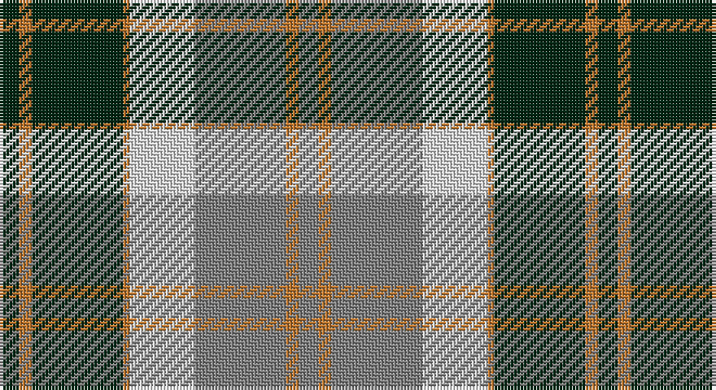

This page is one **sett** — a single exact thread-count. It belongs to the [tartan](/setts/dg3o2dg14o1w10y14o2y3/)
(the same proportion at any scale), whose colour order is pattern [GRGRWGRG](/stripes/grgrwgrg/).

Part of the [Bannockbane Hunting](/tartans/bannockbane-hunting/) tartan — the named design grouping this sett with its other cloths.

Sourced from register-of-tartans.  It is a [8 stripe tartan](/stripes/stripes8/).

Original link https://www.tartanregister.gov.uk/tartanDetails.aspx?ref=201

## Also known as

This cloth is also recorded under:

- Bannockbane, hunting

## Register references

External register numbers recorded for this tartan.

- Scottish Register of Tartans: [201](https://www.tartanregister.gov.uk/tartanDetails.aspx?ref=201)
- Scottish Tartans World Register: 2793

## Thread count
DG/6 DO4 DG28 DO2 LN20 N28 DO4 N/6

One full sett is **184 threads**.

## Palette

Palette: <strong>Tartan Register</strong>
<table><thead><tr><th>Colour</th><th>Threads</th><th>Shade</th><th>Base</th><th>OKLCh</th></tr></thead><tbody><tr><td>DG/</td><td style="text-align:right;font-variant-numeric:tabular-nums">6</td><td><code style="background-color:#002814;">#002814</code> <small style="color:#888">#002814</small></td><td>G <code style="background-color:#006100;">#006100</code></td><td><small style="color:#888">oklch(24.4% 0.059 156.5)</small></td></tr><tr><td>DO</td><td style="text-align:right;font-variant-numeric:tabular-nums">4</td><td><code style="background-color:#BE7832;">#BE7832</code> <small style="color:#888">#BE7832</small></td><td>R <code style="background-color:#CC0000;">#CC0000</code></td><td><small style="color:#888">oklch(63.5% 0.121 62.2)</small></td></tr><tr><td>DG</td><td style="text-align:right;font-variant-numeric:tabular-nums">28</td><td><code style="background-color:#002814;">#002814</code> <small style="color:#888">#002814</small></td><td>G <code style="background-color:#006100;">#006100</code></td><td><small style="color:#888">oklch(24.4% 0.059 156.5)</small></td></tr><tr><td>DO</td><td style="text-align:right;font-variant-numeric:tabular-nums">2</td><td><code style="background-color:#BE7832;">#BE7832</code> <small style="color:#888">#BE7832</small></td><td>R <code style="background-color:#CC0000;">#CC0000</code></td><td><small style="color:#888">oklch(63.5% 0.121 62.2)</small></td></tr><tr><td>LN</td><td style="text-align:right;font-variant-numeric:tabular-nums">20</td><td><code style="background-color:#E0E0E0;">#E0E0E0</code> <small style="color:#888">#E0E0E0</small></td><td>W <code style="background-color:#F7F7F7;">#F7F7F7</code></td><td><small style="color:#888">oklch(90.7% 0.000 89.9)</small></td></tr><tr><td>N</td><td style="text-align:right;font-variant-numeric:tabular-nums">28</td><td><code style="background-color:#808080;">#808080</code> <small style="color:#888">#808080</small></td><td>G <code style="background-color:#006100;">#006100</code></td><td><small style="color:#888">oklch(60.0% 0.000 89.9)</small></td></tr><tr><td>DO</td><td style="text-align:right;font-variant-numeric:tabular-nums">4</td><td><code style="background-color:#BE7832;">#BE7832</code> <small style="color:#888">#BE7832</small></td><td>R <code style="background-color:#CC0000;">#CC0000</code></td><td><small style="color:#888">oklch(63.5% 0.121 62.2)</small></td></tr><tr><td>N/</td><td style="text-align:right;font-variant-numeric:tabular-nums">6</td><td><code style="background-color:#808080;">#808080</code> <small style="color:#888">#808080</small></td><td>G <code style="background-color:#006100;">#006100</code></td><td><small style="color:#888">oklch(60.0% 0.000 89.9)</small></td></tr></tbody></table>

# Sample pattern

## Compared to the master

This cloth is one sett of its design; the master sett (the exemplar the design is anchored on) is below for comparison.

<figure style="margin:0"><figcaption style="color:#888;font-size:smaller">this sett</figcaption></figure>
<figure style="margin:0"><figcaption style="color:#888;font-size:smaller"><a href="/setts/dg2dy2dg15dy1w1dg15dy2dg2/">master sett →</a></figcaption></figure>

## Nearest tartans

The nearest existing variants by ΔTartan distance, with this tartan at the top so the swatches line up against it.

ΔTartan

Tartan

Sett

—

<a href="/ttd/edit/#slug=dg3o2dg14o1w10y14o2y3~x2">Bannockbane Hunting (MacBean and Bishop)</a> <a class="nn-out" href="/variants/s8/dg3o2dg14o1w10y14o2y3~x2/" title="open its dictionary page">↗</a>

0.69

<a href="/ttd/edit/#slug=k4ly2k13ly1w8o13ly2o4~x2&amp;base=dg3o2dg14o1w10y14o2y3~x2">Bannockbane Grey #1</a> <a class="nn-out" href="/variants/s8/k4ly2k13ly1w8o13ly2o4~x2/" title="open its dictionary page">↗</a>

0.69

<a href="/ttd/edit/#slug=dg2dr8dg8o3dr1w12dg2dr1~x2&amp;base=dg3o2dg14o1w10y14o2y3~x2">National Trust</a> <a class="nn-out" href="/variants/s8/dg2dr8dg8o3dr1w12dg2dr1~x2/" title="open its dictionary page">↗</a>

0.71

<a href="/ttd/edit/#slug=dr4ly2dr13ly1w8t13ly2t4~x2&amp;base=dg3o2dg14o1w10y14o2y3~x2">Bannockbane, Dark Tan</a> <a class="nn-out" href="/variants/s8/dr4ly2dr13ly1w8t13ly2t4~x2/" title="open its dictionary page">↗</a>

0.74

<a href="/ttd/edit/#slug=g2do8g8lo3do1w12g2do1~x2&amp;base=dg3o2dg14o1w10y14o2y3~x2">National Trust</a> <a class="nn-out" href="/variants/s8/g2do8g8lo3do1w12g2do1~x2/" title="open its dictionary page">↗</a>

0.74

<a href="/ttd/edit/#slug=do4ly2do13ly1w13t13ly2t4~x2&amp;base=dg3o2dg14o1w10y14o2y3~x2">Bannockbane Tan</a> <a class="nn-out" href="/variants/s8/do4ly2do13ly1w13t13ly2t4~x2/" title="open its dictionary page">↗</a>

0.80

<a href="/ttd/edit/#slug=k4ly2k13ly1w8lo13ly2lo4~x2&amp;base=dg3o2dg14o1w10y14o2y3~x2">Bannockbane Light Tan</a> <a class="nn-out" href="/variants/s8/k4ly2k13ly1w8lo13ly2lo4~x2/" title="open its dictionary page">↗</a>

0.93

<a href="/ttd/edit/#slug=ly6k6y30k8lb18k6ly3~x2&amp;base=dg3o2dg14o1w10y14o2y3~x2">Cape Breton (yellow stripes)</a> <a class="nn-out" href="/variants/s7/ly6k6y30k8lb18k6ly3~x2/" title="open its dictionary page">↗</a>

0.98

<a href="/ttd/edit/#slug=db4dy3db21dy2w14o22dy3o4~x2&amp;base=dg3o2dg14o1w10y14o2y3~x2">Bannock Bane M.407</a> <a class="nn-out" href="/variants/s8/db4dy3db21dy2w14o22dy3o4~x2/" title="open its dictionary page">↗</a>

0.98

<a href="/ttd/edit/#slug=r3g2k1g20k9lb20k1lb2r3~x2&amp;base=dg3o2dg14o1w10y14o2y3~x2">Ayrton (1978) (Personal)</a> <a class="nn-out" href="/variants/s9/r3g2k1g20k9lb20k1lb2r3~x2/" title="open its dictionary page">↗</a>

0.99

<a href="/ttd/edit/#slug=k3g2k10w11g1dy10g2dy3~x6&amp;base=dg3o2dg14o1w10y14o2y3~x2">Dalveen (1981)</a> <a class="nn-out" href="/variants/s8/k3g2k10w11g1dy10g2dy3~x6/" title="open its dictionary page">↗</a>

## Neighbour map

Every grey dot is one of 14360 variants placed by the first two principal components of the ΔTartan feature space (44% of its variance). Red is this tartan; blue dots are its nearest — click one to open its page.

<svg viewBox="0 0 640 380" role="img" style="max-width:100%;height:auto;border:1px solid #e0e0e0;border-radius:4px;display:block" xmlns="http://www.w3.org/2000/svg"><image href="/nn/cloud.v1.png" width="640" height="380"/><a href="/variants/s8/k4ly2k13ly1w8o13ly2o4~x2/"><circle cx="151.5" cy="167.9" r="4" fill="#3465a4"><title>Bannockbane Grey #1</title></circle></a><a href="/variants/s8/dg2dr8dg8o3dr1w12dg2dr1~x2/"><circle cx="143.4" cy="169.9" r="4" fill="#3465a4"><title>National Trust</title></circle></a><a href="/variants/s8/dr4ly2dr13ly1w8t13ly2t4~x2/"><circle cx="163.3" cy="171.8" r="4" fill="#3465a4"><title>Bannockbane, Dark Tan</title></circle></a><a href="/variants/s8/g2do8g8lo3do1w12g2do1~x2/"><circle cx="144.5" cy="170.4" r="4" fill="#3465a4"><title>National Trust</title></circle></a><a href="/variants/s8/do4ly2do13ly1w13t13ly2t4~x2/"><circle cx="141.7" cy="168.9" r="4" fill="#3465a4"><title>Bannockbane Tan</title></circle></a><a href="/variants/s8/k4ly2k13ly1w8lo13ly2lo4~x2/"><circle cx="156.6" cy="169.1" r="4" fill="#3465a4"><title>Bannockbane Light Tan</title></circle></a><a href="/variants/s7/ly6k6y30k8lb18k6ly3~x2/"><circle cx="147.5" cy="180.5" r="4" fill="#3465a4"><title>Cape Breton (yellow stripes)</title></circle></a><a href="/variants/s8/db4dy3db21dy2w14o22dy3o4~x2/"><circle cx="158.8" cy="167.8" r="4" fill="#3465a4"><title>Bannock Bane M.407</title></circle></a><a href="/variants/s9/r3g2k1g20k9lb20k1lb2r3~x2/"><circle cx="204.5" cy="136.2" r="4" fill="#3465a4"><title>Ayrton (1978) (Personal)</title></circle></a><a href="/variants/s8/k3g2k10w11g1dy10g2dy3~x6/"><circle cx="125.8" cy="182.7" r="4" fill="#3465a4"><title>Dalveen (1981)</title></circle></a><circle cx="167.2" cy="168.1" r="5" fill="#c00000"/></svg>

ID: /variants/s8/dg3o2dg14o1w10y14o2y3~x2/
