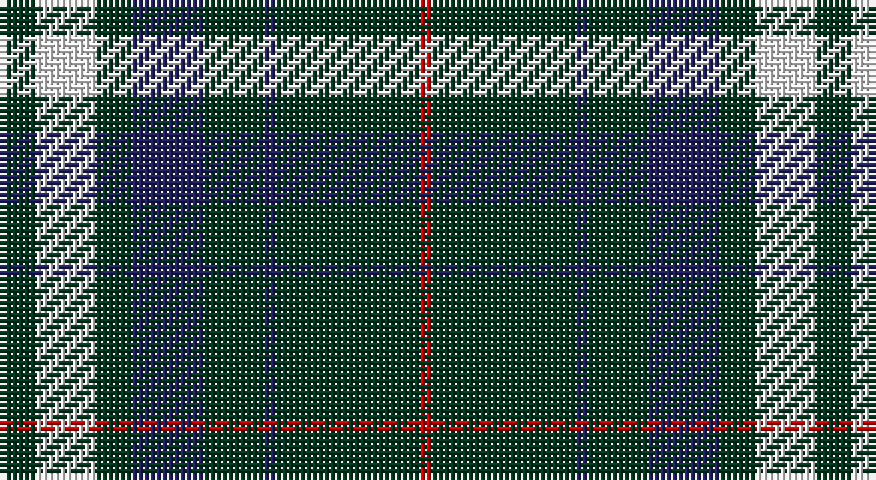

This page is one **sett** — a single exact thread-count. It belongs to the [tartan](/setts/dg3w5dg3db6dg5db1dg12r1/)
(the same proportion at any scale), whose colour order is pattern [GWGBGBGR](/stripes/gwgbgbgr/).

Part of the [Hasegawa](/tartans/hasegawa/) tartan — the named design grouping this sett with its other cloths.

Sourced from tartans-authority.  It is a [8 stripe tartan](/stripes/stripes8/).

Original link http://www.tartansauthority.com/tartan-ferret/display/10889/

## Register references

External register numbers recorded for this tartan.

- Scottish Register of Tartans: [10889](https://www.tartanregister.gov.uk/tartanDetails?ref=10889)
- Scottish Tartans Authority (ITI): 10889

## Thread count
DG/6 W10 DG6 DB12 DG10 DB2 DG24 R/2

One full sett is **136 threads**.

## Palette

Palette: <strong>Tartan Register</strong>
<table><thead><tr><th>Colour</th><th>Threads</th><th>Shade</th><th>Base</th><th>OKLCh</th></tr></thead><tbody><tr><td>DG/</td><td style="text-align:right;font-variant-numeric:tabular-nums">6</td><td><code style="background-color:#003820;">#003820</code> <small style="color:#888">#003820</small></td><td>G <code style="background-color:#006100;">#006100</code></td><td><small style="color:#888">oklch(30.0% 0.070 158.3)</small></td></tr><tr><td>W</td><td style="text-align:right;font-variant-numeric:tabular-nums">10</td><td><code style="background-color:#FCFCFC;">#FCFCFC</code> <small style="color:#888">#FCFCFC</small></td><td>W <code style="background-color:#F7F7F7;">#F7F7F7</code></td><td><small style="color:#888">oklch(99.1% 0.000 89.9)</small></td></tr><tr><td>DG</td><td style="text-align:right;font-variant-numeric:tabular-nums">6</td><td><code style="background-color:#003820;">#003820</code> <small style="color:#888">#003820</small></td><td>G <code style="background-color:#006100;">#006100</code></td><td><small style="color:#888">oklch(30.0% 0.070 158.3)</small></td></tr><tr><td>DB</td><td style="text-align:right;font-variant-numeric:tabular-nums">12</td><td><code style="background-color:#202060;">#202060</code> <small style="color:#888">#202060</small></td><td>B <code style="background-color:#2A418A;">#2A418A</code></td><td><small style="color:#888">oklch(28.9% 0.111 276.9)</small></td></tr><tr><td>DG</td><td style="text-align:right;font-variant-numeric:tabular-nums">10</td><td><code style="background-color:#003820;">#003820</code> <small style="color:#888">#003820</small></td><td>G <code style="background-color:#006100;">#006100</code></td><td><small style="color:#888">oklch(30.0% 0.070 158.3)</small></td></tr><tr><td>DB</td><td style="text-align:right;font-variant-numeric:tabular-nums">2</td><td><code style="background-color:#202060;">#202060</code> <small style="color:#888">#202060</small></td><td>B <code style="background-color:#2A418A;">#2A418A</code></td><td><small style="color:#888">oklch(28.9% 0.111 276.9)</small></td></tr><tr><td>DG</td><td style="text-align:right;font-variant-numeric:tabular-nums">24</td><td><code style="background-color:#003820;">#003820</code> <small style="color:#888">#003820</small></td><td>G <code style="background-color:#006100;">#006100</code></td><td><small style="color:#888">oklch(30.0% 0.070 158.3)</small></td></tr><tr><td>R/</td><td style="text-align:right;font-variant-numeric:tabular-nums">2</td><td><code style="background-color:#C80000;">#C80000</code> <small style="color:#888">#C80000</small></td><td>R <code style="background-color:#CC0000;">#CC0000</code></td><td><small style="color:#888">oklch(52.3% 0.215 29.2)</small></td></tr></tbody></table>

# Sample pattern

## Compared to the master

This cloth is one sett of its design; the master sett (the exemplar the design is anchored on) is below for comparison.

<figure style="margin:0"><figcaption style="color:#888;font-size:smaller">this sett</figcaption></figure>
<figure style="margin:0"><figcaption style="color:#888;font-size:smaller"><a href="/setts/dg3w5dg3t6dg5t1dg12r1/">master sett →</a></figcaption></figure>

## Nearest tartans

The nearest existing variants by ΔTartan distance, with this tartan at the top so the swatches line up against it.

ΔTartan

Tartan

Sett

—

<a href="/ttd/edit/#slug=dg3w5dg3db6dg5db1dg12r1~x2">Hasegawa (Akasaka) (Personal)</a> <a class="nn-out" href="/variants/s8/dg3w5dg3db6dg5db1dg12r1~x2/" title="open its dictionary page">↗</a>

0.81

<a href="/ttd/edit/#slug=dg3w5dg3t6dg5t1dg12r1~x2&amp;base=dg3w5dg3db6dg5db1dg12r1~x2">Hasegawa (Akasaka) (Personal)</a> <a class="nn-out" href="/variants/s8/dg3w5dg3t6dg5t1dg12r1~x2/" title="open its dictionary page">↗</a>

1.06

<a href="/ttd/edit/#slug=k16g15k4t12k22w2k6~x2&amp;base=dg3w5dg3db6dg5db1dg12r1~x2">Frame (Edinburgh) (Personal)</a> <a class="nn-out" href="/variants/s7/k16g15k4t12k22w2k6~x2/" title="open its dictionary page">↗</a>

1.09

<a href="/ttd/edit/#slug=k36w3k10w3g28r6k18~x2&amp;base=dg3w5dg3db6dg5db1dg12r1~x2">Wild Highlanders (Corporate)</a> <a class="nn-out" href="/variants/s7/k36w3k10w3g28r6k18~x2/" title="open its dictionary page">↗</a>

1.10

<a href="/ttd/edit/#slug=k16w15k4dt12k22r2k6~x2&amp;base=dg3w5dg3db6dg5db1dg12r1~x2">Sanley-Cantamessa (Personal)</a> <a class="nn-out" href="/variants/s7/k16w15k4dt12k22r2k6~x2/" title="open its dictionary page">↗</a>

1.17

<a href="/ttd/edit/#slug=k10n2lb5k5r1k5lb5n2k10r1~x4&amp;base=dg3w5dg3db6dg5db1dg12r1~x2">Callaway Corporate Tartan</a> <a class="nn-out" href="/variants/s10/k10n2lb5k5r1k5lb5n2k10r1~x4/" title="open its dictionary page">↗</a>

1.24

<a href="/ttd/edit/#slug=ly2dg12db6r3dg12r4db1&amp;base=dg3w5dg3db6dg5db1dg12r1~x2">MacKintosh Hunting</a> <a class="nn-out" href="/variants/s7/ly2dg12db6r3dg12r4db1/" title="open its dictionary page">↗</a>

1.25

<a href="/ttd/edit/#slug=dg13r1dg13t6r1w6dg13r1dg13w6r1t6~x2&amp;base=dg3w5dg3db6dg5db1dg12r1~x2">McGirr, David (Letterkenny)</a> <a class="nn-out" href="/variants/s12/dg13r1dg13t6r1w6dg13r1dg13w6r1t6~x2/" title="open its dictionary page">↗</a>

1.29

<a href="/ttd/edit/#slug=k16w15k4db12k22r2k6~x2&amp;base=dg3w5dg3db6dg5db1dg12r1~x2">Sanley-Cantamessa</a> <a class="nn-out" href="/variants/s7/k16w15k4db12k22r2k6~x2/" title="open its dictionary page">↗</a>

1.30

<a href="/ttd/edit/#slug=r1k10n2lb5k5r1~x4&amp;base=dg3w5dg3db6dg5db1dg12r1~x2">Callaway (Corporate)</a> <a class="nn-out" href="/variants/s6/r1k10n2lb5k5r1~x4/" title="open its dictionary page">↗</a>

1.34

<a href="/ttd/edit/#slug=k11w1k1w1k4o8r1~x8&amp;base=dg3w5dg3db6dg5db1dg12r1~x2">Dunfermline Athletic (2008) (Corp)</a> <a class="nn-out" href="/variants/s7/k11w1k1w1k4o8r1~x8/" title="open its dictionary page">↗</a>

## Neighbour map

Every grey dot is one of 14360 variants placed by the first two principal components of the ΔTartan feature space (44% of its variance). Red is this tartan; blue dots are its nearest — click one to open its page.

<svg viewBox="0 0 640 380" role="img" style="max-width:100%;height:auto;border:1px solid #e0e0e0;border-radius:4px;display:block" xmlns="http://www.w3.org/2000/svg"><image href="/nn/cloud.v1.png" width="640" height="380"/><a href="/variants/s8/dg3w5dg3t6dg5t1dg12r1~x2/"><circle cx="311.2" cy="199.7" r="4" fill="#3465a4"><title>Hasegawa (Akasaka) (Personal)</title></circle></a><a href="/variants/s7/k16g15k4t12k22w2k6~x2/"><circle cx="305.1" cy="233.6" r="4" fill="#3465a4"><title>Frame (Edinburgh) (Personal)</title></circle></a><a href="/variants/s7/k36w3k10w3g28r6k18~x2/"><circle cx="328.7" cy="209.9" r="4" fill="#3465a4"><title>Wild Highlanders (Corporate)</title></circle></a><a href="/variants/s7/k16w15k4dt12k22r2k6~x2/"><circle cx="277.0" cy="212.3" r="4" fill="#3465a4"><title>Sanley-Cantamessa (Personal)</title></circle></a><a href="/variants/s10/k10n2lb5k5r1k5lb5n2k10r1~x4/"><circle cx="307.9" cy="200.3" r="4" fill="#3465a4"><title>Callaway Corporate Tartan</title></circle></a><a href="/variants/s7/ly2dg12db6r3dg12r4db1/"><circle cx="301.7" cy="210.3" r="4" fill="#3465a4"><title>MacKintosh Hunting</title></circle></a><a href="/variants/s12/dg13r1dg13t6r1w6dg13r1dg13w6r1t6~x2/"><circle cx="317.0" cy="179.5" r="4" fill="#3465a4"><title>McGirr, David (Letterkenny)</title></circle></a><a href="/variants/s7/k16w15k4db12k22r2k6~x2/"><circle cx="278.4" cy="212.5" r="4" fill="#3465a4"><title>Sanley-Cantamessa</title></circle></a><a href="/variants/s6/r1k10n2lb5k5r1~x4/"><circle cx="308.7" cy="209.9" r="4" fill="#3465a4"><title>Callaway (Corporate)</title></circle></a><a href="/variants/s7/k11w1k1w1k4o8r1~x8/"><circle cx="311.1" cy="183.5" r="4" fill="#3465a4"><title>Dunfermline Athletic (2008) (Corp)</title></circle></a><circle cx="311.2" cy="201.7" r="5" fill="#c00000"/></svg>

ID: /variants/s8/dg3w5dg3db6dg5db1dg12r1~x2/
