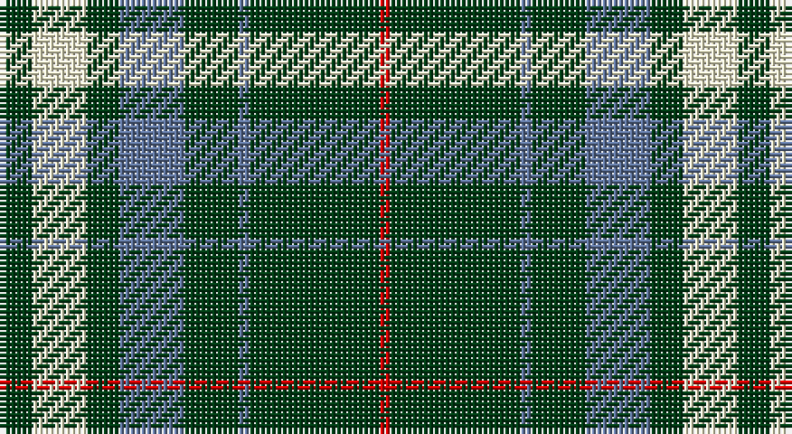

This page is one **sett** — a single exact thread-count. It belongs to the [tartan](/setts/dg3w5dg3t6dg5t1dg12r1/)
(the same proportion at any scale), whose colour order is pattern [GWGBGBGR](/stripes/gwgbgbgr/).

Part of the [Hasegawa](/tartans/hasegawa/) tartan — the named design grouping this sett with its other cloths.

Sourced from register-of-tartans.  It is a [8 stripe tartan](/stripes/stripes8/).

Original link https://www.tartanregister.gov.uk/tartanDetails.aspx?ref=10889

## Register references

External register numbers recorded for this tartan.

- Scottish Register of Tartans: [10889](https://www.tartanregister.gov.uk/tartanDetails.aspx?ref=10889)

## Thread count
DG/6 LY10 DG6 B12 DG10 B2 DG24 R/2

One full sett is **136 threads**.

## Palette

Palette: <strong>Tartan Register</strong> <small style="color:#888">(3 of 4 colours)</small>
<table><thead><tr><th>Colour</th><th>Threads</th><th>Shade</th><th>Base</th><th>OKLCh</th></tr></thead><tbody><tr><td>DG/</td><td style="text-align:right;font-variant-numeric:tabular-nums">6</td><td><code style="background-color:#003C14;">#003C14</code> <small style="color:#888">#003C14</small></td><td>G <code style="background-color:#006100;">#006100</code></td><td><small style="color:#888">oklch(31.1% 0.089 148.5)</small></td></tr><tr><td>LY</td><td style="text-align:right;font-variant-numeric:tabular-nums">10</td><td><code style="background-color:#F8F4D0;">#F8F4D0</code> <small style="color:#888">#F8F4D0</small></td><td>W <code style="background-color:#F7F7F7;">#F7F7F7</code></td><td><small style="color:#888">oklch(96.1% 0.047 102.0)</small></td></tr><tr><td>DG</td><td style="text-align:right;font-variant-numeric:tabular-nums">6</td><td><code style="background-color:#003C14;">#003C14</code> <small style="color:#888">#003C14</small></td><td>G <code style="background-color:#006100;">#006100</code></td><td><small style="color:#888">oklch(31.1% 0.089 148.5)</small></td></tr><tr><td>B</td><td style="text-align:right;font-variant-numeric:tabular-nums">12</td><td><code style="background-color:#5F749C;">#5F749C</code> <small style="color:#888">#5F749C</small></td><td>B <code style="background-color:#2A418A;">#2A418A</code></td><td><small style="color:#888">oklch(55.8% 0.067 262.9)</small></td></tr><tr><td>DG</td><td style="text-align:right;font-variant-numeric:tabular-nums">10</td><td><code style="background-color:#003C14;">#003C14</code> <small style="color:#888">#003C14</small></td><td>G <code style="background-color:#006100;">#006100</code></td><td><small style="color:#888">oklch(31.1% 0.089 148.5)</small></td></tr><tr><td>B</td><td style="text-align:right;font-variant-numeric:tabular-nums">2</td><td><code style="background-color:#5F749C;">#5F749C</code> <small style="color:#888">#5F749C</small></td><td>B <code style="background-color:#2A418A;">#2A418A</code></td><td><small style="color:#888">oklch(55.8% 0.067 262.9)</small></td></tr><tr><td>DG</td><td style="text-align:right;font-variant-numeric:tabular-nums">24</td><td><code style="background-color:#003C14;">#003C14</code> <small style="color:#888">#003C14</small></td><td>G <code style="background-color:#006100;">#006100</code></td><td><small style="color:#888">oklch(31.1% 0.089 148.5)</small></td></tr><tr><td>R/</td><td style="text-align:right;font-variant-numeric:tabular-nums">2</td><td><code style="background-color:#DC0000;">#DC0000</code> <small style="color:#888">#DC0000</small></td><td>R <code style="background-color:#CC0000;">#CC0000</code></td><td><small style="color:#888">oklch(56.2% 0.230 29.2)</small></td></tr></tbody></table>

# Sample pattern

## Nearest tartans

The nearest existing variants by ΔTartan distance, with this tartan at the top so the swatches line up against it.

ΔTartan

Tartan

Sett

—

<a href="/ttd/edit/#slug=dg3w5dg3t6dg5t1dg12r1~x2">Hasegawa (Akasaka) (Personal)</a> <a class="nn-out" href="/variants/s8/dg3w5dg3t6dg5t1dg12r1~x2/" title="open its dictionary page">↗</a>

0.81

<a href="/ttd/edit/#slug=dg3w5dg3db6dg5db1dg12r1~x2&amp;base=dg3w5dg3t6dg5t1dg12r1~x2">Hasegawa (Akasaka) (Personal)</a> <a class="nn-out" href="/variants/s8/dg3w5dg3db6dg5db1dg12r1~x2/" title="open its dictionary page">↗</a>

0.98

<a href="/ttd/edit/#slug=dg13r1dg13t6r1w6dg13r1dg13w6r1t6~x2&amp;base=dg3w5dg3t6dg5t1dg12r1~x2">McGirr, David (Letterkenny)</a> <a class="nn-out" href="/variants/s12/dg13r1dg13t6r1w6dg13r1dg13w6r1t6~x2/" title="open its dictionary page">↗</a>

0.99

<a href="/ttd/edit/#slug=ly2dg12db6r3dg12r4db1&amp;base=dg3w5dg3t6dg5t1dg12r1~x2">MacKintosh Hunting</a> <a class="nn-out" href="/variants/s7/ly2dg12db6r3dg12r4db1/" title="open its dictionary page">↗</a>

1.31

<a href="/ttd/edit/#slug=w2g12k3g3k16g3k3g12ly2~x2&amp;base=dg3w5dg3t6dg5t1dg12r1~x2">MacIver Hunting</a> <a class="nn-out" href="/variants/s9/w2g12k3g3k16g3k3g12ly2~x2/" title="open its dictionary page">↗</a>

1.34

<a href="/ttd/edit/#slug=g3w1g12r6g3k3g2~x4&amp;base=dg3w5dg3t6dg5t1dg12r1~x2">Arkansas</a> <a class="nn-out" href="/variants/s7/g3w1g12r6g3k3g2~x4/" title="open its dictionary page">↗</a>

1.35

<a href="/ttd/edit/#slug=g99db20w8db30ly8db10ly8g46&amp;base=dg3w5dg3t6dg5t1dg12r1~x2">Duke of York Hunting</a> <a class="nn-out" href="/variants/s8/g99db20w8db30ly8db10ly8g46/" title="open its dictionary page">↗</a>

1.41

<a href="/ttd/edit/#slug=g4db12r3db12g32w4~x2&amp;base=dg3w5dg3t6dg5t1dg12r1~x2">MacIntyre Hunting (VS)</a> <a class="nn-out" href="/variants/s6/g4db12r3db12g32w4~x2/" title="open its dictionary page">↗</a>

1.43

<a href="/ttd/edit/#slug=ly2g12db6r3g12r4db1~x2&amp;base=dg3w5dg3t6dg5t1dg12r1~x2">MacKintosh Hunting</a> <a class="nn-out" href="/variants/s7/ly2g12db6r3g12r4db1~x2/" title="open its dictionary page">↗</a>

1.43

<a href="/ttd/edit/#slug=g13k3g34k6db16r2db16k3g13~x2&amp;base=dg3w5dg3t6dg5t1dg12r1~x2">Lockhart</a> <a class="nn-out" href="/variants/s9/g13k3g34k6db16r2db16k3g13~x2/" title="open its dictionary page">↗</a>

1.45

<a href="/ttd/edit/#slug=k5g2k5g2db8g25w4~x2&amp;base=dg3w5dg3t6dg5t1dg12r1~x2">Keppoch</a> <a class="nn-out" href="/variants/s7/k5g2k5g2db8g25w4~x2/" title="open its dictionary page">↗</a>

## Neighbour map

Every grey dot is one of 14360 variants placed by the first two principal components of the ΔTartan feature space (44% of its variance). Red is this tartan; blue dots are its nearest — click one to open its page.

<svg viewBox="0 0 640 380" role="img" style="max-width:100%;height:auto;border:1px solid #e0e0e0;border-radius:4px;display:block" xmlns="http://www.w3.org/2000/svg"><image href="/nn/cloud.v1.png" width="640" height="380"/><a href="/variants/s8/dg3w5dg3db6dg5db1dg12r1~x2/"><circle cx="311.2" cy="201.7" r="4" fill="#3465a4"><title>Hasegawa (Akasaka) (Personal)</title></circle></a><a href="/variants/s12/dg13r1dg13t6r1w6dg13r1dg13w6r1t6~x2/"><circle cx="317.0" cy="179.5" r="4" fill="#3465a4"><title>McGirr, David (Letterkenny)</title></circle></a><a href="/variants/s7/ly2dg12db6r3dg12r4db1/"><circle cx="301.7" cy="210.3" r="4" fill="#3465a4"><title>MacKintosh Hunting</title></circle></a><a href="/variants/s9/w2g12k3g3k16g3k3g12ly2~x2/"><circle cx="273.3" cy="206.0" r="4" fill="#3465a4"><title>MacIver Hunting</title></circle></a><a href="/variants/s7/g3w1g12r6g3k3g2~x4/"><circle cx="366.3" cy="209.2" r="4" fill="#3465a4"><title>Arkansas</title></circle></a><a href="/variants/s8/g99db20w8db30ly8db10ly8g46/"><circle cx="356.4" cy="188.8" r="4" fill="#3465a4"><title>Duke of York Hunting</title></circle></a><a href="/variants/s6/g4db12r3db12g32w4~x2/"><circle cx="294.7" cy="211.8" r="4" fill="#3465a4"><title>MacIntyre Hunting (VS)</title></circle></a><a href="/variants/s7/ly2g12db6r3g12r4db1~x2/"><circle cx="322.1" cy="217.6" r="4" fill="#3465a4"><title>MacKintosh Hunting</title></circle></a><a href="/variants/s9/g13k3g34k6db16r2db16k3g13~x2/"><circle cx="289.4" cy="185.4" r="4" fill="#3465a4"><title>Lockhart</title></circle></a><a href="/variants/s7/k5g2k5g2db8g25w4~x2/"><circle cx="296.9" cy="187.5" r="4" fill="#3465a4"><title>Keppoch</title></circle></a><circle cx="311.2" cy="199.7" r="5" fill="#c00000"/></svg>

ID: /variants/s8/dg3w5dg3t6dg5t1dg12r1~x2/
