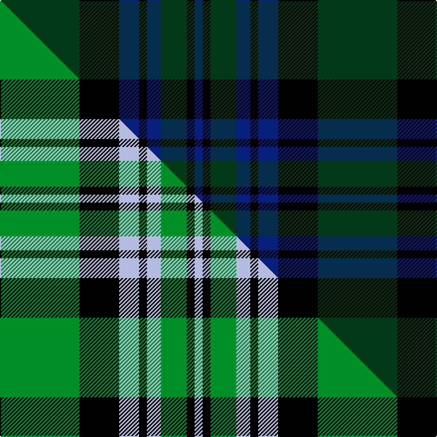

This page is one **sett** — a single exact thread-count. It belongs to the [tartan](/setts/dg40k20db10k4db7dg13k4db4/)
(the same proportion at any scale), whose colour order is pattern [BKGBKBKG](/stripes/bkgbkbkg/).

Part of the [Letham](/tartans/letham/) tartan — the named design grouping this sett with its other cloths.

Sourced from house-of-tartan.  It is a [8 stripe tartan](/stripes/stripes8/).

Original link [http://www.house-of-tartan.scotland.net/house/TartanViewjs.asp?colr=Def&tnam=6718](http://www.house-of-tartan.scotland.net/house/TartanViewjs.asp?colr=Def&tnam=6718)

## Provenance

Earliest known date: pre 2005 Jimmy said, in his recording application, "To allow my family to wear a single tartan"

Dataset <small>— provenance for this record, inherited from the source manifest</small>

<dl class="dataset-prov">
<dt>source</dt><dd><a href="/sources/house-of-tartan/">House of Tartan</a></dd>
<dt>data captured from</dt><dd><a href="https://github.com/thetartan/tartan-database/blob/master/data/house-of-tartan/data.csv">https://github.com/thetartan/tartan-database/blob/master/data/house-of-tartan/data.csv</a></dd>
<dt>data date</dt><dd>2017-01-10 <small>(dataset default)</small></dd>
<dt>licence</dt><dd><a href="https://creativecommons.org/licenses/by-nc-nd/4.0/">CC BY-NC-ND 4.0</a></dd>
</dl>

Capture chain <small>— the hands this data passed through, oldest first; each capture carries its own licence</small>

<ol class="capture-chain">
<li><a href="http://www.house-of-tartan.scotland.net/">House of Tartan</a> <small>the weaver/retailer's database — the site is now offline; the URL is kept as the ultimate source's identity</small></li>
<li><a href="https://github.com/thetartan/tartan-database">thetartan/tartan-database</a> <small>2016-2017</small> · <a href="https://creativecommons.org/licenses/by-nc-nd/4.0/">CC BY-NC-ND 4.0</a> <small>Levko Kravets's frozen compilation — the capture we vendored, and where its CC licence text came from</small></li>
<li>this dictionary <small>captured 2026-06-10 · commit 5bf86c7566</small> <small>each re-capture is a git commit to data/sources</small></li>
</ol>

## Thread count
DG/80 K40 DB20 K8 DB14 DG26 K8 DB/8

One full sett is **320 threads**.

## Palette
<table><thead><tr><th>Colour</th><th>Shade</th><th>OKLCh</th></tr></thead><tbody><tr><td>DB</td><td><code style="background-color:#082077;">#082077</code> <small style="color:#888">#082077</small></td><td><small style="color:#888">oklch(30.0% 0.149 265.1)</small></td></tr><tr><td>DG</td><td><code style="background-color:#053819;">#053819</code> <small style="color:#888">#053819</small></td><td><small style="color:#888">oklch(30.0% 0.075 151.3)</small></td></tr><tr><td>K</td><td><code style="background-color:#000000;">#000000</code> <small style="color:#888">#000000</small></td><td><small style="color:#888">oklch(0.0% 0.000 0.0)</small></td></tr></tbody></table>

# Sample pattern

## Compared to the master

This cloth is one sett of its design; the master sett (the exemplar the design is anchored on) is below for comparison.

Its **ΔTartan distance** from the master is **0.23** — the same measure the nearest-tartans table ranks by (0 is identical; a re-scale of the same cloth is near 0, a recolour or a different proportion further).

<figure class="master-compare" style="margin:0">

this sett
master sett ★

<figcaption style="color:#888;font-size:smaller">One weave of this sett against the <a href="/setts/g40k20lb10k4lb7g13k4lb4/">master sett ★</a>, split on the diagonal: a shared proportion runs seamlessly across it with only the shades shifting; a different proportion breaks on it.</figcaption>
</figure>

## Nearest tartan variants

The nearest existing variants by ΔTartan distance, with this cloth at the top so the swatches line up against it.

ΔTartan

Threads

Variant

Sett

—

320

<a href="/variants/s8/dg40k20db10k4db7dg13k4db4~x2/">Letham Personal Tartan</a>

<a href="/ttd/edit/#slug=k1db12k12g1k12db12g1~x4&amp;base=dg40k20db10k4db7dg13k4db4~x2" title="compare in the TTD">1.86</a>

400

<a href="/variants/s7/k1db12k12g1k12db12g1~x4/">Marchmont (Personal)</a>

<a href="/ttd/edit/#slug=dg15db8k5db8dg15y3dg15db8k5~x2&amp;base=dg40k20db10k4db7dg13k4db4~x2" title="compare in the TTD">2.02</a>

288

<a href="/variants/s9/dg15db8k5db8dg15y3dg15db8k5~x2/">Dewar, Robert Alexander</a>

<a href="/ttd/edit/#slug=r4dg3k2dg38db30k3db3k3~x2&amp;base=dg40k20db10k4db7dg13k4db4~x2" title="compare in the TTD">2.34</a>

330

<a href="/variants/s8/r4dg3k2dg38db30k3db3k3~x2/">Peter of Lee</a>

<a href="/ttd/edit/#slug=db1k1db8k2ly1dg12ly1db8k1db1~x4&amp;base=dg40k20db10k4db7dg13k4db4~x2" title="compare in the TTD">2.56</a>

280

<a href="/variants/s10/db1k1db8k2ly1dg12ly1db8k1db1~x4/">Rowan (Name)</a>

<a href="/ttd/edit/#slug=dg12k11dg1k1dg1db10dg1k1dg1~x4&amp;base=dg40k20db10k4db7dg13k4db4~x2" title="compare in the TTD">2.64</a>

260

<a href="/variants/s9/dg12k11dg1k1dg1db10dg1k1dg1~x4/">Herron from Ulster (Personal)</a>

<a href="/ttd/edit/#slug=k1b1dg7k8b1k8b1dg2b1k4b1~x4&amp;base=dg40k20db10k4db7dg13k4db4~x2" title="compare in the TTD">2.84</a>

272

<a href="/variants/s11/k1b1dg7k8b1k8b1dg2b1k4b1~x4/">Clergy, or Priest</a>

<a href="/ttd/edit/#slug=k3n6k2n8dt20o3dt2o2dt3~x2~n1900000-o2500000&amp;base=dg40k20db10k4db7dg13k4db4~x2" title="compare in the TTD">3.05</a>

184

<a href="/variants/s9/k3n6k2n8dt20o3dt2o2dt3~x2~n1900000-o2500000/">Scottish Monuments (Corporate)</a>

<a href="/ttd/edit/#slug=k1dg6k6db6k1db1~x4~dg1605139-db1004274&amp;base=dg40k20db10k4db7dg13k4db4~x2" title="compare in the TTD">3.19</a>

160

<a href="/variants/s6/k1dg6k6db6k1db1~x4~dg1605139-db1004274/">Black Watch (smallest sett)</a>

<a href="/ttd/edit/#slug=db4k4db16k14dg14dr3dg3~x2&amp;base=dg40k20db10k4db7dg13k4db4~x2" title="compare in the TTD">3.39</a>

218

<a href="/variants/s7/db4k4db16k14dg14dr3dg3~x2/">Inneryne (Personal)</a>

<a href="/ttd/edit/#slug=db5dg8k1y2k1dg8db4~x4&amp;base=dg40k20db10k4db7dg13k4db4~x2" title="compare in the TTD">3.43</a>

196

<a href="/variants/s7/db5dg8k1y2k1dg8db4~x4/">Salvation Army Htg (Corporate)</a>

## Neighbour map

Every grey dot is one of 13621 variants placed by the first two principal components of the ΔTartan feature space (42% of its variance). Red is this tartan; blue dots are its nearest — click one to open its page.

<svg viewBox="0 0 640 380" role="img" style="max-width:100%;height:auto;border:1px solid #e0e0e0;border-radius:4px;display:block" xmlns="http://www.w3.org/2000/svg"><image href="/nn/cloud.v1.png" width="640" height="380"/><a href="/variants/s7/k1db12k12g1k12db12g1~x4/"><circle cx="311.3" cy="213.5" r="4" fill="#3465a4"><title>Marchmont (Personal)</title></circle></a><a href="/variants/s9/dg15db8k5db8dg15y3dg15db8k5~x2/"><circle cx="293.4" cy="275.0" r="4" fill="#3465a4"><title>Dewar, Robert Alexander</title></circle></a><a href="/variants/s8/r4dg3k2dg38db30k3db3k3~x2/"><circle cx="351.3" cy="159.3" r="4" fill="#3465a4"><title>Peter of Lee</title></circle></a><a href="/variants/s10/db1k1db8k2ly1dg12ly1db8k1db1~x4/"><circle cx="293.2" cy="168.9" r="4" fill="#3465a4"><title>Rowan (Name)</title></circle></a><a href="/variants/s9/dg12k11dg1k1dg1db10dg1k1dg1~x4/"><circle cx="293.1" cy="191.6" r="4" fill="#3465a4"><title>Herron from Ulster (Personal)</title></circle></a><a href="/variants/s11/k1b1dg7k8b1k8b1dg2b1k4b1~x4/"><circle cx="306.0" cy="188.7" r="4" fill="#3465a4"><title>Clergy, or Priest</title></circle></a><a href="/variants/s9/k3n6k2n8dt20o3dt2o2dt3~x2~n1900000-o2500000/"><circle cx="309.8" cy="193.2" r="4" fill="#3465a4"><title>Scottish Monuments (Corporate)</title></circle></a><a href="/variants/s6/k1dg6k6db6k1db1~x4~dg1605139-db1004274/"><circle cx="218.2" cy="253.4" r="4" fill="#3465a4"><title>Black Watch (smallest sett)</title></circle></a><a href="/variants/s7/db4k4db16k14dg14dr3dg3~x2/"><circle cx="199.5" cy="254.8" r="4" fill="#3465a4"><title>Inneryne (Personal)</title></circle></a><a href="/variants/s7/db5dg8k1y2k1dg8db4~x4/"><circle cx="339.4" cy="247.3" r="4" fill="#3465a4"><title>Salvation Army Htg (Corporate)</title></circle></a><circle cx="336.0" cy="218.4" r="5" fill="#c00000"/><text x="320" y="376" text-anchor="middle" font-size="11" fill="#999">ground</text><text x="11" y="190" text-anchor="middle" font-size="11" fill="#999" transform="rotate(-90 11 190)">complexity</text></svg>

ID: /variants/s8/dg40k20db10k4db7dg13k4db4~x2/
