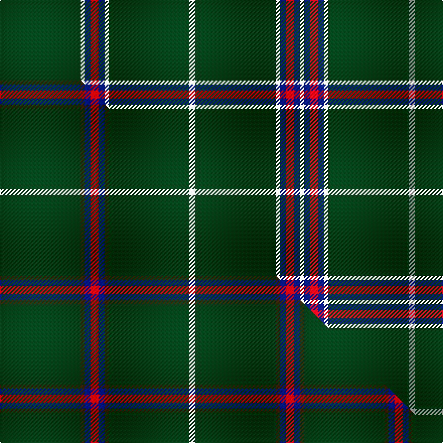

This is one **variant** — a specific cloth: this exact thread count and colourway, with its own
provenance below. It is one weaving of the [sett](/setts/dg40k2db3r4db3k2dg40w3/) (the scale-free proportion — the
same cloth at any scale or shade), whose colour order is pattern [GKBRBKGWGKBRBK](/stripes/gkbrbkgwgkbrbk/).

Part of the [Asher](/tartans/a/as/asher/) tartan — the named design grouping this sett with its other cloths.

Sourced from house-of-tartan.  It is a [14 stripe tartan](/stripes/stripes14/).

Original link [http://www.house-of-tartan.scotland.net/house/TartanViewjs.asp?colr=Def&tnam=3840](http://www.house-of-tartan.scotland.net/house/TartanViewjs.asp?colr=Def&tnam=3840)

## Provenance

Earliest known date: 2002 Designed by Robert Asher of London to recognise his family's Scottish heritage.

Dataset <small>— provenance for this record, inherited from the source manifest</small>

<dl class="dataset-prov">
<dt>source</dt><dd><a href="/sources/house-of-tartan/">House of Tartan</a></dd>
<dt>data captured from</dt><dd><a href="https://github.com/thetartan/tartan-database/blob/master/data/house-of-tartan/data.csv">https://github.com/thetartan/tartan-database/blob/master/data/house-of-tartan/data.csv</a></dd>
<dt>data date</dt><dd>2002 <small>(this record)</small></dd>
<dt>licence</dt><dd><a href="https://creativecommons.org/licenses/by-nc-nd/4.0/">CC BY-NC-ND 4.0</a></dd>
</dl>

Capture chain <small>— the hands this data passed through, oldest first; each capture carries its own licence</small>

<ol class="capture-chain">
<li><a href="http://www.house-of-tartan.scotland.net/">House of Tartan</a> <small>the weaver/retailer's database — the site is now offline; the URL is kept as the ultimate source's identity</small></li>
<li><a href="https://github.com/thetartan/tartan-database">thetartan/tartan-database</a> <small>2016-2017</small> · <a href="https://creativecommons.org/licenses/by-nc-nd/4.0/">CC BY-NC-ND 4.0</a> <small>Levko Kravets's frozen compilation — the capture we vendored, and where its CC licence text came from</small></li>
<li>this dictionary <small>captured 2026-06-10 · commit 5bf86c7566</small> <small>each re-capture is a git commit to data/sources</small></li>
</ol>

## Thread count
DG/80 K4 DB6 R8 DB6 K4 DG80 W6 DG80 K4 DB6 R8 DB6 K/4

One full sett is **520 threads**.

## Palette
<table><thead><tr><th>Colour</th><th>Shade</th><th>OKLCh</th></tr></thead><tbody><tr><td>DB</td><td><code style="background-color:#082077;">#082077</code> <small style="color:#888">#082077</small></td><td><small style="color:#888">oklch(30.0% 0.149 265.1)</small></td></tr><tr><td>DG</td><td><code style="background-color:#053819;">#053819</code> <small style="color:#888">#053819</small></td><td><small style="color:#888">oklch(30.0% 0.075 151.3)</small></td></tr><tr><td>W</td><td><code style="background-color:#F7F7F7;">#F7F7F7</code> <small style="color:#888">#F7F7F7</small></td><td><small style="color:#888">oklch(97.6% 0.000 89.9)</small></td></tr><tr><td>R</td><td><code style="background-color:#D60020;">#D60020</code> <small style="color:#888">#D60020</small></td><td><small style="color:#888">oklch(55.2% 0.224 25.5)</small></td></tr><tr><td>Y</td><td><code style="background-color:#8B6E00;">#8B6E00</code> <small style="color:#888">#8B6E00</small></td><td><small style="color:#888">oklch(55.1% 0.113 90.4)</small></td></tr></tbody></table>

# Sample pattern

## Compared to the master

This cloth is one sett of its design; the master sett (the exemplar the design is anchored on) is below for comparison.

Its **ΔTartan distance** from the master is **0.90** — the same measure the nearest-tartans table ranks by (0 is identical; a re-scale of the same cloth is near 0, a recolour or a different proportion further).

<figure class="master-compare" style="margin:0">

this sett
master sett ★

<figcaption style="color:#888;font-size:smaller">One weave of this sett against the <a href="/setts/dg40dy2db3r4db3dy2dg40w3/">master sett ★</a>, split on the diagonal: a shared proportion runs seamlessly across it with only the shades shifting; a different proportion breaks on it.</figcaption>
</figure>

## Nearest tartan variants

The nearest existing variants by ΔTartan distance, with this cloth at the top so the swatches line up against it.

ΔTartan

Threads

Variant

Sett

—

520

<a href="/variants/s8/dg40k2db3r4db3k2dg40w3~x2/">Asher Personal Tartan</a>

<a href="/ttd/edit/#slug=dg40dy2db3r4db3dy2dg40w3~x2&amp;base=dg40k2db3r4db3k2dg40w3~x2" title="compare in the TTD">0.90</a>

302

<a href="/variants/s8/dg40dy2db3r4db3dy2dg40w3~x2/">Asher (Personal)</a>

<a href="/ttd/edit/#slug=k2w2db8k4dg33r2dg16w2~x2&amp;base=dg40k2db3r4db3k2dg40w3~x2" title="compare in the TTD">1.64</a>

268

<a href="/variants/s8/k2w2db8k4dg33r2dg16w2~x2/">Sarros, Terrence (USA) (Personal)</a>

<a href="/ttd/edit/#slug=dt32dr3dt4k2lo3~x2&amp;base=dg40k2db3r4db3k2dg40w3~x2" title="compare in the TTD">1.98</a>

106

<a href="/variants/s5/dt32dr3dt4k2lo3~x2/">MacLaine of Lochbuie Hunting</a>

<a href="/ttd/edit/#slug=dt68t7dt16k16ly4~x2&amp;base=dg40k2db3r4db3k2dg40w3~x2" title="compare in the TTD">2.00</a>

300

<a href="/variants/s5/dt68t7dt16k16ly4~x2/">Burnett's &amp; Struth (Corporate)</a>

<a href="/ttd/edit/#slug=dg25k1y2k1dg4k1dr2k1dg4k1lr2k1dg25~x4&amp;base=dg40k2db3r4db3k2dg40w3~x2" title="compare in the TTD">2.09</a>

360

<a href="/variants/s13/dg25k1y2k1dg4k1dr2k1dg4k1lr2k1dg25~x4/">Hilton Check</a>

<a href="/ttd/edit/#slug=g4k1dbi9k1g3k1db27r1db27w1r3~x2~dbi1605267-db1004274&amp;base=dg40k2db3r4db3k2dg40w3~x2" title="compare in the TTD">2.12</a>

298

<a href="/variants/s11/g4k1dbi9k1g3k1db27r1db27w1r3~x2~dbi1605267-db1004274/">HMS Neptune</a>

<a href="/ttd/edit/#slug=dg40dr5k2w2k2y3k2dg10dr3k3~x2&amp;base=dg40k2db3r4db3k2dg40w3~x2" title="compare in the TTD">2.22</a>

202

<a href="/variants/s10/dg40dr5k2w2k2y3k2dg10dr3k3~x2/">Palmer, Arnold</a>

<a href="/ttd/edit/#slug=dg40r5k2w2k2y3k2dg10r3k3~x2~dg1605139&amp;base=dg40k2db3r4db3k2dg40w3~x2" title="compare in the TTD">2.25</a>

202

<a href="/variants/s10/dg40r5k2w2k2y3k2dg10r3k3~x2~dg1605139/">Arnold Palmer Corporate Tartan</a>

<a href="/ttd/edit/#slug=o10k2g5k2dg46ly2k2~x2~o2503076-ly2705081&amp;base=dg40k2db3r4db3k2dg40w3~x2" title="compare in the TTD">2.62</a>

252

<a href="/variants/s7/ly10k2g5k2dg46lyi2k2~x2~ly2503076-lyi2705081/">Green Rover (Personal)</a>

<a href="/ttd/edit/#slug=dt40dy10dt8r20dt100w5&amp;base=dg40k2db3r4db3k2dg40w3~x2" title="compare in the TTD">2.90</a>

321

<a href="/variants/s6/dt40dy10dt8r20dt100w5/">East of Scotland Tartan Army</a>

## Neighbour map

Every grey dot is one of 13621 variants placed by the first two principal components of the ΔTartan feature space (42% of its variance). Red is this tartan; blue dots are its nearest — click one to open its page.

<svg viewBox="0 0 640 380" role="img" style="max-width:100%;height:auto;border:1px solid #e0e0e0;border-radius:4px;display:block" xmlns="http://www.w3.org/2000/svg"><image href="/nn/cloud.v1.png" width="640" height="380"/><a href="/variants/s8/dg40dy2db3r4db3dy2dg40w3~x2/"><circle cx="564.8" cy="147.8" r="4" fill="#3465a4"><title>Asher (Personal)</title></circle></a><a href="/variants/s8/k2w2db8k4dg33r2dg16w2~x2/"><circle cx="384.2" cy="130.8" r="4" fill="#3465a4"><title>Sarros, Terrence (USA) (Personal)</title></circle></a><a href="/variants/s5/dt32dr3dt4k2lo3~x2/"><circle cx="549.3" cy="168.5" r="4" fill="#3465a4"><title>MacLaine of Lochbuie Hunting</title></circle></a><a href="/variants/s5/dt68t7dt16k16ly4~x2/"><circle cx="474.5" cy="180.0" r="4" fill="#3465a4"><title>Burnett's &amp; Struth (Corporate)</title></circle></a><a href="/variants/s13/dg25k1y2k1dg4k1dr2k1dg4k1lr2k1dg25~x4/"><circle cx="552.6" cy="93.0" r="4" fill="#3465a4"><title>Hilton Check</title></circle></a><a href="/variants/s11/g4k1dbi9k1g3k1db27r1db27w1r3~x2~dbi1605267-db1004274/"><circle cx="406.7" cy="84.7" r="4" fill="#3465a4"><title>HMS Neptune</title></circle></a><a href="/variants/s10/dg40dr5k2w2k2y3k2dg10dr3k3~x2/"><circle cx="421.1" cy="106.2" r="4" fill="#3465a4"><title>Palmer, Arnold</title></circle></a><a href="/variants/s10/dg40r5k2w2k2y3k2dg10r3k3~x2~dg1605139/"><circle cx="382.9" cy="93.3" r="4" fill="#3465a4"><title>Arnold Palmer Corporate Tartan</title></circle></a><a href="/variants/s7/ly10k2g5k2dg46lyi2k2~x2~ly2503076-lyi2705081/"><circle cx="397.9" cy="114.0" r="4" fill="#3465a4"><title>Green Rover (Personal)</title></circle></a><a href="/variants/s6/dt40dy10dt8r20dt100w5/"><circle cx="550.3" cy="178.4" r="4" fill="#3465a4"><title>East of Scotland Tartan Army</title></circle></a><circle cx="492.1" cy="100.2" r="5" fill="#c00000"/><text x="320" y="376" text-anchor="middle" font-size="11" fill="#999">ground</text><text x="11" y="190" text-anchor="middle" font-size="11" fill="#999" transform="rotate(-90 11 190)">complexity</text></svg>

ID: /variants/s8/dg40k2db3r4db3k2dg40w3~x2/
