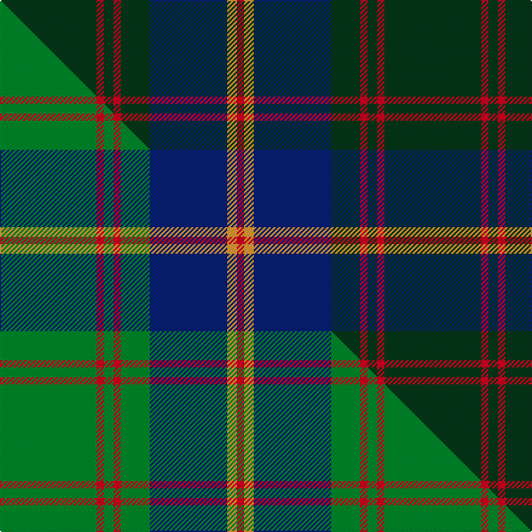

This is one **variant** — a specific cloth: this exact thread count and colourway, with its own
provenance below. It is one weaving of the [sett](/setts/dg40r3dg4r3dg12db32lo4r3/) (the scale-free proportion — the
same cloth at any scale or shade), whose colour order is pattern [GRGRGBYR](/stripes/grgrgbyr/).

Part of the [US Marine Corps](/tartans/us-marine-corps/) tartan — the named design grouping this sett with its other cloths.

Sourced from tartans-authority.  It is a [8 stripe tartan](/stripes/stripes8/).

Original link [https://www.tartanregister.gov.uk/tartanDetails.aspx?ref=975](https://www.tartanregister.gov.uk/tartanDetails.aspx?ref=975)

Dataset <small>— provenance for this record, inherited from the source manifest</small>

<dl class="dataset-prov">
<dt>source</dt><dd><a href="/sources/tartans-authority/">Scottish Tartans Authority</a></dd>
<dt>data captured from</dt><dd><a href="https://github.com/thetartan/tartan-database/blob/master/data/tartans-authority/data.csv">https://github.com/thetartan/tartan-database/blob/master/data/tartans-authority/data.csv</a></dd>
<dt>data date</dt><dd>1986 <small>(this record)</small></dd>
<dt>licence</dt><dd><a href="https://creativecommons.org/licenses/by-nc-nd/4.0/">CC BY-NC-ND 4.0</a></dd>
</dl>

Capture chain <small>— the hands this data passed through, oldest first; each capture carries its own licence</small>

<ol class="capture-chain">
<li><a href="https://www.tartansauthority.com/">Scottish Tartans Authority</a> <small>the heritage body's archive — its tartan-ferret record browser is retired (links repaired to the SRT, above)</small></li>
<li><a href="https://github.com/thetartan/tartan-database">thetartan/tartan-database</a> <small>2016-2017</small> · <a href="https://creativecommons.org/licenses/by-nc-nd/4.0/">CC BY-NC-ND 4.0</a> <small>Levko Kravets's frozen compilation — the capture we vendored, and where its CC licence text came from</small></li>
<li>this dictionary <small>captured 2026-06-10 · commit 5bf86c7566</small> <small>each re-capture is a git commit to data/sources</small></li>
</ol>

## Register references

External register numbers recorded for this tartan.

- Scottish Tartans Authority (ITI): 975

## Thread count
DG/80 R6 DG8 R6 DG24 DB64 LO8 R/6

One full sett is **318 threads**.

## Palette
<table><thead><tr><th>Colour</th><th>Shade</th><th>OKLCh</th></tr></thead><tbody><tr><td>DB</td><td><code style="background-color:#082077;">#082077</code> <small style="color:#888">#082077</small></td><td><small style="color:#888">oklch(30.0% 0.149 265.1)</small></td></tr><tr><td>DG</td><td><code style="background-color:#053819;">#053819</code> <small style="color:#888">#053819</small></td><td><small style="color:#888">oklch(30.0% 0.075 151.3)</small></td></tr><tr><td>R</td><td><code style="background-color:#D60020;">#D60020</code> <small style="color:#888">#D60020</small></td><td><small style="color:#888">oklch(55.2% 0.224 25.5)</small></td></tr><tr><td>LO</td><td><code style="background-color:#FF9C34;">#FF9C34</code> <small style="color:#888">#FF9C34</small></td><td><small style="color:#888">oklch(77.9% 0.161 61.8)</small></td></tr></tbody></table>

# Sample pattern

## Compared to the master

This cloth is one sett of its design; the master sett (the exemplar the design is anchored on) is below for comparison.

Its **ΔTartan distance** from the master is **0.19** — the same measure the nearest-tartans table ranks by (0 is identical; a re-scale of the same cloth is near 0, a recolour or a different proportion further).

<figure class="master-compare" style="margin:0">

this sett
master sett ★

<figcaption style="color:#888;font-size:smaller">One weave of this sett against the <a href="/setts/g40r3g4r3g12db32lo4r3/">master sett ★</a>, split on the diagonal: a shared proportion runs seamlessly across it with only the shades shifting; a different proportion breaks on it.</figcaption>
</figure>

## Nearest tartan variants

The nearest existing variants by ΔTartan distance, with this cloth at the top so the swatches line up against it.

ΔTartan

Threads

Variant

Sett

—

318

<a href="/variants/s8/dg40r3dg4r3dg12db32lo4r3~x2/">U.S. Marine Corps (Military?)</a>

<a href="/ttd/edit/#slug=g28r2g2r2g8db24dy3r2~x2&amp;base=dg40r3dg4r3dg12db32lo4r3~x2" title="compare in the TTD">0.56</a>

224

<a href="/variants/s8/g28r2g2r2g8db24dy3r2~x2/">Leatherneck U.S.Marine Corps Corporate Tartan</a>

<a href="/ttd/edit/#slug=g28r2g2r2g8db24y3r2~x2&amp;base=dg40r3dg4r3dg12db32lo4r3~x2" title="compare in the TTD">0.56</a>

224

<a href="/variants/s8/g28r2g2r2g8db24y3r2~x2/">Leatherneck, U.S.Marine Corps</a>

<a href="/ttd/edit/#slug=r3dg10r3dg14db16dg3dy2~x2&amp;base=dg40r3dg4r3dg12db32lo4r3~x2" title="compare in the TTD">1.45</a>

194

<a href="/variants/s7/r3dg10r3dg14db16dg3dy2~x2/">Cameron of Locheil Htg (1952) (Clan)</a>

<a href="/ttd/edit/#slug=db16g4db3g3y2g24r2~x2&amp;base=dg40r3dg4r3dg12db32lo4r3~x2" title="compare in the TTD">1.89</a>

180

<a href="/variants/s7/db16g4db3g3y2g24r2~x2/">St Andrews Links</a>

<a href="/ttd/edit/#slug=dr5dg27o2b25y7dg3dr3~x2&amp;base=dg40r3dg4r3dg12db32lo4r3~x2" title="compare in the TTD">2.05</a>

272

<a href="/variants/s7/dr5dg27o2b25y7dg3dr3~x2/">Kilkenny</a>

<a href="/ttd/edit/#slug=db26g4db3g3y2g24r2~x2&amp;base=dg40r3dg4r3dg12db32lo4r3~x2" title="compare in the TTD">2.09</a>

200

<a href="/variants/s7/db26g4db3g3y2g24r2~x2/">St Andrews Links</a>

<a href="/ttd/edit/#slug=dy5db9r3db5dy2db4dy26lb3r4~x2&amp;base=dg40r3dg4r3dg12db32lo4r3~x2" title="compare in the TTD">2.09</a>

226

<a href="/variants/s9/dy5db9r3db5dy2db4dy26lb3r4~x2/">Bracken (Fashion)</a>

<a href="/ttd/edit/#slug=db51dg5r15dg37db17r6dg5~x2&amp;base=dg40r3dg4r3dg12db32lo4r3~x2" title="compare in the TTD">2.31</a>

432

<a href="/variants/s7/db51dg5r15dg37db17r6dg5~x2/">Cadence</a>

<a href="/ttd/edit/#slug=dr4dg27o2db25ly5dg3o3~x2&amp;base=dg40r3dg4r3dg12db32lo4r3~x2" title="compare in the TTD">2.32</a>

262

<a href="/variants/s7/dr4dg27o2db25ly5dg3o3~x2/">Kilkenny, County (District)</a>

<a href="/ttd/edit/#slug=dy5dt9r3dt5dy2dt4dy26lb3r4~x2~dt1204274&amp;base=dg40r3dg4r3dg12db32lo4r3~x2" title="compare in the TTD">2.53</a>

226

<a href="/variants/s9/dy5db9r3db5dy2db4dy26lb3r4~x2~db1204274/">Bracken</a>

## Neighbour map

Every grey dot is one of 13621 variants placed by the first two principal components of the ΔTartan feature space (42% of its variance). Red is this tartan; blue dots are its nearest — click one to open its page.

<svg viewBox="0 0 640 380" role="img" style="max-width:100%;height:auto;border:1px solid #e0e0e0;border-radius:4px;display:block" xmlns="http://www.w3.org/2000/svg"><image href="/nn/cloud.v1.png" width="640" height="380"/><a href="/variants/s8/g28r2g2r2g8db24dy3r2~x2/"><circle cx="323.5" cy="176.0" r="4" fill="#3465a4"><title>Leatherneck U.S.Marine Corps Corporate Tartan</title></circle></a><a href="/variants/s8/g28r2g2r2g8db24y3r2~x2/"><circle cx="325.0" cy="176.6" r="4" fill="#3465a4"><title>Leatherneck, U.S.Marine Corps</title></circle></a><a href="/variants/s7/r3dg10r3dg14db16dg3dy2~x2/"><circle cx="345.8" cy="248.5" r="4" fill="#3465a4"><title>Cameron of Locheil Htg (1952) (Clan)</title></circle></a><a href="/variants/s7/db16g4db3g3y2g24r2~x2/"><circle cx="349.9" cy="195.8" r="4" fill="#3465a4"><title>St Andrews Links</title></circle></a><a href="/variants/s7/dr5dg27o2b25y7dg3dr3~x2/"><circle cx="274.7" cy="192.7" r="4" fill="#3465a4"><title>Kilkenny</title></circle></a><a href="/variants/s7/db26g4db3g3y2g24r2~x2/"><circle cx="321.1" cy="189.3" r="4" fill="#3465a4"><title>St Andrews Links</title></circle></a><a href="/variants/s9/dy5db9r3db5dy2db4dy26lb3r4~x2/"><circle cx="347.3" cy="182.7" r="4" fill="#3465a4"><title>Bracken (Fashion)</title></circle></a><a href="/variants/s7/db51dg5r15dg37db17r6dg5~x2/"><circle cx="346.9" cy="235.9" r="4" fill="#3465a4"><title>Cadence</title></circle></a><a href="/variants/s7/dr4dg27o2db25ly5dg3o3~x2/"><circle cx="278.4" cy="184.3" r="4" fill="#3465a4"><title>Kilkenny, County (District)</title></circle></a><a href="/variants/s9/dy5db9r3db5dy2db4dy26lb3r4~x2~db1204274/"><circle cx="361.9" cy="187.0" r="4" fill="#3465a4"><title>Bracken</title></circle></a><circle cx="366.9" cy="187.0" r="5" fill="#c00000"/><text x="320" y="376" text-anchor="middle" font-size="11" fill="#999">ground</text><text x="11" y="190" text-anchor="middle" font-size="11" fill="#999" transform="rotate(-90 11 190)">complexity</text></svg>

ID: /variants/s8/dg40r3dg4r3dg12db32lo4r3~x2/
