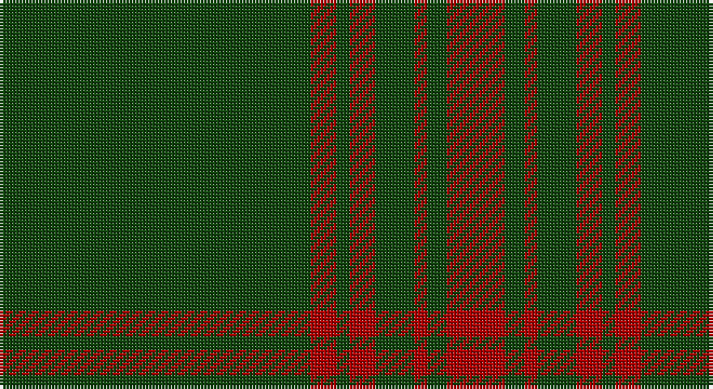

This page is one **sett** — a single exact thread-count. It belongs to the [tartan](/setts/dg48r4dg2r4dg6r2dg3r9/)
(the same proportion at any scale), whose colour order is pattern [GRGRGRGR](/stripes/grgrgrgr/).

Part of the [Menzies Hunting](/tartans/menzies-hunting/) tartan — the named design grouping this sett with its other cloths.

Sourced from weddslist.  It is a [8 stripe tartan](/stripes/stripes8/).

Original link http://www.weddslist.com/cgi-bin/tartans/pg.pl?source=tinsel

## Provenance

Earliest known date: 1893 This sett is woven in various colours with the same basic design. The certified version is red and black. The hunting Menzies was recorded by D.W. Stewart in his book, 'Old and Rare Scottish Tartans' (1893), which contained a selection of forty five setts, woven in silk, of special interest or antiquity.

## Also known as

This cloth is also recorded under:

- Menzies
- Menzies Black & Red
- Menzies Htg
- Menzies, Black & Red
- Menzies, hunting

2 attestations — the source records this cloth was collapsed from (oldest owns this page)

<ul>
<li>undated — Menzies Hunting (weddslist, <a href="http://www.weddslist.com/cgi-bin/tartans/pg.pl?source=tinsel">record</a>)</li>
<li>undated — Menzies Hunting Clan Tartan (house-of-tartan, <a href="http://www.house-of-tartan.scotland.net/house/TartanViewjs.asp?colr=Def&tnam=894">record</a>)</li>
</ul>

## Thread count
DG/96 DR8 DG4 DR8 DG12 DR4 DG6 DR/18

One full sett is **198 threads**.

## Palette

Palette: <strong>custom</strong>
<table><thead><tr><th>Colour</th><th>Threads</th><th>Shade</th><th>Base</th><th>OKLCh</th></tr></thead><tbody><tr><td>DG/</td><td style="text-align:right;font-variant-numeric:tabular-nums">96</td><td><code style="background-color:#11450D;">#11450D</code> <small style="color:#888">#11450D</small></td><td>G <code style="background-color:#006100;">#006100</code></td><td><small style="color:#888">oklch(34.4% 0.101 142.1)</small></td></tr><tr><td>DR</td><td style="text-align:right;font-variant-numeric:tabular-nums">8</td><td><code style="background-color:#AA0000;">#AA0000</code> <small style="color:#888">#AA0000</small></td><td>R <code style="background-color:#CC0000;">#CC0000</code></td><td><small style="color:#888">oklch(46.3% 0.190 29.2)</small></td></tr><tr><td>DG</td><td style="text-align:right;font-variant-numeric:tabular-nums">4</td><td><code style="background-color:#11450D;">#11450D</code> <small style="color:#888">#11450D</small></td><td>G <code style="background-color:#006100;">#006100</code></td><td><small style="color:#888">oklch(34.4% 0.101 142.1)</small></td></tr><tr><td>DR</td><td style="text-align:right;font-variant-numeric:tabular-nums">8</td><td><code style="background-color:#AA0000;">#AA0000</code> <small style="color:#888">#AA0000</small></td><td>R <code style="background-color:#CC0000;">#CC0000</code></td><td><small style="color:#888">oklch(46.3% 0.190 29.2)</small></td></tr><tr><td>DG</td><td style="text-align:right;font-variant-numeric:tabular-nums">12</td><td><code style="background-color:#11450D;">#11450D</code> <small style="color:#888">#11450D</small></td><td>G <code style="background-color:#006100;">#006100</code></td><td><small style="color:#888">oklch(34.4% 0.101 142.1)</small></td></tr><tr><td>DR</td><td style="text-align:right;font-variant-numeric:tabular-nums">4</td><td><code style="background-color:#AA0000;">#AA0000</code> <small style="color:#888">#AA0000</small></td><td>R <code style="background-color:#CC0000;">#CC0000</code></td><td><small style="color:#888">oklch(46.3% 0.190 29.2)</small></td></tr><tr><td>DG</td><td style="text-align:right;font-variant-numeric:tabular-nums">6</td><td><code style="background-color:#11450D;">#11450D</code> <small style="color:#888">#11450D</small></td><td>G <code style="background-color:#006100;">#006100</code></td><td><small style="color:#888">oklch(34.4% 0.101 142.1)</small></td></tr><tr><td>DR/</td><td style="text-align:right;font-variant-numeric:tabular-nums">18</td><td><code style="background-color:#AA0000;">#AA0000</code> <small style="color:#888">#AA0000</small></td><td>R <code style="background-color:#CC0000;">#CC0000</code></td><td><small style="color:#888">oklch(46.3% 0.190 29.2)</small></td></tr></tbody></table>

# Sample pattern

## Nearest tartans

The nearest existing variants by ΔTartan distance, with this tartan at the top so the swatches line up against it.

ΔTartan

Tartan

Sett

—

<a href="/ttd/edit/#slug=dg48r4dg2r4dg6r2dg3r9~x2">Menzies Hunting</a> <a class="nn-out" href="/variants/s8/dg48r4dg2r4dg6r2dg3r9~x2/" title="open its dictionary page">↗</a>

1.06

<a href="/ttd/edit/#slug=dg48r4dg2r4dg6r2dg3r9&amp;base=dg48r4dg2r4dg6r2dg3r9~x2">Menzies Hunting</a> <a class="nn-out" href="/variants/s8/dg48r4dg2r4dg6r2dg3r9/" title="open its dictionary page">↗</a>

1.23

<a href="/ttd/edit/#slug=g48r4g2r4g6r2g3r9~x2&amp;base=dg48r4dg2r4dg6r2dg3r9~x2">Menzies</a> <a class="nn-out" href="/variants/s8/g48r4g2r4g6r2g3r9~x2/" title="open its dictionary page">↗</a>

1.85

<a href="/ttd/edit/#slug=g164r20g6r20g23r14g4r36&amp;base=dg48r4dg2r4dg6r2dg3r9~x2">Aukland &amp; District Pipe Band (Corp)</a> <a class="nn-out" href="/variants/s8/g164r20g6r20g23r14g4r36/" title="open its dictionary page">↗</a>

1.98

<a href="/ttd/edit/#slug=dg32k6dg4k8r1k2~x4&amp;base=dg48r4dg2r4dg6r2dg3r9~x2">Fife, Duke Of</a> <a class="nn-out" href="/variants/s6/dg32k6dg4k8r1k2~x4/" title="open its dictionary page">↗</a>

2.03

<a href="/ttd/edit/#slug=g51dp3g5lo3g5dp5g5dp5g5lo3~x2&amp;base=dg48r4dg2r4dg6r2dg3r9~x2">Highland Hospice (Fashion)</a> <a class="nn-out" href="/variants/s10/g51dp3g5lo3g5dp5g5dp5g5lo3~x2/" title="open its dictionary page">↗</a>

2.10

<a href="/ttd/edit/#slug=k3dg3k2dg4r2dg6k6dg4k4dg36k2&amp;base=dg48r4dg2r4dg6r2dg3r9~x2">Madoc (Welsh Name)</a> <a class="nn-out" href="/variants/s11/k3dg3k2dg4r2dg6k6dg4k4dg36k2/" title="open its dictionary page">↗</a>

2.13

<a href="/ttd/edit/#slug=n2k13n31k1n1~x4&amp;base=dg48r4dg2r4dg6r2dg3r9~x2">Silver Mist</a> <a class="nn-out" href="/variants/s5/n2k13n31k1n1~x4/" title="open its dictionary page">↗</a>

2.15

<a href="/ttd/edit/#slug=dg32dy2dg2dy2dg2dy12dg22w1dg1w3~x2&amp;base=dg48r4dg2r4dg6r2dg3r9~x2">Unidentified Plaid #2</a> <a class="nn-out" href="/variants/s10/dg32dy2dg2dy2dg2dy12dg22w1dg1w3~x2/" title="open its dictionary page">↗</a>

2.16

<a href="/variants/s8/r8g3r4g44w4~x2/">Welsh National</a>

2.20

<a href="/ttd/edit/#slug=dg2dy2dg15dy1w1dg15dy2dg2~x2&amp;base=dg48r4dg2r4dg6r2dg3r9~x2">Bannockbane Hunting</a> <a class="nn-out" href="/variants/s8/dg2dy2dg15dy1w1dg15dy2dg2~x2/" title="open its dictionary page">↗</a>

## Neighbour map

Every grey dot is one of 14360 variants placed by the first two principal components of the ΔTartan feature space (44% of its variance). Red is this tartan; blue dots are its nearest — click one to open its page.

<svg viewBox="0 0 640 380" role="img" style="max-width:100%;height:auto;border:1px solid #e0e0e0;border-radius:4px;display:block" xmlns="http://www.w3.org/2000/svg"><image href="/nn/cloud.v1.png" width="640" height="380"/><a href="/variants/s8/dg48r4dg2r4dg6r2dg3r9/"><circle cx="580.6" cy="187.4" r="4" fill="#3465a4"><title>Menzies Hunting</title></circle></a><a href="/variants/s8/g48r4g2r4g6r2g3r9~x2/"><circle cx="583.5" cy="188.4" r="4" fill="#3465a4"><title>Menzies</title></circle></a><a href="/variants/s8/g164r20g6r20g23r14g4r36/"><circle cx="541.6" cy="164.3" r="4" fill="#3465a4"><title>Aukland &amp; District Pipe Band (Corp)</title></circle></a><a href="/variants/s6/dg32k6dg4k8r1k2~x4/"><circle cx="529.9" cy="209.0" r="4" fill="#3465a4"><title>Fife, Duke Of</title></circle></a><a href="/variants/s10/g51dp3g5lo3g5dp5g5dp5g5lo3~x2/"><circle cx="558.6" cy="179.0" r="4" fill="#3465a4"><title>Highland Hospice (Fashion)</title></circle></a><a href="/variants/s11/k3dg3k2dg4r2dg6k6dg4k4dg36k2/"><circle cx="519.4" cy="181.7" r="4" fill="#3465a4"><title>Madoc (Welsh Name)</title></circle></a><a href="/variants/s5/n2k13n31k1n1~x4/"><circle cx="561.9" cy="215.7" r="4" fill="#3465a4"><title>Silver Mist</title></circle></a><a href="/variants/s10/dg32dy2dg2dy2dg2dy12dg22w1dg1w3~x2/"><circle cx="581.3" cy="193.6" r="4" fill="#3465a4"><title>Unidentified Plaid #2</title></circle></a><a href="/variants/s8/r8g3r4g44w4~x2/"><circle cx="575.0" cy="207.6" r="4" fill="#3465a4"><title>Welsh National</title></circle></a><a href="/variants/s8/dg2dy2dg15dy1w1dg15dy2dg2~x2/"><circle cx="626.0" cy="241.8" r="4" fill="#3465a4"><title>Bannockbane Hunting</title></circle></a><circle cx="611.0" cy="203.3" r="5" fill="#c00000"/></svg>

ID: /variants/s8/dg48r4dg2r4dg6r2dg3r9~x2/
