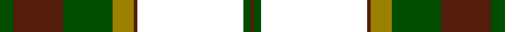
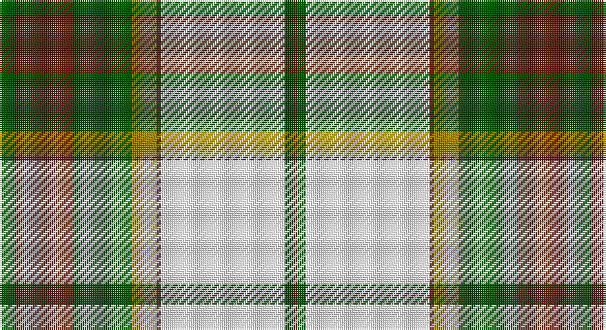

This page is one **sett** — a single exact thread-count. It belongs to the [tartan](/setts/dg4dr14dg14o6dr1w30dg2dr1/)
(the same proportion at any scale), whose colour order is pattern [BGWBRGBG](/stripes/bgwbrgbg/).

Part of the [British Columbia](/tartans/british-columbia/) tartan — the named design grouping this sett with its other cloths.

Sourced from register-of-tartans.  It is a [8 stripe tartan](/stripes/stripes8/).

Original link https://www.tartanregister.gov.uk/tartanDetails.aspx?ref=5077

## Also known as

This cloth is also recorded under:

- British Columbia #2

## Register references

External register numbers recorded for this tartan.

- Scottish Register of Tartans: [5077](https://www.tartanregister.gov.uk/tartanDetails.aspx?ref=5077)
- Scottish Tartans Authority (ITI): 3730

## Thread count
G/8 DR28 G28 LG12 DR2 W60 G4 DR/2

One full sett is **278 threads**.

## Palette

Palette: <strong>Tartan Register</strong> <small style="color:#888">(2 of 4 colours)</small>
<table><thead><tr><th>Colour</th><th>Threads</th><th>Shade</th><th>Base</th><th>OKLCh</th></tr></thead><tbody><tr><td>G/</td><td style="text-align:right;font-variant-numeric:tabular-nums">8</td><td><code style="background-color:#004C00;">#004C00</code> <small style="color:#888">#004C00</small></td><td>G <code style="background-color:#006100;">#006100</code></td><td><small style="color:#888">oklch(36.1% 0.123 142.5)</small></td></tr><tr><td>DR</td><td style="text-align:right;font-variant-numeric:tabular-nums">28</td><td><code style="background-color:#541C0C;">#541C0C</code> <small style="color:#888">#541C0C</small></td><td>B <code style="background-color:#2A418A;">#2A418A</code></td><td><small style="color:#888">oklch(31.1% 0.088 36.4)</small></td></tr><tr><td>G</td><td style="text-align:right;font-variant-numeric:tabular-nums">28</td><td><code style="background-color:#004C00;">#004C00</code> <small style="color:#888">#004C00</small></td><td>G <code style="background-color:#006100;">#006100</code></td><td><small style="color:#888">oklch(36.1% 0.123 142.5)</small></td></tr><tr><td>LG</td><td style="text-align:right;font-variant-numeric:tabular-nums">12</td><td><code style="background-color:#9C8000;">#9C8000</code> <small style="color:#888">#9C8000</small></td><td>R <code style="background-color:#CC0000;">#CC0000</code></td><td><small style="color:#888">oklch(60.8% 0.125 93.4)</small></td></tr><tr><td>DR</td><td style="text-align:right;font-variant-numeric:tabular-nums">2</td><td><code style="background-color:#541C0C;">#541C0C</code> <small style="color:#888">#541C0C</small></td><td>B <code style="background-color:#2A418A;">#2A418A</code></td><td><small style="color:#888">oklch(31.1% 0.088 36.4)</small></td></tr><tr><td>W</td><td style="text-align:right;font-variant-numeric:tabular-nums">60</td><td><code style="background-color:#FFFFFF;">#FFFFFF</code> <small style="color:#888">#FFFFFF</small></td><td>W <code style="background-color:#F7F7F7;">#F7F7F7</code></td><td><small style="color:#888">oklch(100.0% 0.000 89.9)</small></td></tr><tr><td>G</td><td style="text-align:right;font-variant-numeric:tabular-nums">4</td><td><code style="background-color:#004C00;">#004C00</code> <small style="color:#888">#004C00</small></td><td>G <code style="background-color:#006100;">#006100</code></td><td><small style="color:#888">oklch(36.1% 0.123 142.5)</small></td></tr><tr><td>DR/</td><td style="text-align:right;font-variant-numeric:tabular-nums">2</td><td><code style="background-color:#541C0C;">#541C0C</code> <small style="color:#888">#541C0C</small></td><td>B <code style="background-color:#2A418A;">#2A418A</code></td><td><small style="color:#888">oklch(31.1% 0.088 36.4)</small></td></tr></tbody></table>

# Sample pattern

## Compared to the master

This cloth is one sett of its design; the master sett (the exemplar the design is anchored on) is below for comparison.

<figure style="margin:0"><figcaption style="color:#888;font-size:smaller">this sett</figcaption></figure>
<figure style="margin:0"><figcaption style="color:#888;font-size:smaller"><a href="/setts/db50w16db8dg8w1dg1w1dg1w1dg1w1dg1w1dg1w1dg1w20dg40db12dg24g8w1g1w1g1w1g1w1g1w1g1w1g1w28g6dg4/">master sett →</a></figcaption></figure>

## Nearest tartans

The nearest existing variants by ΔTartan distance, with this tartan at the top so the swatches line up against it.

ΔTartan

Tartan

Sett

—

<a href="/ttd/edit/#slug=dg4dr14dg14o6dr1w30dg2dr1~x2">British Columbia #2</a> <a class="nn-out" href="/variants/s8/dg4dr14dg14o6dr1w30dg2dr1~x2/" title="open its dictionary page">↗</a>

0.43

<a href="/ttd/edit/#slug=dg4do10dg10o6do1w26dg2do1~x4&amp;base=dg4dr14dg14o6dr1w30dg2dr1~x2">Dogwood</a> <a class="nn-out" href="/variants/s8/dg4do10dg10o6do1w26dg2do1~x4/" title="open its dictionary page">↗</a>

0.70

<a href="/ttd/edit/#slug=g3r12g12lo5r1w25g2r1~x2&amp;base=dg4dr14dg14o6dr1w30dg2dr1~x2">Dogwood Trade Tartan</a> <a class="nn-out" href="/variants/s8/g3r12g12lo5r1w25g2r1~x2/" title="open its dictionary page">↗</a>

0.72

<a href="/ttd/edit/#slug=g3r12g12o5r1w25g2r1~x2&amp;base=dg4dr14dg14o6dr1w30dg2dr1~x2">Dogwood</a> <a class="nn-out" href="/variants/s8/g3r12g12o5r1w25g2r1~x2/" title="open its dictionary page">↗</a>

1.01

<a href="/ttd/edit/#slug=g22r2g4r2g4r18w24r1lo3~x2&amp;base=dg4dr14dg14o6dr1w30dg2dr1~x2">Prince Edward Island, Dress</a> <a class="nn-out" href="/variants/s9/g22r2g4r2g4r18w24r1lo3~x2/" title="open its dictionary page">↗</a>

1.05

<a href="/ttd/edit/#slug=r6w1r2w25r3g12r3g12r3~x2&amp;base=dg4dr14dg14o6dr1w30dg2dr1~x2">Crawford Arisaid (Dance)</a> <a class="nn-out" href="/variants/s9/r6w1r2w25r3g12r3g12r3~x2/" title="open its dictionary page">↗</a>

1.08

<a href="/ttd/edit/#slug=r4g5w2g5r4g14r10w30k1r2g4~x2&amp;base=dg4dr14dg14o6dr1w30dg2dr1~x2">Scott, dress</a> <a class="nn-out" href="/variants/s11/r4g5w2g5r4g14r10w30k1r2g4~x2/" title="open its dictionary page">↗</a>

1.14

<a href="/ttd/edit/#slug=ly6dg36w5b4w30b1w2~x2&amp;base=dg4dr14dg14o6dr1w30dg2dr1~x2">Pearce Scotch Plaid 4 (Fashion)</a> <a class="nn-out" href="/variants/s7/ly6dg36w5b4w30b1w2~x2/" title="open its dictionary page">↗</a>

1.21

<a href="/ttd/edit/#slug=r6g2w21ly2k8ly2g32w1k3~x2&amp;base=dg4dr14dg14o6dr1w30dg2dr1~x2">Fiander, Julian (Personal)</a> <a class="nn-out" href="/variants/s9/r6g2w21ly2k8ly2g32w1k3~x2/" title="open its dictionary page">↗</a>

1.24

<a href="/ttd/edit/#slug=dt3loi2dt30loi1w18lg30lo2lg3~x2&amp;base=dg4dr14dg14o6dr1w30dg2dr1~x2">Bannockbane Green</a> <a class="nn-out" href="/variants/s8/dt3loi2dt30loi1w18lg30lo2lg3~x2/" title="open its dictionary page">↗</a>

1.25

<a href="/ttd/edit/#slug=g2dy10g11ly4dy1w18g2dy1~x2&amp;base=dg4dr14dg14o6dr1w30dg2dr1~x2">Aviemore Check</a> <a class="nn-out" href="/variants/s8/g2dy10g11ly4dy1w18g2dy1~x2/" title="open its dictionary page">↗</a>

## Neighbour map

Every grey dot is one of 14360 variants placed by the first two principal components of the ΔTartan feature space (44% of its variance). Red is this tartan; blue dots are its nearest — click one to open its page.

<svg viewBox="0 0 640 380" role="img" style="max-width:100%;height:auto;border:1px solid #e0e0e0;border-radius:4px;display:block" xmlns="http://www.w3.org/2000/svg"><image href="/nn/cloud.v1.png" width="640" height="380"/><a href="/variants/s8/dg4do10dg10o6do1w26dg2do1~x4/"><circle cx="216.7" cy="118.6" r="4" fill="#3465a4"><title>Dogwood</title></circle></a><a href="/variants/s8/g3r12g12lo5r1w25g2r1~x2/"><circle cx="222.1" cy="125.2" r="4" fill="#3465a4"><title>Dogwood Trade Tartan</title></circle></a><a href="/variants/s8/g3r12g12o5r1w25g2r1~x2/"><circle cx="222.0" cy="125.4" r="4" fill="#3465a4"><title>Dogwood</title></circle></a><a href="/variants/s9/g22r2g4r2g4r18w24r1lo3~x2/"><circle cx="213.4" cy="127.4" r="4" fill="#3465a4"><title>Prince Edward Island, Dress</title></circle></a><a href="/variants/s9/r6w1r2w25r3g12r3g12r3~x2/"><circle cx="228.3" cy="134.1" r="4" fill="#3465a4"><title>Crawford Arisaid (Dance)</title></circle></a><a href="/variants/s11/r4g5w2g5r4g14r10w30k1r2g4~x2/"><circle cx="234.3" cy="101.4" r="4" fill="#3465a4"><title>Scott, dress</title></circle></a><a href="/variants/s7/ly6dg36w5b4w30b1w2~x2/"><circle cx="268.8" cy="114.9" r="4" fill="#3465a4"><title>Pearce Scotch Plaid 4 (Fashion)</title></circle></a><a href="/variants/s9/r6g2w21ly2k8ly2g32w1k3~x2/"><circle cx="216.3" cy="87.0" r="4" fill="#3465a4"><title>Fiander, Julian (Personal)</title></circle></a><a href="/variants/s8/dt3loi2dt30loi1w18lg30lo2lg3~x2/"><circle cx="202.2" cy="105.3" r="4" fill="#3465a4"><title>Bannockbane Green</title></circle></a><a href="/variants/s8/g2dy10g11ly4dy1w18g2dy1~x2/"><circle cx="187.2" cy="147.3" r="4" fill="#3465a4"><title>Aviemore Check</title></circle></a><circle cx="214.5" cy="111.5" r="5" fill="#c00000"/></svg>

ID: /variants/s8/dg4dr14dg14o6dr1w30dg2dr1~x2/
