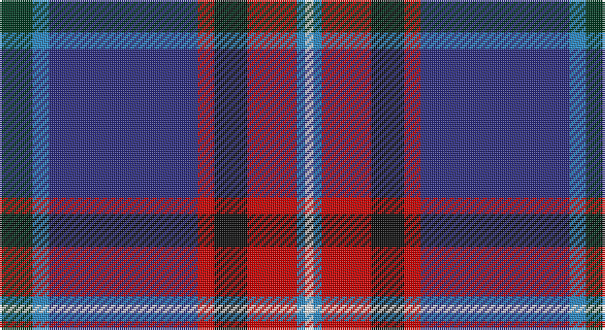

This page is one **sett** — a single exact thread-count. It belongs to the [tartan](/setts/dg4t2db18r2k4r6t1w1/)
(the same proportion at any scale), whose colour order is pattern [GBBRKRBW](/stripes/gbbrkrbw/).

Sourced from register-of-tartans.  It is a [8 stripe tartan](/stripes/stripes8/).

Original link https://www.tartanregister.gov.uk/tartanDetails.aspx?ref=1430

2 attestations — the source records this cloth was collapsed from (oldest owns this page)

<ul>
<li>01/01/2000 — Glenn (register-of-tartans, <a href="https://www.tartanregister.gov.uk/tartanDetails.aspx?ref=1430">record</a>)</li>
<li>2000 — Glenn (Name) (tartans-authority, <a href="http://www.tartansauthority.com/tartan-ferret/display/5930/">record</a>)</li>
</ul>

## Register references

External register numbers recorded for this tartan.

- Scottish Register of Tartans: [1430](https://www.tartanregister.gov.uk/tartanDetails.aspx?ref=1430)
- Scottish Tartans Authority (ITI): 5930

## Thread count
DG/16 B8 DB72 R8 K16 R24 B4 W/4

One full sett is **284 threads**.

## Palette

Palette: <strong>Tartan Register</strong>
<table><thead><tr><th>Colour</th><th>Threads</th><th>Shade</th><th>Base</th><th>OKLCh</th></tr></thead><tbody><tr><td>DG/</td><td style="text-align:right;font-variant-numeric:tabular-nums">16</td><td><code style="background-color:#003820;">#003820</code> <small style="color:#888">#003820</small></td><td>G <code style="background-color:#006100;">#006100</code></td><td><small style="color:#888">oklch(30.0% 0.070 158.3)</small></td></tr><tr><td>B</td><td style="text-align:right;font-variant-numeric:tabular-nums">8</td><td><code style="background-color:#2888C4;">#2888C4</code> <small style="color:#888">#2888C4</small></td><td>B <code style="background-color:#2A418A;">#2A418A</code></td><td><small style="color:#888">oklch(60.1% 0.125 241.5)</small></td></tr><tr><td>DB</td><td style="text-align:right;font-variant-numeric:tabular-nums">72</td><td><code style="background-color:#2C2C80;">#2C2C80</code> <small style="color:#888">#2C2C80</small></td><td>B <code style="background-color:#2A418A;">#2A418A</code></td><td><small style="color:#888">oklch(35.0% 0.138 276.6)</small></td></tr><tr><td>R</td><td style="text-align:right;font-variant-numeric:tabular-nums">8</td><td><code style="background-color:#C80000;">#C80000</code> <small style="color:#888">#C80000</small></td><td>R <code style="background-color:#CC0000;">#CC0000</code></td><td><small style="color:#888">oklch(52.3% 0.215 29.2)</small></td></tr><tr><td>K</td><td style="text-align:right;font-variant-numeric:tabular-nums">16</td><td><code style="background-color:#101010;">#101010</code> <small style="color:#888">#101010</small></td><td>K <code style="background-color:#000000;">#000000</code></td><td><small style="color:#888">oklch(17.3% 0.000 89.9)</small></td></tr><tr><td>R</td><td style="text-align:right;font-variant-numeric:tabular-nums">24</td><td><code style="background-color:#C80000;">#C80000</code> <small style="color:#888">#C80000</small></td><td>R <code style="background-color:#CC0000;">#CC0000</code></td><td><small style="color:#888">oklch(52.3% 0.215 29.2)</small></td></tr><tr><td>B</td><td style="text-align:right;font-variant-numeric:tabular-nums">4</td><td><code style="background-color:#2888C4;">#2888C4</code> <small style="color:#888">#2888C4</small></td><td>B <code style="background-color:#2A418A;">#2A418A</code></td><td><small style="color:#888">oklch(60.1% 0.125 241.5)</small></td></tr><tr><td>W/</td><td style="text-align:right;font-variant-numeric:tabular-nums">4</td><td><code style="background-color:#FCFCFC;">#FCFCFC</code> <small style="color:#888">#FCFCFC</small></td><td>W <code style="background-color:#F7F7F7;">#F7F7F7</code></td><td><small style="color:#888">oklch(99.1% 0.000 89.9)</small></td></tr></tbody></table>

# Sample pattern

## Nearest tartans

The nearest existing variants by ΔTartan distance, with this tartan at the top so the swatches line up against it.

ΔTartan

Tartan

Sett

—

<a href="/ttd/edit/#slug=dg4t2db18r2k4r6t1w1~x4">Glenn</a> <a class="nn-out" href="/variants/s8/dg4t2db18r2k4r6t1w1~x4/" title="open its dictionary page">↗</a>

0.97

<a href="/ttd/edit/#slug=r3db38k13w3o20ly2~x2&amp;base=dg4t2db18r2k4r6t1w1~x4">LLoyd of Astargus Canadian Family Tartan</a> <a class="nn-out" href="/variants/s6/r3db38k13w3o20ly2~x2/" title="open its dictionary page">↗</a>

1.05

<a href="/ttd/edit/#slug=dg10w2dt10lo5db35r6~x2&amp;base=dg4t2db18r2k4r6t1w1~x4">Hatfield &amp; Mize (Personal)</a> <a class="nn-out" href="/variants/s6/dg10w2dt10lo5db35r6~x2/" title="open its dictionary page">↗</a>

1.12

<a href="/ttd/edit/#slug=b11db5g4w3r3k16db28b2~x2&amp;base=dg4t2db18r2k4r6t1w1~x4">Scottish Italian</a> <a class="nn-out" href="/variants/s8/b11db5g4w3r3k16db28b2~x2/" title="open its dictionary page">↗</a>

1.13

<a href="/ttd/edit/#slug=g20db2w2db12dp29r1dp1k3~x2&amp;base=dg4t2db18r2k4r6t1w1~x4">Longhaugh Primary School</a> <a class="nn-out" href="/variants/s8/g20db2w2db12dp29r1dp1k3~x2/" title="open its dictionary page">↗</a>

1.14

<a href="/ttd/edit/#slug=db33r8k12ly2k4w4k4g12db8k4db4w2~x2&amp;base=dg4t2db18r2k4r6t1w1~x4">MacLulich</a> <a class="nn-out" href="/variants/s12/db33r8k12ly2k4w4k4g12db8k4db4w2~x2/" title="open its dictionary page">↗</a>

1.16

<a href="/ttd/edit/#slug=db46ly4db4ly4db6k16n66lb11r6&amp;base=dg4t2db18r2k4r6t1w1~x4">Scottish Association for Neurological Sciences</a> <a class="nn-out" href="/variants/s9/db46ly4db4ly4db6k16n66lb11r6/" title="open its dictionary page">↗</a>

1.17

<a href="/ttd/edit/#slug=db40r4k16w3dy8ri4dy3ri8k10~x2&amp;base=dg4t2db18r2k4r6t1w1~x4">United Arrows House Check</a> <a class="nn-out" href="/variants/s9/db40r4k16w3dy8ri4dy3ri8k10~x2/" title="open its dictionary page">↗</a>

1.17

<a href="/ttd/edit/#slug=db1w2t12k2db2k2dp15db2ly1~x2&amp;base=dg4t2db18r2k4r6t1w1~x4">Hek (Name)</a> <a class="nn-out" href="/variants/s9/db1w2t12k2db2k2dp15db2ly1~x2/" title="open its dictionary page">↗</a>

1.17

<a href="/ttd/edit/#slug=db5r2ly7r2db42dg28k5db10k15dg5w3r3&amp;base=dg4t2db18r2k4r6t1w1~x4">Héritage Séquane</a> <a class="nn-out" href="/variants/s12/db5r2ly7r2db42dg28k5db10k15dg5w3r3/" title="open its dictionary page">↗</a>

1.17

<a href="/ttd/edit/#slug=db4w1k2db25k12b1k2r16k2lo1~x2&amp;base=dg4t2db18r2k4r6t1w1~x4">Sidey Dress Tartan (Name)</a> <a class="nn-out" href="/variants/s10/db4w1k2db25k12b1k2r16k2lo1~x2/" title="open its dictionary page">↗</a>

## Neighbour map

Every grey dot is one of 14360 variants placed by the first two principal components of the ΔTartan feature space (44% of its variance). Red is this tartan; blue dots are its nearest — click one to open its page.

<svg viewBox="0 0 640 380" role="img" style="max-width:100%;height:auto;border:1px solid #e0e0e0;border-radius:4px;display:block" xmlns="http://www.w3.org/2000/svg"><image href="/nn/cloud.v1.png" width="640" height="380"/><a href="/variants/s6/r3db38k13w3o20ly2~x2/"><circle cx="236.4" cy="146.3" r="4" fill="#3465a4"><title>LLoyd of Astargus Canadian Family Tartan</title></circle></a><a href="/variants/s6/dg10w2dt10lo5db35r6~x2/"><circle cx="254.0" cy="157.2" r="4" fill="#3465a4"><title>Hatfield &amp; Mize (Personal)</title></circle></a><a href="/variants/s8/b11db5g4w3r3k16db28b2~x2/"><circle cx="208.2" cy="156.9" r="4" fill="#3465a4"><title>Scottish Italian</title></circle></a><a href="/variants/s8/g20db2w2db12dp29r1dp1k3~x2/"><circle cx="228.9" cy="99.4" r="4" fill="#3465a4"><title>Longhaugh Primary School</title></circle></a><a href="/variants/s12/db33r8k12ly2k4w4k4g12db8k4db4w2~x2/"><circle cx="205.2" cy="119.9" r="4" fill="#3465a4"><title>MacLulich</title></circle></a><a href="/variants/s9/db46ly4db4ly4db6k16n66lb11r6/"><circle cx="215.7" cy="128.5" r="4" fill="#3465a4"><title>Scottish Association for Neurological Sciences</title></circle></a><a href="/variants/s9/db40r4k16w3dy8ri4dy3ri8k10~x2/"><circle cx="206.6" cy="148.6" r="4" fill="#3465a4"><title>United Arrows House Check</title></circle></a><a href="/variants/s9/db1w2t12k2db2k2dp15db2ly1~x2/"><circle cx="186.2" cy="118.3" r="4" fill="#3465a4"><title>Hek (Name)</title></circle></a><a href="/variants/s12/db5r2ly7r2db42dg28k5db10k15dg5w3r3/"><circle cx="230.0" cy="113.7" r="4" fill="#3465a4"><title>Héritage Séquane</title></circle></a><a href="/variants/s10/db4w1k2db25k12b1k2r16k2lo1~x2/"><circle cx="258.9" cy="106.6" r="4" fill="#3465a4"><title>Sidey Dress Tartan (Name)</title></circle></a><circle cx="237.0" cy="128.4" r="5" fill="#c00000"/></svg>

ID: /variants/s8/dg4t2db18r2k4r6t1w1~x4/
