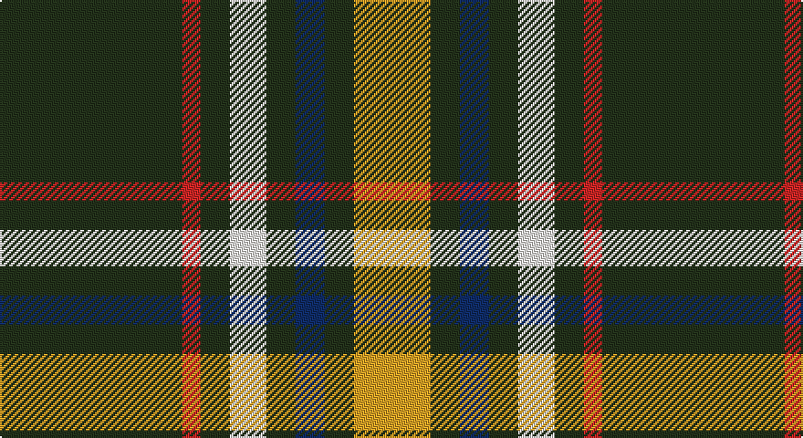

This page is one **sett** — a single exact thread-count. It belongs to the [tartan](/setts/dg50r5dg8w10dg8db8dg8lo21/)
(the same proportion at any scale), whose colour order is pattern [GRGWGBGY](/stripes/grgwgbgy/).

Sourced from register-of-tartans.  It is a [8 stripe tartan](/stripes/stripes8/).

Original link https://www.tartanregister.gov.uk/tartanDetails.aspx?ref=10548

## Also known as

This cloth is also recorded under:

- St. Patrick's Krewe

2 attestations — the source records this cloth was collapsed from (oldest owns this page)

<ul>
<li>21/08/2009 — St Patrick's Krewe (register-of-tartans, <a href="https://www.tartanregister.gov.uk/tartanDetails.aspx?ref=10548">record</a>)</li>
<li>21st Aug 2009 — St. Patrick's Krewe (Corporate) (tartans-authority, <a href="http://www.tartansauthority.com/tartan-ferret/display/10548/">record</a>)</li>
</ul>

## Register references

External register numbers recorded for this tartan.

- Scottish Register of Tartans: [10548](https://www.tartanregister.gov.uk/tartanDetails?ref=10548)
- Scottish Tartans Authority (ITI): 10548

## Thread count
K/100 R10 K16 W20 K16 DB16 K16 Y/42

One full sett is **330 threads**.

## Palette

Palette: <strong>Tartan Dictionary</strong> <small style="color:#888">(1 of 5 colours)</small>
<table><thead><tr><th>Colour</th><th>Threads</th><th>Shade</th><th>Base</th><th>OKLCh</th></tr></thead><tbody><tr><td>K/</td><td style="text-align:right;font-variant-numeric:tabular-nums">100</td><td><code style="background-color:#23321B;">#23321B</code> <small style="color:#888">#23321B</small></td><td>G <code style="background-color:#006100;">#006100</code></td><td><small style="color:#888">oklch(29.7% 0.045 135.3)</small></td></tr><tr><td>R</td><td style="text-align:right;font-variant-numeric:tabular-nums">10</td><td><code style="background-color:#CA2625;">#CA2625</code> <small style="color:#888">#CA2625</small></td><td>R <code style="background-color:#CC0000;">#CC0000</code></td><td><small style="color:#888">oklch(54.4% 0.199 27.2)</small></td></tr><tr><td>K</td><td style="text-align:right;font-variant-numeric:tabular-nums">16</td><td><code style="background-color:#23321B;">#23321B</code> <small style="color:#888">#23321B</small></td><td>G <code style="background-color:#006100;">#006100</code></td><td><small style="color:#888">oklch(29.7% 0.045 135.3)</small></td></tr><tr><td>W</td><td style="text-align:right;font-variant-numeric:tabular-nums">20</td><td><code style="background-color:#F9F5EF;">#F9F5EF</code> <small style="color:#888">#F9F5EF</small></td><td>W <code style="background-color:#F7F7F7;">#F7F7F7</code></td><td><small style="color:#888">oklch(97.2% 0.009 78.3)</small></td></tr><tr><td>K</td><td style="text-align:right;font-variant-numeric:tabular-nums">16</td><td><code style="background-color:#23321B;">#23321B</code> <small style="color:#888">#23321B</small></td><td>G <code style="background-color:#006100;">#006100</code></td><td><small style="color:#888">oklch(29.7% 0.045 135.3)</small></td></tr><tr><td>DB</td><td style="text-align:right;font-variant-numeric:tabular-nums">16</td><td><code style="background-color:#0F2C67;">#0F2C67</code> <small style="color:#888">#0F2C67</small></td><td>B <code style="background-color:#2A418A;">#2A418A</code></td><td><small style="color:#888">oklch(31.1% 0.110 262.3)</small></td></tr><tr><td>K</td><td style="text-align:right;font-variant-numeric:tabular-nums">16</td><td><code style="background-color:#23321B;">#23321B</code> <small style="color:#888">#23321B</small></td><td>G <code style="background-color:#006100;">#006100</code></td><td><small style="color:#888">oklch(29.7% 0.045 135.3)</small></td></tr><tr><td>Y/</td><td style="text-align:right;font-variant-numeric:tabular-nums">42</td><td><code style="background-color:#E0A126;">#E0A126</code> <small style="color:#888">#E0A126</small></td><td>Y <code style="background-color:#F2BF00;">#F2BF00</code></td><td><small style="color:#888">oklch(75.1% 0.146 78.3)</small></td></tr></tbody></table>

# Sample pattern

## Nearest tartans

The nearest existing variants by ΔTartan distance, with this tartan at the top so the swatches line up against it.

ΔTartan

Tartan

Sett

—

<a href="/ttd/edit/#slug=dg50r5dg8w10dg8db8dg8lo21~x2">St Patrick's Krewe</a> <a class="nn-out" href="/variants/s8/dg50r5dg8w10dg8db8dg8lo21~x2/" title="open its dictionary page">↗</a>

1.17

<a href="/ttd/edit/#slug=dp2r1k4ly2k12ly8k12ly2k4ly1w2~x2&amp;base=dg50r5dg8w10dg8db8dg8lo21~x2">Gary Personal Tartan</a> <a class="nn-out" href="/variants/s11/dp2r1k4ly2k12ly8k12ly2k4ly1w2~x2/" title="open its dictionary page">↗</a>

1.24

<a href="/ttd/edit/#slug=dg3w1dg12r6dg3k3g2~x4&amp;base=dg50r5dg8w10dg8db8dg8lo21~x2">Arkansas</a> <a class="nn-out" href="/variants/s7/dg3w1dg12r6dg3k3g2~x4/" title="open its dictionary page">↗</a>

1.31

<a href="/ttd/edit/#slug=k4lo8k26o6g15o6k26w2~x2&amp;base=dg50r5dg8w10dg8db8dg8lo21~x2">Holestone (Corporate)</a> <a class="nn-out" href="/variants/s8/k4lo8k26o6g15o6k26w2~x2/" title="open its dictionary page">↗</a>

1.32

<a href="/ttd/edit/#slug=ly11k4m2k3lyi2k4ly15k32ly2k5w2~x2&amp;base=dg50r5dg8w10dg8db8dg8lo21~x2">Livingston Football Club</a> <a class="nn-out" href="/variants/s11/ly11k4m2k3lyi2k4ly15k32ly2k5w2~x2/" title="open its dictionary page">↗</a>

1.36

<a href="/ttd/edit/#slug=k17dg48ly4r10lb12dg4&amp;base=dg50r5dg8w10dg8db8dg8lo21~x2">Asheville Firefighters, The</a> <a class="nn-out" href="/variants/s6/k17dg48ly4r10lb12dg4/" title="open its dictionary page">↗</a>

1.37

<a href="/ttd/edit/#slug=dg62g17ly12t8o8~x2&amp;base=dg50r5dg8w10dg8db8dg8lo21~x2">Dundhuin Hunting (Personal)</a> <a class="nn-out" href="/variants/s5/dg62g17ly12t8o8~x2/" title="open its dictionary page">↗</a>

1.37

<a href="/ttd/edit/#slug=k2r1ly1y8k15y2dp1~x4&amp;base=dg50r5dg8w10dg8db8dg8lo21~x2">Coalfields Regeneration Trust, The</a> <a class="nn-out" href="/variants/s7/k2r1ly1y8k15y2dp1~x4/" title="open its dictionary page">↗</a>

1.39

<a href="/ttd/edit/#slug=dg26r2dg3ly2dg8w20db3w4~x2&amp;base=dg50r5dg8w10dg8db8dg8lo21~x2">Green Mountain</a> <a class="nn-out" href="/variants/s8/dg26r2dg3ly2dg8w20db3w4~x2/" title="open its dictionary page">↗</a>

1.41

<a href="/ttd/edit/#slug=dy1w2k5dy3k1lo5k1lo11k1lo1~x4&amp;base=dg50r5dg8w10dg8db8dg8lo21~x2">Braemar or Blair Atholl Trade Tartan</a> <a class="nn-out" href="/variants/s10/dy1w2k5dy3k1lo5k1lo11k1lo1~x4/" title="open its dictionary page">↗</a>

1.41

<a href="/ttd/edit/#slug=k11w1k1w1k4o8r1~x8&amp;base=dg50r5dg8w10dg8db8dg8lo21~x2">Dunfermline Athletic (2008) (Corp)</a> <a class="nn-out" href="/variants/s7/k11w1k1w1k4o8r1~x8/" title="open its dictionary page">↗</a>

## Neighbour map

Every grey dot is one of 14360 variants placed by the first two principal components of the ΔTartan feature space (44% of its variance). Red is this tartan; blue dots are its nearest — click one to open its page.

<svg viewBox="0 0 640 380" role="img" style="max-width:100%;height:auto;border:1px solid #e0e0e0;border-radius:4px;display:block" xmlns="http://www.w3.org/2000/svg"><image href="/nn/cloud.v1.png" width="640" height="380"/><a href="/variants/s11/dp2r1k4ly2k12ly8k12ly2k4ly1w2~x2/"><circle cx="297.2" cy="148.0" r="4" fill="#3465a4"><title>Gary Personal Tartan</title></circle></a><a href="/variants/s7/dg3w1dg12r6dg3k3g2~x4/"><circle cx="294.3" cy="191.2" r="4" fill="#3465a4"><title>Arkansas</title></circle></a><a href="/variants/s8/k4lo8k26o6g15o6k26w2~x2/"><circle cx="287.0" cy="181.7" r="4" fill="#3465a4"><title>Holestone (Corporate)</title></circle></a><a href="/variants/s11/ly11k4m2k3lyi2k4ly15k32ly2k5w2~x2/"><circle cx="303.3" cy="117.1" r="4" fill="#3465a4"><title>Livingston Football Club</title></circle></a><a href="/variants/s6/k17dg48ly4r10lb12dg4/"><circle cx="261.5" cy="178.8" r="4" fill="#3465a4"><title>Asheville Firefighters, The</title></circle></a><a href="/variants/s5/dg62g17ly12t8o8~x2/"><circle cx="268.7" cy="200.5" r="4" fill="#3465a4"><title>Dundhuin Hunting (Personal)</title></circle></a><a href="/variants/s7/k2r1ly1y8k15y2dp1~x4/"><circle cx="310.0" cy="150.1" r="4" fill="#3465a4"><title>Coalfields Regeneration Trust, The</title></circle></a><a href="/variants/s8/dg26r2dg3ly2dg8w20db3w4~x2/"><circle cx="255.6" cy="142.5" r="4" fill="#3465a4"><title>Green Mountain</title></circle></a><a href="/variants/s10/dy1w2k5dy3k1lo5k1lo11k1lo1~x4/"><circle cx="275.8" cy="162.8" r="4" fill="#3465a4"><title>Braemar or Blair Atholl Trade Tartan</title></circle></a><a href="/variants/s7/k11w1k1w1k4o8r1~x8/"><circle cx="311.1" cy="183.5" r="4" fill="#3465a4"><title>Dunfermline Athletic (2008) (Corp)</title></circle></a><circle cx="293.5" cy="165.6" r="5" fill="#c00000"/></svg>

ID: /variants/s8/dg50r5dg8w10dg8db8dg8lo21~x2/
