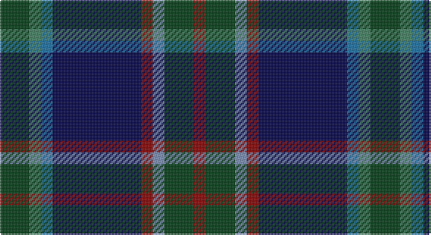

This page is one **sett** — a single exact thread-count. It belongs to the [tartan](/setts/dg5g2b2db15r2t2dg5r2/)
(the same proportion at any scale), whose colour order is pattern [GGBBRBGR](/stripes/ggbbrbgr/).

Part of the [Remember the Somme 1916](/tartans/remember-the-somme-1916/) tartan — the named design grouping this sett with its other cloths.

Sourced from register-of-tartans.  It is a [8 stripe tartan](/stripes/stripes8/).

Original link https://www.tartanregister.gov.uk/tartanDetails.aspx?ref=11098

## Register references

External register numbers recorded for this tartan.

- Scottish Register of Tartans: [11098](https://www.tartanregister.gov.uk/tartanDetails.aspx?ref=11098)

## Thread count
DG/20 G8 Ba8 DB60 DR8 B8 DG20 DR/8

One full sett is **252 threads**.

## Palette

Palette: <strong>Tartan Register</strong>
<table><thead><tr><th>Colour</th><th>Threads</th><th>Shade</th><th>Base</th><th>OKLCh</th></tr></thead><tbody><tr><td>DG/</td><td style="text-align:right;font-variant-numeric:tabular-nums">20</td><td><code style="background-color:#003C14;">#003C14</code> <small style="color:#888">#003C14</small></td><td>G <code style="background-color:#006100;">#006100</code></td><td><small style="color:#888">oklch(31.1% 0.089 148.5)</small></td></tr><tr><td>G</td><td style="text-align:right;font-variant-numeric:tabular-nums">8</td><td><code style="background-color:#408060;">#408060</code> <small style="color:#888">#408060</small></td><td>G <code style="background-color:#006100;">#006100</code></td><td><small style="color:#888">oklch(54.8% 0.084 160.1)</small></td></tr><tr><td>Ba</td><td style="text-align:right;font-variant-numeric:tabular-nums">8</td><td><code style="background-color:#1870A4;">#1870A4</code> <small style="color:#888">#1870A4</small></td><td>B <code style="background-color:#2A418A;">#2A418A</code></td><td><small style="color:#888">oklch(52.2% 0.113 241.2)</small></td></tr><tr><td>DB</td><td style="text-align:right;font-variant-numeric:tabular-nums">60</td><td><code style="background-color:#000048;">#000048</code> <small style="color:#888">#000048</small></td><td>B <code style="background-color:#2A418A;">#2A418A</code></td><td><small style="color:#888">oklch(18.2% 0.126 264.1)</small></td></tr><tr><td>DR</td><td style="text-align:right;font-variant-numeric:tabular-nums">8</td><td><code style="background-color:#880000;">#880000</code> <small style="color:#888">#880000</small></td><td>R <code style="background-color:#CC0000;">#CC0000</code></td><td><small style="color:#888">oklch(39.4% 0.162 29.2)</small></td></tr><tr><td>B</td><td style="text-align:right;font-variant-numeric:tabular-nums">8</td><td><code style="background-color:#788CB4;">#788CB4</code> <small style="color:#888">#788CB4</small></td><td>B <code style="background-color:#2A418A;">#2A418A</code></td><td><small style="color:#888">oklch(63.9% 0.065 264.0)</small></td></tr><tr><td>DG</td><td style="text-align:right;font-variant-numeric:tabular-nums">20</td><td><code style="background-color:#003C14;">#003C14</code> <small style="color:#888">#003C14</small></td><td>G <code style="background-color:#006100;">#006100</code></td><td><small style="color:#888">oklch(31.1% 0.089 148.5)</small></td></tr><tr><td>DR/</td><td style="text-align:right;font-variant-numeric:tabular-nums">8</td><td><code style="background-color:#880000;">#880000</code> <small style="color:#888">#880000</small></td><td>R <code style="background-color:#CC0000;">#CC0000</code></td><td><small style="color:#888">oklch(39.4% 0.162 29.2)</small></td></tr></tbody></table>

# Sample pattern

## Nearest tartans

The nearest existing variants by ΔTartan distance, with this tartan at the top so the swatches line up against it.

ΔTartan

Tartan

Sett

—

<a href="/ttd/edit/#slug=dg5g2b2db15r2t2dg5r2~x4">Remember the Somme 1916</a> <a class="nn-out" href="/variants/s8/dg5g2b2db15r2t2dg5r2~x4/" title="open its dictionary page">↗</a>

0.81

<a href="/ttd/edit/#slug=db10g42dbi8t8dbi8k24dbi8db71r10&amp;base=dg5g2b2db15r2t2dg5r2~x4">Robert Burns Legacy</a> <a class="nn-out" href="/variants/s9/db10g42dbi8t8dbi8k24dbi8db71r10/" title="open its dictionary page">↗</a>

0.90

<a href="/ttd/edit/#slug=k37r4db30n7k10w5n10y7~x2&amp;base=dg5g2b2db15r2t2dg5r2~x4">Yates</a> <a class="nn-out" href="/variants/s8/k37r4db30n7k10w5n10y7~x2/" title="open its dictionary page">↗</a>

0.93

<a href="/ttd/edit/#slug=k29r3dt24n6k8w4n8o6~x2&amp;base=dg5g2b2db15r2t2dg5r2~x4">Yates (Personal)</a> <a class="nn-out" href="/variants/s8/k29r3dt24n6k8w4n8o6~x2/" title="open its dictionary page">↗</a>

0.94

<a href="/ttd/edit/#slug=k3dbi20db8dbi4dg20k2dg2r2dg3lo3~x2&amp;base=dg5g2b2db15r2t2dg5r2~x4">Schmidt (2014)</a> <a class="nn-out" href="/variants/s10/k3dbi20db8dbi4dg20k2dg2r2dg3lo3~x2/" title="open its dictionary page">↗</a>

0.99

<a href="/ttd/edit/#slug=db3r2db18k6dg18ly2g3~x2&amp;base=dg5g2b2db15r2t2dg5r2~x4">McComb</a> <a class="nn-out" href="/variants/s7/db3r2db18k6dg18ly2g3~x2/" title="open its dictionary page">↗</a>

0.99

<a href="/ttd/edit/#slug=r3dg20k2n11k2db20lr2~x2&amp;base=dg5g2b2db15r2t2dg5r2~x4">Grandfather Mountain Games (District</a> <a class="nn-out" href="/variants/s7/r3dg20k2n11k2db20lr2~x2/" title="open its dictionary page">↗</a>

1.02

<a href="/ttd/edit/#slug=db4dy5g19dp5dy5k5dy5db36ly3~x2&amp;base=dg5g2b2db15r2t2dg5r2~x4">Suzugamine (Corporate)</a> <a class="nn-out" href="/variants/s9/db4dy5g19dp5dy5k5dy5db36ly3~x2/" title="open its dictionary page">↗</a>

1.07

<a href="/ttd/edit/#slug=db3r2db18k6gi18ly2g3~x2&amp;base=dg5g2b2db15r2t2dg5r2~x4">McComb (Personal)</a> <a class="nn-out" href="/variants/s7/db3r2db18k6gi18ly2g3~x2/" title="open its dictionary page">↗</a>

1.11

<a href="/ttd/edit/#slug=db9k30db9t3db5r3db5ly3db5g3~x2&amp;base=dg5g2b2db15r2t2dg5r2~x4">Fed. of Circles &amp; Solitaries (Corp.)</a> <a class="nn-out" href="/variants/s10/db9k30db9t3db5r3db5ly3db5g3~x2/" title="open its dictionary page">↗</a>

1.13

<a href="/ttd/edit/#slug=db17w2db2r2db2do12dg16lo3~x4&amp;base=dg5g2b2db15r2t2dg5r2~x4">Blairmore House</a> <a class="nn-out" href="/variants/s8/db17w2db2r2db2do12dg16lo3~x4/" title="open its dictionary page">↗</a>

## Neighbour map

Every grey dot is one of 14360 variants placed by the first two principal components of the ΔTartan feature space (44% of its variance). Red is this tartan; blue dots are its nearest — click one to open its page.

<svg viewBox="0 0 640 380" role="img" style="max-width:100%;height:auto;border:1px solid #e0e0e0;border-radius:4px;display:block" xmlns="http://www.w3.org/2000/svg"><image href="/nn/cloud.v1.png" width="640" height="380"/><a href="/variants/s9/db10g42dbi8t8dbi8k24dbi8db71r10/"><circle cx="193.6" cy="177.2" r="4" fill="#3465a4"><title>Robert Burns Legacy</title></circle></a><a href="/variants/s8/k37r4db30n7k10w5n10y7~x2/"><circle cx="174.5" cy="179.7" r="4" fill="#3465a4"><title>Yates</title></circle></a><a href="/variants/s8/k29r3dt24n6k8w4n8o6~x2/"><circle cx="174.5" cy="179.6" r="4" fill="#3465a4"><title>Yates (Personal)</title></circle></a><a href="/variants/s10/k3dbi20db8dbi4dg20k2dg2r2dg3lo3~x2/"><circle cx="192.7" cy="172.5" r="4" fill="#3465a4"><title>Schmidt (2014)</title></circle></a><a href="/variants/s7/db3r2db18k6dg18ly2g3~x2/"><circle cx="177.1" cy="182.7" r="4" fill="#3465a4"><title>McComb</title></circle></a><a href="/variants/s7/r3dg20k2n11k2db20lr2~x2/"><circle cx="155.3" cy="184.5" r="4" fill="#3465a4"><title>Grandfather Mountain Games (District</title></circle></a><a href="/variants/s9/db4dy5g19dp5dy5k5dy5db36ly3~x2/"><circle cx="224.2" cy="156.7" r="4" fill="#3465a4"><title>Suzugamine (Corporate)</title></circle></a><a href="/variants/s7/db3r2db18k6gi18ly2g3~x2/"><circle cx="184.9" cy="185.1" r="4" fill="#3465a4"><title>McComb (Personal)</title></circle></a><a href="/variants/s10/db9k30db9t3db5r3db5ly3db5g3~x2/"><circle cx="237.8" cy="166.2" r="4" fill="#3465a4"><title>Fed. of Circles &amp; Solitaries (Corp.)</title></circle></a><a href="/variants/s8/db17w2db2r2db2do12dg16lo3~x4/"><circle cx="176.9" cy="190.5" r="4" fill="#3465a4"><title>Blairmore House</title></circle></a><circle cx="190.0" cy="189.0" r="5" fill="#c00000"/></svg>

ID: /variants/s8/dg5g2b2db15r2t2dg5r2~x4/
