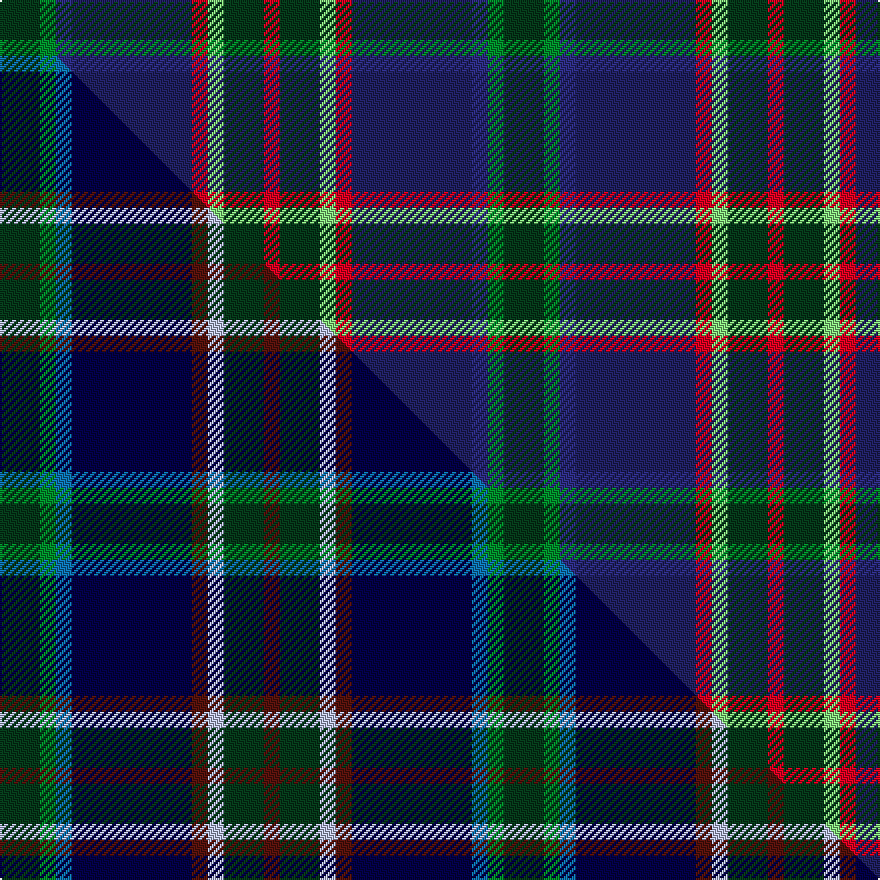

This is one **variant** — a specific cloth: this exact thread count and colourway, with its own
provenance below. It is one weaving of the [sett](/setts/dg5g2dbi2db15r2lg2dg5r2/) (the scale-free proportion — the
same cloth at any scale or shade), whose colour order is pattern [GGBBRYGR](/stripes/ggbbrygr/).

Part of the [Remember the Somme 1916](/tartans/remember-the-somme-1916/) tartan — the named design grouping this sett with its other cloths.

Sourced from tartans-authority.  It is a [8 stripe tartan](/stripes/stripes8/).

Original link [https://www.tartanregister.gov.uk/tartanDetails.aspx?ref=11098](https://www.tartanregister.gov.uk/tartanDetails.aspx?ref=11098)

Dataset <small>— provenance for this record, inherited from the source manifest</small>

<dl class="dataset-prov">
<dt>source</dt><dd><a href="/sources/tartans-authority/">Scottish Tartans Authority</a></dd>
<dt>data captured from</dt><dd><a href="https://github.com/thetartan/tartan-database/blob/master/data/tartans-authority/data.csv">https://github.com/thetartan/tartan-database/blob/master/data/tartans-authority/data.csv</a></dd>
<dt>data date</dt><dd>2014 <small>(this record)</small></dd>
<dt>licence</dt><dd><a href="https://creativecommons.org/licenses/by-nc-nd/4.0/">CC BY-NC-ND 4.0</a></dd>
</dl>

Capture chain <small>— the hands this data passed through, oldest first; each capture carries its own licence</small>

<ol class="capture-chain">
<li><a href="https://www.tartansauthority.com/">Scottish Tartans Authority</a> <small>the heritage body's archive — its tartan-ferret record browser is retired (links repaired to the SRT, above)</small></li>
<li><a href="https://github.com/thetartan/tartan-database">thetartan/tartan-database</a> <small>2016-2017</small> · <a href="https://creativecommons.org/licenses/by-nc-nd/4.0/">CC BY-NC-ND 4.0</a> <small>Levko Kravets's frozen compilation — the capture we vendored, and where its CC licence text came from</small></li>
<li>this dictionary <small>captured 2026-06-10 · commit 5bf86c7566</small> <small>each re-capture is a git commit to data/sources</small></li>
</ol>

## Register references

External register numbers recorded for this tartan.

- Scottish Register of Tartans: [11098](https://www.tartanregister.gov.uk/tartanDetails?ref=11098)
- Scottish Tartans Authority (ITI): 11098

## Thread count
DG/20 G8 DBi8 DB60 R8 LG8 DG20 R/8

One full sett is **252 threads**.

## Palette
<table><thead><tr><th>Colour</th><th>Shade</th><th>OKLCh</th></tr></thead><tbody><tr><td>LG</td><td><code style="background-color:#82D67A;">#82D67A</code> <small style="color:#888">#82D67A</small></td><td><small style="color:#888">oklch(80.1% 0.150 142.2)</small></td></tr><tr><td>DB</td><td><code style="background-color:#2C2C80;">#2C2C80</code> <small style="color:#888">#2C2C80</small></td><td><small style="color:#888">oklch(35.0% 0.138 276.6)</small></td></tr><tr><td>DB</td><td><code style="background-color:#202060;">#202060</code> <small style="color:#888">#202060</small></td><td><small style="color:#888">oklch(28.9% 0.111 276.9)</small></td></tr><tr><td>DG</td><td><code style="background-color:#053819;">#053819</code> <small style="color:#888">#053819</small></td><td><small style="color:#888">oklch(30.0% 0.075 151.3)</small></td></tr><tr><td>R</td><td><code style="background-color:#D60020;">#D60020</code> <small style="color:#888">#D60020</small></td><td><small style="color:#888">oklch(55.2% 0.224 25.5)</small></td></tr><tr><td>G</td><td><code style="background-color:#008B2A;">#008B2A</code> <small style="color:#888">#008B2A</small></td><td><small style="color:#888">oklch(55.4% 0.170 145.9)</small></td></tr></tbody></table>

# Sample pattern

## Compared to the master

This cloth is one sett of its design; the master sett (the exemplar the design is anchored on) is below for comparison.

Its **ΔTartan distance** from the master is **0.41** — the same measure the nearest-tartans table ranks by (0 is identical; a re-scale of the same cloth is near 0, a recolour or a different proportion further).

<figure class="master-compare" style="margin:0">

this sett
master sett ★

<figcaption style="color:#888;font-size:smaller">One weave of this sett against the <a href="/setts/dg5g2t2db15dr2lb2dg5dr2/">master sett ★</a>, split on the diagonal: a shared proportion runs seamlessly across it with only the shades shifting; a different proportion breaks on it.</figcaption>
</figure>

## Nearest tartan variants

The nearest existing variants by ΔTartan distance, with this cloth at the top so the swatches line up against it.

ΔTartan

Threads

Variant

Sett

—

252

<a href="/variants/s8/dg5g2dbi2db15r2lg2dg5r2~x4~dbi1406275-db1204274/">Remember the Somme 1916</a>

<a href="/ttd/edit/#slug=dg5g2b2k15dr2lb2dg5dr2~x4~b2105244-k0705267&amp;base=dg5g2dbi2db15r2lg2dg5r2~x4~dbi1406275-db1204274" title="compare in the TTD">0.41</a>

252

<a href="/variants/s8/dg5g2t2db15dr2lb2dg5dr2~x4~t2105244-db0705267/">Remember the Somme 1916</a>

<a href="/ttd/edit/#slug=dg5t2dg9db19r9ly2~x2&amp;base=dg5g2dbi2db15r2lg2dg5r2~x4~dbi1406275-db1204274" title="compare in the TTD">1.65</a>

170

<a href="/variants/s6/dg5t2dg9db19r9ly2~x2/">Lyle and Scott</a>

<a href="/ttd/edit/#slug=dg5db2dg9k19r9y2~x2~db1406275-k0705267&amp;base=dg5g2dbi2db15r2lg2dg5r2~x4~dbi1406275-db1204274" title="compare in the TTD">1.65</a>

170

<a href="/variants/s6/dg5dbi2dg9db19r9y2~x2~dbi1406275-db0705267/">Lyle and Scott</a>

<a href="/ttd/edit/#slug=lb8n4db30dt30r3dt4~x2&amp;base=dg5g2dbi2db15r2lg2dg5r2~x4~dbi1406275-db1204274" title="compare in the TTD">1.94</a>

292

<a href="/variants/s6/lb8n4db30dt30r3dt4~x2/">Hutchesons' Grammar (Corporate)</a>

<a href="/ttd/edit/#slug=db17w2db2r2db2do12dg16y3~x4&amp;base=dg5g2dbi2db15r2lg2dg5r2~x4~dbi1406275-db1204274" title="compare in the TTD">2.05</a>

368

<a href="/variants/s8/db17w2db2r2db2do12dg16y3~x4/">Blairmore House</a>

<a href="/ttd/edit/#slug=r12db3g5dt16y2g2~x2~db1406275-dt1204274&amp;base=dg5g2dbi2db15r2lg2dg5r2~x4~dbi1406275-db1204274" title="compare in the TTD">2.27</a>

132

<a href="/variants/s6/r12dbi3g5db16y2g2~x2~dbi1406275-db1204274/">Dunbog Primary School Corporate Tartan</a>

<a href="/ttd/edit/#slug=dg3lo2o10dg10db20dg12r3db10w2~x2&amp;base=dg5g2dbi2db15r2lg2dg5r2~x4~dbi1406275-db1204274" title="compare in the TTD">2.36</a>

278

<a href="/variants/s9/dg3lo2o10dg10db20dg12r3db10w2~x2/">Patel Name Tartan</a>

<a href="/ttd/edit/#slug=dr4dg27o2db25ly5dg3o3~x2&amp;base=dg5g2dbi2db15r2lg2dg5r2~x4~dbi1406275-db1204274" title="compare in the TTD">2.38</a>

262

<a href="/variants/s7/dr4dg27o2db25ly5dg3o3~x2/">Kilkenny, County (District)</a>

<a href="/ttd/edit/#slug=dr5dg27o2b25y7dg3dr3~x2&amp;base=dg5g2dbi2db15r2lg2dg5r2~x4~dbi1406275-db1204274" title="compare in the TTD">2.38</a>

272

<a href="/variants/s7/dr5dg27o2b25y7dg3dr3~x2/">Kilkenny</a>

<a href="/ttd/edit/#slug=db34w5db5r5db5do26g33o6~x2&amp;base=dg5g2dbi2db15r2lg2dg5r2~x4~dbi1406275-db1204274" title="compare in the TTD">2.46</a>

396

<a href="/variants/s8/db34w5db5r5db5do26g33o6~x2/">Blairmore</a>

## Neighbour map

Every grey dot is one of 13621 variants placed by the first two principal components of the ΔTartan feature space (42% of its variance). Red is this tartan; blue dots are its nearest — click one to open its page.

<svg viewBox="0 0 640 380" role="img" style="max-width:100%;height:auto;border:1px solid #e0e0e0;border-radius:4px;display:block" xmlns="http://www.w3.org/2000/svg"><image href="/nn/cloud.v1.png" width="640" height="380"/><a href="/variants/s8/dg5g2t2db15dr2lb2dg5dr2~x4~t2105244-db0705267/"><circle cx="229.7" cy="202.9" r="4" fill="#3465a4"><title>Remember the Somme 1916</title></circle></a><a href="/variants/s6/dg5t2dg9db19r9ly2~x2/"><circle cx="219.5" cy="217.2" r="4" fill="#3465a4"><title>Lyle and Scott</title></circle></a><a href="/variants/s6/dg5dbi2dg9db19r9y2~x2~dbi1406275-db0705267/"><circle cx="220.2" cy="215.1" r="4" fill="#3465a4"><title>Lyle and Scott</title></circle></a><a href="/variants/s6/lb8n4db30dt30r3dt4~x2/"><circle cx="276.3" cy="215.1" r="4" fill="#3465a4"><title>Hutchesons' Grammar (Corporate)</title></circle></a><a href="/variants/s8/db17w2db2r2db2do12dg16y3~x4/"><circle cx="214.9" cy="200.2" r="4" fill="#3465a4"><title>Blairmore House</title></circle></a><a href="/variants/s6/r12dbi3g5db16y2g2~x2~dbi1406275-db1204274/"><circle cx="205.7" cy="213.5" r="4" fill="#3465a4"><title>Dunbog Primary School Corporate Tartan</title></circle></a><a href="/variants/s9/dg3lo2o10dg10db20dg12r3db10w2~x2/"><circle cx="196.5" cy="191.9" r="4" fill="#3465a4"><title>Patel Name Tartan</title></circle></a><a href="/variants/s7/dr4dg27o2db25ly5dg3o3~x2/"><circle cx="278.4" cy="184.3" r="4" fill="#3465a4"><title>Kilkenny, County (District)</title></circle></a><a href="/variants/s7/dr5dg27o2b25y7dg3dr3~x2/"><circle cx="274.7" cy="192.7" r="4" fill="#3465a4"><title>Kilkenny</title></circle></a><a href="/variants/s8/db34w5db5r5db5do26g33o6~x2/"><circle cx="150.8" cy="196.0" r="4" fill="#3465a4"><title>Blairmore</title></circle></a><circle cx="211.0" cy="188.0" r="5" fill="#c00000"/><text x="320" y="376" text-anchor="middle" font-size="11" fill="#999">ground</text><text x="11" y="190" text-anchor="middle" font-size="11" fill="#999" transform="rotate(-90 11 190)">complexity</text></svg>

ID: /variants/s8/dg5g2dbi2db15r2lg2dg5r2~x4~dbi1406275-db1204274/
