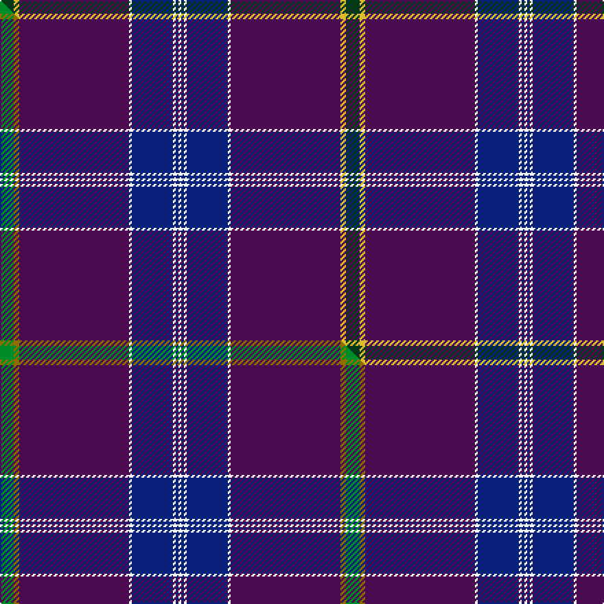

This is one **variant** — a specific cloth: this exact thread count and colourway, with its own
provenance below. It is one weaving of the [sett](/tartans/j/ja/jackson/) (the scale-free proportion — the
same cloth at any scale or shade), whose colour order is pattern [GYBWBWBW](/stripes/gybwbwbw/).

Part of the [Jackson](/tartans/j/ja/jackson/) tartan — the named design grouping this sett with its other cloths.

Sourced from tartans-authority.  It is a [8 stripe tartan](/stripes/stripes8/).

Original link <code>http://www.tartansauthority.com/tartan-ferret/display/6317/</code> — retired · [Internet Archive copy](https://web.archive.org/web/*/http://www.tartansauthority.com/tartan-ferret/display/6317/*)

Dataset <small>— provenance for this record, inherited from the source manifest</small>

<dl class="dataset-prov">
<dt>source</dt><dd><a href="/sources/tartans-authority/">Scottish Tartans Authority</a></dd>
<dt>data captured from</dt><dd><a href="https://github.com/thetartan/tartan-database/blob/master/data/tartans-authority/data.csv">https://github.com/thetartan/tartan-database/blob/master/data/tartans-authority/data.csv</a></dd>
<dt>data date</dt><dd>July 2004 <small>(this record)</small></dd>
<dt>licence</dt><dd><a href="https://creativecommons.org/licenses/by-nc-nd/4.0/">CC BY-NC-ND 4.0</a></dd>
</dl>

Capture chain <small>— the hands this data passed through, oldest first; each capture carries its own licence</small>

<ol class="capture-chain">
<li><a href="https://www.tartansauthority.com/">Scottish Tartans Authority</a> <small>the heritage body’s archive — its tartan-ferret record browser is retired; dead record links are shown unlinked, with an Internet Archive copy (ITI numbers are not SRT references)</small></li>
<li><a href="https://github.com/thetartan/tartan-database">thetartan/tartan-database</a> <small>2016-2017</small> · <a href="https://creativecommons.org/licenses/by-nc-nd/4.0/">CC BY-NC-ND 4.0</a> <small>Levko Kravets's frozen compilation — the capture we vendored, and where its CC licence text came from</small></li>
<li>this dictionary <small>captured 2026-06-10 · commit 5bf86c7566</small> <small>each re-capture is a git commit to data/sources</small></li>
</ol>

## Register references

External register numbers recorded for this tartan.

- Scottish Tartans Authority (ITI): 6317

## Thread count
DG/10 LY4 DP80 W2 DB30 W2 DB2 W/2

One full sett is **252 threads**.

## Palette
<table><thead><tr><th>Colour</th><th>Shade</th><th>OKLCh</th></tr></thead><tbody><tr><td>DB</td><td><code style="background-color:#082077;">#082077</code> <small style="color:#888">#082077</small></td><td><small style="color:#888">oklch(30.0% 0.149 265.1)</small></td></tr><tr><td>DG</td><td><code style="background-color:#053819;">#053819</code> <small style="color:#888">#053819</small></td><td><small style="color:#888">oklch(30.0% 0.075 151.3)</small></td></tr><tr><td>DP</td><td><code style="background-color:#4B0B4F;">#4B0B4F</code> <small style="color:#888">#4B0B4F</small></td><td><small style="color:#888">oklch(30.1% 0.125 325.4)</small></td></tr><tr><td>W</td><td><code style="background-color:#F7F7F7;">#F7F7F7</code> <small style="color:#888">#F7F7F7</small></td><td><small style="color:#888">oklch(97.6% 0.000 89.9)</small></td></tr><tr><td>LY</td><td><code style="background-color:#DCBC32;">#DCBC32</code> <small style="color:#888">#DCBC32</small></td><td><small style="color:#888">oklch(80.0% 0.150 95.2)</small></td></tr></tbody></table>

# Sample pattern

## Compared to the master

This cloth is one sett of its design; the master sett (the exemplar the design is anchored on) is below for comparison.

Its **ΔTartan distance** from the master is **0.06** — the same measure the nearest-tartans table ranks by (0 is identical; a re-scale of the same cloth is near 0, a recolour or a different proportion further).

<figure class="master-compare" style="margin:0">

this sett
master sett ★

<figcaption style="color:#888;font-size:smaller">One weave of this sett against the <a href="/setts/g5y2dp40w1db15w1db1w1/">master sett ★</a>, split on the diagonal: a shared proportion runs seamlessly across it with only the shades shifting; a different proportion breaks on it.</figcaption>
</figure>

## Nearest tartan variants

The nearest existing variants by ΔTartan distance, with this cloth at the top so the swatches line up against it.

ΔTartan

Threads

Variant

Sett

—

252

<a href="/variants/s8/dg5ly2dp40w1db15w1db1w1~x2/">Jackson (Name)</a>

<a href="/ttd/edit/#slug=g5y2dp40w1db15w1db1w1~x2&amp;base=dg5ly2dp40w1db15w1db1w1~x2" title="compare in the TTD">0.06</a>

252

<a href="/variants/s8/g5y2dp40w1db15w1db1w1~x2/">Jackson (Personal)</a>

<a href="/ttd/edit/#slug=n42db2n2db17lo8y4~x2~db1208266-lo2706076&amp;base=dg5ly2dp40w1db15w1db1w1~x2" title="compare in the TTD">3.16</a>

208

<a href="/variants/s6/n42db2n2db17lo8y4~x2~db1208266-lo2706076/">Connecticut State Police PB (Cor.)</a>

<a href="/ttd/edit/#slug=db58n3g16dr3ly2g7db29dr3n2~x2&amp;base=dg5ly2dp40w1db15w1db1w1~x2" title="compare in the TTD">3.18</a>

372

<a href="/variants/s9/db58n3g16dr3ly2g7db29dr3n2~x2/">Aberdeen Mither Kirk (St Nicholas)</a>

<a href="/ttd/edit/#slug=w3dp2ly2dp38db28o2db2r2~x2&amp;base=dg5ly2dp40w1db15w1db1w1~x2" title="compare in the TTD">3.31</a>

306

<a href="/variants/s8/w3dp2ly2dp38db28o2db2r2~x2/">Gretna Gold (Fashion)</a>

<a href="/ttd/edit/#slug=db21n2lr1n2db1dr2db1y6~x4&amp;base=dg5ly2dp40w1db15w1db1w1~x2" title="compare in the TTD">3.53</a>

180

<a href="/variants/s8/db21n2lr1n2db1dr2db1y6~x4/">Blue Rust (Corporate)</a>

<a href="/ttd/edit/#slug=dp35dt2dy1dt1lb1dt5dr2g5lo4~x2&amp;base=dg5ly2dp40w1db15w1db1w1~x2" title="compare in the TTD">3.62</a>

146

<a href="/variants/s9/dp35dt2dy1dt1lb1dt5dr2g5lo4~x2/">Millennium (Langholm) (Corporate)</a>

<a href="/ttd/edit/#slug=dt47y1db27lr4g5y1lr8b1db1~x2~dt1000000-lr3201060&amp;base=dg5ly2dp40w1db15w1db1w1~x2" title="compare in the TTD">3.69</a>

284

<a href="/variants/s9/dt47y1db27lr4g5y1lr8b1db1~x2~dt1000000-lr3201060/">Brighton Mac Dermotte</a>

<a href="/ttd/edit/#slug=w2dr45y3dg8db8w2~x2&amp;base=dg5ly2dp40w1db15w1db1w1~x2" title="compare in the TTD">3.81</a>

264

<a href="/variants/s6/w2dr45y3dg8db8w2~x2/">Glencross (Moniaive) (Personal)</a>

<a href="/ttd/edit/#slug=db46ly1y3dg13ly1dr7g3ly1~x2&amp;base=dg5ly2dp40w1db15w1db1w1~x2" title="compare in the TTD">3.86</a>

206

<a href="/variants/s8/db46ly1y3dg13ly1dr7g3ly1~x2/">Victorian Highland Pipe Band Association (Australia)</a>

<a href="/ttd/edit/#slug=w6dt32n3dt3n1dt3n2db4dt1y2~x2~dt1204274-db1406275&amp;base=dg5ly2dp40w1db15w1db1w1~x2" title="compare in the TTD">3.87</a>

212

<a href="/variants/s10/w6db32n3db3n1db3n2dbi4db1y2~x2~db1204274-dbi1406275/">X Marks the Scot</a>

## Neighbour map

Every grey dot is one of 13657 variants placed by the first two principal components of the ΔTartan feature space (42% of its variance). Red is this tartan; blue dots are its nearest — click one to open its page. The map is a flat projection of a many-dimensional space — [how to read it](/posts/neighbourhood-maps/).

<svg viewBox="0 0 640 380" role="img" style="max-width:100%;height:auto;border:1px solid #e0e0e0;border-radius:4px;display:block" xmlns="http://www.w3.org/2000/svg"><image href="/nn/cloud.v1.png" width="640" height="380"/><a href="/variants/s8/g5y2dp40w1db15w1db1w1~x2/"><circle cx="438.1" cy="111.9" r="4" fill="#3465a4"><title>Jackson (Personal)</title></circle></a><a href="/variants/s6/n42db2n2db17lo8y4~x2~db1208266-lo2706076/"><circle cx="432.2" cy="196.5" r="4" fill="#3465a4"><title>Connecticut State Police PB (Cor.)</title></circle></a><a href="/variants/s9/db58n3g16dr3ly2g7db29dr3n2~x2/"><circle cx="482.4" cy="138.5" r="4" fill="#3465a4"><title>Aberdeen Mither Kirk (St Nicholas)</title></circle></a><a href="/variants/s8/w3dp2ly2dp38db28o2db2r2~x2/"><circle cx="345.0" cy="128.7" r="4" fill="#3465a4"><title>Gretna Gold (Fashion)</title></circle></a><a href="/variants/s8/db21n2lr1n2db1dr2db1y6~x4/"><circle cx="439.3" cy="150.2" r="4" fill="#3465a4"><title>Blue Rust (Corporate)</title></circle></a><a href="/variants/s9/dp35dt2dy1dt1lb1dt5dr2g5lo4~x2/"><circle cx="406.3" cy="81.0" r="4" fill="#3465a4"><title>Millennium (Langholm) (Corporate)</title></circle></a><a href="/variants/s9/dt47y1db27lr4g5y1lr8b1db1~x2~dt1000000-lr3201060/"><circle cx="334.0" cy="95.8" r="4" fill="#3465a4"><title>Brighton Mac Dermotte</title></circle></a><a href="/variants/s6/w2dr45y3dg8db8w2~x2/"><circle cx="445.5" cy="150.6" r="4" fill="#3465a4"><title>Glencross (Moniaive) (Personal)</title></circle></a><a href="/variants/s8/db46ly1y3dg13ly1dr7g3ly1~x2/"><circle cx="436.2" cy="106.7" r="4" fill="#3465a4"><title>Victorian Highland Pipe Band Association (Australia)</title></circle></a><a href="/variants/s10/w6db32n3db3n1db3n2dbi4db1y2~x2~db1204274-dbi1406275/"><circle cx="437.3" cy="103.8" r="4" fill="#3465a4"><title>X Marks the Scot</title></circle></a><circle cx="451.2" cy="118.4" r="5" fill="#c00000"/><text x="320" y="376" text-anchor="middle" font-size="11" fill="#999">ground</text><text x="11" y="190" text-anchor="middle" font-size="11" fill="#999" transform="rotate(-90 11 190)">complexity</text></svg>

ID: /variants/s8/dg5ly2dp40w1db15w1db1w1~x2/
