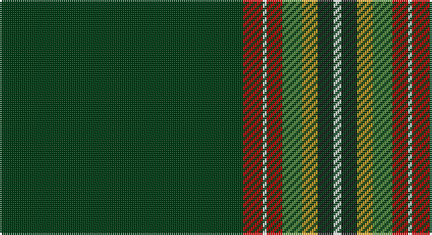

This page is one **sett** — a single exact thread-count. It belongs to the [tartan](/setts/dg62r5w1r4g5lo4dt4w2/)
(the same proportion at any scale), whose colour order is pattern [GRWRGYBW](/stripes/grwrgybw/).

Sourced from register-of-tartans.  It is a [8 stripe tartan](/stripes/stripes8/).

Original link https://www.tartanregister.gov.uk/tartanDetails.aspx?ref=11425

## Register references

External register numbers recorded for this tartan.

- Scottish Register of Tartans: [11425](https://www.tartanregister.gov.uk/tartanDetails.aspx?ref=11425)

## Thread count
DG/124 R10 W2 R8 LG10 Y8 K8 W/4

One full sett is **220 threads**.

## Palette

Palette: <strong>Tartan Register</strong>
<table><thead><tr><th>Colour</th><th>Threads</th><th>Shade</th><th>Base</th><th>OKLCh</th></tr></thead><tbody><tr><td>DG/</td><td style="text-align:right;font-variant-numeric:tabular-nums">124</td><td><code style="background-color:#003C14;">#003C14</code> <small style="color:#888">#003C14</small></td><td>G <code style="background-color:#006100;">#006100</code></td><td><small style="color:#888">oklch(31.1% 0.089 148.5)</small></td></tr><tr><td>R</td><td style="text-align:right;font-variant-numeric:tabular-nums">10</td><td><code style="background-color:#C80000;">#C80000</code> <small style="color:#888">#C80000</small></td><td>R <code style="background-color:#CC0000;">#CC0000</code></td><td><small style="color:#888">oklch(52.3% 0.215 29.2)</small></td></tr><tr><td>W</td><td style="text-align:right;font-variant-numeric:tabular-nums">2</td><td><code style="background-color:#F8F8F8;">#F8F8F8</code> <small style="color:#888">#F8F8F8</small></td><td>W <code style="background-color:#F7F7F7;">#F7F7F7</code></td><td><small style="color:#888">oklch(97.9% 0.000 89.9)</small></td></tr><tr><td>R</td><td style="text-align:right;font-variant-numeric:tabular-nums">8</td><td><code style="background-color:#C80000;">#C80000</code> <small style="color:#888">#C80000</small></td><td>R <code style="background-color:#CC0000;">#CC0000</code></td><td><small style="color:#888">oklch(52.3% 0.215 29.2)</small></td></tr><tr><td>LG</td><td style="text-align:right;font-variant-numeric:tabular-nums">10</td><td><code style="background-color:#649848;">#649848</code> <small style="color:#888">#649848</small></td><td>G <code style="background-color:#006100;">#006100</code></td><td><small style="color:#888">oklch(62.4% 0.125 135.7)</small></td></tr><tr><td>Y</td><td style="text-align:right;font-variant-numeric:tabular-nums">8</td><td><code style="background-color:#E0A126;">#E0A126</code> <small style="color:#888">#E0A126</small></td><td>Y <code style="background-color:#F2BF00;">#F2BF00</code></td><td><small style="color:#888">oklch(75.1% 0.146 78.3)</small></td></tr><tr><td>K</td><td style="text-align:right;font-variant-numeric:tabular-nums">8</td><td><code style="background-color:#1C1C1C;">#1C1C1C</code> <small style="color:#888">#1C1C1C</small></td><td>B <code style="background-color:#2A418A;">#2A418A</code></td><td><small style="color:#888">oklch(22.6% 0.000 89.9)</small></td></tr><tr><td>W/</td><td style="text-align:right;font-variant-numeric:tabular-nums">4</td><td><code style="background-color:#F8F8F8;">#F8F8F8</code> <small style="color:#888">#F8F8F8</small></td><td>W <code style="background-color:#F7F7F7;">#F7F7F7</code></td><td><small style="color:#888">oklch(97.9% 0.000 89.9)</small></td></tr></tbody></table>

# Sample pattern

## Nearest tartans

The nearest existing variants by ΔTartan distance, with this tartan at the top so the swatches line up against it.

ΔTartan

Tartan

Sett

—

<a href="/ttd/edit/#slug=dg62r5w1r4g5lo4dt4w2~x2">Greeven, Wolfgang H (Personal)</a> <a class="nn-out" href="/variants/s8/dg62r5w1r4g5lo4dt4w2~x2/" title="open its dictionary page">↗</a>

1.27

<a href="/ttd/edit/#slug=w2k2w2k10lb1dg40w1r4w1dg5ri1~x2&amp;base=dg62r5w1r4g5lo4dt4w2~x2">Knox, David Paul (Personal)</a> <a class="nn-out" href="/variants/s11/w2k2w2k10lb1dg40w1r4w1dg5ri1~x2/" title="open its dictionary page">↗</a>

1.32

<a href="/ttd/edit/#slug=dg60w11r5b5k1lo4~x2&amp;base=dg62r5w1r4g5lo4dt4w2~x2">Christie Hunting (London) (Personal)</a> <a class="nn-out" href="/variants/s6/dg60w11r5b5k1lo4~x2/" title="open its dictionary page">↗</a>

1.38

<a href="/ttd/edit/#slug=dg40k3w1k5r1k2ri10~x2&amp;base=dg62r5w1r4g5lo4dt4w2~x2">Aviemore Highland (Corporate)</a> <a class="nn-out" href="/variants/s7/dg40k3w1k5r1k2ri10~x2/" title="open its dictionary page">↗</a>

1.44

<a href="/ttd/edit/#slug=dg60db1lo5k1r15k1w15k1dg15~x2&amp;base=dg62r5w1r4g5lo4dt4w2~x2">Michael Pellicci (Personal)</a> <a class="nn-out" href="/variants/s9/dg60db1lo5k1r15k1w15k1dg15~x2/" title="open its dictionary page">↗</a>

1.45

<a href="/ttd/edit/#slug=dg67k2dg2k2dg2ly8r8k8ly2t7~x2&amp;base=dg62r5w1r4g5lo4dt4w2~x2">Moran (French) (Name)</a> <a class="nn-out" href="/variants/s10/dg67k2dg2k2dg2ly8r8k8ly2t7~x2/" title="open its dictionary page">↗</a>

1.46

<a href="/ttd/edit/#slug=dg115k15r8k4b8k4ly8k4g8~x2&amp;base=dg62r5w1r4g5lo4dt4w2~x2">Granvert</a> <a class="nn-out" href="/variants/s9/dg115k15r8k4b8k4ly8k4g8~x2/" title="open its dictionary page">↗</a>

1.48

<a href="/ttd/edit/#slug=r5k3r9dg56t4dg2w3&amp;base=dg62r5w1r4g5lo4dt4w2~x2">MTV</a> <a class="nn-out" href="/variants/s7/r5k3r9dg56t4dg2w3/" title="open its dictionary page">↗</a>

1.49

<a href="/ttd/edit/#slug=dg32t2k7ly1k1w1k2r7dg5k1dg3w1~x2&amp;base=dg62r5w1r4g5lo4dt4w2~x2">Stuart/Stewart (Variant)</a> <a class="nn-out" href="/variants/s12/dg32t2k7ly1k1w1k2r7dg5k1dg3w1~x2/" title="open its dictionary page">↗</a>

1.52

<a href="/ttd/edit/#slug=dg3gi2dg40g2dg4g8w1gi4dg2lo4ly4w2~x2&amp;base=dg62r5w1r4g5lo4dt4w2~x2">Springbok (Fashion)</a> <a class="nn-out" href="/variants/s12/dg3gi2dg40g2dg4g8w1gi4dg2lo4ly4w2~x2/" title="open its dictionary page">↗</a>

1.53

<a href="/ttd/edit/#slug=dg3g2dg40dy2dg4dy8w1g4dg2o4ly4w2~x2&amp;base=dg62r5w1r4g5lo4dt4w2~x2">Springbok</a> <a class="nn-out" href="/variants/s12/dg3g2dg40dy2dg4dy8w1g4dg2o4ly4w2~x2/" title="open its dictionary page">↗</a>

## Neighbour map

Every grey dot is one of 14360 variants placed by the first two principal components of the ΔTartan feature space (44% of its variance). Red is this tartan; blue dots are its nearest — click one to open its page.

<svg viewBox="0 0 640 380" role="img" style="max-width:100%;height:auto;border:1px solid #e0e0e0;border-radius:4px;display:block" xmlns="http://www.w3.org/2000/svg"><image href="/nn/cloud.v1.png" width="640" height="380"/><a href="/variants/s11/w2k2w2k10lb1dg40w1r4w1dg5ri1~x2/"><circle cx="384.3" cy="55.3" r="4" fill="#3465a4"><title>Knox, David Paul (Personal)</title></circle></a><a href="/variants/s6/dg60w11r5b5k1lo4~x2/"><circle cx="419.4" cy="87.2" r="4" fill="#3465a4"><title>Christie Hunting (London) (Personal)</title></circle></a><a href="/variants/s7/dg40k3w1k5r1k2ri10~x2/"><circle cx="420.3" cy="110.2" r="4" fill="#3465a4"><title>Aviemore Highland (Corporate)</title></circle></a><a href="/variants/s9/dg60db1lo5k1r15k1w15k1dg15~x2/"><circle cx="382.3" cy="64.6" r="4" fill="#3465a4"><title>Michael Pellicci (Personal)</title></circle></a><a href="/variants/s10/dg67k2dg2k2dg2ly8r8k8ly2t7~x2/"><circle cx="415.2" cy="92.2" r="4" fill="#3465a4"><title>Moran (French) (Name)</title></circle></a><a href="/variants/s9/dg115k15r8k4b8k4ly8k4g8~x2/"><circle cx="420.5" cy="101.3" r="4" fill="#3465a4"><title>Granvert</title></circle></a><a href="/variants/s7/r5k3r9dg56t4dg2w3/"><circle cx="470.0" cy="132.0" r="4" fill="#3465a4"><title>MTV</title></circle></a><a href="/variants/s12/dg32t2k7ly1k1w1k2r7dg5k1dg3w1~x2/"><circle cx="381.0" cy="79.2" r="4" fill="#3465a4"><title>Stuart/Stewart (Variant)</title></circle></a><a href="/variants/s12/dg3gi2dg40g2dg4g8w1gi4dg2lo4ly4w2~x2/"><circle cx="377.2" cy="66.5" r="4" fill="#3465a4"><title>Springbok (Fashion)</title></circle></a><a href="/variants/s12/dg3g2dg40dy2dg4dy8w1g4dg2o4ly4w2~x2/"><circle cx="397.1" cy="75.2" r="4" fill="#3465a4"><title>Springbok</title></circle></a><circle cx="462.2" cy="72.8" r="5" fill="#c00000"/></svg>

ID: /variants/s8/dg62r5w1r4g5lo4dt4w2~x2/
