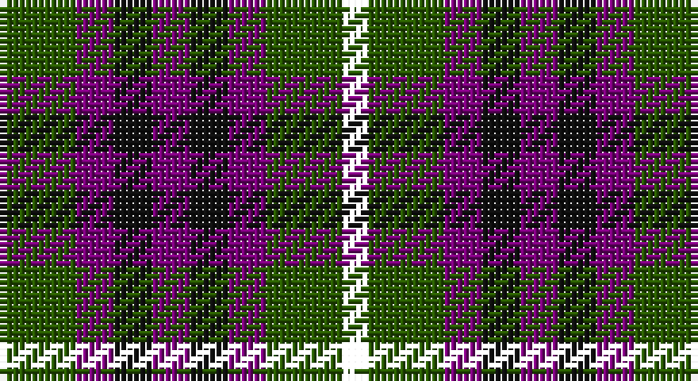

This page is one **sett** — a single exact thread-count. It belongs to the [tartan](/setts/dg6dp3ki3dp3ki3dp3dg6k2/)
(the same proportion at any scale), whose colour order is pattern [GBKBKBGK](/stripes/gbkbkbgk/).

Sourced from register-of-tartans.  It is a [8 stripe tartan](/stripes/stripes8/).

Original link https://www.tartanregister.gov.uk/tartanDetails.aspx?ref=4712

## Register references

External register numbers recorded for this tartan.

- Scottish Register of Tartans: [4712](https://www.tartanregister.gov.uk/tartanDetails.aspx?ref=4712)
- Scottish Tartans Authority (ITI): 5594

## Thread count
G/12 P6 K6 P6 K6 P6 G12 YY/4

One full sett is **100 threads**.

## Palette

Palette: <strong>Tartan Register</strong>
<table><thead><tr><th>Colour</th><th>Threads</th><th>Shade</th><th>Base</th><th>OKLCh</th></tr></thead><tbody><tr><td>G/</td><td style="text-align:right;font-variant-numeric:tabular-nums">12</td><td><code style="background-color:#285800;">#285800</code> <small style="color:#888">#285800</small></td><td>G <code style="background-color:#006100;">#006100</code></td><td><small style="color:#888">oklch(41.0% 0.122 135.8)</small></td></tr><tr><td>P</td><td style="text-align:right;font-variant-numeric:tabular-nums">6</td><td><code style="background-color:#780078;">#780078</code> <small style="color:#888">#780078</small></td><td>B <code style="background-color:#2A418A;">#2A418A</code></td><td><small style="color:#888">oklch(40.2% 0.185 328.4)</small></td></tr><tr><td>K</td><td style="text-align:right;font-variant-numeric:tabular-nums">6</td><td><code style="background-color:#101010;">#101010</code> <small style="color:#888">#101010</small></td><td>K <code style="background-color:#000000;">#000000</code></td><td><small style="color:#888">oklch(17.3% 0.000 89.9)</small></td></tr><tr><td>P</td><td style="text-align:right;font-variant-numeric:tabular-nums">6</td><td><code style="background-color:#780078;">#780078</code> <small style="color:#888">#780078</small></td><td>B <code style="background-color:#2A418A;">#2A418A</code></td><td><small style="color:#888">oklch(40.2% 0.185 328.4)</small></td></tr><tr><td>K</td><td style="text-align:right;font-variant-numeric:tabular-nums">6</td><td><code style="background-color:#101010;">#101010</code> <small style="color:#888">#101010</small></td><td>K <code style="background-color:#000000;">#000000</code></td><td><small style="color:#888">oklch(17.3% 0.000 89.9)</small></td></tr><tr><td>P</td><td style="text-align:right;font-variant-numeric:tabular-nums">6</td><td><code style="background-color:#780078;">#780078</code> <small style="color:#888">#780078</small></td><td>B <code style="background-color:#2A418A;">#2A418A</code></td><td><small style="color:#888">oklch(40.2% 0.185 328.4)</small></td></tr><tr><td>G</td><td style="text-align:right;font-variant-numeric:tabular-nums">12</td><td><code style="background-color:#285800;">#285800</code> <small style="color:#888">#285800</small></td><td>G <code style="background-color:#006100;">#006100</code></td><td><small style="color:#888">oklch(41.0% 0.122 135.8)</small></td></tr><tr><td>/</td><td style="text-align:right;font-variant-numeric:tabular-nums">4</td><td><code style="background-color:;"></code> <small style="color:#888"></small></td><td> <code style="background-color:;"></code></td><td><small style="color:#888"></small></td></tr></tbody></table>

# Sample pattern

## Nearest tartans

The nearest existing variants by ΔTartan distance, with this tartan at the top so the swatches line up against it.

ΔTartan

Tartan

Sett

—

<a href="/ttd/edit/#slug=dg6dp3ki3dp3ki3dp3dg6k2~x2">Wilson's No.173</a> <a class="nn-out" href="/variants/s8/dg6dp3ki3dp3ki3dp3dg6k2~x2/" title="open its dictionary page">↗</a>

0.47

<a href="/ttd/edit/#slug=g6dp3k3dp3k3dp3g6r2~x2&amp;base=dg6dp3ki3dp3ki3dp3dg6k2~x2">Wilson's No.137</a> <a class="nn-out" href="/variants/s8/g6dp3k3dp3k3dp3g6r2~x2/" title="open its dictionary page">↗</a>

1.03

<a href="/ttd/edit/#slug=k1db3k3dg3r1dg3k3dg1r1~x2&amp;base=dg6dp3ki3dp3ki3dp3dg6k2~x2">Unidentified No 30</a> <a class="nn-out" href="/variants/s9/k1db3k3dg3r1dg3k3dg1r1~x2/" title="open its dictionary page">↗</a>

1.15

<a href="/ttd/edit/#slug=dr5g6y2g6dr5db6dr2~x2&amp;base=dg6dp3ki3dp3ki3dp3dg6k2~x2">Gleneagles Group</a> <a class="nn-out" href="/variants/s7/dr5g6y2g6dr5db6dr2~x2/" title="open its dictionary page">↗</a>

1.25

<a href="/ttd/edit/#slug=k1g3k3db3r1~x4&amp;base=dg6dp3ki3dp3ki3dp3dg6k2~x2">Durham District Tartan</a> <a class="nn-out" href="/variants/s5/k1g3k3db3r1~x4/" title="open its dictionary page">↗</a>

1.29

<a href="/ttd/edit/#slug=k12dt12r4dt12k12dt11g12ly4~x2&amp;base=dg6dp3ki3dp3ki3dp3dg6k2~x2">Montrose of Alabama</a> <a class="nn-out" href="/variants/s8/k12dt12r4dt12k12dt11g12ly4~x2/" title="open its dictionary page">↗</a>

1.30

<a href="/ttd/edit/#slug=k4dg4ly1dg4k4db4k1~x2&amp;base=dg6dp3ki3dp3ki3dp3dg6k2~x2">MacKay Coat</a> <a class="nn-out" href="/variants/s7/k4dg4ly1dg4k4db4k1~x2/" title="open its dictionary page">↗</a>

1.30

<a href="/ttd/edit/#slug=k4dg4k1dg4k4db4ly1~x2&amp;base=dg6dp3ki3dp3ki3dp3dg6k2~x2">Unidentified No 39</a> <a class="nn-out" href="/variants/s7/k4dg4k1dg4k4db4ly1~x2/" title="open its dictionary page">↗</a>

1.30

<a href="/ttd/edit/#slug=dp9k11t2g9k3g9t2k11dp9k3~x2&amp;base=dg6dp3ki3dp3ki3dp3dg6k2~x2">Scott, Sir Walter</a> <a class="nn-out" href="/variants/s10/dp9k11t2g9k3g9t2k11dp9k3~x2/" title="open its dictionary page">↗</a>

1.31

<a href="/ttd/edit/#slug=g3dp3w1dp3g3r1~x4&amp;base=dg6dp3ki3dp3ki3dp3dg6k2~x2">Wilson's No.113</a> <a class="nn-out" href="/variants/s6/g3dp3w1dp3g3r1~x4/" title="open its dictionary page">↗</a>

1.32

<a href="/ttd/edit/#slug=dp3k3dp3dg6r2~x2&amp;base=dg6dp3ki3dp3ki3dp3dg6k2~x2">Austin (Wilson's No 137)</a> <a class="nn-out" href="/variants/s5/dp3k3dp3dg6r2~x2/" title="open its dictionary page">↗</a>

## Neighbour map

Every grey dot is one of 14360 variants placed by the first two principal components of the ΔTartan feature space (44% of its variance). Red is this tartan; blue dots are its nearest — click one to open its page.

<svg viewBox="0 0 640 380" role="img" style="max-width:100%;height:auto;border:1px solid #e0e0e0;border-radius:4px;display:block" xmlns="http://www.w3.org/2000/svg"><image href="/nn/cloud.v1.png" width="640" height="380"/><a href="/variants/s8/g6dp3k3dp3k3dp3g6r2~x2/"><circle cx="131.8" cy="296.9" r="4" fill="#3465a4"><title>Wilson's No.137</title></circle></a><a href="/variants/s9/k1db3k3dg3r1dg3k3dg1r1~x2/"><circle cx="140.1" cy="297.1" r="4" fill="#3465a4"><title>Unidentified No 30</title></circle></a><a href="/variants/s7/dr5g6y2g6dr5db6dr2~x2/"><circle cx="131.6" cy="313.6" r="4" fill="#3465a4"><title>Gleneagles Group</title></circle></a><a href="/variants/s5/k1g3k3db3r1~x4/"><circle cx="130.3" cy="319.2" r="4" fill="#3465a4"><title>Durham District Tartan</title></circle></a><a href="/variants/s8/k12dt12r4dt12k12dt11g12ly4~x2/"><circle cx="120.6" cy="300.5" r="4" fill="#3465a4"><title>Montrose of Alabama</title></circle></a><a href="/variants/s7/k4dg4ly1dg4k4db4k1~x2/"><circle cx="169.1" cy="306.5" r="4" fill="#3465a4"><title>MacKay Coat</title></circle></a><a href="/variants/s7/k4dg4k1dg4k4db4ly1~x2/"><circle cx="169.1" cy="306.5" r="4" fill="#3465a4"><title>Unidentified No 39</title></circle></a><a href="/variants/s10/dp9k11t2g9k3g9t2k11dp9k3~x2/"><circle cx="166.9" cy="251.8" r="4" fill="#3465a4"><title>Scott, Sir Walter</title></circle></a><a href="/variants/s6/g3dp3w1dp3g3r1~x4/"><circle cx="148.6" cy="298.4" r="4" fill="#3465a4"><title>Wilson's No.113</title></circle></a><a href="/variants/s5/dp3k3dp3dg6r2~x2/"><circle cx="122.6" cy="317.4" r="4" fill="#3465a4"><title>Austin (Wilson's No 137)</title></circle></a><circle cx="136.0" cy="301.9" r="5" fill="#c00000"/></svg>

ID: /variants/s8/dg6dp3ki3dp3ki3dp3dg6k2~x2/
