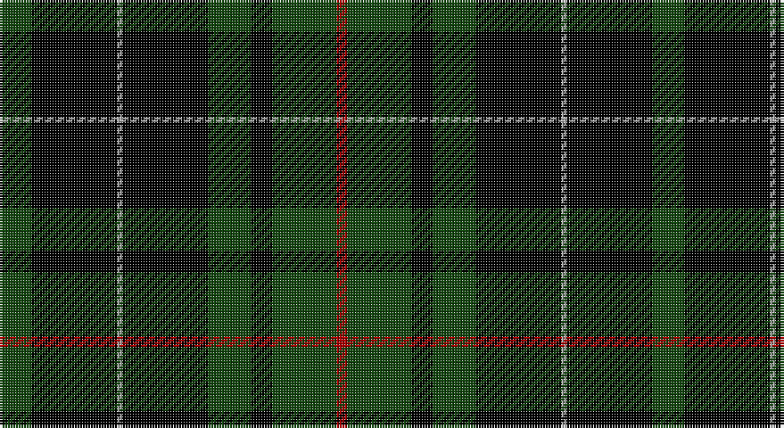

This page is one **sett** — a single exact thread-count. It belongs to the [tartan](/setts/dg6k16lr1k16dg8k4dg12r2/)
(the same proportion at any scale), whose colour order is pattern [GKYKGKGR](/stripes/gkykgkgr/).

Part of the [MacAulay Hunting](/tartans/macaulay-hunting/) tartan — the named design grouping this sett with its other cloths.

Sourced from weddslist.  It is a [8 stripe tartan](/stripes/stripes8/).

Original link http://www.weddslist.com/cgi-bin/tartans/pg.pl?source=tinsel

## Also known as

This cloth is also recorded under:

- MacAulay Htg
- MacAuley Hunting
- MacAuley, hunting

2 attestations — the source records this cloth was collapsed from (oldest owns this page)

<ul>
<li>undated — MacAulay Hunting (weddslist, <a href="http://www.weddslist.com/cgi-bin/tartans/pg.pl?source=tinsel">record</a>)</li>
<li>undated — MacAulay Hunting (weddslist, <a href="http://www.weddslist.com/cgi-bin/tartans/pg.pl?source=x">record</a>)</li>
</ul>

## Thread count
DG/12 K32 N2 K32 DG16 K8 DG24 DR/4

One full sett is **244 threads**.

## Palette

Palette: <strong>Ingles Buchan</strong> <small style="color:#888">(1 of 4 colours)</small>
<table><thead><tr><th>Colour</th><th>Threads</th><th>Shade</th><th>Base</th><th>OKLCh</th></tr></thead><tbody><tr><td>DG/</td><td style="text-align:right;font-variant-numeric:tabular-nums">12</td><td><code style="background-color:#11450D;">#11450D</code> <small style="color:#888">#11450D</small></td><td>G <code style="background-color:#006100;">#006100</code></td><td><small style="color:#888">oklch(34.4% 0.101 142.1)</small></td></tr><tr><td>K</td><td style="text-align:right;font-variant-numeric:tabular-nums">32</td><td><code style="background-color:#000000;">#000000</code> <small style="color:#888">#000000</small></td><td>K <code style="background-color:#000000;">#000000</code></td><td><small style="color:#888">oklch(0.0% 0.000 0.0)</small></td></tr><tr><td>N</td><td style="text-align:right;font-variant-numeric:tabular-nums">2</td><td><code style="background-color:#AAAAAA;">#AAAAAA</code> <small style="color:#888">#AAAAAA</small></td><td>Y <code style="background-color:#F2BF00;">#F2BF00</code></td><td><small style="color:#888">oklch(73.8% 0.000 89.9)</small></td></tr><tr><td>K</td><td style="text-align:right;font-variant-numeric:tabular-nums">32</td><td><code style="background-color:#000000;">#000000</code> <small style="color:#888">#000000</small></td><td>K <code style="background-color:#000000;">#000000</code></td><td><small style="color:#888">oklch(0.0% 0.000 0.0)</small></td></tr><tr><td>DG</td><td style="text-align:right;font-variant-numeric:tabular-nums">16</td><td><code style="background-color:#11450D;">#11450D</code> <small style="color:#888">#11450D</small></td><td>G <code style="background-color:#006100;">#006100</code></td><td><small style="color:#888">oklch(34.4% 0.101 142.1)</small></td></tr><tr><td>K</td><td style="text-align:right;font-variant-numeric:tabular-nums">8</td><td><code style="background-color:#000000;">#000000</code> <small style="color:#888">#000000</small></td><td>K <code style="background-color:#000000;">#000000</code></td><td><small style="color:#888">oklch(0.0% 0.000 0.0)</small></td></tr><tr><td>DG</td><td style="text-align:right;font-variant-numeric:tabular-nums">24</td><td><code style="background-color:#11450D;">#11450D</code> <small style="color:#888">#11450D</small></td><td>G <code style="background-color:#006100;">#006100</code></td><td><small style="color:#888">oklch(34.4% 0.101 142.1)</small></td></tr><tr><td>DR/</td><td style="text-align:right;font-variant-numeric:tabular-nums">4</td><td><code style="background-color:#AA0000;">#AA0000</code> <small style="color:#888">#AA0000</small></td><td>R <code style="background-color:#CC0000;">#CC0000</code></td><td><small style="color:#888">oklch(46.3% 0.190 29.2)</small></td></tr></tbody></table>

# Sample pattern

## Compared to the master

This cloth is one sett of its design; the master sett (the exemplar the design is anchored on) is below for comparison.

<figure style="margin:0"><figcaption style="color:#888;font-size:smaller">this sett</figcaption></figure>
<figure style="margin:0"><figcaption style="color:#888;font-size:smaller"><a href="/setts/g6k16w1k16g8k4g12r2/">master sett →</a></figcaption></figure>

## Nearest tartans

The nearest existing variants by ΔTartan distance, with this tartan at the top so the swatches line up against it.

ΔTartan

Tartan

Sett

—

<a href="/ttd/edit/#slug=dg6k16lr1k16dg8k4dg12r2~x2">MacAulay Hunting</a> <a class="nn-out" href="/variants/s8/dg6k16lr1k16dg8k4dg12r2~x2/" title="open its dictionary page">↗</a>

0.38

<a href="/ttd/edit/#slug=dg6k16lb1k16dg8k4dg12r2~x2&amp;base=dg6k16lr1k16dg8k4dg12r2~x2">MacAulay Hunting</a> <a class="nn-out" href="/variants/s8/dg6k16lb1k16dg8k4dg12r2~x2/" title="open its dictionary page">↗</a>

1.00

<a href="/ttd/edit/#slug=dg5k15dg5k15dg19r2dg10b4~x2&amp;base=dg6k16lr1k16dg8k4dg12r2~x2">Strath Halladale (Sutherland)</a> <a class="nn-out" href="/variants/s8/dg5k15dg5k15dg19r2dg10b4~x2/" title="open its dictionary page">↗</a>

1.32

<a href="/ttd/edit/#slug=g6k16w1k16g8k4g12r2~x2&amp;base=dg6k16lr1k16dg8k4dg12r2~x2">MacAulay Hunting</a> <a class="nn-out" href="/variants/s8/g6k16w1k16g8k4g12r2~x2/" title="open its dictionary page">↗</a>

1.35

<a href="/ttd/edit/#slug=r1dg16k8dg3k4ly1~x2&amp;base=dg6k16lr1k16dg8k4dg12r2~x2">Forbes VS</a> <a class="nn-out" href="/variants/s6/r1dg16k8dg3k4ly1~x2/" title="open its dictionary page">↗</a>

1.43

<a href="/ttd/edit/#slug=k20t2k6g16p4k9~x2&amp;base=dg6k16lr1k16dg8k4dg12r2~x2">Wilson's, No 167</a> <a class="nn-out" href="/variants/s6/k20t2k6g16p4k9~x2/" title="open its dictionary page">↗</a>

1.44

<a href="/ttd/edit/#slug=dg1k8dg1k8dg15r1~x4&amp;base=dg6k16lr1k16dg8k4dg12r2~x2">Gunn VS</a> <a class="nn-out" href="/variants/s6/dg1k8dg1k8dg15r1~x4/" title="open its dictionary page">↗</a>

1.46

<a href="/ttd/edit/#slug=k32dg6k12dg30ly3~x2&amp;base=dg6k16lr1k16dg8k4dg12r2~x2">MacArthur</a> <a class="nn-out" href="/variants/s5/k32dg6k12dg30ly3~x2/" title="open its dictionary page">↗</a>

1.48

<a href="/ttd/edit/#slug=dg1k8dg1k8dg15r1~x2&amp;base=dg6k16lr1k16dg8k4dg12r2~x2">Gunn VS</a> <a class="nn-out" href="/variants/s6/dg1k8dg1k8dg15r1~x2/" title="open its dictionary page">↗</a>

1.53

<a href="/ttd/edit/#slug=dg3k6lr1k6dg2k2dg16k1~x2&amp;base=dg6k16lr1k16dg8k4dg12r2~x2">MacLean VS</a> <a class="nn-out" href="/variants/s8/dg3k6lr1k6dg2k2dg16k1~x2/" title="open its dictionary page">↗</a>

1.56

<a href="/ttd/edit/#slug=r1dg16k8dg3k4ly1&amp;base=dg6k16lr1k16dg8k4dg12r2~x2">Forbes VS</a> <a class="nn-out" href="/variants/s6/r1dg16k8dg3k4ly1/" title="open its dictionary page">↗</a>

## Neighbour map

Every grey dot is one of 14360 variants placed by the first two principal components of the ΔTartan feature space (44% of its variance). Red is this tartan; blue dots are its nearest — click one to open its page.

<svg viewBox="0 0 640 380" role="img" style="max-width:100%;height:auto;border:1px solid #e0e0e0;border-radius:4px;display:block" xmlns="http://www.w3.org/2000/svg"><image href="/nn/cloud.v1.png" width="640" height="380"/><a href="/variants/s8/dg6k16lb1k16dg8k4dg12r2~x2/"><circle cx="313.1" cy="214.9" r="4" fill="#3465a4"><title>MacAulay Hunting</title></circle></a><a href="/variants/s8/dg5k15dg5k15dg19r2dg10b4~x2/"><circle cx="281.4" cy="246.2" r="4" fill="#3465a4"><title>Strath Halladale (Sutherland)</title></circle></a><a href="/variants/s8/g6k16w1k16g8k4g12r2~x2/"><circle cx="326.3" cy="217.2" r="4" fill="#3465a4"><title>MacAulay Hunting</title></circle></a><a href="/variants/s6/r1dg16k8dg3k4ly1~x2/"><circle cx="352.9" cy="205.1" r="4" fill="#3465a4"><title>Forbes VS</title></circle></a><a href="/variants/s6/k20t2k6g16p4k9~x2/"><circle cx="298.8" cy="233.3" r="4" fill="#3465a4"><title>Wilson's, No 167</title></circle></a><a href="/variants/s6/dg1k8dg1k8dg15r1~x4/"><circle cx="353.4" cy="231.4" r="4" fill="#3465a4"><title>Gunn VS</title></circle></a><a href="/variants/s5/k32dg6k12dg30ly3~x2/"><circle cx="327.6" cy="263.1" r="4" fill="#3465a4"><title>MacArthur</title></circle></a><a href="/variants/s6/dg1k8dg1k8dg15r1~x2/"><circle cx="343.5" cy="227.3" r="4" fill="#3465a4"><title>Gunn VS</title></circle></a><a href="/variants/s8/dg3k6lr1k6dg2k2dg16k1~x2/"><circle cx="375.6" cy="207.4" r="4" fill="#3465a4"><title>MacLean VS</title></circle></a><a href="/variants/s6/r1dg16k8dg3k4ly1/"><circle cx="340.1" cy="199.1" r="4" fill="#3465a4"><title>Forbes VS</title></circle></a><circle cx="323.6" cy="219.6" r="5" fill="#c00000"/></svg>

ID: /variants/s8/dg6k16lr1k16dg8k4dg12r2~x2/
