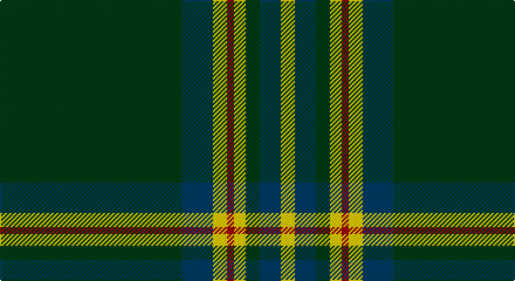

This page is one **sett** — a single exact thread-count. It belongs to the [tartan](/setts/dg78dt13ly6r3ly5dg6dt9ly6/)
(the same proportion at any scale), whose colour order is pattern [GBYRYGBY](/stripes/gbyrygby/).

Part of the [Walterström](/tartans/walterstr-m/) tartan — the named design grouping this sett with its other cloths.

Sourced from register-of-tartans.  It is a [8 stripe tartan](/stripes/stripes8/).

Original link https://www.tartanregister.gov.uk/tartanDetails.aspx?ref=11080

## Also known as

This cloth is also recorded under:

- Walterstrm )

## Register references

External register numbers recorded for this tartan.

- Scottish Register of Tartans: [11080](https://www.tartanregister.gov.uk/tartanDetails.aspx?ref=11080)

## Thread count
DG/156 DB26 Y12 DR6 Y10 DG12 DB18 Y/12

One full sett is **336 threads**.

## Palette

Palette: <strong>Tartan Register</strong>
<table><thead><tr><th>Colour</th><th>Threads</th><th>Shade</th><th>Base</th><th>OKLCh</th></tr></thead><tbody><tr><td>DG/</td><td style="text-align:right;font-variant-numeric:tabular-nums">156</td><td><code style="background-color:#003C14;">#003C14</code> <small style="color:#888">#003C14</small></td><td>G <code style="background-color:#006100;">#006100</code></td><td><small style="color:#888">oklch(31.1% 0.089 148.5)</small></td></tr><tr><td>DB</td><td style="text-align:right;font-variant-numeric:tabular-nums">26</td><td><code style="background-color:#003C64;">#003C64</code> <small style="color:#888">#003C64</small></td><td>B <code style="background-color:#2A418A;">#2A418A</code></td><td><small style="color:#888">oklch(34.5% 0.089 246.0)</small></td></tr><tr><td>Y</td><td style="text-align:right;font-variant-numeric:tabular-nums">12</td><td><code style="background-color:#FCCC00;">#FCCC00</code> <small style="color:#888">#FCCC00</small></td><td>Y <code style="background-color:#F2BF00;">#F2BF00</code></td><td><small style="color:#888">oklch(86.2% 0.176 91.5)</small></td></tr><tr><td>DR</td><td style="text-align:right;font-variant-numeric:tabular-nums">6</td><td><code style="background-color:#A00000;">#A00000</code> <small style="color:#888">#A00000</small></td><td>R <code style="background-color:#CC0000;">#CC0000</code></td><td><small style="color:#888">oklch(44.3% 0.182 29.2)</small></td></tr><tr><td>Y</td><td style="text-align:right;font-variant-numeric:tabular-nums">10</td><td><code style="background-color:#FCCC00;">#FCCC00</code> <small style="color:#888">#FCCC00</small></td><td>Y <code style="background-color:#F2BF00;">#F2BF00</code></td><td><small style="color:#888">oklch(86.2% 0.176 91.5)</small></td></tr><tr><td>DG</td><td style="text-align:right;font-variant-numeric:tabular-nums">12</td><td><code style="background-color:#003C14;">#003C14</code> <small style="color:#888">#003C14</small></td><td>G <code style="background-color:#006100;">#006100</code></td><td><small style="color:#888">oklch(31.1% 0.089 148.5)</small></td></tr><tr><td>DB</td><td style="text-align:right;font-variant-numeric:tabular-nums">18</td><td><code style="background-color:#003C64;">#003C64</code> <small style="color:#888">#003C64</small></td><td>B <code style="background-color:#2A418A;">#2A418A</code></td><td><small style="color:#888">oklch(34.5% 0.089 246.0)</small></td></tr><tr><td>Y/</td><td style="text-align:right;font-variant-numeric:tabular-nums">12</td><td><code style="background-color:#FCCC00;">#FCCC00</code> <small style="color:#888">#FCCC00</small></td><td>Y <code style="background-color:#F2BF00;">#F2BF00</code></td><td><small style="color:#888">oklch(86.2% 0.176 91.5)</small></td></tr></tbody></table>

# Sample pattern

## Nearest tartans

The nearest existing variants by ΔTartan distance, with this tartan at the top so the swatches line up against it.

ΔTartan

Tartan

Sett

—

<a href="/ttd/edit/#slug=dg78dt13ly6r3ly5dg6dt9ly6~x2">Walterström (2014)</a> <a class="nn-out" href="/variants/s8/dg78dt13ly6r3ly5dg6dt9ly6~x2/" title="open its dictionary page">↗</a>

0.96

<a href="/ttd/edit/#slug=g78db13ly6r3ly5g6db9ly6~x2&amp;base=dg78dt13ly6r3ly5dg6dt9ly6~x2">Walterstrm (2014))</a> <a class="nn-out" href="/variants/s8/g78db13ly6r3ly5g6db9ly6~x2/" title="open its dictionary page">↗</a>

1.05

<a href="/ttd/edit/#slug=dg60w3k12o5dg9o6k4w10&amp;base=dg78dt13ly6r3ly5dg6dt9ly6~x2">New York Jets</a> <a class="nn-out" href="/variants/s8/dg60w3k12o5dg9o6k4w10/" title="open its dictionary page">↗</a>

1.07

<a href="/ttd/edit/#slug=r4g3dp3g44dp16g10w2g2dp2~x2&amp;base=dg78dt13ly6r3ly5dg6dt9ly6~x2">Glenfeshie (Personal)</a> <a class="nn-out" href="/variants/s9/r4g3dp3g44dp16g10w2g2dp2~x2/" title="open its dictionary page">↗</a>

1.14

<a href="/ttd/edit/#slug=dg20r1ly1r1lb1dg1r1lb1db5~x4&amp;base=dg78dt13ly6r3ly5dg6dt9ly6~x2">Scotts Valley</a> <a class="nn-out" href="/variants/s9/dg20r1ly1r1lb1dg1r1lb1db5~x4/" title="open its dictionary page">↗</a>

1.14

<a href="/ttd/edit/#slug=k3dg32k2dg4ly4dg2ly4dg4k6w3~x2&amp;base=dg78dt13ly6r3ly5dg6dt9ly6~x2">University of Alberta (Corporate)</a> <a class="nn-out" href="/variants/s10/k3dg32k2dg4ly4dg2ly4dg4k6w3~x2/" title="open its dictionary page">↗</a>

1.18

<a href="/ttd/edit/#slug=dg42k10lr2k2r2k2dg10r6k2r3dg2~x2&amp;base=dg78dt13ly6r3ly5dg6dt9ly6~x2">Dryfe</a> <a class="nn-out" href="/variants/s11/dg42k10lr2k2r2k2dg10r6k2r3dg2~x2/" title="open its dictionary page">↗</a>

1.22

<a href="/ttd/edit/#slug=g16ly1k2r1k1r1k2ly1k1g1~x4&amp;base=dg78dt13ly6r3ly5dg6dt9ly6~x2">Forde Irish Family Tartan</a> <a class="nn-out" href="/variants/s10/g16ly1k2r1k1r1k2ly1k1g1~x4/" title="open its dictionary page">↗</a>

1.25

<a href="/ttd/edit/#slug=dg48lo3k6w4dg3k15lo3dg4~x2&amp;base=dg78dt13ly6r3ly5dg6dt9ly6~x2">Birmingham Irish Pipes &amp; Drums</a> <a class="nn-out" href="/variants/s8/dg48lo3k6w4dg3k15lo3dg4~x2/" title="open its dictionary page">↗</a>

1.26

<a href="/ttd/edit/#slug=g30ly2k3r2k2r2k3ly2k2g4~x2&amp;base=dg78dt13ly6r3ly5dg6dt9ly6~x2">Forde</a> <a class="nn-out" href="/variants/s10/g30ly2k3r2k2r2k3ly2k2g4~x2/" title="open its dictionary page">↗</a>

1.26

<a href="/ttd/edit/#slug=dg67k2dg2k2dg2ly8r8k8ly2t7~x2&amp;base=dg78dt13ly6r3ly5dg6dt9ly6~x2">Moran (French) (Name)</a> <a class="nn-out" href="/variants/s10/dg67k2dg2k2dg2ly8r8k8ly2t7~x2/" title="open its dictionary page">↗</a>

## Neighbour map

Every grey dot is one of 14360 variants placed by the first two principal components of the ΔTartan feature space (44% of its variance). Red is this tartan; blue dots are its nearest — click one to open its page.

<svg viewBox="0 0 640 380" role="img" style="max-width:100%;height:auto;border:1px solid #e0e0e0;border-radius:4px;display:block" xmlns="http://www.w3.org/2000/svg"><image href="/nn/cloud.v1.png" width="640" height="380"/><a href="/variants/s8/g78db13ly6r3ly5g6db9ly6~x2/"><circle cx="423.8" cy="133.0" r="4" fill="#3465a4"><title>Walterstrm (2014))</title></circle></a><a href="/variants/s8/dg60w3k12o5dg9o6k4w10/"><circle cx="359.7" cy="143.3" r="4" fill="#3465a4"><title>New York Jets</title></circle></a><a href="/variants/s9/r4g3dp3g44dp16g10w2g2dp2~x2/"><circle cx="449.0" cy="147.9" r="4" fill="#3465a4"><title>Glenfeshie (Personal)</title></circle></a><a href="/variants/s9/dg20r1ly1r1lb1dg1r1lb1db5~x4/"><circle cx="402.4" cy="123.1" r="4" fill="#3465a4"><title>Scotts Valley</title></circle></a><a href="/variants/s10/k3dg32k2dg4ly4dg2ly4dg4k6w3~x2/"><circle cx="376.9" cy="145.7" r="4" fill="#3465a4"><title>University of Alberta (Corporate)</title></circle></a><a href="/variants/s11/dg42k10lr2k2r2k2dg10r6k2r3dg2~x2/"><circle cx="415.5" cy="138.2" r="4" fill="#3465a4"><title>Dryfe</title></circle></a><a href="/variants/s10/g16ly1k2r1k1r1k2ly1k1g1~x4/"><circle cx="388.7" cy="137.0" r="4" fill="#3465a4"><title>Forde Irish Family Tartan</title></circle></a><a href="/variants/s8/dg48lo3k6w4dg3k15lo3dg4~x2/"><circle cx="366.9" cy="150.8" r="4" fill="#3465a4"><title>Birmingham Irish Pipes &amp; Drums</title></circle></a><a href="/variants/s10/g30ly2k3r2k2r2k3ly2k2g4~x2/"><circle cx="400.4" cy="142.5" r="4" fill="#3465a4"><title>Forde</title></circle></a><a href="/variants/s10/dg67k2dg2k2dg2ly8r8k8ly2t7~x2/"><circle cx="415.2" cy="92.2" r="4" fill="#3465a4"><title>Moran (French) (Name)</title></circle></a><circle cx="426.6" cy="136.8" r="5" fill="#c00000"/></svg>

ID: /variants/s8/dg78dt13ly6r3ly5dg6dt9ly6~x2/
