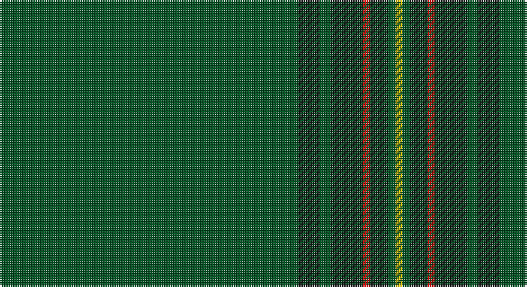

This page is one **sett** — a single exact thread-count. It belongs to the [tartan](/setts/dg83k6dg3k9r2k5dg2ly2/)
(the same proportion at any scale), whose colour order is pattern [GKGKRKGY](/stripes/gkgkrkgy/).

Sourced from register-of-tartans.  It is a [8 stripe tartan](/stripes/stripes8/).

Original link https://www.tartanregister.gov.uk/tartanDetails.aspx?ref=5053

## Register references

External register numbers recorded for this tartan.

- Scottish Register of Tartans: [5053](https://www.tartanregister.gov.uk/tartanDetails.aspx?ref=5053)
- Scottish Tartans World Register: 3059

## Thread count
G/166 K12 G6 K18 R4 K10 G4 Y/4

One full sett is **278 threads**.

## Palette

Palette: <strong>Tartan Register</strong>
<table><thead><tr><th>Colour</th><th>Threads</th><th>Shade</th><th>Base</th><th>OKLCh</th></tr></thead><tbody><tr><td>G/</td><td style="text-align:right;font-variant-numeric:tabular-nums">166</td><td><code style="background-color:#005020;">#005020</code> <small style="color:#888">#005020</small></td><td>G <code style="background-color:#006100;">#006100</code></td><td><small style="color:#888">oklch(37.7% 0.105 149.6)</small></td></tr><tr><td>K</td><td style="text-align:right;font-variant-numeric:tabular-nums">12</td><td><code style="background-color:#101010;">#101010</code> <small style="color:#888">#101010</small></td><td>K <code style="background-color:#000000;">#000000</code></td><td><small style="color:#888">oklch(17.3% 0.000 89.9)</small></td></tr><tr><td>G</td><td style="text-align:right;font-variant-numeric:tabular-nums">6</td><td><code style="background-color:#005020;">#005020</code> <small style="color:#888">#005020</small></td><td>G <code style="background-color:#006100;">#006100</code></td><td><small style="color:#888">oklch(37.7% 0.105 149.6)</small></td></tr><tr><td>K</td><td style="text-align:right;font-variant-numeric:tabular-nums">18</td><td><code style="background-color:#101010;">#101010</code> <small style="color:#888">#101010</small></td><td>K <code style="background-color:#000000;">#000000</code></td><td><small style="color:#888">oklch(17.3% 0.000 89.9)</small></td></tr><tr><td>R</td><td style="text-align:right;font-variant-numeric:tabular-nums">4</td><td><code style="background-color:#DC0000;">#DC0000</code> <small style="color:#888">#DC0000</small></td><td>R <code style="background-color:#CC0000;">#CC0000</code></td><td><small style="color:#888">oklch(56.2% 0.230 29.2)</small></td></tr><tr><td>K</td><td style="text-align:right;font-variant-numeric:tabular-nums">10</td><td><code style="background-color:#101010;">#101010</code> <small style="color:#888">#101010</small></td><td>K <code style="background-color:#000000;">#000000</code></td><td><small style="color:#888">oklch(17.3% 0.000 89.9)</small></td></tr><tr><td>G</td><td style="text-align:right;font-variant-numeric:tabular-nums">4</td><td><code style="background-color:#005020;">#005020</code> <small style="color:#888">#005020</small></td><td>G <code style="background-color:#006100;">#006100</code></td><td><small style="color:#888">oklch(37.7% 0.105 149.6)</small></td></tr><tr><td>Y/</td><td style="text-align:right;font-variant-numeric:tabular-nums">4</td><td><code style="background-color:#E8C000;">#E8C000</code> <small style="color:#888">#E8C000</small></td><td>Y <code style="background-color:#F2BF00;">#F2BF00</code></td><td><small style="color:#888">oklch(81.9% 0.168 93.7)</small></td></tr></tbody></table>

# Sample pattern

## Nearest tartans

The nearest existing variants by ΔTartan distance, with this tartan at the top so the swatches line up against it.

ΔTartan

Tartan

Sett

—

<a href="/ttd/edit/#slug=dg83k6dg3k9r2k5dg2ly2~x2">Stewart from Cairnie</a> <a class="nn-out" href="/variants/s8/dg83k6dg3k9r2k5dg2ly2~x2/" title="open its dictionary page">↗</a>

1.22

<a href="/ttd/edit/#slug=g82k6g3k9r2k5g2ly2~x2&amp;base=dg83k6dg3k9r2k5dg2ly2~x2">Crane of Cluny (Personal)</a> <a class="nn-out" href="/variants/s8/g82k6g3k9r2k5g2ly2~x2/" title="open its dictionary page">↗</a>

1.53

<a href="/ttd/edit/#slug=t2k1dg36k1r2k1r2k1dg36k1ly2~x2&amp;base=dg83k6dg3k9r2k5dg2ly2~x2">Unidentified #12</a> <a class="nn-out" href="/variants/s11/t2k1dg36k1r2k1r2k1dg36k1ly2~x2/" title="open its dictionary page">↗</a>

1.57

<a href="/ttd/edit/#slug=lr1r12dg2r1dg162r12ly1~x2&amp;base=dg83k6dg3k9r2k5dg2ly2~x2">MacFie</a> <a class="nn-out" href="/variants/s7/lr1r12dg2r1dg162r12ly1~x2/" title="open its dictionary page">↗</a>

1.64

<a href="/ttd/edit/#slug=g61g1g1db2g1g1g16g1db4g2db6g1db4~x2&amp;base=dg83k6dg3k9r2k5dg2ly2~x2">Coeur D'Alene Firefighters (Corporat</a> <a class="nn-out" href="/variants/s13/g61g1g1db2g1g1g16g1db4g2db6g1db4~x2/" title="open its dictionary page">↗</a>

1.73

<a href="/ttd/edit/#slug=gi16dg1y4dg41y1dg6g2dg2~x2&amp;base=dg83k6dg3k9r2k5dg2ly2~x2">Semper</a> <a class="nn-out" href="/variants/s8/gi16dg1y4dg41y1dg6g2dg2~x2/" title="open its dictionary page">↗</a>

1.84

<a href="/ttd/edit/#slug=gi16dg1lg4dg41lg1dg6g2dg2~x2&amp;base=dg83k6dg3k9r2k5dg2ly2~x2">Semper</a> <a class="nn-out" href="/variants/s8/gi16dg1lg4dg41lg1dg6g2dg2~x2/" title="open its dictionary page">↗</a>

1.87

<a href="/ttd/edit/#slug=dg25k1lr2k1dg4k1r2k1dg4k1ly2k1dg25~x4&amp;base=dg83k6dg3k9r2k5dg2ly2~x2">Hilton Check</a> <a class="nn-out" href="/variants/s13/dg25k1lr2k1dg4k1r2k1dg4k1ly2k1dg25~x4/" title="open its dictionary page">↗</a>

1.87

<a href="/ttd/edit/#slug=g3db2g40db1g2db1g9r4g3r2~x4&amp;base=dg83k6dg3k9r2k5dg2ly2~x2">Braveheart Htg (Fashion)</a> <a class="nn-out" href="/variants/s10/g3db2g40db1g2db1g9r4g3r2~x4/" title="open its dictionary page">↗</a>

1.91

<a href="/ttd/edit/#slug=g3dt1g2r1g3db3g2db2g18dt2~x2&amp;base=dg83k6dg3k9r2k5dg2ly2~x2">Owen Welsh Name Tartan</a> <a class="nn-out" href="/variants/s10/g3dt1g2r1g3db3g2db2g18dt2~x2/" title="open its dictionary page">↗</a>

1.96

<a href="/ttd/edit/#slug=r2k4g45k3ly2~x2&amp;base=dg83k6dg3k9r2k5dg2ly2~x2">Mar, Tribe of (Clan)</a> <a class="nn-out" href="/variants/s5/r2k4g45k3ly2~x2/" title="open its dictionary page">↗</a>

## Neighbour map

Every grey dot is one of 14360 variants placed by the first two principal components of the ΔTartan feature space (44% of its variance). Red is this tartan; blue dots are its nearest — click one to open its page.

<svg viewBox="0 0 640 380" role="img" style="max-width:100%;height:auto;border:1px solid #e0e0e0;border-radius:4px;display:block" xmlns="http://www.w3.org/2000/svg"><image href="/nn/cloud.v1.png" width="640" height="380"/><a href="/variants/s8/g82k6g3k9r2k5g2ly2~x2/"><circle cx="588.8" cy="132.6" r="4" fill="#3465a4"><title>Crane of Cluny (Personal)</title></circle></a><a href="/variants/s11/t2k1dg36k1r2k1r2k1dg36k1ly2~x2/"><circle cx="625.0" cy="123.8" r="4" fill="#3465a4"><title>Unidentified #12</title></circle></a><a href="/variants/s7/lr1r12dg2r1dg162r12ly1~x2/"><circle cx="626.0" cy="148.6" r="4" fill="#3465a4"><title>MacFie</title></circle></a><a href="/variants/s13/g61g1g1db2g1g1g16g1db4g2db6g1db4~x2/"><circle cx="626.0" cy="128.3" r="4" fill="#3465a4"><title>Coeur D'Alene Firefighters (Corporat</title></circle></a><a href="/variants/s8/gi16dg1y4dg41y1dg6g2dg2~x2/"><circle cx="512.2" cy="157.8" r="4" fill="#3465a4"><title>Semper</title></circle></a><a href="/variants/s8/gi16dg1lg4dg41lg1dg6g2dg2~x2/"><circle cx="503.0" cy="153.0" r="4" fill="#3465a4"><title>Semper</title></circle></a><a href="/variants/s13/dg25k1lr2k1dg4k1r2k1dg4k1ly2k1dg25~x4/"><circle cx="582.2" cy="135.7" r="4" fill="#3465a4"><title>Hilton Check</title></circle></a><a href="/variants/s10/g3db2g40db1g2db1g9r4g3r2~x4/"><circle cx="626.0" cy="170.8" r="4" fill="#3465a4"><title>Braveheart Htg (Fashion)</title></circle></a><a href="/variants/s10/g3dt1g2r1g3db3g2db2g18dt2~x2/"><circle cx="536.1" cy="193.3" r="4" fill="#3465a4"><title>Owen Welsh Name Tartan</title></circle></a><a href="/variants/s5/r2k4g45k3ly2~x2/"><circle cx="576.3" cy="187.3" r="4" fill="#3465a4"><title>Mar, Tribe of (Clan)</title></circle></a><circle cx="621.9" cy="148.1" r="5" fill="#c00000"/></svg>

ID: /variants/s8/dg83k6dg3k9r2k5dg2ly2~x2/
