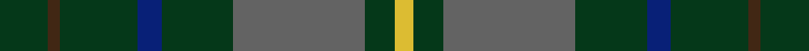

This page is one **sett** — a single exact thread-count. It belongs to the [tartan](/setts/dg8do2dg13db4dg12n22dg5ly3/)
(the same proportion at any scale), whose colour order is pattern [GBGBGBGY](/stripes/gbgbgbgy/).

Sourced from register-of-tartans.  It is a [8 stripe tartan](/stripes/stripes8/).

Original link https://www.tartanregister.gov.uk/tartanDetails.aspx?ref=10231

## Register references

External register numbers recorded for this tartan.

- Scottish Register of Tartans: [10231](https://www.tartanregister.gov.uk/tartanDetails.aspx?ref=10231)

## Thread count
DG/16 DO4 DG26 DB8 DG24 N44 DG10 LY/6

One full sett is **254 threads**.

## Palette
<table><thead><tr><th>Colour</th><th>Shade</th><th>OKLCh</th></tr></thead><tbody><tr><td>DB</td><td><code style="background-color:#082077;">#082077</code> <small style="color:#888">#082077</small></td><td><small style="color:#888">oklch(30.0% 0.149 265.1)</small></td></tr><tr><td>DG</td><td><code style="background-color:#053819;">#053819</code> <small style="color:#888">#053819</small></td><td><small style="color:#888">oklch(30.0% 0.075 151.3)</small></td></tr><tr><td>N</td><td><code style="background-color:#636363;">#636363</code> <small style="color:#888">#636363</small></td><td><small style="color:#888">oklch(50.0% 0.000 89.9)</small></td></tr><tr><td>DO</td><td><code style="background-color:#412714;">#412714</code> <small style="color:#888">#412714</small></td><td><small style="color:#888">oklch(30.1% 0.050 55.7)</small></td></tr><tr><td>LY</td><td><code style="background-color:#DCBC32;">#DCBC32</code> <small style="color:#888">#DCBC32</small></td><td><small style="color:#888">oklch(80.0% 0.150 95.2)</small></td></tr></tbody></table>

# Sample pattern

## Nearest tartan variants

The nearest existing variants by ΔTartan distance, with this cloth at the top so the swatches line up against it.

ΔTartan

Threads

Variant

Sett

—

254

<a href="/variants/s8/dg8do2dg13db4dg12n22dg5ly3~x2/">Scottish Pup</a>

<a href="/ttd/edit/#slug=n44y2dg27y2g16lb8dg16lb2dg8~x2&amp;base=dg8do2dg13db4dg12n22dg5ly3~x2" title="compare in the TTD">2.26</a>

396

<a href="/variants/s9/n44y2dg27y2g16lb8dg16lb2dg8~x2/">Crumlish (2015)</a>

<a href="/ttd/edit/#slug=dt25r14dt8dy14t5dt12o6dt8lb2~x2&amp;base=dg8do2dg13db4dg12n22dg5ly3~x2" title="compare in the TTD">2.48</a>

322

<a href="/variants/s9/dt25r14dt8dy14t5dt12o6dt8lb2~x2/">Johnstons of Elgin Bicentennial (Com</a>

<a href="/ttd/edit/#slug=dt14o1dt1o1dt6n14w1n1~x4&amp;base=dg8do2dg13db4dg12n22dg5ly3~x2" title="compare in the TTD">2.50</a>

252

<a href="/variants/s8/dt14o1dt1o1dt6n14w1n1~x4/">Corrie</a>

<a href="/ttd/edit/#slug=dg4t28dg11w2dg2g14y2~x2&amp;base=dg8do2dg13db4dg12n22dg5ly3~x2" title="compare in the TTD">2.58</a>

240

<a href="/variants/s7/dg4t28dg11w2dg2g14y2~x2/">Rhode Island State American District Tartan</a>

<a href="/ttd/edit/#slug=dt4t28dt11w2dt2g14y2~x2&amp;base=dg8do2dg13db4dg12n22dg5ly3~x2" title="compare in the TTD">2.58</a>

240

<a href="/variants/s7/dt4t28dt11w2dt2g14y2~x2/">Rhode Island, State of</a>

<a href="/ttd/edit/#slug=r3dg20y2dg20n20b20r3~x2&amp;base=dg8do2dg13db4dg12n22dg5ly3~x2" title="compare in the TTD">2.83</a>

340

<a href="/variants/s7/r3dg20y2dg20n20b20r3~x2/">Brodie, Silver</a>

2.88

—

<a href="/variants/s10/dg9w2dg24db37r3db37dg24w2dg9o4~x2~db1103284/">Hardie</a>

## Neighbour map

Every grey dot is one of 13620 variants placed by the first two principal components of the ΔTartan feature space (42% of its variance). Red is this tartan; blue dots are its nearest — click one to open its page.

<svg viewBox="0 0 640 380" role="img" style="max-width:100%;height:auto;border:1px solid #e0e0e0;border-radius:4px;display:block" xmlns="http://www.w3.org/2000/svg"><image href="/nn/cloud.v1.png" width="640" height="380"/><a href="/variants/s9/n44y2dg27y2g16lb8dg16lb2dg8~x2/"><circle cx="310.0" cy="187.6" r="4" fill="#3465a4"><title>Crumlish (2015)</title></circle></a><a href="/variants/s9/dt25r14dt8dy14t5dt12o6dt8lb2~x2/"><circle cx="296.7" cy="203.2" r="4" fill="#3465a4"><title>Johnstons of Elgin Bicentennial (Com</title></circle></a><a href="/variants/s8/dt14o1dt1o1dt6n14w1n1~x4/"><circle cx="411.9" cy="199.5" r="4" fill="#3465a4"><title>Corrie</title></circle></a><a href="/variants/s7/dg4t28dg11w2dg2g14y2~x2/"><circle cx="308.2" cy="212.2" r="4" fill="#3465a4"><title>Rhode Island State American District Tartan</title></circle></a><a href="/variants/s7/dt4t28dt11w2dt2g14y2~x2/"><circle cx="308.8" cy="212.1" r="4" fill="#3465a4"><title>Rhode Island, State of</title></circle></a><a href="/variants/s7/r3dg20y2dg20n20b20r3~x2/"><circle cx="267.9" cy="231.5" r="4" fill="#3465a4"><title>Brodie, Silver</title></circle></a><a href="/variants/s10/dg9w2dg24db37r3db37dg24w2dg9o4~x2~db1103284/"><circle cx="381.8" cy="190.5" r="4" fill="#3465a4"><title>Hardie</title></circle></a><circle cx="379.4" cy="241.7" r="5" fill="#c00000"/><text x="320" y="376" text-anchor="middle" font-size="11" fill="#999">ground</text><text x="11" y="190" text-anchor="middle" font-size="11" fill="#999" transform="rotate(-90 11 190)">complexity</text></svg>

ID: /variants/s8/dg8do2dg13db4dg12n22dg5ly3~x2/
