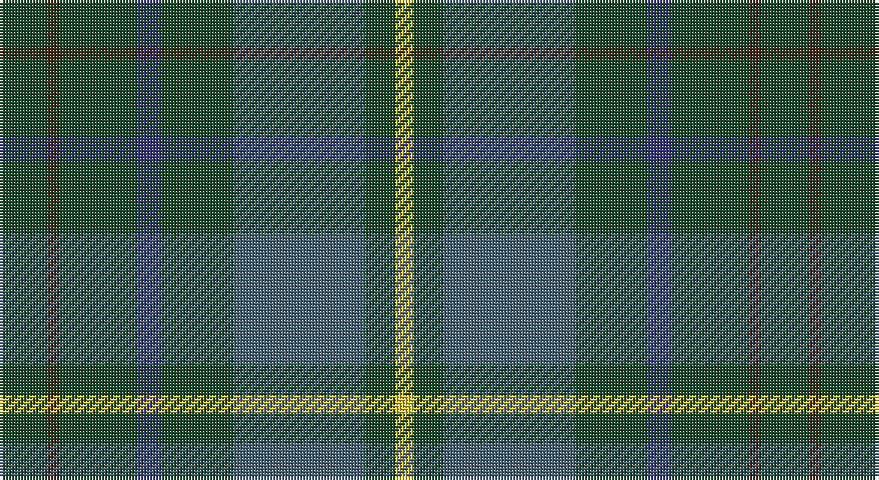

This page is one **sett** — a single exact thread-count. It belongs to the [tartan](/setts/dg8do2dg13db4dg12n22dg5ly3/)
(the same proportion at any scale), whose colour order is pattern [GBGBGBGY](/stripes/gbgbgbgy/).

Sourced from register-of-tartans.  It is a [8 stripe tartan](/stripes/stripes8/).

Original link https://www.tartanregister.gov.uk/tartanDetails.aspx?ref=10231

## Register references

External register numbers recorded for this tartan.

- Scottish Register of Tartans: [10231](https://www.tartanregister.gov.uk/tartanDetails.aspx?ref=10231)

## Thread count
DG/16 T4 DG26 DB8 DG24 N44 DG10 Y/6

One full sett is **254 threads**.

## Palette

Palette: <strong>custom</strong>
<table><thead><tr><th>Colour</th><th>Threads</th><th>Shade</th><th>Base</th><th>OKLCh</th></tr></thead><tbody><tr><td>DG/</td><td style="text-align:right;font-variant-numeric:tabular-nums">16</td><td><code style="background-color:#1E492B;">#1E492B</code> <small style="color:#888">#1E492B</small></td><td>G <code style="background-color:#006100;">#006100</code></td><td><small style="color:#888">oklch(36.6% 0.071 151.3)</small></td></tr><tr><td>T</td><td style="text-align:right;font-variant-numeric:tabular-nums">4</td><td><code style="background-color:#412719;">#412719</code> <small style="color:#888">#412719</small></td><td>B <code style="background-color:#2A418A;">#2A418A</code></td><td><small style="color:#888">oklch(30.2% 0.046 48.7)</small></td></tr><tr><td>DG</td><td style="text-align:right;font-variant-numeric:tabular-nums">26</td><td><code style="background-color:#1E492B;">#1E492B</code> <small style="color:#888">#1E492B</small></td><td>G <code style="background-color:#006100;">#006100</code></td><td><small style="color:#888">oklch(36.6% 0.071 151.3)</small></td></tr><tr><td>DB</td><td style="text-align:right;font-variant-numeric:tabular-nums">8</td><td><code style="background-color:#373875;">#373875</code> <small style="color:#888">#373875</small></td><td>B <code style="background-color:#2A418A;">#2A418A</code></td><td><small style="color:#888">oklch(37.4% 0.102 279.5)</small></td></tr><tr><td>DG</td><td style="text-align:right;font-variant-numeric:tabular-nums">24</td><td><code style="background-color:#1E492B;">#1E492B</code> <small style="color:#888">#1E492B</small></td><td>G <code style="background-color:#006100;">#006100</code></td><td><small style="color:#888">oklch(36.6% 0.071 151.3)</small></td></tr><tr><td>N</td><td style="text-align:right;font-variant-numeric:tabular-nums">44</td><td><code style="background-color:#486373;">#486373</code> <small style="color:#888">#486373</small></td><td>B <code style="background-color:#2A418A;">#2A418A</code></td><td><small style="color:#888">oklch(48.5% 0.041 234.7)</small></td></tr><tr><td>DG</td><td style="text-align:right;font-variant-numeric:tabular-nums">10</td><td><code style="background-color:#1E492B;">#1E492B</code> <small style="color:#888">#1E492B</small></td><td>G <code style="background-color:#006100;">#006100</code></td><td><small style="color:#888">oklch(36.6% 0.071 151.3)</small></td></tr><tr><td>Y/</td><td style="text-align:right;font-variant-numeric:tabular-nums">6</td><td><code style="background-color:#D9C341;">#D9C341</code> <small style="color:#888">#D9C341</small></td><td>Y <code style="background-color:#F2BF00;">#F2BF00</code></td><td><small style="color:#888">oklch(81.3% 0.146 99.4)</small></td></tr></tbody></table>

# Sample pattern

## Nearest tartans

The nearest existing variants by ΔTartan distance, with this tartan at the top so the swatches line up against it.

ΔTartan

Tartan

Sett

—

<a href="/ttd/edit/#slug=dg8do2dg13db4dg12n22dg5ly3~x2">Scottish Pup</a> <a class="nn-out" href="/variants/s8/dg8do2dg13db4dg12n22dg5ly3~x2/" title="open its dictionary page">↗</a>

1.02

<a href="/ttd/edit/#slug=g8dr2g13r4g12t22g5y3~x2&amp;base=dg8do2dg13db4dg12n22dg5ly3~x2">Kildare</a> <a class="nn-out" href="/variants/s8/g8dr2g13r4g12t22g5y3~x2/" title="open its dictionary page">↗</a>

1.30

<a href="/ttd/edit/#slug=dgi4ly2dgi17dg2r4dg2dgi3dg11dgi2~x2&amp;base=dg8do2dg13db4dg12n22dg5ly3~x2">Armagh, County</a> <a class="nn-out" href="/variants/s9/dgi4ly2dgi17dg2r4dg2dgi3dg11dgi2~x2/" title="open its dictionary page">↗</a>

1.32

<a href="/ttd/edit/#slug=g8k2g13lr4g12n22g5lo3~x2&amp;base=dg8do2dg13db4dg12n22dg5ly3~x2">Taylor</a> <a class="nn-out" href="/variants/s8/g8k2g13lr4g12n22g5lo3~x2/" title="open its dictionary page">↗</a>

1.41

<a href="/ttd/edit/#slug=dg20k2dg20dp25w2n3~x2&amp;base=dg8do2dg13db4dg12n22dg5ly3~x2">Lawrence of Broughty Ferry</a> <a class="nn-out" href="/variants/s6/dg20k2dg20dp25w2n3~x2/" title="open its dictionary page">↗</a>

1.52

<a href="/ttd/edit/#slug=db1dy9dg5dy1k5dy1dg5dy9w1~x2&amp;base=dg8do2dg13db4dg12n22dg5ly3~x2">Duchess of York</a> <a class="nn-out" href="/variants/s9/db1dy9dg5dy1k5dy1dg5dy9w1~x2/" title="open its dictionary page">↗</a>

1.58

<a href="/variants/s7/dp3n24ni10n2g11n8w3~x2/">Hesco</a>

1.63

<a href="/ttd/edit/#slug=db3dy7g2y2g14dy2g2db3~x2&amp;base=dg8do2dg13db4dg12n22dg5ly3~x2">Daks (Loden)</a> <a class="nn-out" href="/variants/s8/db3dy7g2y2g14dy2g2db3~x2/" title="open its dictionary page">↗</a>

1.64

<a href="/ttd/edit/#slug=dg14k8dg21k2lo5k2dg21k11db18k2r5~x2&amp;base=dg8do2dg13db4dg12n22dg5ly3~x2">de Vere-Austin (Clan)</a> <a class="nn-out" href="/variants/s11/dg14k8dg21k2lo5k2dg21k11db18k2r5~x2/" title="open its dictionary page">↗</a>

1.66

<a href="/ttd/edit/#slug=g10n2w2n16g6ly2g4r2g3n6~x4&amp;base=dg8do2dg13db4dg12n22dg5ly3~x2">Harkness Htg (Name)</a> <a class="nn-out" href="/variants/s10/g10n2w2n16g6ly2g4r2g3n6~x4/" title="open its dictionary page">↗</a>

1.70

<a href="/ttd/edit/#slug=dbi2db16dg14r3dg14k3dg14lo3dg14db16dbi2~x2&amp;base=dg8do2dg13db4dg12n22dg5ly3~x2">Pendleton Hunting</a> <a class="nn-out" href="/variants/s11/dbi2db16dg14r3dg14k3dg14lo3dg14db16dbi2~x2/" title="open its dictionary page">↗</a>

## Neighbour map

Every grey dot is one of 14360 variants placed by the first two principal components of the ΔTartan feature space (44% of its variance). Red is this tartan; blue dots are its nearest — click one to open its page.

<svg viewBox="0 0 640 380" role="img" style="max-width:100%;height:auto;border:1px solid #e0e0e0;border-radius:4px;display:block" xmlns="http://www.w3.org/2000/svg"><image href="/nn/cloud.v1.png" width="640" height="380"/><a href="/variants/s8/g8dr2g13r4g12t22g5y3~x2/"><circle cx="349.4" cy="239.1" r="4" fill="#3465a4"><title>Kildare</title></circle></a><a href="/variants/s9/dgi4ly2dgi17dg2r4dg2dgi3dg11dgi2~x2/"><circle cx="386.1" cy="256.5" r="4" fill="#3465a4"><title>Armagh, County</title></circle></a><a href="/variants/s8/g8k2g13lr4g12n22g5lo3~x2/"><circle cx="336.0" cy="237.5" r="4" fill="#3465a4"><title>Taylor</title></circle></a><a href="/variants/s6/dg20k2dg20dp25w2n3~x2/"><circle cx="360.5" cy="237.8" r="4" fill="#3465a4"><title>Lawrence of Broughty Ferry</title></circle></a><a href="/variants/s9/db1dy9dg5dy1k5dy1dg5dy9w1~x2/"><circle cx="327.8" cy="239.6" r="4" fill="#3465a4"><title>Duchess of York</title></circle></a><a href="/variants/s7/dp3n24ni10n2g11n8w3~x2/"><circle cx="323.8" cy="218.0" r="4" fill="#3465a4"><title>Hesco</title></circle></a><a href="/variants/s8/db3dy7g2y2g14dy2g2db3~x2/"><circle cx="329.5" cy="256.6" r="4" fill="#3465a4"><title>Daks (Loden)</title></circle></a><a href="/variants/s11/dg14k8dg21k2lo5k2dg21k11db18k2r5~x2/"><circle cx="303.1" cy="233.8" r="4" fill="#3465a4"><title>de Vere-Austin (Clan)</title></circle></a><a href="/variants/s10/g10n2w2n16g6ly2g4r2g3n6~x4/"><circle cx="283.7" cy="231.7" r="4" fill="#3465a4"><title>Harkness Htg (Name)</title></circle></a><a href="/variants/s11/dbi2db16dg14r3dg14k3dg14lo3dg14db16dbi2~x2/"><circle cx="320.6" cy="244.3" r="4" fill="#3465a4"><title>Pendleton Hunting</title></circle></a><circle cx="358.2" cy="250.6" r="5" fill="#c00000"/></svg>

ID: /variants/s8/dg8do2dg13db4dg12n22dg5ly3~x2/
