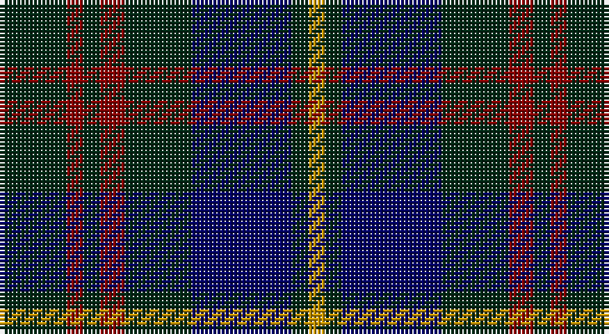

This page is one **sett** — a single exact thread-count. It belongs to the [tartan](/setts/dg8r2dg2r3dg8db12dg2lo2/)
(the same proportion at any scale), whose colour order is pattern [GRGRGBGY](/stripes/grgrgbgy/).

Part of the [Glen Nevis](/tartans/glen-nevis/) tartan — the named design grouping this sett with its other cloths.

Sourced from register-of-tartans.  It is a [8 stripe tartan](/stripes/stripes8/).

Original link https://www.tartanregister.gov.uk/tartanDetails.aspx?ref=1389

## Also known as

This cloth is also recorded under:

- Glen Nevis #1
- Glen Nevis #3

## Register references

External register numbers recorded for this tartan.

- Scottish Register of Tartans: [1389](https://www.tartanregister.gov.uk/tartanDetails.aspx?ref=1389)
- Scottish Tartans Authority (ITI): 5017

## Thread count
DG/16 DR4 DG4 DR6 DG16 DB24 DG4 DY/4

One full sett is **136 threads**.

## Palette

Palette: <strong>Tartan Register</strong> <small style="color:#888">(3 of 4 colours)</small>
<table><thead><tr><th>Colour</th><th>Threads</th><th>Shade</th><th>Base</th><th>OKLCh</th></tr></thead><tbody><tr><td>DG/</td><td style="text-align:right;font-variant-numeric:tabular-nums">16</td><td><code style="background-color:#002814;">#002814</code> <small style="color:#888">#002814</small></td><td>G <code style="background-color:#006100;">#006100</code></td><td><small style="color:#888">oklch(24.4% 0.059 156.5)</small></td></tr><tr><td>DR</td><td style="text-align:right;font-variant-numeric:tabular-nums">4</td><td><code style="background-color:#880000;">#880000</code> <small style="color:#888">#880000</small></td><td>R <code style="background-color:#CC0000;">#CC0000</code></td><td><small style="color:#888">oklch(39.4% 0.162 29.2)</small></td></tr><tr><td>DG</td><td style="text-align:right;font-variant-numeric:tabular-nums">4</td><td><code style="background-color:#002814;">#002814</code> <small style="color:#888">#002814</small></td><td>G <code style="background-color:#006100;">#006100</code></td><td><small style="color:#888">oklch(24.4% 0.059 156.5)</small></td></tr><tr><td>DR</td><td style="text-align:right;font-variant-numeric:tabular-nums">6</td><td><code style="background-color:#880000;">#880000</code> <small style="color:#888">#880000</small></td><td>R <code style="background-color:#CC0000;">#CC0000</code></td><td><small style="color:#888">oklch(39.4% 0.162 29.2)</small></td></tr><tr><td>DG</td><td style="text-align:right;font-variant-numeric:tabular-nums">16</td><td><code style="background-color:#002814;">#002814</code> <small style="color:#888">#002814</small></td><td>G <code style="background-color:#006100;">#006100</code></td><td><small style="color:#888">oklch(24.4% 0.059 156.5)</small></td></tr><tr><td>DB</td><td style="text-align:right;font-variant-numeric:tabular-nums">24</td><td><code style="background-color:#000064;">#000064</code> <small style="color:#888">#000064</small></td><td>B <code style="background-color:#2A418A;">#2A418A</code></td><td><small style="color:#888">oklch(22.7% 0.158 264.1)</small></td></tr><tr><td>DG</td><td style="text-align:right;font-variant-numeric:tabular-nums">4</td><td><code style="background-color:#002814;">#002814</code> <small style="color:#888">#002814</small></td><td>G <code style="background-color:#006100;">#006100</code></td><td><small style="color:#888">oklch(24.4% 0.059 156.5)</small></td></tr><tr><td>DY/</td><td style="text-align:right;font-variant-numeric:tabular-nums">4</td><td><code style="background-color:#C89600;">#C89600</code> <small style="color:#888">#C89600</small></td><td>Y <code style="background-color:#F2BF00;">#F2BF00</code></td><td><small style="color:#888">oklch(70.2% 0.144 84.7)</small></td></tr></tbody></table>

# Sample pattern

## Nearest tartans

The nearest existing variants by ΔTartan distance, with this tartan at the top so the swatches line up against it.

ΔTartan

Tartan

Sett

—

<a href="/ttd/edit/#slug=dg8r2dg2r3dg8db12dg2lo2~x2">Glen Nevis #1</a> <a class="nn-out" href="/variants/s8/dg8r2dg2r3dg8db12dg2lo2~x2/" title="open its dictionary page">↗</a>

0.55

<a href="/ttd/edit/#slug=dg8r2dg2r3dg8db12dg2ly2~x2&amp;base=dg8r2dg2r3dg8db12dg2lo2~x2">Glen Nevis #1 (Fashion)</a> <a class="nn-out" href="/variants/s8/dg8r2dg2r3dg8db12dg2ly2~x2/" title="open its dictionary page">↗</a>

0.97

<a href="/ttd/edit/#slug=k3dg11k3dr11k18o3~x2&amp;base=dg8r2dg2r3dg8db12dg2lo2~x2">The Harbour Town, Hilton Head</a> <a class="nn-out" href="/variants/s6/k3dg11k3dr11k18o3~x2/" title="open its dictionary page">↗</a>

1.00

<a href="/ttd/edit/#slug=t3k16dg16k16db3t3~x2&amp;base=dg8r2dg2r3dg8db12dg2lo2~x2">Murray</a> <a class="nn-out" href="/variants/s6/t3k16dg16k16db3t3~x2/" title="open its dictionary page">↗</a>

1.01

<a href="/ttd/edit/#slug=k1db5k4db1dg1db1dg4db5dg1r1~x6&amp;base=dg8r2dg2r3dg8db12dg2lo2~x2">Nichol (Personal)</a> <a class="nn-out" href="/variants/s10/k1db5k4db1dg1db1dg4db5dg1r1~x6/" title="open its dictionary page">↗</a>

1.03

<a href="/ttd/edit/#slug=k7dg7k1dg7k7t1dp7k1~x4&amp;base=dg8r2dg2r3dg8db12dg2lo2~x2">Wilson's No 108</a> <a class="nn-out" href="/variants/s8/k7dg7k1dg7k7t1dp7k1~x4/" title="open its dictionary page">↗</a>

1.06

<a href="/ttd/edit/#slug=r3dg10r3dg14db16dg3ly2~x2&amp;base=dg8r2dg2r3dg8db12dg2lo2~x2">Cameron Hunting</a> <a class="nn-out" href="/variants/s7/r3dg10r3dg14db16dg3ly2~x2/" title="open its dictionary page">↗</a>

1.09

<a href="/ttd/edit/#slug=db6r15dg41r15db20dg41dbi6&amp;base=dg8r2dg2r3dg8db12dg2lo2~x2">Bean Hunting Clan Tartan</a> <a class="nn-out" href="/variants/s7/db6r15dg41r15db20dg41dbi6/" title="open its dictionary page">↗</a>

1.14

<a href="/ttd/edit/#slug=k42w5dg16k5k5db21~x2&amp;base=dg8r2dg2r3dg8db12dg2lo2~x2">Givens (Arizona)</a> <a class="nn-out" href="/variants/s6/k42w5dg16k5k5db21~x2/" title="open its dictionary page">↗</a>

1.16

<a href="/ttd/edit/#slug=dt6r15dg41r15dt20dg41db6&amp;base=dg8r2dg2r3dg8db12dg2lo2~x2">Bean of Freeport (Personal)</a> <a class="nn-out" href="/variants/s7/dt6r15dg41r15dt20dg41db6/" title="open its dictionary page">↗</a>

1.19

<a href="/ttd/edit/#slug=k42w5k5dg16k5db21~x2&amp;base=dg8r2dg2r3dg8db12dg2lo2~x2">Givens (Arizona)</a> <a class="nn-out" href="/variants/s6/k42w5k5dg16k5db21~x2/" title="open its dictionary page">↗</a>

## Neighbour map

Every grey dot is one of 14360 variants placed by the first two principal components of the ΔTartan feature space (44% of its variance). Red is this tartan; blue dots are its nearest — click one to open its page.

<svg viewBox="0 0 640 380" role="img" style="max-width:100%;height:auto;border:1px solid #e0e0e0;border-radius:4px;display:block" xmlns="http://www.w3.org/2000/svg"><image href="/nn/cloud.v1.png" width="640" height="380"/><a href="/variants/s8/dg8r2dg2r3dg8db12dg2ly2~x2/"><circle cx="263.8" cy="247.2" r="4" fill="#3465a4"><title>Glen Nevis #1 (Fashion)</title></circle></a><a href="/variants/s6/k3dg11k3dr11k18o3~x2/"><circle cx="268.2" cy="275.8" r="4" fill="#3465a4"><title>The Harbour Town, Hilton Head</title></circle></a><a href="/variants/s6/t3k16dg16k16db3t3~x2/"><circle cx="300.9" cy="282.5" r="4" fill="#3465a4"><title>Murray</title></circle></a><a href="/variants/s10/k1db5k4db1dg1db1dg4db5dg1r1~x6/"><circle cx="272.7" cy="264.3" r="4" fill="#3465a4"><title>Nichol (Personal)</title></circle></a><a href="/variants/s8/k7dg7k1dg7k7t1dp7k1~x4/"><circle cx="235.0" cy="265.9" r="4" fill="#3465a4"><title>Wilson's No 108</title></circle></a><a href="/variants/s7/r3dg10r3dg14db16dg3ly2~x2/"><circle cx="285.2" cy="242.4" r="4" fill="#3465a4"><title>Cameron Hunting</title></circle></a><a href="/variants/s7/db6r15dg41r15db20dg41dbi6/"><circle cx="306.2" cy="259.4" r="4" fill="#3465a4"><title>Bean Hunting Clan Tartan</title></circle></a><a href="/variants/s6/k42w5dg16k5k5db21~x2/"><circle cx="306.2" cy="243.0" r="4" fill="#3465a4"><title>Givens (Arizona)</title></circle></a><a href="/variants/s7/dt6r15dg41r15dt20dg41db6/"><circle cx="311.0" cy="263.3" r="4" fill="#3465a4"><title>Bean of Freeport (Personal)</title></circle></a><a href="/variants/s6/k42w5k5dg16k5db21~x2/"><circle cx="309.2" cy="245.8" r="4" fill="#3465a4"><title>Givens (Arizona)</title></circle></a><circle cx="276.0" cy="256.3" r="5" fill="#c00000"/></svg>

ID: /variants/s8/dg8r2dg2r3dg8db12dg2lo2~x2/
