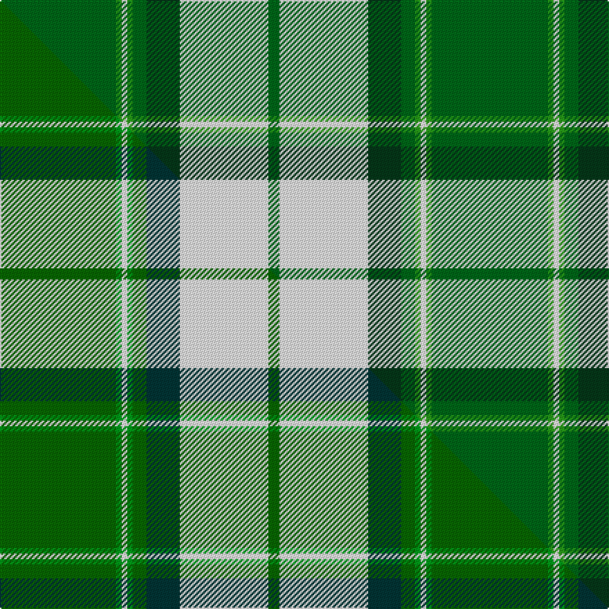

This is one **variant** — a specific cloth: this exact thread count and colourway, with its own
provenance below. It is one weaving of the [sett](/setts/dgi42g2w2g2dgi5dg12w32dgi4/) (the scale-free proportion — the
same cloth at any scale or shade), whose colour order is pattern [GGWGGGWG](/stripes/ggwgggwg/).

Part of the [Longniddry](/tartans/l/lo/longniddry-4/) tartan — the named design grouping this sett with its other cloths.

Sourced from house-of-tartan.  It is a [8 stripe tartan](/stripes/stripes8/).

Original link [http://www.house-of-tartan.scotland.net/house/TartanViewjs.asp?colr=Def&tnam=764](http://www.house-of-tartan.scotland.net/house/TartanViewjs.asp?colr=Def&tnam=764)

## Provenance

Earliest known date: pre 1992 A dancers tartan from D.C. Dalgleish weavers of Selkirk

Dataset <small>— provenance for this record, inherited from the source manifest</small>

<dl class="dataset-prov">
<dt>source</dt><dd><a href="/sources/house-of-tartan/">House of Tartan</a></dd>
<dt>data captured from</dt><dd><a href="https://github.com/thetartan/tartan-database/blob/master/data/house-of-tartan/data.csv">https://github.com/thetartan/tartan-database/blob/master/data/house-of-tartan/data.csv</a></dd>
<dt>data date</dt><dd>pre 1992 <small>(this record)</small></dd>
<dt>licence</dt><dd><a href="https://creativecommons.org/licenses/by-nc-nd/4.0/">CC BY-NC-ND 4.0</a></dd>
</dl>

Capture chain <small>— the hands this data passed through, oldest first; each capture carries its own licence</small>

<ol class="capture-chain">
<li><a href="http://www.house-of-tartan.scotland.net/">House of Tartan</a> <small>the weaver/retailer's database — the site is now offline; the URL is kept as the ultimate source's identity</small></li>
<li><a href="https://github.com/thetartan/tartan-database">thetartan/tartan-database</a> <small>2016-2017</small> · <a href="https://creativecommons.org/licenses/by-nc-nd/4.0/">CC BY-NC-ND 4.0</a> <small>Levko Kravets's frozen compilation — the capture we vendored, and where its CC licence text came from</small></li>
<li>this dictionary <small>captured 2026-06-10 · commit 5bf86c7566</small> <small>each re-capture is a git commit to data/sources</small></li>
</ol>

## Thread count
DGi/84 G4 W4 G4 DGi10 DG24 W64 DGi/8

One full sett is **312 threads**.

## Palette
<table><thead><tr><th>Colour</th><th>Shade</th><th>OKLCh</th></tr></thead><tbody><tr><td>DG</td><td><code style="background-color:#053819;">#053819</code> <small style="color:#888">#053819</small></td><td><small style="color:#888">oklch(30.0% 0.075 151.3)</small></td></tr><tr><td>DG</td><td><code style="background-color:#006818;">#006818</code> <small style="color:#888">#006818</small></td><td><small style="color:#888">oklch(45.0% 0.142 145.0)</small></td></tr><tr><td>G</td><td><code style="background-color:#289C18;">#289C18</code> <small style="color:#888">#289C18</small></td><td><small style="color:#888">oklch(60.6% 0.191 141.6)</small></td></tr><tr><td>W</td><td><code style="background-color:#F7F7F7;">#F7F7F7</code> <small style="color:#888">#F7F7F7</small></td><td><small style="color:#888">oklch(97.6% 0.000 89.9)</small></td></tr></tbody></table>

# Sample pattern

## Compared to the master

This cloth is one sett of its design; the master sett (the exemplar the design is anchored on) is below for comparison.

Its **ΔTartan distance** from the master is **0.03** — the same measure the nearest-tartans table ranks by (0 is identical; a re-scale of the same cloth is near 0, a recolour or a different proportion further).

<figure class="master-compare" style="margin:0">

this sett
master sett ★

<figcaption style="color:#888;font-size:smaller">One weave of this sett against the <a href="/setts/dg42g2w2g2dg5dt12w32dg4/">master sett ★</a>, split on the diagonal: a shared proportion runs seamlessly across it with only the shades shifting; a different proportion breaks on it.</figcaption>
</figure>

## Nearest tartan variants

The nearest existing variants by ΔTartan distance, with this cloth at the top so the swatches line up against it.

ΔTartan

Threads

Variant

Sett

—

312

<a href="/variants/s8/dgi42g2w2g2dgi5dg12w32dgi4~x2~dgi1806142-g2408144/">Longniddry Green District Tartan</a>

<a href="/ttd/edit/#slug=dg42g2w2g2dg5dt12w32dg4~x2~dg1806142-g2408144&amp;base=dgi42g2w2g2dgi5dg12w32dgi4~x2~dgi1806142-g2408144" title="compare in the TTD">0.02</a>

312

<a href="/variants/s8/dg42g2w2g2dg5dt12w32dg4~x2~dg1806142-g2408144/">Longniddry Green (Dance)</a>

<a href="/ttd/edit/#slug=g42b2w2b2g5dg12w32g4~x2&amp;base=dgi42g2w2g2dgi5dg12w32dgi4~x2~dgi1806142-g2408144" title="compare in the TTD">0.64</a>

312

<a href="/variants/s8/g42b2w2b2g5dg12w32g4~x2/">Longniddry, Green</a>

<a href="/ttd/edit/#slug=g42y1w2y1g5dg12w32g4~x2&amp;base=dgi42g2w2g2dgi5dg12w32dgi4~x2~dgi1806142-g2408144" title="compare in the TTD">1.09</a>

304

<a href="/variants/s8/g42y1w2y1g5dg12w32g4~x2/">Longniddry Green Error (Dance)</a>

<a href="/ttd/edit/#slug=ly4g4db2g29w1db12g2ly16g4db2~x2&amp;base=dgi42g2w2g2dgi5dg12w32dgi4~x2~dgi1806142-g2408144" title="compare in the TTD">2.31</a>

292

<a href="/variants/s10/ly4g4db2g29w1db12g2ly16g4db2~x2/">Unidentified (Pahls)</a>

<a href="/ttd/edit/#slug=g3r2g27dg3w30dg2w3~x2&amp;base=dgi42g2w2g2dgi5dg12w32dgi4~x2~dgi1806142-g2408144" title="compare in the TTD">2.97</a>

268

<a href="/variants/s7/g3r2g27dg3w30dg2w3~x2/">Uist, Green (Dance)</a>

<a href="/ttd/edit/#slug=dg41ly3g7n3w24dg10g7n7w3~x2&amp;base=dgi42g2w2g2dgi5dg12w32dgi4~x2~dgi1806142-g2408144" title="compare in the TTD">3.13</a>

332

<a href="/variants/s9/dg41ly3g7n3w24dg10g7n7w3~x2/">Drummond of Perth Dress (Dance)</a>

<a href="/ttd/edit/#slug=y6dg36w5t4w30t1w2~x2&amp;base=dgi42g2w2g2dgi5dg12w32dgi4~x2~dgi1806142-g2408144" title="compare in the TTD">3.14</a>

320

<a href="/variants/s7/y6dg36w5t4w30t1w2~x2/">Pearce Scotch Plaid 4 (Fashion)</a>

<a href="/ttd/edit/#slug=g2dy10g11y4dy1w18g2dy1~x2&amp;base=dgi42g2w2g2dgi5dg12w32dgi4~x2~dgi1806142-g2408144" title="compare in the TTD">3.47</a>

190

<a href="/variants/s8/g2dy10g11y4dy1w18g2dy1~x2/">Aviemore Check District Tartan</a>

<a href="/ttd/edit/#slug=g22dr2g4dr2g4dr18w24dr1lo3~x2&amp;base=dgi42g2w2g2dgi5dg12w32dgi4~x2~dgi1806142-g2408144" title="compare in the TTD">3.49</a>

270

<a href="/variants/s9/g22dr2g4dr2g4dr18w24dr1lo3~x2/">Prince Edward Island, Dress</a>

<a href="/ttd/edit/#slug=g2dy10g11ly4dy1w18g2dy1~x2&amp;base=dgi42g2w2g2dgi5dg12w32dgi4~x2~dgi1806142-g2408144" title="compare in the TTD">3.51</a>

190

<a href="/variants/s8/g2dy10g11ly4dy1w18g2dy1~x2/">Aviemore Check (Fashion)</a>

## Neighbour map

Every grey dot is one of 13621 variants placed by the first two principal components of the ΔTartan feature space (42% of its variance). Red is this tartan; blue dots are its nearest — click one to open its page. The map is a flat projection of a many-dimensional space — [how to read it](/posts/neighbourhood-maps/).

<svg viewBox="0 0 640 380" role="img" style="max-width:100%;height:auto;border:1px solid #e0e0e0;border-radius:4px;display:block" xmlns="http://www.w3.org/2000/svg"><image href="/nn/cloud.v1.png" width="640" height="380"/><a href="/variants/s8/dg42g2w2g2dg5dt12w32dg4~x2~dg1806142-g2408144/"><circle cx="298.8" cy="163.9" r="4" fill="#3465a4"><title>Longniddry Green (Dance)</title></circle></a><a href="/variants/s8/g42b2w2b2g5dg12w32g4~x2/"><circle cx="306.6" cy="168.2" r="4" fill="#3465a4"><title>Longniddry, Green</title></circle></a><a href="/variants/s8/g42y1w2y1g5dg12w32g4~x2/"><circle cx="337.4" cy="140.0" r="4" fill="#3465a4"><title>Longniddry Green Error (Dance)</title></circle></a><a href="/variants/s10/ly4g4db2g29w1db12g2ly16g4db2~x2/"><circle cx="330.3" cy="156.5" r="4" fill="#3465a4"><title>Unidentified (Pahls)</title></circle></a><a href="/variants/s7/g3r2g27dg3w30dg2w3~x2/"><circle cx="278.6" cy="170.0" r="4" fill="#3465a4"><title>Uist, Green (Dance)</title></circle></a><a href="/variants/s9/dg41ly3g7n3w24dg10g7n7w3~x2/"><circle cx="234.3" cy="167.2" r="4" fill="#3465a4"><title>Drummond of Perth Dress (Dance)</title></circle></a><a href="/variants/s7/y6dg36w5t4w30t1w2~x2/"><circle cx="290.8" cy="147.2" r="4" fill="#3465a4"><title>Pearce Scotch Plaid 4 (Fashion)</title></circle></a><a href="/variants/s8/g2dy10g11y4dy1w18g2dy1~x2/"><circle cx="212.0" cy="184.3" r="4" fill="#3465a4"><title>Aviemore Check District Tartan</title></circle></a><a href="/variants/s9/g22dr2g4dr2g4dr18w24dr1lo3~x2/"><circle cx="233.5" cy="164.5" r="4" fill="#3465a4"><title>Prince Edward Island, Dress</title></circle></a><a href="/variants/s8/g2dy10g11ly4dy1w18g2dy1~x2/"><circle cx="210.9" cy="184.3" r="4" fill="#3465a4"><title>Aviemore Check (Fashion)</title></circle></a><circle cx="299.2" cy="164.3" r="5" fill="#c00000"/><text x="320" y="376" text-anchor="middle" font-size="11" fill="#999">ground</text><text x="11" y="190" text-anchor="middle" font-size="11" fill="#999" transform="rotate(-90 11 190)">complexity</text></svg>

ID: /variants/s8/dgi42g2w2g2dgi5dg12w32dgi4~x2~dgi1806142-g2408144/
