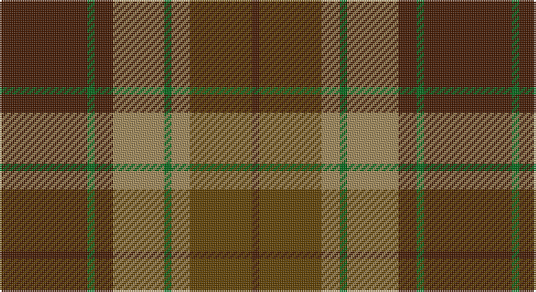

This page is one **sett** — a single exact thread-count. It belongs to the [tartan](/setts/do24g2do5lo14g2lo5dy17do2/)
(the same proportion at any scale), whose colour order is pattern [BGBYGYGB](/stripes/bgbygygb/).

Part of the [Loch Rannoch](/tartans/loch-rannoch/) tartan — the named design grouping this sett with its other cloths.

Sourced from house-of-tartan.  It is a [8 stripe tartan](/stripes/stripes8/).

Original link http://www.house-of-tartan.scotland.net/house/TartanViewjs.asp?colr=Def&tnam=1735

## Provenance

Earliest known date: 1975 Nothing

## Also known as

This cloth is also recorded under:

- Loch Rannoch #2
- Loch Rannoch Fancy

## Thread count
DR/48 G4 DR10 LT28 G4 LT10 T34 DR/4

One full sett is **232 threads**.

## Palette

Palette: <strong>Tartan Register</strong>
<table><thead><tr><th>Colour</th><th>Threads</th><th>Shade</th><th>Base</th><th>OKLCh</th></tr></thead><tbody><tr><td>DR/</td><td style="text-align:right;font-variant-numeric:tabular-nums">48</td><td><code style="background-color:#441800;">#441800</code> <small style="color:#888">#441800</small></td><td>B <code style="background-color:#2A418A;">#2A418A</code></td><td><small style="color:#888">oklch(27.3% 0.076 46.3)</small></td></tr><tr><td>G</td><td style="text-align:right;font-variant-numeric:tabular-nums">4</td><td><code style="background-color:#006818;">#006818</code> <small style="color:#888">#006818</small></td><td>G <code style="background-color:#006100;">#006100</code></td><td><small style="color:#888">oklch(45.0% 0.142 145.0)</small></td></tr><tr><td>DR</td><td style="text-align:right;font-variant-numeric:tabular-nums">10</td><td><code style="background-color:#441800;">#441800</code> <small style="color:#888">#441800</small></td><td>B <code style="background-color:#2A418A;">#2A418A</code></td><td><small style="color:#888">oklch(27.3% 0.076 46.3)</small></td></tr><tr><td>LT</td><td style="text-align:right;font-variant-numeric:tabular-nums">28</td><td><code style="background-color:#A08858;">#A08858</code> <small style="color:#888">#A08858</small></td><td>Y <code style="background-color:#F2BF00;">#F2BF00</code></td><td><small style="color:#888">oklch(63.7% 0.071 84.0)</small></td></tr><tr><td>G</td><td style="text-align:right;font-variant-numeric:tabular-nums">4</td><td><code style="background-color:#006818;">#006818</code> <small style="color:#888">#006818</small></td><td>G <code style="background-color:#006100;">#006100</code></td><td><small style="color:#888">oklch(45.0% 0.142 145.0)</small></td></tr><tr><td>LT</td><td style="text-align:right;font-variant-numeric:tabular-nums">10</td><td><code style="background-color:#A08858;">#A08858</code> <small style="color:#888">#A08858</small></td><td>Y <code style="background-color:#F2BF00;">#F2BF00</code></td><td><small style="color:#888">oklch(63.7% 0.071 84.0)</small></td></tr><tr><td>T</td><td style="text-align:right;font-variant-numeric:tabular-nums">34</td><td><code style="background-color:#604000;">#604000</code> <small style="color:#888">#604000</small></td><td>G <code style="background-color:#006100;">#006100</code></td><td><small style="color:#888">oklch(39.8% 0.083 76.8)</small></td></tr><tr><td>DR/</td><td style="text-align:right;font-variant-numeric:tabular-nums">4</td><td><code style="background-color:#441800;">#441800</code> <small style="color:#888">#441800</small></td><td>B <code style="background-color:#2A418A;">#2A418A</code></td><td><small style="color:#888">oklch(27.3% 0.076 46.3)</small></td></tr></tbody></table>

# Sample pattern

## Compared to the master

This cloth is one sett of its design; the master sett (the exemplar the design is anchored on) is below for comparison.

<figure style="margin:0"><figcaption style="color:#888;font-size:smaller">this sett</figcaption></figure>
<figure style="margin:0"><figcaption style="color:#888;font-size:smaller"><a href="/setts/dy24g2dy5o14g2o5lo17dy2/">master sett →</a></figcaption></figure>

## Nearest tartans

The nearest existing variants by ΔTartan distance, with this tartan at the top so the swatches line up against it.

ΔTartan

Tartan

Sett

—

<a href="/ttd/edit/#slug=do24g2do5lo14g2lo5dy17do2~x2">Loch Rannoch Trade Tartan</a> <a class="nn-out" href="/variants/s8/do24g2do5lo14g2lo5dy17do2~x2/" title="open its dictionary page">↗</a>

0.61

<a href="/ttd/edit/#slug=dr24g2dr5o14g2o5oi17dr2~x2&amp;base=do24g2do5lo14g2lo5dy17do2~x2">Loch Rannoch</a> <a class="nn-out" href="/variants/s8/dr24g2dr5o14g2o5oi17dr2~x2/" title="open its dictionary page">↗</a>

0.82

<a href="/ttd/edit/#slug=r8g2r12k6r3db3g24k2~x2&amp;base=do24g2do5lo14g2lo5dy17do2~x2">McInery (Personal)</a> <a class="nn-out" href="/variants/s8/r8g2r12k6r3db3g24k2~x2/" title="open its dictionary page">↗</a>

0.95

<a href="/ttd/edit/#slug=g3r22t5g10k10g2~x2&amp;base=do24g2do5lo14g2lo5dy17do2~x2">Strathspey (Fashion)</a> <a class="nn-out" href="/variants/s6/g3r22t5g10k10g2~x2/" title="open its dictionary page">↗</a>

1.01

<a href="/ttd/edit/#slug=dg12b6dg6r15k1r1k2~x2&amp;base=do24g2do5lo14g2lo5dy17do2~x2">(2) Cook</a> <a class="nn-out" href="/variants/s7/dg12b6dg6r15k1r1k2~x2/" title="open its dictionary page">↗</a>

1.10

<a href="/ttd/edit/#slug=r5dg12o4db4o22dg3o4r5&amp;base=do24g2do5lo14g2lo5dy17do2~x2">Invertere, (Daks)</a> <a class="nn-out" href="/variants/s8/r5dg12o4db4o22dg3o4r5/" title="open its dictionary page">↗</a>

1.13

<a href="/ttd/edit/#slug=r3dy16g10r3g3lb2g3r3~x2&amp;base=do24g2do5lo14g2lo5dy17do2~x2">Scott Htg (Clan)</a> <a class="nn-out" href="/variants/s8/r3dy16g10r3g3lb2g3r3~x2/" title="open its dictionary page">↗</a>

1.14

<a href="/ttd/edit/#slug=dt5r19dti2y8r3y18dti2y9dti2~x2&amp;base=do24g2do5lo14g2lo5dy17do2~x2">Hubbard (2016)</a> <a class="nn-out" href="/variants/s9/dt5r19dti2y8r3y18dti2y9dti2~x2/" title="open its dictionary page">↗</a>

1.16

<a href="/ttd/edit/#slug=db1k1r12g12k6db5r12k1db1~x4&amp;base=do24g2do5lo14g2lo5dy17do2~x2">Montrose (Macnaughton variation)</a> <a class="nn-out" href="/variants/s9/db1k1r12g12k6db5r12k1db1~x4/" title="open its dictionary page">↗</a>

1.16

<a href="/ttd/edit/#slug=dy6r3dy34k16ly3dt22r4~x2&amp;base=do24g2do5lo14g2lo5dy17do2~x2">Ballantrae (Macnaughtons)</a> <a class="nn-out" href="/variants/s7/dy6r3dy34k16ly3dt22r4~x2/" title="open its dictionary page">↗</a>

1.17

<a href="/ttd/edit/#slug=dg6r2dr2dg4dr2r12k1~x2&amp;base=do24g2do5lo14g2lo5dy17do2~x2">MacNab VS</a> <a class="nn-out" href="/variants/s7/dg6r2dr2dg4dr2r12k1~x2/" title="open its dictionary page">↗</a>

## Neighbour map

Every grey dot is one of 14360 variants placed by the first two principal components of the ΔTartan feature space (44% of its variance). Red is this tartan; blue dots are its nearest — click one to open its page.

<svg viewBox="0 0 640 380" role="img" style="max-width:100%;height:auto;border:1px solid #e0e0e0;border-radius:4px;display:block" xmlns="http://www.w3.org/2000/svg"><image href="/nn/cloud.v1.png" width="640" height="380"/><a href="/variants/s8/dr24g2dr5o14g2o5oi17dr2~x2/"><circle cx="292.2" cy="213.0" r="4" fill="#3465a4"><title>Loch Rannoch</title></circle></a><a href="/variants/s8/r8g2r12k6r3db3g24k2~x2/"><circle cx="281.0" cy="201.8" r="4" fill="#3465a4"><title>McInery (Personal)</title></circle></a><a href="/variants/s6/g3r22t5g10k10g2~x2/"><circle cx="251.6" cy="226.8" r="4" fill="#3465a4"><title>Strathspey (Fashion)</title></circle></a><a href="/variants/s7/dg12b6dg6r15k1r1k2~x2/"><circle cx="274.9" cy="211.3" r="4" fill="#3465a4"><title>(2) Cook</title></circle></a><a href="/variants/s8/r5dg12o4db4o22dg3o4r5/"><circle cx="285.0" cy="225.4" r="4" fill="#3465a4"><title>Invertere, (Daks)</title></circle></a><a href="/variants/s8/r3dy16g10r3g3lb2g3r3~x2/"><circle cx="247.7" cy="227.3" r="4" fill="#3465a4"><title>Scott Htg (Clan)</title></circle></a><a href="/variants/s9/dt5r19dti2y8r3y18dti2y9dti2~x2/"><circle cx="316.8" cy="213.0" r="4" fill="#3465a4"><title>Hubbard (2016)</title></circle></a><a href="/variants/s9/db1k1r12g12k6db5r12k1db1~x4/"><circle cx="272.3" cy="199.2" r="4" fill="#3465a4"><title>Montrose (Macnaughton variation)</title></circle></a><a href="/variants/s7/dy6r3dy34k16ly3dt22r4~x2/"><circle cx="264.2" cy="205.0" r="4" fill="#3465a4"><title>Ballantrae (Macnaughtons)</title></circle></a><a href="/variants/s7/dg6r2dr2dg4dr2r12k1~x2/"><circle cx="319.4" cy="212.3" r="4" fill="#3465a4"><title>MacNab VS</title></circle></a><circle cx="277.2" cy="206.8" r="5" fill="#c00000"/></svg>

ID: /variants/s8/do24g2do5lo14g2lo5dy17do2~x2/
