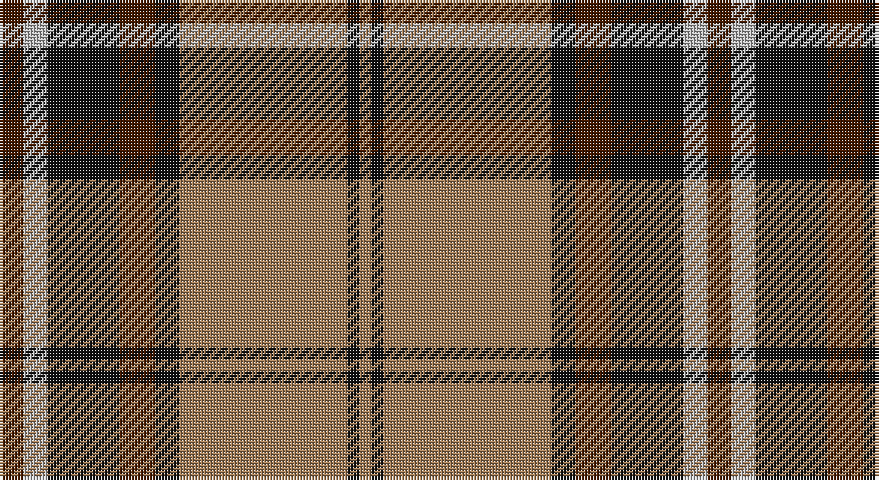

This page is one **sett** — a single exact thread-count. It belongs to the [tartan](/setts/do2lr2k6do3k2o14k1o1/)
(the same proportion at any scale), whose colour order is pattern [BYKBKRKR](/stripes/bykbkrkr/).

Sourced from tartans-authority.  It is a [8 stripe tartan](/stripes/stripes8/).

Original link http://www.tartansauthority.com/tartan-ferret/display/1741/

## Register references

External register numbers recorded for this tartan.

- Scottish Tartans Authority (ITI): 1741

## Thread count
DR/8 N8 K24 DR12 K8 LT56 K4 LT/4

One full sett is **236 threads**.

## Palette

Palette: <strong>Tartan Register</strong> <small style="color:#888">(3 of 4 colours)</small>
<table><thead><tr><th>Colour</th><th>Threads</th><th>Shade</th><th>Base</th><th>OKLCh</th></tr></thead><tbody><tr><td>DR/</td><td style="text-align:right;font-variant-numeric:tabular-nums">8</td><td><code style="background-color:#441800;">#441800</code> <small style="color:#888">#441800</small></td><td>B <code style="background-color:#2A418A;">#2A418A</code></td><td><small style="color:#888">oklch(27.3% 0.076 46.3)</small></td></tr><tr><td>N</td><td style="text-align:right;font-variant-numeric:tabular-nums">8</td><td><code style="background-color:#B8B8B8;">#B8B8B8</code> <small style="color:#888">#B8B8B8</small></td><td>Y <code style="background-color:#F2BF00;">#F2BF00</code></td><td><small style="color:#888">oklch(78.3% 0.000 89.9)</small></td></tr><tr><td>K</td><td style="text-align:right;font-variant-numeric:tabular-nums">24</td><td><code style="background-color:#101010;">#101010</code> <small style="color:#888">#101010</small></td><td>K <code style="background-color:#000000;">#000000</code></td><td><small style="color:#888">oklch(17.3% 0.000 89.9)</small></td></tr><tr><td>DR</td><td style="text-align:right;font-variant-numeric:tabular-nums">12</td><td><code style="background-color:#441800;">#441800</code> <small style="color:#888">#441800</small></td><td>B <code style="background-color:#2A418A;">#2A418A</code></td><td><small style="color:#888">oklch(27.3% 0.076 46.3)</small></td></tr><tr><td>K</td><td style="text-align:right;font-variant-numeric:tabular-nums">8</td><td><code style="background-color:#101010;">#101010</code> <small style="color:#888">#101010</small></td><td>K <code style="background-color:#000000;">#000000</code></td><td><small style="color:#888">oklch(17.3% 0.000 89.9)</small></td></tr><tr><td>LT</td><td style="text-align:right;font-variant-numeric:tabular-nums">56</td><td><code style="background-color:#A07C58;">#A07C58</code> <small style="color:#888">#A07C58</small></td><td>R <code style="background-color:#CC0000;">#CC0000</code></td><td><small style="color:#888">oklch(61.2% 0.067 66.0)</small></td></tr><tr><td>K</td><td style="text-align:right;font-variant-numeric:tabular-nums">4</td><td><code style="background-color:#101010;">#101010</code> <small style="color:#888">#101010</small></td><td>K <code style="background-color:#000000;">#000000</code></td><td><small style="color:#888">oklch(17.3% 0.000 89.9)</small></td></tr><tr><td>LT/</td><td style="text-align:right;font-variant-numeric:tabular-nums">4</td><td><code style="background-color:#A07C58;">#A07C58</code> <small style="color:#888">#A07C58</small></td><td>R <code style="background-color:#CC0000;">#CC0000</code></td><td><small style="color:#888">oklch(61.2% 0.067 66.0)</small></td></tr></tbody></table>

# Sample pattern

## Nearest tartans

The nearest existing variants by ΔTartan distance, with this tartan at the top so the swatches line up against it.

ΔTartan

Tartan

Sett

—

<a href="/ttd/edit/#slug=do2lr2k6do3k2o14k1o1~x4">Blair Atholl (Fashion)</a> <a class="nn-out" href="/variants/s8/do2lr2k6do3k2o14k1o1~x4/" title="open its dictionary page">↗</a>

0.39

<a href="/ttd/edit/#slug=do2w2k6do3k2o14k1o1~x4&amp;base=do2lr2k6do3k2o14k1o1~x4">Braemar or Blair Atholl</a> <a class="nn-out" href="/variants/s8/do2w2k6do3k2o14k1o1~x4/" title="open its dictionary page">↗</a>

0.74

<a href="/ttd/edit/#slug=r2w8k14dy25w2k2w2~x2&amp;base=do2lr2k6do3k2o14k1o1~x4">Merric Dark Camel.. Trade Tartan</a> <a class="nn-out" href="/variants/s7/r2w8k14dy25w2k2w2~x2/" title="open its dictionary page">↗</a>

0.82

<a href="/ttd/edit/#slug=o15y1o2lo2o2y1o3k8y10o3~x4&amp;base=do2lr2k6do3k2o14k1o1~x4">Annan</a> <a class="nn-out" href="/variants/s10/o15y1o2lo2o2y1o3k8y10o3~x4/" title="open its dictionary page">↗</a>

0.87

<a href="/ttd/edit/#slug=r4k2lb10k10y28k3~x2&amp;base=do2lr2k6do3k2o14k1o1~x4">Thomson Camel (Jedburgh Mill)</a> <a class="nn-out" href="/variants/s6/r4k2lb10k10y28k3~x2/" title="open its dictionary page">↗</a>

0.90

<a href="/ttd/edit/#slug=k3r8k3r8lo19r7dt36r3~x2&amp;base=do2lr2k6do3k2o14k1o1~x4">Private SA Club</a> <a class="nn-out" href="/variants/s8/k3r8k3r8lo19r7dt36r3~x2/" title="open its dictionary page">↗</a>

0.90

<a href="/ttd/edit/#slug=k4lo17k2lo2g7k2lo2k22db4~x2&amp;base=do2lr2k6do3k2o14k1o1~x4">Bro-Leon</a> <a class="nn-out" href="/variants/s9/k4lo17k2lo2g7k2lo2k22db4~x2/" title="open its dictionary page">↗</a>

0.91

<a href="/ttd/edit/#slug=k2lr6r3lr6r3k20y30r2~x2&amp;base=do2lr2k6do3k2o14k1o1~x4">Hermitage Academy (Corporate)</a> <a class="nn-out" href="/variants/s8/k2lr6r3lr6r3k20y30r2~x2/" title="open its dictionary page">↗</a>

0.95

<a href="/ttd/edit/#slug=w1dg1r1dg14r1db6r11dg1r1w1~x4&amp;base=do2lr2k6do3k2o14k1o1~x4">Unidentified Specimen #2</a> <a class="nn-out" href="/variants/s10/w1dg1r1dg14r1db6r11dg1r1w1~x4/" title="open its dictionary page">↗</a>

0.96

<a href="/ttd/edit/#slug=dg5r4dg17lt5r32lt5dg17r4dg5w2~x2&amp;base=do2lr2k6do3k2o14k1o1~x4">Wilson's No.005</a> <a class="nn-out" href="/variants/s10/dg5r4dg17lt5r32lt5dg17r4dg5w2~x2/" title="open its dictionary page">↗</a>

0.97

<a href="/ttd/edit/#slug=r10w2k10w10dy35k5~x2&amp;base=do2lr2k6do3k2o14k1o1~x4">Loch Ness</a> <a class="nn-out" href="/variants/s6/r10w2k10w10dy35k5~x2/" title="open its dictionary page">↗</a>

## Neighbour map

Every grey dot is one of 14360 variants placed by the first two principal components of the ΔTartan feature space (44% of its variance). Red is this tartan; blue dots are its nearest — click one to open its page.

<svg viewBox="0 0 640 380" role="img" style="max-width:100%;height:auto;border:1px solid #e0e0e0;border-radius:4px;display:block" xmlns="http://www.w3.org/2000/svg"><image href="/nn/cloud.v1.png" width="640" height="380"/><a href="/variants/s8/do2w2k6do3k2o14k1o1~x4/"><circle cx="255.7" cy="155.3" r="4" fill="#3465a4"><title>Braemar or Blair Atholl</title></circle></a><a href="/variants/s7/r2w8k14dy25w2k2w2~x2/"><circle cx="233.4" cy="163.7" r="4" fill="#3465a4"><title>Merric Dark Camel.. Trade Tartan</title></circle></a><a href="/variants/s10/o15y1o2lo2o2y1o3k8y10o3~x4/"><circle cx="286.0" cy="157.9" r="4" fill="#3465a4"><title>Annan</title></circle></a><a href="/variants/s6/r4k2lb10k10y28k3~x2/"><circle cx="260.4" cy="177.6" r="4" fill="#3465a4"><title>Thomson Camel (Jedburgh Mill)</title></circle></a><a href="/variants/s8/k3r8k3r8lo19r7dt36r3~x2/"><circle cx="229.0" cy="173.9" r="4" fill="#3465a4"><title>Private SA Club</title></circle></a><a href="/variants/s9/k4lo17k2lo2g7k2lo2k22db4~x2/"><circle cx="248.4" cy="169.4" r="4" fill="#3465a4"><title>Bro-Leon</title></circle></a><a href="/variants/s8/k2lr6r3lr6r3k20y30r2~x2/"><circle cx="236.5" cy="158.9" r="4" fill="#3465a4"><title>Hermitage Academy (Corporate)</title></circle></a><a href="/variants/s10/w1dg1r1dg14r1db6r11dg1r1w1~x4/"><circle cx="259.3" cy="142.5" r="4" fill="#3465a4"><title>Unidentified Specimen #2</title></circle></a><a href="/variants/s10/dg5r4dg17lt5r32lt5dg17r4dg5w2~x2/"><circle cx="260.8" cy="149.2" r="4" fill="#3465a4"><title>Wilson's No.005</title></circle></a><a href="/variants/s6/r10w2k10w10dy35k5~x2/"><circle cx="252.3" cy="170.0" r="4" fill="#3465a4"><title>Loch Ness</title></circle></a><circle cx="267.3" cy="161.8" r="5" fill="#c00000"/></svg>

ID: /variants/s8/do2lr2k6do3k2o14k1o1~x4/
