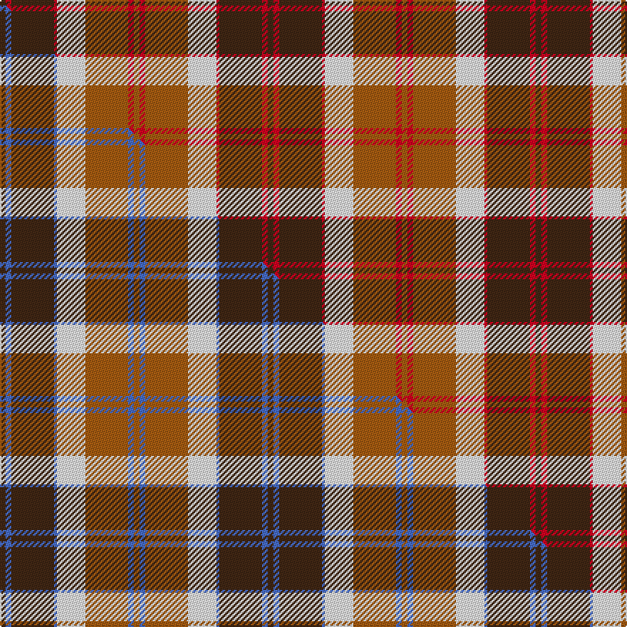

This is one **variant** — a specific cloth: this exact thread count and colourway, with its own
provenance below. It is one weaving of the [sett](/tartans/b/ba/bannockbane-6/) (the scale-free proportion — the
same cloth at any scale or shade), whose colour order is pattern [BRBRWRRR](/stripes/brbrwrrr/).

Part of the [Bannockbane](/tartans/b/ba/bannockbane-6/) tartan — the named design grouping this sett with its other cloths.

Sourced from weddslist.  It is a [8 stripe tartan](/stripes/stripes8/).

Original link [http://www.weddslist.com/cgi-bin/tartans/pg.pl?source=sts](http://www.weddslist.com/cgi-bin/tartans/pg.pl?source=sts)

Dataset <small>— provenance for this record, inherited from the source manifest</small>

<dl class="dataset-prov">
<dt>source</dt><dd><a href="/sources/weddslist/">Weddslist</a></dd>
<dt>data captured from</dt><dd><a href="https://github.com/thetartan/tartan-database/blob/master/data/weddslist/data.csv">https://github.com/thetartan/tartan-database/blob/master/data/weddslist/data.csv</a></dd>
<dt>data date</dt><dd>2016-11-17 <small>(dataset default)</small></dd>
<dt>licence</dt><dd><a href="https://creativecommons.org/licenses/by-nc-nd/4.0/">CC BY-NC-ND 4.0</a></dd>
</dl>

Capture chain <small>— the hands this data passed through, oldest first; each capture carries its own licence</small>

<ol class="capture-chain">
<li><a href="https://www.weddslist.com/tartans/">Weddslist</a> <small>the living privately compiled reference</small></li>
<li><a href="https://github.com/thetartan/tartan-database">thetartan/tartan-database</a> <small>2016-2017</small> · <a href="https://creativecommons.org/licenses/by-nc-nd/4.0/">CC BY-NC-ND 4.0</a> <small>Levko Kravets's frozen compilation — the capture we vendored, and where its CC licence text came from</small></li>
<li>this dictionary <small>captured 2026-06-10 · commit 5bf86c7566</small> <small>each re-capture is a git commit to data/sources</small></li>
</ol>

## Thread count
DO/4 R4 DO30 R2 W20 O30 R4 O/4

One full sett is **188 threads**.

## Palette
<table><thead><tr><th>Colour</th><th>Shade</th><th>OKLCh</th></tr></thead><tbody><tr><td>DO</td><td><code style="background-color:#412714;">#412714</code> <small style="color:#888">#412714</small></td><td><small style="color:#888">oklch(30.1% 0.050 55.7)</small></td></tr><tr><td>W</td><td><code style="background-color:#F7F7F7;">#F7F7F7</code> <small style="color:#888">#F7F7F7</small></td><td><small style="color:#888">oklch(97.6% 0.000 89.9)</small></td></tr><tr><td>O</td><td><code style="background-color:#A65C11;">#A65C11</code> <small style="color:#888">#A65C11</small></td><td><small style="color:#888">oklch(55.0% 0.125 58.3)</small></td></tr><tr><td>R</td><td><code style="background-color:#D60020;">#D60020</code> <small style="color:#888">#D60020</small></td><td><small style="color:#888">oklch(55.2% 0.224 25.5)</small></td></tr></tbody></table>

# Sample pattern

## Compared to the master

This cloth is one sett of its design; the master sett (the exemplar the design is anchored on) is below for comparison.

Its **ΔTartan distance** from the master is **0.90** — the same measure the nearest-tartans table ranks by (0 is identical; a re-scale of the same cloth is near 0, a recolour or a different proportion further).

<figure class="master-compare" style="margin:0">

this sett
master sett ★

<figcaption style="color:#888;font-size:smaller">One weave of this sett against the <a href="/setts/do2b2do15b1w10o15b2o2/">master sett ★</a>, split on the diagonal: a shared proportion runs seamlessly across it with only the shades shifting; a different proportion breaks on it.</figcaption>
</figure>

## Nearest tartan variants

The nearest existing variants by ΔTartan distance, with this cloth at the top so the swatches line up against it.

ΔTartan

Threads

Variant

Sett

—

188

<a href="/variants/s8/do2r2do15r1w10o15r2o2~x2/">Bannockbane</a>

<a href="/ttd/edit/#slug=do2b2do15b1w10o15b2o2~x2&amp;base=do2r2do15r1w10o15r2o2~x2" title="compare in the TTD">0.90</a>

188

<a href="/variants/s8/do2b2do15b1w10o15b2o2~x2/">Bannockbane</a>

<a href="/ttd/edit/#slug=dr4w2dr1w18dr18r18ri3r4~x2~r1807033-ri2109032&amp;base=do2r2do15r1w10o15r2o2~x2" title="compare in the TTD">2.05</a>

256

<a href="/variants/s8/dr4w2dr1w18dr18r18ri3r4~x2~r1807033-ri2109032/">Gigha, Cherry (Dance)</a>

<a href="/ttd/edit/#slug=dy1w2lb16dy8r16dy2w1~x2&amp;base=do2r2do15r1w10o15r2o2~x2" title="compare in the TTD">2.14</a>

180

<a href="/variants/s7/dy1w2lb16dy8r16dy2w1~x2/">Jones (2016)</a>

<a href="/ttd/edit/#slug=r30db3r2db3r6db14g26dg6~g2408144-dg1806142&amp;base=do2r2do15r1w10o15r2o2~x2" title="compare in the TTD">2.15</a>

144

<a href="/variants/s8/r30db3r2db3r6db14g26dg6~g2408144-dg1806142/">Cranston Dress Family Tartan</a>

<a href="/ttd/edit/#slug=r15db2r1db2r3db7g13dg3~x2~g2408144-dg1806142&amp;base=do2r2do15r1w10o15r2o2~x2" title="compare in the TTD">2.16</a>

148

<a href="/variants/s8/r15db2r1db2r3db7g13dg3~x2~g2408144-dg1806142/">Cranston Dress</a>

<a href="/ttd/edit/#slug=do2r2do15r1w10dy15r2dy2~x2&amp;base=do2r2do15r1w10o15r2o2~x2" title="compare in the TTD">2.36</a>

188

<a href="/variants/s8/do2r2do15r1w10dy15r2dy2~x2/">Bannockbane Brown #1</a>

<a href="/ttd/edit/#slug=dp1r5g15r3dp9r10w1~x4&amp;base=do2r2do15r1w10o15r2o2~x2" title="compare in the TTD">2.46</a>

344

<a href="/variants/s7/dp1r5g15r3dp9r10w1~x4/">Geddes</a>

<a href="/ttd/edit/#slug=r3dr14g8r2g2w2g2r1~x2&amp;base=do2r2do15r1w10o15r2o2~x2" title="compare in the TTD">2.48</a>

128

<a href="/variants/s8/r3dr14g8r2g2w2g2r1~x2/">Scott Hunting Clan Tartan</a>

<a href="/ttd/edit/#slug=ly25r2w2db2w2r13dy28db2r3~x2&amp;base=do2r2do15r1w10o15r2o2~x2" title="compare in the TTD">2.49</a>

260

<a href="/variants/s9/ly25r2w2db2w2r13dy28db2r3~x2/">Brousseau (Personal)</a>

<a href="/ttd/edit/#slug=g12w1r1w4r1w1r8dy2r1~x4&amp;base=do2r2do15r1w10o15r2o2~x2" title="compare in the TTD">2.51</a>

196

<a href="/variants/s9/g12w1r1w4r1w1r8dy2r1~x4/">Karibu (Corporate)</a>

## Neighbour map

Every grey dot is one of 13657 variants placed by the first two principal components of the ΔTartan feature space (42% of its variance). Red is this tartan; blue dots are its nearest — click one to open its page. The map is a flat projection of a many-dimensional space — [how to read it](/posts/neighbourhood-maps/).

<svg viewBox="0 0 640 380" role="img" style="max-width:100%;height:auto;border:1px solid #e0e0e0;border-radius:4px;display:block" xmlns="http://www.w3.org/2000/svg"><image href="/nn/cloud.v1.png" width="640" height="380"/><a href="/variants/s8/do2b2do15b1w10o15b2o2~x2/"><circle cx="199.7" cy="176.1" r="4" fill="#3465a4"><title>Bannockbane</title></circle></a><a href="/variants/s8/dr4w2dr1w18dr18r18ri3r4~x2~r1807033-ri2109032/"><circle cx="189.8" cy="161.3" r="4" fill="#3465a4"><title>Gigha, Cherry (Dance)</title></circle></a><a href="/variants/s7/dy1w2lb16dy8r16dy2w1~x2/"><circle cx="218.5" cy="174.3" r="4" fill="#3465a4"><title>Jones (2016)</title></circle></a><a href="/variants/s8/r30db3r2db3r6db14g26dg6~g2408144-dg1806142/"><circle cx="242.1" cy="178.9" r="4" fill="#3465a4"><title>Cranston Dress Family Tartan</title></circle></a><a href="/variants/s8/r15db2r1db2r3db7g13dg3~x2~g2408144-dg1806142/"><circle cx="234.8" cy="181.8" r="4" fill="#3465a4"><title>Cranston Dress</title></circle></a><a href="/variants/s8/do2r2do15r1w10dy15r2dy2~x2/"><circle cx="194.1" cy="173.0" r="4" fill="#3465a4"><title>Bannockbane Brown #1</title></circle></a><a href="/variants/s7/dp1r5g15r3dp9r10w1~x4/"><circle cx="247.3" cy="196.1" r="4" fill="#3465a4"><title>Geddes</title></circle></a><a href="/variants/s8/r3dr14g8r2g2w2g2r1~x2/"><circle cx="242.2" cy="174.8" r="4" fill="#3465a4"><title>Scott Hunting Clan Tartan</title></circle></a><a href="/variants/s9/ly25r2w2db2w2r13dy28db2r3~x2/"><circle cx="184.2" cy="142.0" r="4" fill="#3465a4"><title>Brousseau (Personal)</title></circle></a><a href="/variants/s9/g12w1r1w4r1w1r8dy2r1~x4/"><circle cx="218.2" cy="168.9" r="4" fill="#3465a4"><title>Karibu (Corporate)</title></circle></a><circle cx="196.9" cy="170.1" r="5" fill="#c00000"/><text x="320" y="376" text-anchor="middle" font-size="11" fill="#999">ground</text><text x="11" y="190" text-anchor="middle" font-size="11" fill="#999" transform="rotate(-90 11 190)">complexity</text></svg>

ID: /variants/s8/do2r2do15r1w10o15r2o2~x2/
