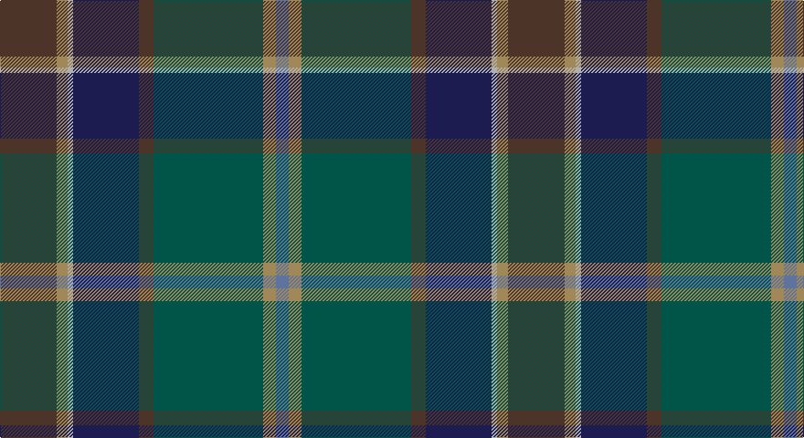

This page is one **sett** — a single exact thread-count. It belongs to the [tartan](/setts/do31lo6lr3db36do8dg60lo7t7/)
(the same proportion at any scale), whose colour order is pattern [BYGBBYYB](/stripes/bygbbyyb/).

Part of the [Little-Dowse Wedding](/tartans/little-dowse-wedding/) tartan — the named design grouping this sett with its other cloths.

Sourced from register-of-tartans.  It is a [8 stripe tartan](/stripes/stripes8/).

Original link https://www.tartanregister.gov.uk/tartanDetails.aspx?ref=11075

## Register references

External register numbers recorded for this tartan.

- Scottish Register of Tartans: [11075](https://www.tartanregister.gov.uk/tartanDetails.aspx?ref=11075)

## Thread count
T/62 LT12 N6 DB72 T16 G120 LT14 B/14

One full sett is **556 threads**.

## Palette

Palette: <strong>Tartan Register</strong>
<table><thead><tr><th>Colour</th><th>Threads</th><th>Shade</th><th>Base</th><th>OKLCh</th></tr></thead><tbody><tr><td>T/</td><td style="text-align:right;font-variant-numeric:tabular-nums">62</td><td><code style="background-color:#4C3428;">#4C3428</code> <small style="color:#888">#4C3428</small></td><td>B <code style="background-color:#2A418A;">#2A418A</code></td><td><small style="color:#888">oklch(34.9% 0.040 47.5)</small></td></tr><tr><td>LT</td><td style="text-align:right;font-variant-numeric:tabular-nums">12</td><td><code style="background-color:#A08858;">#A08858</code> <small style="color:#888">#A08858</small></td><td>Y <code style="background-color:#F2BF00;">#F2BF00</code></td><td><small style="color:#888">oklch(63.7% 0.071 84.0)</small></td></tr><tr><td>N</td><td style="text-align:right;font-variant-numeric:tabular-nums">6</td><td><code style="background-color:#B0B0B0;">#B0B0B0</code> <small style="color:#888">#B0B0B0</small></td><td>Y <code style="background-color:#F2BF00;">#F2BF00</code></td><td><small style="color:#888">oklch(75.7% 0.000 89.9)</small></td></tr><tr><td>DB</td><td style="text-align:right;font-variant-numeric:tabular-nums">72</td><td><code style="background-color:#1C1C50;">#1C1C50</code> <small style="color:#888">#1C1C50</small></td><td>B <code style="background-color:#2A418A;">#2A418A</code></td><td><small style="color:#888">oklch(26.2% 0.093 277.9)</small></td></tr><tr><td>T</td><td style="text-align:right;font-variant-numeric:tabular-nums">16</td><td><code style="background-color:#4C3428;">#4C3428</code> <small style="color:#888">#4C3428</small></td><td>B <code style="background-color:#2A418A;">#2A418A</code></td><td><small style="color:#888">oklch(34.9% 0.040 47.5)</small></td></tr><tr><td>G</td><td style="text-align:right;font-variant-numeric:tabular-nums">120</td><td><code style="background-color:#005448;">#005448</code> <small style="color:#888">#005448</small></td><td>G <code style="background-color:#006100;">#006100</code></td><td><small style="color:#888">oklch(39.9% 0.073 178.8)</small></td></tr><tr><td>LT</td><td style="text-align:right;font-variant-numeric:tabular-nums">14</td><td><code style="background-color:#A08858;">#A08858</code> <small style="color:#888">#A08858</small></td><td>Y <code style="background-color:#F2BF00;">#F2BF00</code></td><td><small style="color:#888">oklch(63.7% 0.071 84.0)</small></td></tr><tr><td>B/</td><td style="text-align:right;font-variant-numeric:tabular-nums">14</td><td><code style="background-color:#5F749C;">#5F749C</code> <small style="color:#888">#5F749C</small></td><td>B <code style="background-color:#2A418A;">#2A418A</code></td><td><small style="color:#888">oklch(55.8% 0.067 262.9)</small></td></tr></tbody></table>

# Sample pattern

## Nearest tartans

The nearest existing variants by ΔTartan distance, with this tartan at the top so the swatches line up against it.

ΔTartan

Tartan

Sett

—

<a href="/ttd/edit/#slug=do31lo6lr3db36do8dg60lo7t7~x2">Little-Dowse Wedding</a> <a class="nn-out" href="/variants/s8/do31lo6lr3db36do8dg60lo7t7~x2/" title="open its dictionary page">↗</a>

0.64

<a href="/ttd/edit/#slug=o7dg20y2dg4k5db4k2db20k3w1~x2&amp;base=do31lo6lr3db36do8dg60lo7t7~x2">McMeeken</a> <a class="nn-out" href="/variants/s10/o7dg20y2dg4k5db4k2db20k3w1~x2/" title="open its dictionary page">↗</a>

0.99

<a href="/ttd/edit/#slug=dpi10k2dg10dp30dg30dgi55k4r8&amp;base=do31lo6lr3db36do8dg60lo7t7~x2">Batten of Argyll (Baddenach)</a> <a class="nn-out" href="/variants/s8/dpi10k2dg10dp30dg30dgi55k4r8/" title="open its dictionary page">↗</a>

1.01

<a href="/ttd/edit/#slug=dy31y6o3db31dy8yi60y7b7~x2&amp;base=do31lo6lr3db36do8dg60lo7t7~x2">Little-Dowse Wedding</a> <a class="nn-out" href="/variants/s8/dy31y6o3db31dy8yi60y7b7~x2/" title="open its dictionary page">↗</a>

1.15

<a href="/ttd/edit/#slug=db4b1dt20db2dt2db18dg2db2dg22m2dp4~x2&amp;base=do31lo6lr3db36do8dg60lo7t7~x2">Heartlands (Fashion)</a> <a class="nn-out" href="/variants/s11/db4b1dt20db2dt2db18dg2db2dg22m2dp4~x2/" title="open its dictionary page">↗</a>

1.27

<a href="/ttd/edit/#slug=n3dgi10n2dt25do3lr4do3dg10dt3n2lr3n1~x2&amp;base=do31lo6lr3db36do8dg60lo7t7~x2">Bowhunter</a> <a class="nn-out" href="/variants/s12/n3dgi10n2dt25do3lr4do3dg10dt3n2lr3n1~x2/" title="open its dictionary page">↗</a>

1.31

<a href="/ttd/edit/#slug=k12g8ly1dg13t1db31k8~x2&amp;base=do31lo6lr3db36do8dg60lo7t7~x2">Chesters, Eric (Personal)</a> <a class="nn-out" href="/variants/s7/k12g8ly1dg13t1db31k8~x2/" title="open its dictionary page">↗</a>

1.36

<a href="/ttd/edit/#slug=b1db5dp6dg2dp1dg12r1dg2dp1r5lo1~x4&amp;base=do31lo6lr3db36do8dg60lo7t7~x2">Telfer, Jamie of the Fair Dodhead</a> <a class="nn-out" href="/variants/s11/b1db5dp6dg2dp1dg12r1dg2dp1r5lo1~x4/" title="open its dictionary page">↗</a>

1.36

<a href="/ttd/edit/#slug=dy20dp2dy2dp2dy3dp8dg9g8y8dg1lr2~x2&amp;base=do31lo6lr3db36do8dg60lo7t7~x2">Isle of Skye District Tartan</a> <a class="nn-out" href="/variants/s11/dy20dp2dy2dp2dy3dp8dg9g8y8dg1lr2~x2/" title="open its dictionary page">↗</a>

1.36

<a href="/ttd/edit/#slug=r4n38k4n6k41dg62y4&amp;base=do31lo6lr3db36do8dg60lo7t7~x2">Bennett, John Paul (Personal)</a> <a class="nn-out" href="/variants/s7/r4n38k4n6k41dg62y4/" title="open its dictionary page">↗</a>

1.39

<a href="/ttd/edit/#slug=w2k2r1dt20k15dg30ly1~x2&amp;base=do31lo6lr3db36do8dg60lo7t7~x2">Muir-Hill (Personal)</a> <a class="nn-out" href="/variants/s7/w2k2r1dt20k15dg30ly1~x2/" title="open its dictionary page">↗</a>

## Neighbour map

Every grey dot is one of 14360 variants placed by the first two principal components of the ΔTartan feature space (44% of its variance). Red is this tartan; blue dots are its nearest — click one to open its page.

<svg viewBox="0 0 640 380" role="img" style="max-width:100%;height:auto;border:1px solid #e0e0e0;border-radius:4px;display:block" xmlns="http://www.w3.org/2000/svg"><image href="/nn/cloud.v1.png" width="640" height="380"/><a href="/variants/s10/o7dg20y2dg4k5db4k2db20k3w1~x2/"><circle cx="253.2" cy="170.1" r="4" fill="#3465a4"><title>McMeeken</title></circle></a><a href="/variants/s8/dpi10k2dg10dp30dg30dgi55k4r8/"><circle cx="256.0" cy="168.3" r="4" fill="#3465a4"><title>Batten of Argyll (Baddenach)</title></circle></a><a href="/variants/s8/dy31y6o3db31dy8yi60y7b7~x2/"><circle cx="285.8" cy="185.7" r="4" fill="#3465a4"><title>Little-Dowse Wedding</title></circle></a><a href="/variants/s11/db4b1dt20db2dt2db18dg2db2dg22m2dp4~x2/"><circle cx="246.9" cy="151.0" r="4" fill="#3465a4"><title>Heartlands (Fashion)</title></circle></a><a href="/variants/s12/n3dgi10n2dt25do3lr4do3dg10dt3n2lr3n1~x2/"><circle cx="252.1" cy="133.0" r="4" fill="#3465a4"><title>Bowhunter</title></circle></a><a href="/variants/s7/k12g8ly1dg13t1db31k8~x2/"><circle cx="285.6" cy="177.9" r="4" fill="#3465a4"><title>Chesters, Eric (Personal)</title></circle></a><a href="/variants/s11/b1db5dp6dg2dp1dg12r1dg2dp1r5lo1~x4/"><circle cx="248.0" cy="175.3" r="4" fill="#3465a4"><title>Telfer, Jamie of the Fair Dodhead</title></circle></a><a href="/variants/s11/dy20dp2dy2dp2dy3dp8dg9g8y8dg1lr2~x2/"><circle cx="227.7" cy="155.2" r="4" fill="#3465a4"><title>Isle of Skye District Tartan</title></circle></a><a href="/variants/s7/r4n38k4n6k41dg62y4/"><circle cx="291.6" cy="212.1" r="4" fill="#3465a4"><title>Bennett, John Paul (Personal)</title></circle></a><a href="/variants/s7/w2k2r1dt20k15dg30ly1~x2/"><circle cx="291.4" cy="161.3" r="4" fill="#3465a4"><title>Muir-Hill (Personal)</title></circle></a><circle cx="254.2" cy="177.3" r="5" fill="#c00000"/></svg>

ID: /variants/s8/do31lo6lr3db36do8dg60lo7t7~x2/
